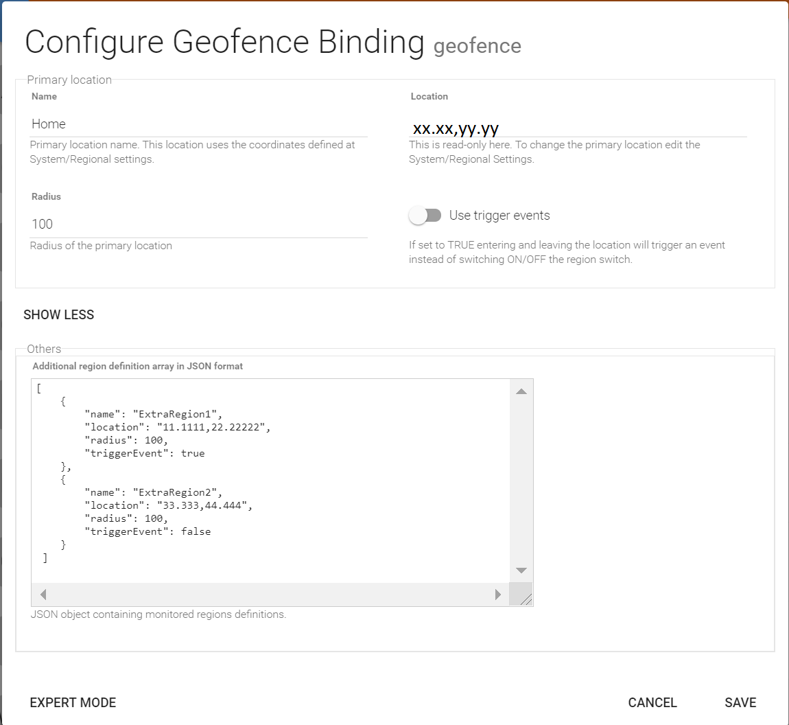
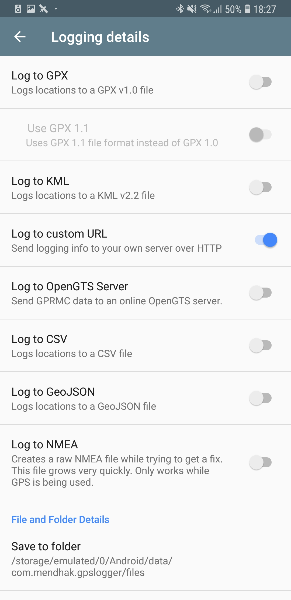

# GPSTracker Binding

This binding allows you to connect mobile GPS tracking applications to an openHAB installation and detect 
presence based on GPS location reports. Currently two applications are supported:

* [OwnTracks](https://owntracks.org/booklet/) - iOS, Android
* [GPSLogger](https://gpslogger.app/) - Android

GPS location reports are sent to openHAB using HTTP protocol. Please be aware that this communication uses the public network
so make sure your openHAB installation is [secured](https://www.openhab.org/docs/installation/security.html#encrypted-communication)
and you configured HTTP**S** access in tracking applications.

The binding can process two message types received from trackers:

* **Location** - This is a simple location report with coordinates extended with some extra information about the tracker (e.g. tracker device battery level). [OwnTracks, GPSLogger]
* **Transition** - This report is based on regions defined in tracker application. A message is sent every time the tracker enters or leaves a region. [OwnTracks only]

## Regions

Regions are predefined waypoints with a center location and a radius. The binding defines two region types:

* **External** - region is defined in tracker application. These regions are usually user specific (e.g. family members can have their own waypoints like school or work) and the tracker is responsible to send transition messages related to external regions. [supported by OwnTracks]
* **Internal** - defined centrally in the binding config which regions are shared between all users connected to the openHAB installation. For these regions it is the binding's responsibility to fire the entering or leaving events (the distance of the tracker is calculated after each location report). The best example for this region type is Home. The openHAB installation location can be set on **System/Regional Settings** configuration screen. This location is interpreted by the binding as the **primary region**. [supported by both OwnTracks and GPSLogger]

## Configuration

### Binding in openHAB


After installing the binding the main configuration task is to define the **Internal** regions. 
There is one primary region which is the location of the openHAB installation. 
The dialog above shows the details of this primary region configuration where the:

* **Name** - is the name of the region
* **Location** - Read-only location of the openHAB installation. To change the coordinates go to System/Regional Setting.
* **Radius** - Radius of the location circle in meters. The value should be set based on the tracker application used and its settings (location update interval and displacement)
* **Use trigger events** - If TRUE the binding will fire create trigger channels for each tracker and fire the entering and leaving events with the region name payload. If set to FALSE the binding will create switch channels which will be set to ON in the tracker is inside the region or OFF if outside.
* **Additional region definitions** - This configuration option is for expert users to create additional internal regions in JSON format. The binding expects an array of regions in the following format:

 ```
 [
    {
        "name": "ExtraRegion1",
        "location": "xx.xxxx,yy.yyyy",
        "radius": 100,
        "triggerEvent": true
    },
    {
        "name": "ExtraRegion2",
        "location": "xx.xxxx,yy.yyyy",
        "radius": 100,
        "triggerEvent": false
    },
    ...
 ]
 ```

### OwnTracks

Install [OwnTracks for Android](https://play.google.com/store/apps/details?id=org.openhab.habdroid) or [OwnTracks for iOS](https://itunes.apple.com/us/app/owntracks/id692424691) on your device.

Go to Preferences/Connection and set:

* **Mode** - select Private HTTP
* **Host** - **https://<your.ip.address>/gpstracker/owntracks**
* **Identification**
  * Turn Authentication ON
  * Set username and password to be able to reach your openHAB server
  * Device ID is not important. Set it to e.g. phone
  * Tracker ID - This id will identify the tracker as a thing. I use initials here.
  


### GPSLogger

Install [GPSLogger for Android](https://play.google.com/store/apps/details?id=com.mendhak.gpslogger) on your device. After the launch, go to General Options. Enable Start on bootup and Start on app launch.


Go to Logging details and disable Log to GPX, Log to KML and Log to NMEA. Enable Log to custom URL.



Right after enabling, the app will take you to the Log to custom URL settings and modify:

* **URL** - Set URL to **https://<username>:<password>@<your.ip.address>/gpstracker/gpslogger** by replacing <???> with values matching your setup. It’s HIGHLY recommended to use SSL/TLS.
* **HTTP Body** - Type in the following JSON:

```
{
    "_type":"location",
    "lat":%LAT,
    "lon":%LON,
    "tid":"XY",
    "acc":%ACC,
    "batt":%BATT,
    "tst":%TIMESTAMP,
    "alt":%ALT,
    "cog":%DIR,
    "vel":%SPD
}
```

**Note**: The value of "tid" is the tracker identified that will identify the tracker as a thing in openHAB. This must be unique for each tracker connected to the same openHAB instance (e.g. family members).

* **HTTP Method** - type in: **POST**
* **HTTP Headers** - type in: **Content-Type: application/json**


### Things

It is possible to define things manually or to use the discovery feature of the openHAB. An important detail for both methods is that a tracker is identified by a **tracker id** configured on mobile devices. Make sure these tracker ids are unique in group of trackers connected to a single openHAB instance.

#### Manual setup

```
//phones
Thing gpstracker:tracker:XY   "XY tracker"
Thing gpstracker:tracker:PQ   "PQ tracker"
...
```

#### Discovery

If the things are not defined in **.things** files the first time the tracker sends a GPS log record the binding will recognize it as new tracker and insert an entry into the Inbox as new tracker with name **GPS Tracker ??**.

### Items

The binding will create dynamic channels based on the configuration:

* **Region presence channels** - These switch channels will be created for all regions that have the **triggerEvent** flag set to false. ON state of the switch indicates the presence within region radius.
* **Region enter/leave trigger channels** - These two channels are added to the thing in case there is at least one region with **triggerEvent** set to true. Event will be fired with payload of the region name when the binding receives a **transition** log record (for external regions) or in case the distance from the center of the internal region is less than the region radius.

```
Number		distanceEX	"Distance [%.2f km]"	{channel="gpstracker:tracker:EX:distance"}
Switch		atWorkEX	"EX @ Work"		{channel="gpstracker:tracker:EX:regionPresence_Work"}
Switch		atHomeEX	"EX @ Home"		{channel="gpstracker:tracker:EX:regionPresence_Home"}
Location	locationEX	"Location"		{channel="gpstracker:tracker:EX:location"}
DateTime	lastSeenEX	"Last seen"		{channel="gpstracker:tracker:EX:lastReport"}
Number		batteryEX	"Battery level"		{channel="gpstracker:tracker:EX:batteryLevel"}
```

**Note**: EX is the tracker id in channel references configured in mobile applications.

### Sitemaps

```
sitemap gpstracker label="GPSTracker Binding" {
    Text item=distanceEX
    Text item=atWorkEX
    Text item=atHomeEX
    Text item=lastSeenEX
    Text item=batteryEX
    Mapview item=locationEX height=4
}
```
