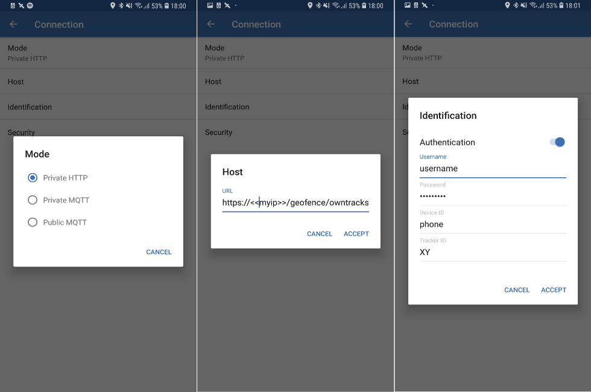
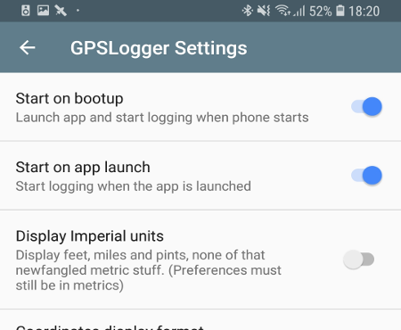
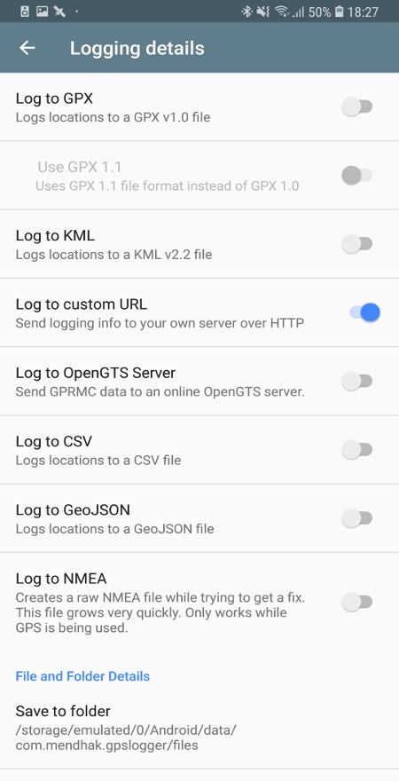
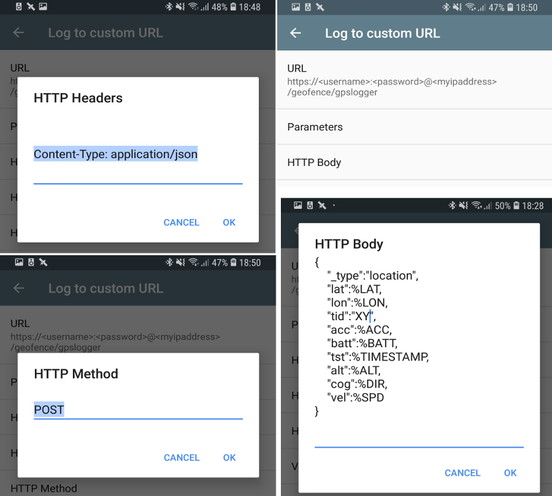

# GPSTracker Binding

This binding allows you to connect mobile GPS tracker applications to openHAB and process GPS location reports. 
Currently two applications are supported:

* [OwnTracks](https://owntracks.org/booklet/) - iOS, Android
* [GPSLogger](https://gpslogger.app/) - Android

GPS location reports are sent to openHAB using HTTP protocol. 
Please be aware that this communication uses the public network so make sure your openHAB installation is [secured](https://www.openhab.org/docs/installation/security.html#encrypted-communication)
and you configured HTTP**S** access in tracking applications.

The binding can process two message types received from trackers:

* **Location** - This is a simple location report with coordinates extended with some extra information about the tracker (e.g. tracker device battery level). [OwnTracks, GPSLogger]
* **Transition** - This report is based on regions defined in tracker application. A message is sent every time the tracker enters or leaves a region. [OwnTracks only]

## Configuration

### OwnTracks

Install [OwnTracks for Android](https://play.google.com/store/apps/details?id=org.openhab.habdroid) or [OwnTracks for iOS](https://itunes.apple.com/us/app/owntracks/id692424691) on your device.

Go to Preferences/Connection and set:

* **Mode** - select Private HTTP
* **Host** - **https://<your.ip.address>/gpstracker/owntracks**
* **Identification**
  * Turn Authentication ON
  * Set username and password to be able to reach your openHAB server
  * Device ID is not important. Set it to e.g. phone
  * Tracker ID - This id identifies the tracker as a thing. I use initials here.
  


### GPSLogger

Install [GPSLogger for Android](https://play.google.com/store/apps/details?id=com.mendhak.gpslogger) on your device. 
After the launch, go to General Options. 
Enable Start on boot-up and Start on app launch.



Go to Logging details and disable Log to GPX, Log to KML and Log to NMEA. 
Enable Log to custom URL.



Right after enabling, the app takes you to the Log to custom URL settings and modify:

* **URL** - Set URL to **https://\<username\>:\<password\>@<your.ip.address>/gpstracker/gpslogger** by replacing <???> with values matching your setup. It’s HIGHLY recommended to use SSL/TLS.
* **HTTP Body** - Type in the following JSON:

```
{
    "_type":"location",
    "lat":%LAT,
    "lon":%LON,
    "tid":"XY",
    "acc":%ACC,
    "batt":%BATT,
    "tst":%TIMESTAMP
}
```

**Note**: The value of "tid" is the tracker id that identifies the tracker as a thing in openHAB. 
This must be unique for each tracker connected to the same openHAB instance (e.g. family members).

* **HTTP Method** - type in: **POST**
* **HTTP Headers** - type in: **Content-Type: application/json**



### Things

It is possible to define things manually or to use the discovery feature of the openHAB. 
An important detail for both methods is that a tracker is identified by a **tracker id** configured on mobile devices. 
Make sure these tracker ids are unique in group of trackers connected to a single openHAB instance.

#### Discovery

If the things are not defined in **.things** files the first time the tracker sends a GPS log record the binding recognizes it as new tracker and inserts an entry into the Inbox as new tracker with name **GPS Tracker ??**.

### Channels

Basic channels provided by the tracker things:

* **Location** - Current location of the tracker
* **Last Report** - Timestamp of the last location report
* **Battery Level** - Battery level of the device running the tracker application
* **Region trigger channel** - Used by regions defined in tracker application. Event is fired with payload of the region name when the binding receives a **transition** log record or a distance calculation for a **location** record indicates that the tracker is outside of the region circle. Payload is suffixed with `/enter` for entering and with `/leave` for leaving events.

#### Distance Calculation

Tracker thing can be extended with **Distance** channels if a distance calculation is needed for a region. 
These dynamic channels require the following parameters:

| Parameter | Type |Description |
| --- | --- | --- |
| Region Name | String | Region name. If the region is configured in the tracker app as well use the same name. Distance channels can also be defined as binding only regions (not configured in trackers) | 
| Region center | Location | Region center location |

Distance values will be updated each time a GPS log record is received from the tracker.

#### Geofences

Switch type items can be linked to **regionTrigger** and **regionDistance** channels with the following parameters:

| Channel | Parameter | Type |Description |
| --- | --- | --- | --- |
| Region Trigger | Region Name | String | Region name which should be the same as used in the tracker application |
| Region Distance | Region Circle Radius | Number | Region radius |

Each time the **Region Trigger** channel is triggered by an entering transition message the binding turns ON the linked switch and turns if OFF in case the region is left.
For distance channels if the distance is less than the preset radius for the link the binding turns ON the switch and turns it OFF otherwise.
 
## Manual Configuration

### Things

```
//trackers
Thing gpstracker:tracker:1   "XY tracker" [trackerId="XY"]
Thing gpstracker:tracker:EX   "EX tracker" [trackerId="EX"] {
    Channels:
            Type regionDistance : homeDistance "Distance from Home" [
                regionName="Home",
                regionCenterLocation="11.1111,22.2222",
                regionRadius=100
            ]
}
```

### Items

```
//items for basic channels
Location	locationEX	"Location"		{channel="gpstracker:tracker:1:lastLocation"}
DateTime	lastSeenEX	"Last seen"		{channel="gpstracker:tracker:1:lastReport"}
Number		batteryEX	"Battery level"		{channel="gpstracker:tracker:1:batteryLevel"}

//linking to the distance channel
Switch atHomeEX "Home presence" {channel="gpstracker:tracker:EX:homeDistance", profile="gpstracker:trigger-geofence"}
```

### Sitemaps

```
sitemap gpstracker label="GPSTracker Binding" {
    Text item=distanceEX
    Text item=atWorkEX
    Text item=atHomeEX
    Text item=lastSeenEX
    Text item=batteryEX
    Mapview item=locationEX height=4
}
```
