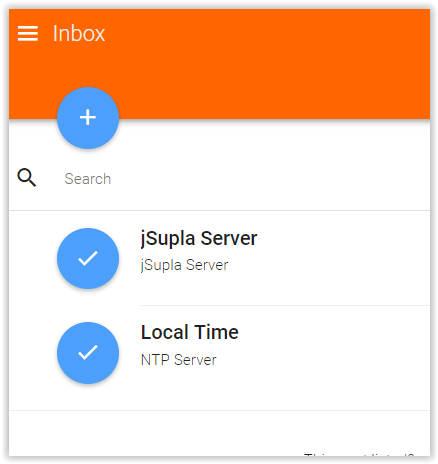
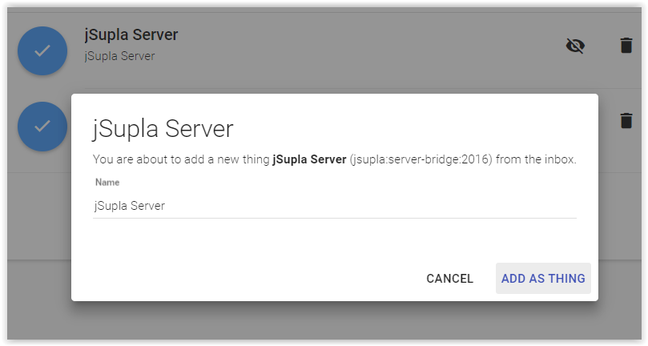
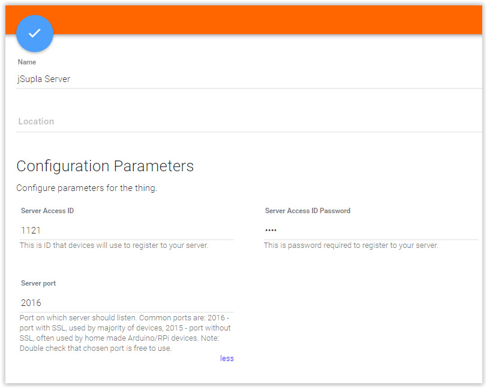
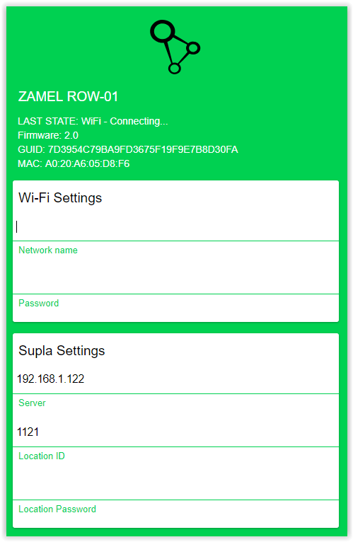
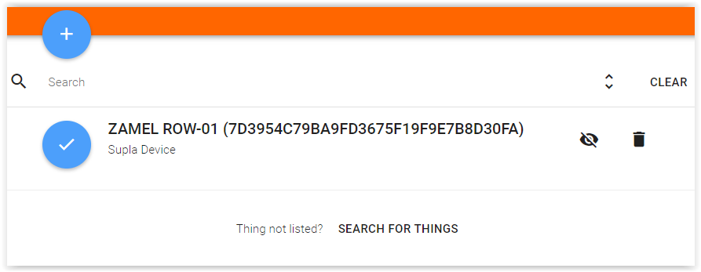
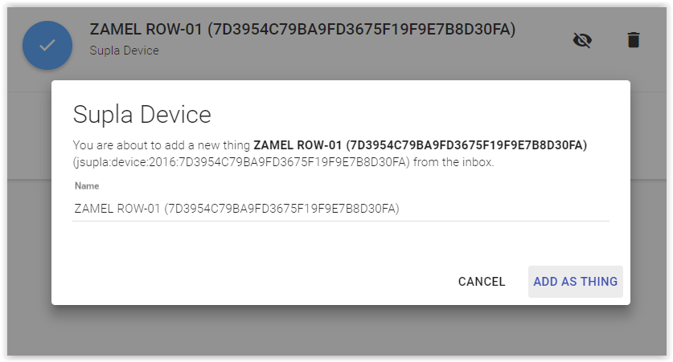
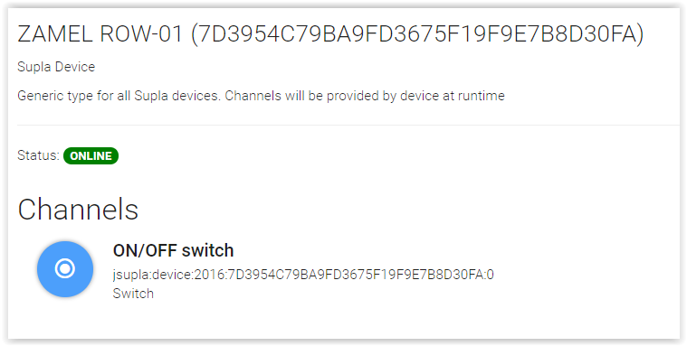

# jSupla Binding

This binding support Supla devices. To use it you don't need 

## Supported Things

Supported things:

* Switches
* RGB controllers
* Temperature & humidity devices

This binding was tested with ZAMEL 
[ROW-01](http://www.zamel.pl/produkty/supla-sterowanie-wifi/supla--odbiorniki-dopuszkowe/row01) and 
[ROW-02](http://www.zamel.pl/produkty/supla-sterowanie-wifi/supla--odbiorniki-dopuszkowe/row02) devices. Big thanks 
to **Zamel** for providing free testing devices.

## Discovery

Using auto discovery is recommended way of adding devices and server. After creating jSupla server from inbox all 
devices will be added into the openHAB inbox page.

## Full Example

### Add jSupla Server

After adding jSupla binding go to inbox and add _jSupla Server_. By default it will work on port ```2016```.




 
On configuration page you need to choose ```Server Access ID``` and ```Server Access ID Password```. Write this things down 
because you will need them later to configure your devices.
 

 
### Configure Supla devices

To configure device follow instructions provided by manufacturer. 

```Location ID``` and ```Location Password``` should be filled up with values from ```Server Access ID``` and 
```Server Access ID Password```.



After restarting device wait up to 30 sec. and check OpenHAB inbox. You should find there a thing that has the same 
_GUID_ as device you configured. 





Last thing to do is open previously added thing and link channels by clicking o them. 



## Bugs, problems, ect.

If you find any bugs you can submit them [on Github issue page](https://github.com/magx2/openhab2-addons/issues). Before
doing this it would be great if you would provide details logs. To do this add this lines in ```logback.xml```:

```xml
<appender name="supla" class="ch.qos.logback.core.FileAppender">
   <param name="Append" value="false"></param>
    <file>~/jsupla.log</file>
    <encoder>
        <pattern>%d{yyyy-MM-dd HH:mm:ss.SSS} [%-5level] [%-80.80logger{80}:%-5line] - %msg%ex{10}%n</pattern>
    </encoder>
</appender>
<logger name="org.openhab.binding.jsupla" level="TRACE" additivity="true">
    <appender-ref ref="supla" />
</logger>
<logger name="pl.grzeslowski" level="TRACE" additivity="true">
    <appender-ref ref="supla" />
</logger>
```

The log file should be in ```~/jsupla.log``` directory.

## Links

* [supla.org](http://www.supla.org) - link to official page
* [forum.supla.org](https://forum.supla.org/) - official forum page
* [e-sklep.zamel.pl](https://e-sklep.zamel.pl/kategoria-produktu/supla/) - shop where you can buy certified Supla devices
* [origin repo with this binding](https://github.com/magx2/openhab2-addons)
* Person responsible for creating this binding [Martin Grześlowski](https://github.com/magx2)
