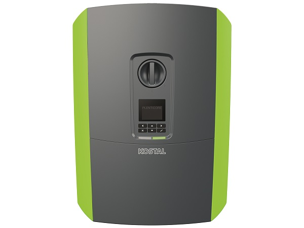

# Kostal Inverter Binding

Scrapes the web interface of the inverter for the metrics of the supported channels below.




## Supported Things

### First generation devices (PIKO)

Tested with Kostal Inverter PIKO but might work with other inverters from kostal too.

### Third generation devices (PIKO IQ / PLENTICORE plus)

This implementation was tested for the current KOSTAL PIKO PLENTICORE plus and PIKO IQ devices.
All of these devices contain the same communication board (SCB = **S**mart**C**onnection**B**oard)

Currently supported things are:

* PIKO IQ 4.2
* PIKO IQ 5.5
* PIKO IQ 7.0
* PIKO IQ 8.5
* PIKO IQ 10.0
* PLENTICORE plus 4.2 (with or without battery attached)
* PLENTICORE plus 5.5 (with or without battery attached)
* PLENTICORE plus 7.0 (with or without battery attached)
* PLENTICORE plus 8.5 (with or without battery attached)
* PLENTICORE plus 10.0 (with or without battery attached)

Others may be supported (like future devices using the same SCB or offering the same Web API, branded OEM devices, ...), but they were not tested!

## Discovery

None

## Channels

### First generation devices (PIKO)

-   acPower
-   totalEnergy
-   dayEnergy
-   status
-   str1Voltage
-   str1Current
-   str2Voltage
-   str2Current
-   l1Voltage
-   l1Power
-   l2Voltage
-   l2Power
-   l3Voltage
-   l3Power

### Third generation devices (PIKO IQ / PLENTICORE plus)

| Channel Type ID                          | Item Type                | Description                                                                      | Read Write |
|------------------------------------------|--------------------------|----------------------------------------------------------------------------------|:----------:|
| deviceLocalDCPower                       | Number:Energy            | Current DC power of the inverter                                                 |      R     |
| deviceLocalHomeconsumptionFromBattery    | Number:Energy            | Current home consumption obtained from the battery                               |      R     |
| deviceLocalHomeconsumptionFromGrid       | Number:Energy            | Current home consumption obtained from the grid                                  |      R     |
| deviceLocalOwnconsumption                | Number:Energy            | Current own comsumption                                                          |      R     |
| deviceLocalHomeconsumptionFromPV         | Number:Energy            | Current home consumption obtained from photovoltaic                              |      R     |
| deviceLocalHomeconsumptionTotal          | Number:Energy            | Current total homeconsumption                                                    |      R     |
| deviceLocalLimitEVUAbsolute              | Number:Energy            | Permitted feed-in quantity as absolute value as specified by the energy supplier |      R     |
| deviceLocalLimitEVURelativ               | Number:Dimensionless     | Permitted feed-in quantity as relative value as specified by the energy supplier |      R     |
| deviceLocalWorktime                      | Number:Time              | Uptime of the inverter                                                           |      R     |
| deviceLocalACPhase1CurrentAmperage       | Number:ElectricCurrent   | Amperage of phase 1                                                              |      R     |
| deviceLocalACPhase1CurrentPower          | Number:Energy            | Power of phase 1                                                                 |      R     |
| deviceLocalACPhase1CurrentVoltage        | Number:ElectricPotential | Voltage of phase 1                                                               |      R     |
| deviceLocalACPhase2CurrentAmperage       | Number:ElectricCurrent   | Amperage of phase 2                                                              |      R     |
| deviceLocalACPhase2CurrentPower          | Number:Energy            | Power of phase 2                                                                 |      R     |
| deviceLocalACPhase2CurrentVoltage        | Number:ElectricPotential | Voltage of phase 2                                                               |      R     |
| deviceLocalACPhase3CurrentAmperage       | Number:ElectricCurrent   | Amperage of phase 3                                                              |      R     |
| deviceLocalACPhase3CurrentPower          | Number:Energy            | Power of phase 3                                                                 |      R     |
| deviceLocalACPhase3CurrentVoltage        | Number:ElectricPotential | Voltage of phase 3                                                               |      R     |
| deviceLocalACCurrentPower                | Number:Energy            | Current AC power of the inverter                                                 |      R     |
| deviceLocalBatteryLoadingCycles          | Number:Dimensionless     | Amount of loading cycles done by the battery                                     |      R     |
| deviceLocalBatteryFullChargeCapacity     | Number:ElectricCharge    | Capacity of the battery if charged fully                                         |      R     |
| deviceLocalBatteryAmperage               | Number:ElectricCurrent   | Current amperage of the battery                                                  |      R     |
| deviceLocalBatteryPower                  | Number:Energy            | Current battery charge                                                           |      R     |
| deviceLocalBatteryStageOfCharge          | Number:Dimensionless     | Current battery charge status                                                    |      R     |
| deviceLocalBatteryVoltage                | Number:ElectricPotential | Current voltage of the battery                                                   |      R     |
| deviceLocalPVString1Amperage             | Number:ElectricCurrent   | Current amperage of photovoltaic string 1                                        |      R     |
| deviceLocalPVString1Power                | Number:Energy            | Current power of photovoltaic string 1                                           |      R     |
| deviceLocalPVString1Voltage              | Number:ElectricPotential | Current voltage of photovoltaic string 1                                         |      R     |
| deviceLocalPVString2Amperage             | Number:ElectricCurrent   | Current amperage of photovoltaic string 2                                        |      R     |
| deviceLocalPVString2Power                | Number:Energy            | Current power of photovoltaic string 2                                           |      R     |
| deviceLocalPVString2Voltage              | Number:ElectricPotential | Current voltage of photovoltaic string 2                                         |      R     |
| deviceLocalPVString3Amperage             | Number:ElectricCurrent   | Current amperage of photovoltaic string 3                                        |      R     |
| deviceLocalPVString3Power                | Number:Energy            | Current power of photovoltaic string 3                                           |      R     |
| deviceLocalPVString3Voltage              | Number:ElectricPotential | Current voltage of photovoltaic string 3                                         |      R     |
| SCBEventErrorCountMc                     | Number:Dimensionless     | Number of errors reported by the main controller                                 |      R     |
| SCBEventErrorCountSFH                    | Number:Dimensionless     | Number of errors reported by the grid interface controller                       |      R     |
| SCBEventErrorCountSCB                    | Number:Dimensionless     | Number of errors reported by the smart communication board                       |      R     |
| SCBEventWarningCountSCB                  | Number:Dimensionless     | Number of warnings reported by the smart communication board                     |      R     |
| statisticAutarkyDay                      | Number:Dimensionless     | Autarky ratio of this day                                                        |      R     |
| statisticAutarkyMonth                    | Number:Dimensionless     | Autarky ratio of this month                                                      |      R     |
| statisticAutarkyTotal                    | Number:Dimensionless     | Autarky ratio overall                                                            |      R     |
| statisticAutarkyYear                     | Number:Dimensionless     | Autarky ratio of this year                                                       |      R     |
| statisticCo2SavingDay                    | Number:Mass              | Savings in Co2 emissions today                                                   |      R     |
| statisticCo2SavingMonth                  | Number:Mass              | Savings in Co2 emissions this month                                              |      R     |
| statisticCo2SavingTotal                  | Number:Mass              | Savings in Co2 emissions overall                                                 |      R     |
| statisticCo2SavingYear                   | Number:Mass              | Savings in Co2 emissions this year                                               |      R     |
| statisticHomeconsumptionDay              | Number:Energy            | Home consumption today                                                           |      R     |
| statisticHomeconsumptionMonth            | Number:Energy            | Home consumption this month                                                      |      R     |
| statisticHomeconsumptionTotal            | Number:Energy            | Home consumption overall                                                         |      R     |
| statisticHomeconsumptionYear             | Number:Energy            | Home consumption this year                                                       |      R     |
| statisticHomeconsumptionFromBatteryDay   | Number:Energy            | Home consumption obtained from the battery today                                 |      R     |
| statisticHomeconsumptionFromBatteryMonth | Number:Energy            | Home consumption obtained from the battery this month                            |      R     |
| statisticHomeconsumptionFromBatteryTotal | Number:Energy            | Home consumption obtained from the battery overall                               |      R     |
| statisticHomeconsumptionFromBatteryYear  | Number:Energy            | Home consumption obtained from the battery this year                             |      R     |
| statisticHomeconsumptionFromGridDay      | Number:Energy            | Home consumption obtained from the grid today                                    |      R     |
| statisticHomeconsumptionFromGridMonth    | Number:Energy            | Home consumption obtained from the grid this month                               |      R     |
| statisticHomeconsumptionFromGridTotal    | Number:Energy            | Home consumption obtained from the grid overall                                  |      R     |
| statisticHomeconsumptionFromGridYear     | Number:Energy            | Home consumption obtained from the grid this year                                |      R     |
| statisticHomeconsumptionFromPVDay        | Number:Energy            | Home consumption obtained from the photovoltaic plant today                      |      R     |
| statisticHomeconsumptionFromPVMonth      | Number:Energy            | Home consumption obtained from the photovoltaic plant this month                 |      R     |
| statisticHomeconsumptionFromPVTotal      | Number:Energy            | Home consumption obtained from the photovoltaic plant overall                    |      R     |
| statisticHomeconsumptionFromPVYear       | Number:Energy            | Home consumption obtained from the photovoltaic plant this year                  |      R     |
| statisticOwnconsumptionRateDay           | Number:Dimensionless     | Percentage of electricity demand covered by photovoltaics today                  |      R     |
| statisticOwnconsumptionRateMonth         | Number:Dimensionless     | Percentage of electricity demand covered by photovoltaics this month             |      R     |
| statisticOwnconsumptionRateTotal         | Number:Dimensionless     | Percentage of electricity demand covered by photovoltaics overall                |      R     |
| statisticOwnconsumptionRateYear          | Number:Dimensionless     | Percentage of electricity demand covered by photovoltaics this year              |      R     |
| statisticYieldDay                        | Number:Energy            | Yield of the photovoltaic plant today                                            |      R     |
| statisticYieldMonth                      | Number:Energy            | Yield of the photovoltaic plant this month                                       |      R     |
| statisticYieldTotal                      | Number:Energy            | Yield of the photovoltaic plant overall                                          |      R     |
| statisticYieldYear                       | Number:Energy            | Yield of the photovoltaic plant this year                                        |      R     |

## Thing Configuration

### First generation devices (PIKO)

demo.things

```
Thing kostalinverter:kostalinverter:inverter [ url="http://192.168.0.128" ]
```

If the thing goes online then the connection to the web interface is successful.
In case it is offline you should see an error message.
You optionally can define a `userName` and a `password` parameter if the access to the webinterface is protected and a desired `refreshInterval` (the time interval between updates, default 60 seconds).

### Third generation devices (PIKO IQ / PLENTICORE plus)

All third generation inverters require to define 3 mandatory configuration parameters:

| Parameter                | Description                                            | Type    |  Unit   | Default value | Example value |
|--------------------------|--------------------------------------------------------|---------|---------|---------------|---------------|
| url                      | Host name or IP address of your device                 | Text    | ---     | ---           | 192.168.1.2   |
| userPassword             | Password you configured on the inverters web front end | Text    | ---     | ---           | myPassword    |
| refreshInternalInSeconds | Defines how often the device is polled for new values  | Integer | Seconds | 30            | 30            |

If you are using the hostname instead of the IP address, please make sure your DNS is configuration correctly!
The refresh interval should be chosen wisely. To small interval may led to high workload for the inverter. From my testing I recommend a interval of 30 seconds.

Full sample of thing configuration:

```
Thing kostalinverter:PLENTICOREPLUS100WITHBATTERY:MyPlentiCore100WithBattery [ url = "192.168.1.2", userPassword="myPassword", refreshInternalInSeconds="30"]
```

## Items

### First generation devices (PIKO)

demo.items:

```
Number:Power SolarPower "Solar power [%.1f %unit%]" <energy> { channel="kostalinverter:kostalinverter:inverter:acPower" }
Number:Energy SolarEnergyDay "Solar day energy [%.3f %unit%]" <energy> { channel="kostalinverter:kostalinverter:inverter:dayEnergy" }
Number:Energy SolarTotalEnergy "Solar total energy [%.3f %unit%]" <energy> { channel="kostalinverter:kostalinverter:inverter:totalEnergy" }
String SolarStatus "Solar status [%s]" <energy> { channel="kostalinverter:kostalinverter:inverter:status" }
```

### Third generation devices (PIKO IQ / PLENTICORE plus)

demo.items:

```
Number:Energy                MyPlentiCore100WithBattery_DEVICE_LOCAL_DC_POWER                         <energy> { channel="kostalinverter:PLENTICOREPLUS100WITHBATTERY:MyPlentiCore100WithBattery:deviceLocalDCPower"}
Number:Energy                MyPlentiCore100WithBattery_DEVICE_LOCAL_HOMECONSUMPTION_FROM_BATTERY     <energy> { channel="kostalinverter:PLENTICOREPLUS100WITHBATTERY:MyPlentiCore100WithBattery:deviceLocalHomeconsumptionFromBattery"}
Number:Energy                MyPlentiCore100WithBattery_DEVICE_LOCAL_HOMECONSUMPTION_FROM_GRID        <energy> { channel="kostalinverter:PLENTICOREPLUS100WITHBATTERY:MyPlentiCore100WithBattery:deviceLocalHomeconsumptionFromGrid"}
Number:Energy                MyPlentiCore100WithBattery_DEVICE_LOCAL_OWNCONSUMPTION                   <energy> { channel="kostalinverter:PLENTICOREPLUS100WITHBATTERY:MyPlentiCore100WithBattery:deviceLocalOwnconsumption"}
Number:Energy                MyPlentiCore100WithBattery_DEVICE_LOCAL_HOMECONSUMPTION_FROM_PV          <energy> { channel="kostalinverter:PLENTICOREPLUS100WITHBATTERY:MyPlentiCore100WithBattery:deviceLocalHomeconsumptionFromPV"}
Number:Energy                MyPlentiCore100WithBattery_DEVICE_LOCAL_HOMECONSUMPTION_TOTAL            <energy> { channel="kostalinverter:PLENTICOREPLUS100WITHBATTERY:MyPlentiCore100WithBattery:deviceLocalHomeconsumptionTotal"}
Number:Energy                MyPlentiCore100WithBattery_DEVICE_LOCAL_LIMIT_EVU_ABSOLUTE               <energy> { channel="kostalinverter:PLENTICOREPLUS100WITHBATTERY:MyPlentiCore100WithBattery:deviceLocalLimitEVUAbsolute"}
Number:Dimensionless         MyPlentiCore100WithBattery_DEVICE_LOCAL_LIMIT_EVU_RELATIV                <energy> { channel="kostalinverter:PLENTICOREPLUS100WITHBATTERY:MyPlentiCore100WithBattery:deviceLocalLimitEVURelativ"}
Number:Time                  MyPlentiCore100WithBattery_DEVICE_LOCAL_WORKTIME                         <energy> { channel="kostalinverter:PLENTICOREPLUS100WITHBATTERY:MyPlentiCore100WithBattery:deviceLocalWorktime"}
Number:ElectricCurrent       MyPlentiCore100WithBattery_DEVICE_LOCAL_AC_PHASE_1_CURRENT_AMPERAGE      <energy> { channel="kostalinverter:PLENTICOREPLUS100WITHBATTERY:MyPlentiCore100WithBattery:deviceLocalACPhase1CurrentAmperage"}
Number:Energy                MyPlentiCore100WithBattery_DEVICE_LOCAL_AC_PHASE_1_CURRENT_POWER         <energy> { channel="kostalinverter:PLENTICOREPLUS100WITHBATTERY:MyPlentiCore100WithBattery:deviceLocalACPhase1CurrentPower"}
Number:ElectricPotential     MyPlentiCore100WithBattery_DEVICE_LOCAL_AC_PHASE_1_CURRENT_VOLTAGE       <energy> { channel="kostalinverter:PLENTICOREPLUS100WITHBATTERY:MyPlentiCore100WithBattery:deviceLocalACPhase1CurrentVoltage"}
Number:ElectricCurrent       MyPlentiCore100WithBattery_DEVICE_LOCAL_AC_PHASE_2_CURRENT_AMPERAGE      <energy> { channel="kostalinverter:PLENTICOREPLUS100WITHBATTERY:MyPlentiCore100WithBattery:deviceLocalACPhase2CurrentAmperage"}
Number:Energy                MyPlentiCore100WithBattery_DEVICE_LOCAL_AC_PHASE_2_CURRENT_POWER         <energy> { channel="kostalinverter:PLENTICOREPLUS100WITHBATTERY:MyPlentiCore100WithBattery:deviceLocalACPhase2CurrentPower"}
Number:ElectricPotential     MyPlentiCore100WithBattery_DEVICE_LOCAL_AC_PHASE_2_CURRENT_VOLTAGE       <energy> { channel="kostalinverter:PLENTICOREPLUS100WITHBATTERY:MyPlentiCore100WithBattery:deviceLocalACPhase2CurrentVoltage"}
Number:ElectricCurrent       MyPlentiCore100WithBattery_DEVICE_LOCAL_AC_PHASE_3_CURRENT_AMPERAGE      <energy> { channel="kostalinverter:PLENTICOREPLUS100WITHBATTERY:MyPlentiCore100WithBattery:deviceLocalACPhase3CurrentAmperage"}
Number:Energy                MyPlentiCore100WithBattery_DEVICE_LOCAL_AC_PHASE_3_CURRENT_POWER         <energy> { channel="kostalinverter:PLENTICOREPLUS100WITHBATTERY:MyPlentiCore100WithBattery:deviceLocalACPhase3CurrentPower"}
Number:ElectricPotential     MyPlentiCore100WithBattery_DEVICE_LOCAL_AC_PHASE_3_CURRENT_VOLTAGE       <energy> { channel="kostalinverter:PLENTICOREPLUS100WITHBATTERY:MyPlentiCore100WithBattery:deviceLocalACPhase3CurrentVoltage"}
Number:Energy                MyPlentiCore100WithBattery_DEVICE_LOCAL_AC_CURRENT_POWER                 <energy> { channel="kostalinverter:PLENTICOREPLUS100WITHBATTERY:MyPlentiCore100WithBattery:deviceLocalACCurrentPower"}
Number:Dimensionless         MyPlentiCore100WithBattery_DEVICE_LOCAL_BATTERY_LOADING_CYCLES           <energy> { channel="kostalinverter:PLENTICOREPLUS100WITHBATTERY:MyPlentiCore100WithBattery:deviceLocalBatteryLoadingCycles"}
Number:ElectricCharge        MyPlentiCore100WithBattery_DEVICE_LOCAL_BATTERY_FULL_CHARGE_CAPACITY     <energy> { channel="kostalinverter:PLENTICOREPLUS100WITHBATTERY:MyPlentiCore100WithBattery:deviceLocalBatteryFullChargeCapacity"}
Number:ElectricCurrent       MyPlentiCore100WithBattery_DEVICE_LOCAL_BATTERY_AMPERAGE                 <energy> { channel="kostalinverter:PLENTICOREPLUS100WITHBATTERY:MyPlentiCore100WithBattery:deviceLocalBatteryAmperage"}
Number:Energy                MyPlentiCore100WithBattery_DEVICE_LOCAL_BATTERY_POWER                    <energy> { channel="kostalinverter:PLENTICOREPLUS100WITHBATTERY:MyPlentiCore100WithBattery:deviceLocalBatteryPower"}
Number:Dimensionless         MyPlentiCore100WithBattery_DEVICE_LOCAL_BATTERY_STATE_OF_CHARGE          <energy> { channel="kostalinverter:PLENTICOREPLUS100WITHBATTERY:MyPlentiCore100WithBattery:deviceLocalBatteryStageOfCharge"}
Number:ElectricPotential     MyPlentiCore100WithBattery_DEVICE_LOCAL_BATTERY_VOLTAGE                  <energy> { channel="kostalinverter:PLENTICOREPLUS100WITHBATTERY:MyPlentiCore100WithBattery:deviceLocalBatteryVoltage"}
Number:ElectricCurrent       MyPlentiCore100WithBattery_DEVICE_LOCAL_PVSTRING_1_AMPERAGE              <energy> { channel="kostalinverter:PLENTICOREPLUS100WITHBATTERY:MyPlentiCore100WithBattery:deviceLocalPVString1Amperage"}
Number:Energy                MyPlentiCore100WithBattery_DEVICE_LOCAL_PVSTRING_1_POWER                 <energy> { channel="kostalinverter:PLENTICOREPLUS100WITHBATTERY:MyPlentiCore100WithBattery:deviceLocalPVString1Power"}
Number:ElectricPotential     MyPlentiCore100WithBattery_DEVICE_LOCAL_PVSTRING_1_VOLTAGE               <energy> { channel="kostalinverter:PLENTICOREPLUS100WITHBATTERY:MyPlentiCore100WithBattery:deviceLocalPVString1Voltage"}
Number:ElectricCurrent       MyPlentiCore100WithBattery_DEVICE_LOCAL_PVSTRING_2_AMPERAGE              <energy> { channel="kostalinverter:PLENTICOREPLUS100WITHBATTERY:MyPlentiCore100WithBattery:deviceLocalPVString2Amperage"}
Number:Energy                MyPlentiCore100WithBattery_DEVICE_LOCAL_PVSTRING_2_POWER                 <energy> { channel="kostalinverter:PLENTICOREPLUS100WITHBATTERY:MyPlentiCore100WithBattery:deviceLocalPVString2Power"}
Number:ElectricPotential     MyPlentiCore100WithBattery_DEVICE_LOCAL_PVSTRING_2_VOLTAGE               <energy> { channel="kostalinverter:PLENTICOREPLUS100WITHBATTERY:MyPlentiCore100WithBattery:deviceLocalPVString2Voltage"}
Number:Dimensionless         MyPlentiCore100WithBattery_SCB_EVENT_ERROR_COUNT_MC                      <energy> { channel="kostalinverter:PLENTICOREPLUS100WITHBATTERY:MyPlentiCore100WithBattery:SCBEventErrorCountMc"}
Number:Dimensionless         MyPlentiCore100WithBattery_SCB_EVENT_ERROR_COUNT_SFH                     <energy> { channel="kostalinverter:PLENTICOREPLUS100WITHBATTERY:MyPlentiCore100WithBattery:SCBEventErrorCountSFH"}
Number:Dimensionless         MyPlentiCore100WithBattery_SCB_EVENT_ERROR_COUNT_SCB                     <energy> { channel="kostalinverter:PLENTICOREPLUS100WITHBATTERY:MyPlentiCore100WithBattery:SCBEventErrorCountSCB"}
Number:Dimensionless         MyPlentiCore100WithBattery_SCB_EVENT_WARNING_COUNT_SCB                   <energy> { channel="kostalinverter:PLENTICOREPLUS100WITHBATTERY:MyPlentiCore100WithBattery:SCBEventWarningCountSCB"}
Number:Dimensionless         MyPlentiCore100WithBattery_STATISTIC_AUTARKY_DAY                         <energy> { channel="kostalinverter:PLENTICOREPLUS100WITHBATTERY:MyPlentiCore100WithBattery:statisticAutarkyDay"}
Number:Dimensionless         MyPlentiCore100WithBattery_STATISTIC_AUTARKY_MONTH                       <energy> { channel="kostalinverter:PLENTICOREPLUS100WITHBATTERY:MyPlentiCore100WithBattery:statisticAutarkyMonth"}
Number:Dimensionless         MyPlentiCore100WithBattery_STATISTIC_AUTARKY_TOTAL                       <energy> { channel="kostalinverter:PLENTICOREPLUS100WITHBATTERY:MyPlentiCore100WithBattery:statisticAutarkyTotal"}
Number:Dimensionless         MyPlentiCore100WithBattery_STATISTIC_AUTARKY_YEAR                        <energy> { channel="kostalinverter:PLENTICOREPLUS100WITHBATTERY:MyPlentiCore100WithBattery:statisticAutarkyYear"}
Number:Mass                  MyPlentiCore100WithBattery_STATISTIC_CO2SAVING_DAY                       <energy> { channel="kostalinverter:PLENTICOREPLUS100WITHBATTERY:MyPlentiCore100WithBattery:statisticCo2SavingDay"}
Number:Mass                  MyPlentiCore100WithBattery_STATISTIC_CO2SAVING_MONTH                     <energy> { channel="kostalinverter:PLENTICOREPLUS100WITHBATTERY:MyPlentiCore100WithBattery:statisticCo2SavingMonth"}
Number:Mass                  MyPlentiCore100WithBattery_STATISTIC_CO2SAVING_TOTAL                     <energy> { channel="kostalinverter:PLENTICOREPLUS100WITHBATTERY:MyPlentiCore100WithBattery:statisticCo2SavingTotal"}
Number:Mass                  MyPlentiCore100WithBattery_STATISTIC_CO2SAVING_YEAR                      <energy> { channel="kostalinverter:PLENTICOREPLUS100WITHBATTERY:MyPlentiCore100WithBattery:statisticCo2SavingYear"}
Number:Energy                MyPlentiCore100WithBattery_STATISTIC_HOMECONSUMPTION_DAY                 <energy> { channel="kostalinverter:PLENTICOREPLUS100WITHBATTERY:MyPlentiCore100WithBattery:statisticHomeconsumptionDay"}
Number:Energy                MyPlentiCore100WithBattery_STATISTIC_HOMECONSUMPTION_MONTH               <energy> { channel="kostalinverter:PLENTICOREPLUS100WITHBATTERY:MyPlentiCore100WithBattery:statisticHomeconsumptionMonth"}
Number:Energy                MyPlentiCore100WithBattery_STATISTIC_HOMECONSUMPTION_TOTAL               <energy> { channel="kostalinverter:PLENTICOREPLUS100WITHBATTERY:MyPlentiCore100WithBattery:statisticHomeconsumptionTotal"}
Number:Energy                MyPlentiCore100WithBattery_STATISTIC_HOMECONSUMPTION_YEAR                <energy> { channel="kostalinverter:PLENTICOREPLUS100WITHBATTERY:MyPlentiCore100WithBattery:statisticHomeconsumptionYear"}
Number:Energy                MyPlentiCore100WithBattery_STATISTIC_HOMECONSUMPTION_FROM_BATTERIE_DAY   <energy> { channel="kostalinverter:PLENTICOREPLUS100WITHBATTERY:MyPlentiCore100WithBattery:statisticHomeconsumptionFromBatteryDay"}
Number:Energy                MyPlentiCore100WithBattery_STATISTIC_HOMECONSUMPTION_FROM_BATTERIE_MONTH <energy> { channel="kostalinverter:PLENTICOREPLUS100WITHBATTERY:MyPlentiCore100WithBattery:statisticHomeconsumptionFromBatteryMonth"}
Number:Energy                MyPlentiCore100WithBattery_STATISTIC_HOMECONSUMPTION_FROM_BATTERIE_TOTAL <energy> { channel="kostalinverter:PLENTICOREPLUS100WITHBATTERY:MyPlentiCore100WithBattery:statisticHomeconsumptionFromBatteryTotal"}
Number:Energy                MyPlentiCore100WithBattery_STATISTIC_HOMECONSUMPTION_FROM_BATTERIE_YEAR  <energy> { channel="kostalinverter:PLENTICOREPLUS100WITHBATTERY:MyPlentiCore100WithBattery:statisticHomeconsumptionFromBatteryYear"}
Number:Energy                MyPlentiCore100WithBattery_STATISTIC_HOMECONSUMPTION_FROM_GRID_DAY       <energy> { channel="kostalinverter:PLENTICOREPLUS100WITHBATTERY:MyPlentiCore100WithBattery:statisticHomeconsumptionFromGridDay"}
Number:Energy                MyPlentiCore100WithBattery_STATISTIC_HOMECONSUMPTION_FROM_GRID_MONTH     <energy> { channel="kostalinverter:PLENTICOREPLUS100WITHBATTERY:MyPlentiCore100WithBattery:statisticHomeconsumptionFromGridMonth"}
Number:Energy                MyPlentiCore100WithBattery_STATISTIC_HOMECONSUMPTION_FROM_GRID_TOTAL     <energy> { channel="kostalinverter:PLENTICOREPLUS100WITHBATTERY:MyPlentiCore100WithBattery:statisticHomeconsumptionFromGridTotal"}
Number:Energy                MyPlentiCore100WithBattery_STATISTIC_HOMECONSUMPTION_FROM_GRID_YEAR      <energy> { channel="kostalinverter:PLENTICOREPLUS100WITHBATTERY:MyPlentiCore100WithBattery:statisticHomeconsumptionFromGridYear"}
Number:Energy                MyPlentiCore100WithBattery_STATISTIC_HOMECONSUMPTION_FROM_PV_DAY         <energy> { channel="kostalinverter:PLENTICOREPLUS100WITHBATTERY:MyPlentiCore100WithBattery:statisticHomeconsumptionFromPVDay"}
Number:Energy                MyPlentiCore100WithBattery_STATISTIC_HOMECONSUMPTION_FROM_PV_MONTH       <energy> { channel="kostalinverter:PLENTICOREPLUS100WITHBATTERY:MyPlentiCore100WithBattery:statisticHomeconsumptionFromPVMonth"}
Number:Energy                MyPlentiCore100WithBattery_STATISTIC_HOMECONSUMPTION_FROM_PV_TOTAL       <energy> { channel="kostalinverter:PLENTICOREPLUS100WITHBATTERY:MyPlentiCore100WithBattery:statisticHomeconsumptionFromPVTotal"}
Number:Energy                MyPlentiCore100WithBattery_STATISTIC_HOMECONSUMPTION_FROM_PV_YEAR        <energy> { channel="kostalinverter:PLENTICOREPLUS100WITHBATTERY:MyPlentiCore100WithBattery:statisticHomeconsumptionFromPVYear"}
Number:Dimensionless         MyPlentiCore100WithBattery_STATISTIC_OWNCONSUMPTION_RATE_DAY             <energy> { channel="kostalinverter:PLENTICOREPLUS100WITHBATTERY:MyPlentiCore100WithBattery:statisticOwnconsumptionRateDay"}
Number:Dimensionless         MyPlentiCore100WithBattery_STATISTIC_OWNCONSUMPTION_RATE_MONTH           <energy> { channel="kostalinverter:PLENTICOREPLUS100WITHBATTERY:MyPlentiCore100WithBattery:statisticOwnconsumptionRateMonth"}
Number:Dimensionless         MyPlentiCore100WithBattery_STATISTIC_OWNCONSUMPTION_RATE_TOTAL           <energy> { channel="kostalinverter:PLENTICOREPLUS100WITHBATTERY:MyPlentiCore100WithBattery:statisticOwnconsumptionRateTotal"}
Number:Dimensionless         MyPlentiCore100WithBattery_STATISTIC_OWNCONSUMPTION_RATE_YEAR            <energy> { channel="kostalinverter:PLENTICOREPLUS100WITHBATTERY:MyPlentiCore100WithBattery:statisticOwnconsumptionRateYear"}
Number:Energy                MyPlentiCore100WithBattery_STATISTIC_YIELD_DAY                           <energy> { channel="kostalinverter:PLENTICOREPLUS100WITHBATTERY:MyPlentiCore100WithBattery:statisticYieldDay"}
Number:Energy                MyPlentiCore100WithBattery_STATISTIC_YIELD_MONTH                         <energy> { channel="kostalinverter:PLENTICOREPLUS100WITHBATTERY:MyPlentiCore100WithBattery:statisticYieldMonth"}
Number:Energy                MyPlentiCore100WithBattery_STATISTIC_YIELD_TOTAL                         <energy> { channel="kostalinverter:PLENTICOREPLUS100WITHBATTERY:MyPlentiCore100WithBattery:statisticYieldTotal"}
Number:Energy                MyPlentiCore100WithBattery_STATISTIC_YIELD_YEAR                          <energy> { channel="kostalinverter:PLENTICOREPLUS100WITHBATTERY:MyPlentiCore100WithBattery:statisticYieldYear"}

```
