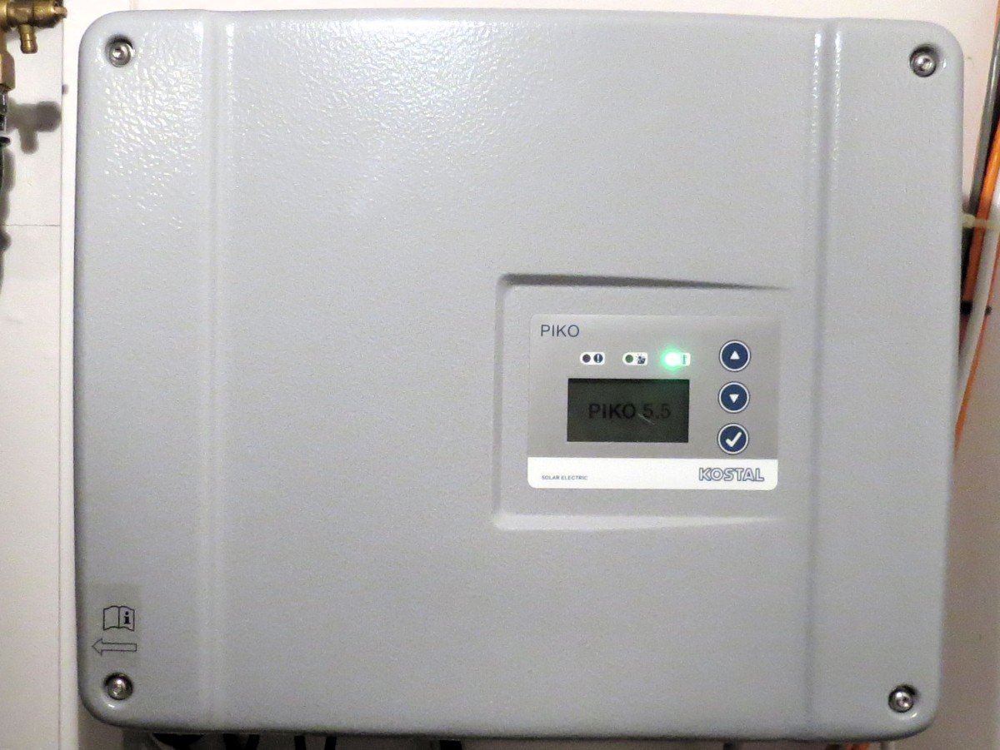

# Kostal Inverter Binding

Scrapes the web interface of the inverter for the metrics of the supported channels below.



## Supported Things

Tested with Kostal Inverter Pico but might work with other inverters from kostal too.

## Discovery

None

## Channels

-   acPower
-   totalEnergy
-   dayEnergy
-   status

## Thing Configuration

demo.things

```
Thing kostalinverter:kostalinverter:inverter [ url="http://192.168.0.128" ]
```

If the thing goes online then the connection to the web interface is successful.
In case it is offline you should see an error message.

## Items

demo.items:

```
Number SolarPower "Solar power [%.2f Watt]" <energy> (gGF) { channel="kostalinverter:kostalinverter:inverter:acPower" }
Number SolarEnergyDay "Solar day energy[%.2f kwh]" <energy> (gGF)  { channel="kostalinverter:kostalinverter:inverter:dayEnergy" }
Number SolarTotalEnergy "Solar total energy[%.2f kwh]" <energy> (gGF) { channel="kostalinverter:kostalinverter:inverter:totalEnergy" }
String SolarStatus "Solar status [%s]" <energy> (gGF) { channel="kostalinverter:kostalinverter:inverter:status" }
```
