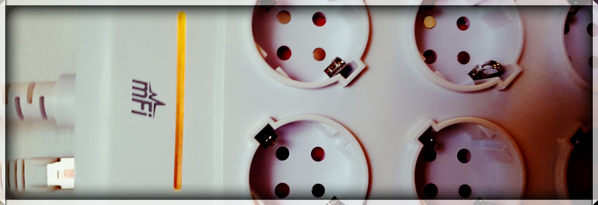
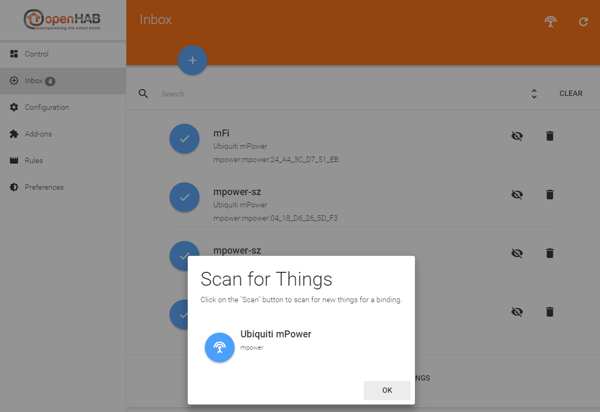
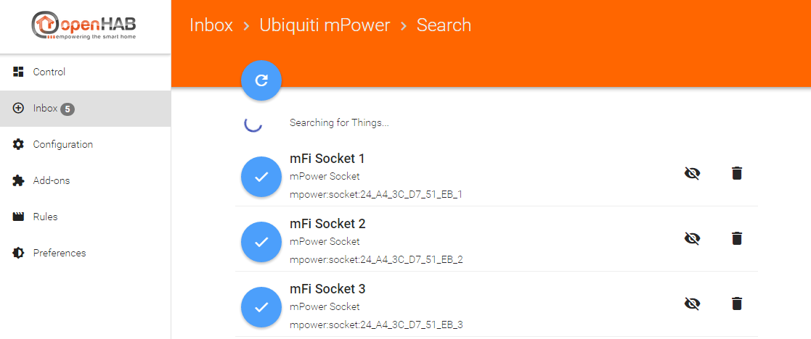
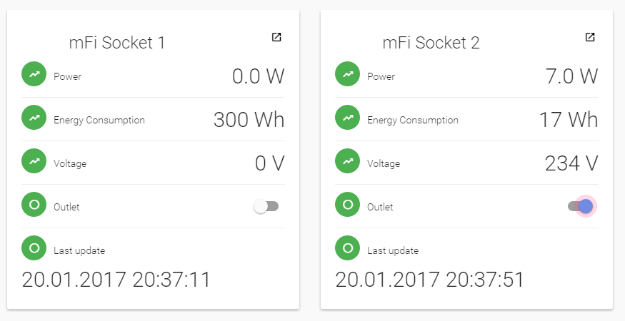

# Ubiquiti Networks mPower binding



This binding allows you to control [Ubiquiti Networks mPower devices](https://www.ubnt.com/mfi/mpower/)

You do not need the mFi Controller software.

## Supported devices
Device | Status
------------ | -------------
P1E|untested
P3E|tested, works
P6E|tested, works
P1U|untested
P3U|untested
P8U|untested

## Concept

Each mPower strip is a "bridge" and each socket on the strip is a "thing".
Communication with the mPower strip is done via SSH.

Features:

* Switch outlets
* Good latency for switching operations
* Read power consumption values (see below)
* Automatic reconnect once a mPower connection got lost (check performed every 60 seconds)
* Switch state stays in sync with mPower: So if you switch a socket with the mPower App oder Webinterface it will be reflected in OpenHab
* Discovery of strips and sockets
* As least as possible channel updates by comparing new and old values and rounding

## Available channels

Each socket thing provides the following channels:

Channel | description
------------ | -------------
power|The current power draw in Watt
voltage|Current voltage
outlet|The switch
energy|Accumulated energy consumption in Watt hours (Wh)
lastUpdated|the date holding the last update timestamp. Usually this is not needed, thus this channel is marked as "advanced".


## Thing configuration
Each mPower strip needs the following configuration parameters. They can be set either in PaperUI after Autodiscovery or manually in a thing file. (see below)

Parameter | Description
------------ | -------------
username|mPower username (default set to `ubnt`)
password|mPower password (default set to `ubnt`)
host|IP address or hostname of the mPower. Autodiscovery will set this value for you. 
refresh|in ms. Defines how often the channels are updated. The minimum refresh is `10.000 ms`. Default is `20.000 ms.`)

## Let autodiscovery create the bridge
Autodiscovery scans your network and will add new mPower devices to your inbox. Please note: this won't happen if you added the device manually in a *.things file.



## Let autodiscovery create the sockets
As soon as you added an mPower strip as a thing, autodiscovery will prepare more things: one for each socket. You can find it in your inbox.



Now you can control the sockets.


## Create things manually
You can also add mPower and socket things manually. Please note the syntax for the bridge and the sockets:
```
Bridge <Unique ID> "<label>" [ host="<IP/hostname>", refresh=<in_ms>, username="<username>", password="<password>" ] {
```

```
socket <Unique ID, simply use the socket number here> "<label>" @ "<location>" [ socketNumber=<the number of the socket on the mPower>] 
```

The following code provides an example. 

```
Bridge mpower:mpower:24_A4_3C_D7_51_EB "mPower living room" [ host="192.168.1.26", refresh=60000, username="ubnt", password ="ubnt" ] {
    socket 1 "mPower Switch" @ "mPower" [ socketNumber=1]
    socket 2 "mPower TV" @ "mPower"[ socketNumber=2]
    socket 3 "mPower Lights" @ "mPower"[ socketNumber=3]
}
``` 

Make sure that the Unique ID (UID) is correct. Otherwise autodiscovery will add the same mPower bridge again to your inbox. To find out the right UID you have 2 options:

* Use your OS and find out the serial number of your mPower. Replace all ":" by "_" to get the right format.

* Use auto discovery (without confirming the item in the inbox) and copy the UID from there


# Extra features

## Energy consumption statistics
By default the channel `energy` cumulates watt-hours (Wh).
I you like to have a per-day statistic available in OpenHab I suggest the following approach:

Make sure that the "cf_count" values are reset each night. You can do this by connecting to your mPower device via SSH and adding the following lines to /tmp/system.cfg
```
cron.1.job.1.cmd=echo 1 > /proc/power/clear_ae4;echo 1 > /proc/power/clear_ae5;echo 1 > /proc/power/clear_ae6;echo 1 > /proc/power/clear_ae1;echo 1 > /proc/power/clear_ae2;echo 1 > /proc/power/clear_ae3;
cron.1.job.1.schedule=59 23 * * *
cron.1.job.1.status=enabled
cron.1.status=enabled
cron.1.user=ubnt
cron.status=enabled
```

Now you can persist the `enery` each day a minute before midnight.