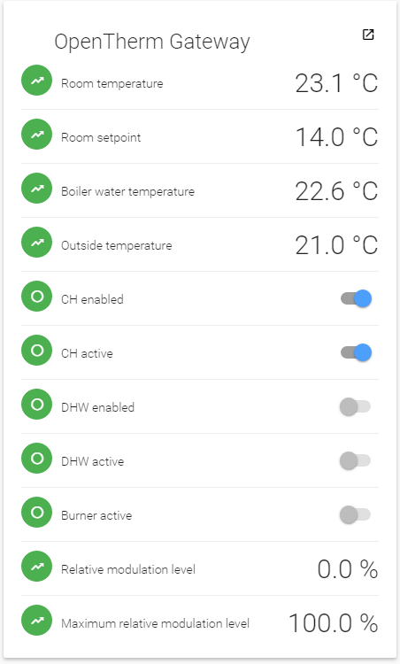

# OpenTherm Gateway Binding

This binding is used to integrate the OpenTherm Gateway into OpenHAB2. The OpenTherm Gateway is module designed by Schelte Bron that is connected in between a boiler and a thermostat that communicates using the OpenTherm protocol. 

More info on the OpenTherm Gateway can be found at [http://otgw.tclcode.com/]

## Supported Things

The OpenTherm Gateway binding currently only supports one thing, and that's the gateway itself.

## Discovery

This binding doesn't support auto discovery features.

## Binding Configuration

The binding itself does not require any configuration.

## Thing Configuration

The binding is designed to support various ways of connecting to the OpenTherm Gateway, but currently only supports a socket connection. The configuration settings for the thing are Hostname and Port, which are used to open the socket to the gateway.

Future types of connections may require other settings, such as a COM port.

## Channels

The thing currently supports the follow channels:

## Full Example

_Provide a full usage example based on textual configuration files (*.things, *.items, *.sitemap)._

## Any custom content here!

_Feel free to add additional sections for whatever you think should also be mentioned about your binding!_
