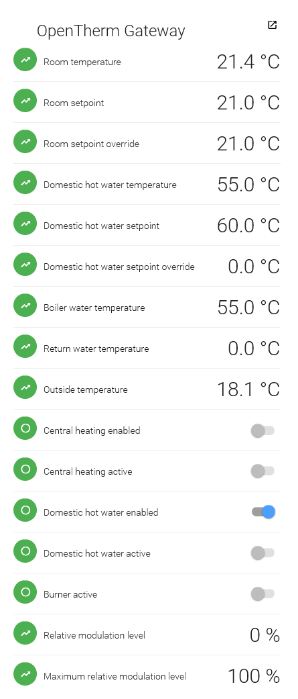

# OpenTherm Gateway Binding

This binding is used to integrate the OpenTherm Gateway into OpenHAB2. The OpenTherm Gateway is a module designed by Schelte Bron that is connected in between a boiler and a thermostat that communicates using the OpenTherm protocol.

This binding is still under development. Please visit https://github.com/ArjenKorevaar/openhab2-openthermgateway-binary to download the lastest compiled test version.

More information on the OpenTherm Gateway can be found at http://otgw.tclcode.com/

## Supported Things

The OpenTherm Gateway binding currently only supports one thing, and that's the gateway itself.

## Discovery

The binding supports auto discovery.

## Binding Configuration

The binding itself does not require any configuration.

## Thing Configuration

The binding is designed to support various ways of connecting to the OpenTherm Gateway, but currently only supports a TCP socket connection. The configuration settings for the thing are Hostname and Port, which are used to open the socket to the gateway.

Future types of connections may require other settings, such as a COM port.

## Channels

The OTGW thing currently supports the follow channels:



## Full Example

### demo.things:

```
Thing openthermgateway:otgw:1 [ipaddress="192.168.1.100", port="8000"]
```

### demo.items:

```
Number OpenThermGateway_RoomTemperature "Room temperature [%.1f °C]" <temperature> {channel="openthermgateway:otgw:1:roomtemp"}
Number OpenThermGateway_RoomSetpoint "Room setpoint [%.1f °C]" <temperature> {channel="openthermgateway:otgw:1:roomsetpoint"}
Number OpenThermGateway_RoomSetpointOverride "Room setpoint override [%.1f °C]" <temperature> {channel="openthermgateway:otgw:1:overridesetpoint"}
Number OpenThermGateway_DomesticHotWaterTemperature "Domestic hot water temperature [%.1f °C]" <temperature> {channel="openthermgateway:otgw:1:dhwtemp"}
Number OpenThermGateway_DomesticHotWaterSetpoint "Domestic hot water setpoint [%.1f °C]" <temperature> {channel="openthermgateway:otgw:1:tdhwset"}
Number OpenThermGateway_DomesticHotWaterSetpointOverride "Domestic hot water setpoint override [%.1f °C]" <temperature> {channel="openthermgateway:otgw:1:overridedhwsetpoint"}
Number OpenThermGateway_BoilerWaterTemperature "Boiler water temperature [%.1f °C]" <temperature> {channel="openthermgateway:otgw:1:flowtemp"}
Number OpenThermGateway_ReturnWaterTemperature "Return water temperature [%.1f °C]" <temperature> {channel="openthermgateway:otgw:1:returntemp"}
Number OpenThermGateway_OutsideTemperature "Outside temperature [%.1f °C]" <temperature> {channel="openthermgateway:otgw:1:outsidetemp"}
Switch OpenThermGateway_CentralHeatingEnabled "Central heating enabled" <switch> {channel="openthermgateway:otgw:1:ch_enable"}
Switch OpenThermGateway_CentralHeatingMode "Central heating active" <switch> {channel="openthermgateway:otgw:1:ch_mode"}
Switch OpenThermGateway_DomesticHotWaterEnabled "Domestic hot water enabled" <switch> {channel="openthermgateway:otgw:1:dhw_enable"}
Switch OpenThermGateway_DomesticHotWaterMode "Domestic hot water active" <switch> {channel="openthermgateway:otgw:1:dhw_mode"}
Switch OpenThermGateway_FlameMode "Burner active" <fire> {channel="openthermgateway:otgw:1:flame"}
Number OpenThermGateway_RelativeModulationLevel "Relative modulation level [%d %%]" {channel="openthermgateway:otgw:1:modulevel"}
Number OpenThermGateway_MaxRelativeModulationLevel "Maximum relative modulation level [%d %%]" {channel="openthermgateway:otgw:1:maxrelmdulevel"}
```

### demo.sitemap:

```
sitemap demo label="Main Menu" {
    Frame label="OpenTherm Gateway" {
        Text item=RoomTemperature icon="temperature" label="Room temperature [%.1f °C]"        
        Setpoint item=RoomSetpoint minValue=0.0 maxValue=99.0 step=0.5 icon="heating" label="Room setpoint [%.1f °C]"
        Text item=BoilerWaterTemperature icon="temperature" label="Boiler water temperature [%.1f °C]"
        Text item=ReturnWaterTemperature icon="temperature" label="Return water temperature [%.1f °C]"
        Setpoint item=OutsideTemperature minValue=0.0 maxValue=99.0 step=0.5 icon="temperature" label="Outside temperature [%.1f °C]"
        
        Switch item=CentralHeatingEnabled icon="radiator" label="Central heating enabled"
        Switch item=CentralHeatingActive icon="radiator" label="Central heating active"
        Switch item=DomesticHotWaterEnabled icon="faucet" label="Domestic hot water enabled"
        Switch item=DomesticHotWaterActive icon="faucet" label="Domestic hot water active"
        Switch item=BurnerActive icon="fire" label="Burner active"
        
        Text item=RelativeModulationLevel icon="heating" label="Relative modulation level"
        Text item=MaximumRelativeModulationLevel icon="heating" label="Maximum relative modulation level"
    }
}
```
