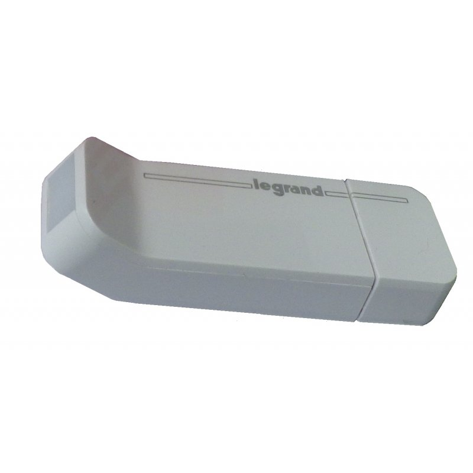

# OpenWebNet Binding

This binding integrates BTicino / Legrand devices using OpenWebNet protocol over Zigbee aka Open/ZigBee and commercially MyHOME(r) Play

The integration happens through a USB dongle, which acts as a gateway to the Open/ZigBee devices.

## Supported Things

The USB dongle is required as a "bridge" for accessing any other Open/ZigBee devices.

Almost all available Open/ZigBee devices are supported by this binding. 
Please note that the devices need to be attached to same Network as USB dongle before it is possible for this binding to use them.

The Hue binding supports mostly all lighting devices (switch and dimmer) and automation devices.

## Discovery

All discoveries can be done through PaperUI.

The discovery of the USB dongle is performed on user request by checking all serial interface on the computer.

Once it is added as a Thing, a second user request is needed to find the devices themselves. This step takes several tens of seconds.

## Binding Configuration

No configuration is needed.

## Thing Configuration

No Thing configuration is needed.

## Channels

All devices support some of the following channels:

| Channel Type ID   | Item Type       | Description                                                                                                                                   |
|-------------------|-----------------|-----------------------------------------------------------------------------------------------------------------------------------------------|
| switch            | Switch          | This channel supports switching the device on and off.                                                                                        |   
| brightness        | Dimmer          | This channel supports adjusting the brightness value. Note that this is channel also compatible of switch channel.                            |
| shutter           | Rollershutter   | This channel supports activation of roller shutter (Up, down, stop), if the shutter travel is configured, the position can be set/returned.   |                                                                                          

## Full Example

None for now
