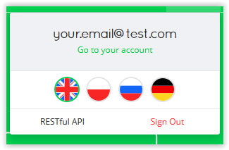
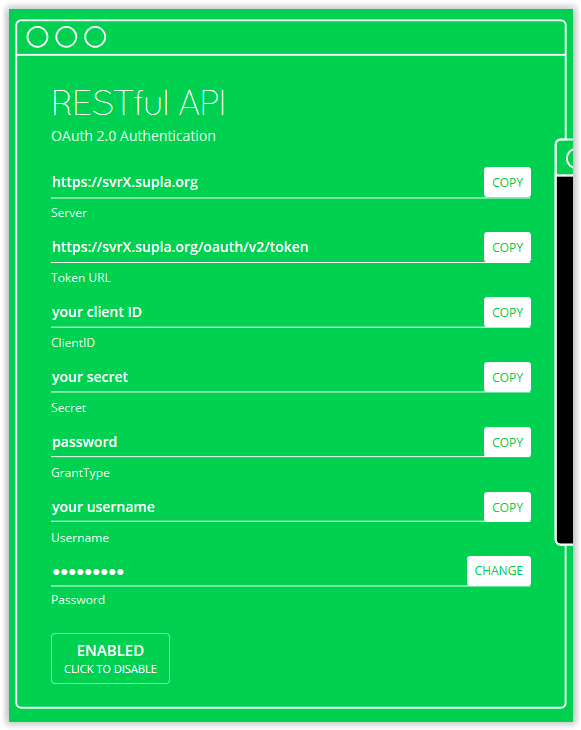

# Supla Binding

This binding provides integration with Supla Cloud (https://cloud.supla.org), either web version or Raspberry PI version. 

Note: **Remember about turning on RESTful API!**

## Supported Things

Right now supported are only Supla _relay_ things - everything that can be turned on/off. Other devices may be supported 
in future but right now I don't have any physical devices for tests.

This binding was tested with _Zamel ROW-01_ https://supla.zamel.pl/en/.

## Discovery

After adding _Supla Bridge_ all _Supla Devices_ that belongs to this server will be discovered. There is no need for manual 
importing things into OpenHAB.

## Thing Configuration

_Describe what is needed to manually configure a thing, either through the (Paper) UI or via a thing-file. This should be mainly about its mandatory and optional configuration parameters. A short example entry for a thing file can help!_

_Note that it is planned to generate some part of this based on the XML files within ```ESH-INF/thing``` of your binding._

## Channels

Right now there is only support for 2 types of channels: *light-channel* and *switch-channel*.
 
 *switch-channel* is used when device has channel of type ```TYPE_RELAY``` (from Supla REST). *light-channel* is specialized
 version of *switch-channel* and it is used when channel function is ```FNC_LIGHTSWITCH```.
 
 There is plan to create more channel types, but right now I don't have any physical devices to test.  

## Turning on REST API

Log in into your Supla Cloud account (create if not done yet). Then go to _Account_ and click **RESTful API**



After that please click button to enable API. After that you should see something similar to this:



Take this values to create new _Supla Bridge_ and discover all your _Supla Devices_.

