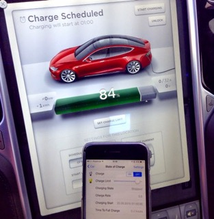

# Tesla Binding

This binding integrates the [Tesla Electrical Vehicle](http://www.teslamotors.com).
The integration happens through the Tesla Owners Remote API.

## Supported Things

Currently, the Tesla Model S is supported by this binding.



## Binding Configuration

The binding uses a the owner's email address and password in order to access the Tesla Owners Remote API.
This is the same email address and password as used in the Tesla smartphone app, that allows to remotely control the Tesla Model S.

## Alternative secure configuration

After a successful connection (Thing is online), you can clear the username and password field from the configuration, leaving only the VIN. Instead of using the username and password, from now on, only the access token will be stored and used (access token + refresh token).
This is a better approach for many reasons, one being that you cannot start the car without the password.
If you really don't like the thought of your username and password being stored temporarily, there is also a third option: Leave username/password blank, go into the openHAB console (ssh -p 8101 openhab@localhost), and run the following command:

```
openhab> smarthome:tesla logon 1
Username (email): ****@***.com
Password:
Attempting logon...
Successfully logged on and stored token.
```

This command will perform a single logon, store the auth tokens and forget it ever saw your username and password.
In the second parameter to the logon comand above, "1" is the thing id.

## Thing Configuration

The Tesla Thing requires the username and password as a configuration value in order for the binding to log into the Tesla service, as well as the VIN (Vehicle Identfication Number) to identify the vehicle tracked by the Thing.
In the thing file, this looks e.g. like

```
Thing tesla:models:1 [ username="your.email@company.com", password="somepassword", vin="5YJSA7H25FFP53746"]
```

## Channels

All devices support the following channels (non exhaustive):

| Channel Type ID | Item Type | Description                                                                                                                 |   |   |
|-----------------|-----------|-----------------------------------------------------------------------------------------------------------------------------|---|---|
| charge          | Switch    | This channel supports starting or stopping the charging process of the vehicle                                              |   |   |
| location        | Location  | This channel indicates the actual location (latitude, longitude, elevation) of the vehicle                                  |   |   |
| doorlock        | Switch    | This channel supports locking or unlocking the doors of the vehicle                                                         |   |   |
| insidetemp      | Number    | This channel indicates the inside temperature of the vehicle                                                                |   |   |
| odometer        | Number    | This channel indicates the actual state of the vehicle's odometer, in km or miles along the build of the vehicle (EU or US) |   |   |
| batterylevel    | Number    | This channel indicates the actual state of the vehicle's battery, in %                                                      |   |   |


## Example

demo.Things:

```
Thing tesla:models:1 [ username="your.email@company.com", password="somepassword", vin="5YJSA7H25FFP53746"]
```

demo.items:

```
Switch TeslaCharge {channel="tesla:models:1:charge"}
Location TeslaLocation {channel="tesla:models:1:location"}
Dimmer TeslaChargeLimit {channel="tesla:models:1:chargelimit"}
String TeslaChargeRate {channel="tesla:models:1:chargerate"}
String TeslaChargingState {channel="tesla:models:1:chargingstate"}
Number TeslaTimeToFullCharge {channel="tesla:models:1:timetofullcharge"}
Number TeslaChargerPower {channel="tesla:models:1:chargerpower"}
DateTime TeslaScheduledChargingStart {channel="tesla:models:1:scheduledchargingstart"}
Dimmer TeslaSoC "State of Charge [%.1f %%]" {channel="tesla:models:1:soc"}
Number TeslaSpeed {channel="tesla:models:1:speed"}
String TeslaState {channel="tesla:models:1:state"}
Number TeslaPower {channel="tesla:models:1:power"}
Number TeslaInsideTemperature {channel="tesla:models:1:insidetemp"}
Number TeslaOutsideTemperature {channel="tesla:models:1:outsidetemp"}
Switch TeslaAutoconditioning {channel="tesla:models:1:autoconditioning"}
Number TeslaTemperature {channel="tesla:models:1:temperature"}
String TeslaShiftState {channel="tesla:models:1:shiftstate"}
Number TeslaBatteryCurrent {channel="tesla:models:1:batterycurrent"}
Number TeslaBatteryLevel {channel="tesla:models:1:batterylevel"}
DateTime TeslaEventstamp {channel="tesla:models:1:eventstamp"}
Number 	TeslaOdometer {channel="tesla:models:1:odometer"}
Number	TeslaLatitude {channel="tesla:models:1:latitude"}
Number	TeslaLongitude {channel="tesla:models:1:longitude"}
Number	TeslaElevation {channel="tesla:models:1:elevation"}
Number	TeslaHeading {channel="tesla:models:1:heading"}
DateTime TeslaGPSStamp {channel="tesla:models:1:gpstimestamp"}
```

demo.sitemap:

```
sitemap demo label="Main Menu"
{
			Text label="Car" {
				Text label="Drive" {
					Text item=TeslaEventstamp label="Last Event Timestamp [%1$td.%1$tm.%1$tY %1$tT]"
					Text item=TeslaState label="State [%s]"
					Text item=TeslaSpeed label="Speed [%.1f]"
					Text item=TeslaShiftState label="Shift State [%s]"
					Text item=TeslaOdometer label="Odometer [%.1f km]"
				}
				Text label="Climate" {
					Switch item=TeslaAutoconditioning label="Auto Conditioning"  mappings=[ON=ON, OFF=OFF ]
					Setpoint item=TeslaTemperature step=0.5 minValue=18 maxValue=34 label="Auto Conditioning Temperature [%.1f °C]" icon="temperature"
					Text item=TeslaInsideTemperature label="Inside Temperature [%.1f]"
				}
				Text label="Power" {
					Text item=TeslaBatteryCurrent label="Current [%.1f]"
				}
				Text item=TeslaSoC {
					Switch item=TeslaCharge label="Charge" mappings=[ON=ON, OFF=OFF ]
					Slider item=TeslaChargeLimit label="Charge Limit [%.1f]"
					Text item=TeslaChargingState label="Charging State [%s]"
					Text item=TeslaChargeRate label="Charge Rate [%s]"
					Text item=TeslaScheduledChargingStart label="Charging Start [%1$td.%1$tm.%1$tY %1$tT]"
					Text item=TeslaTimeToFullCharge label="Time To Full Charge [%.1f hours]"
				}
			}
}
```
