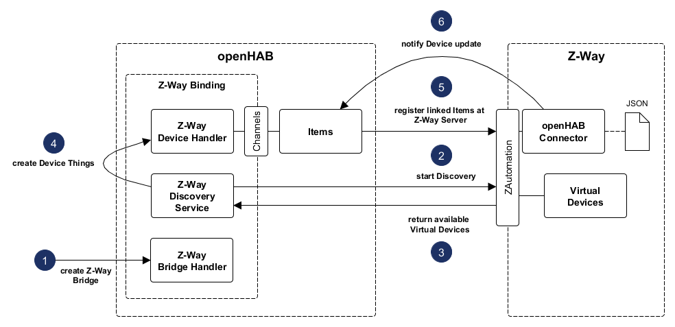

# Z-Way Binding

Z-Way is a software to configure and control a Z-Wave network.
The software comes with a full stack from Z-Wave transceiver with certified firmware to a REST API on high level.

Z-Way comes in three parts [cf. [Z-Wave.Me]([Z-Wave.Me](https://www.z-wave.me/index.php?id=1))]:

-   a firmware that runs on the Z-Wave transceiver chip
-   the communication stack that runs on different host Operating Systems
-   an automation engine and optionally a web server to implement a User Interface

All parts together represents a smart home controller for Z-Wave.

The entire infrastructure is maintained and developed by [Z-Wave.Me](https://www.z-wave.me/index.php?id=1) with the help of a large community.

Please note the **known issues** below.

### Approach

The idea behind is the integration of Z-Wave through a bridge (Z-Way controller).
The existing, certified Z-Way stack can be used to build, configure and control the Z-Wave network.
By using the REST API all devices are loaded from Z-Way and represented as openHAB elements.
The sensor data and actuator states are constantly updated and commands are passed to the Z-Way system.

The Binding uses the Z-Way library for Java ([Github](https://github.com/pathec/ZWay-library-for-Java)).

## Supported Things

The Z-Way Binding provides different thing types.
The core component is the bridge which represents the Z-Way server.
For the integration of devices, two thing types are available.
In Z-Way there are devices which represent physical devices and (virtual) devices which are defined in Apps.
The difference is that physical devices usually have several functions.
Z-Way server constructs (virtual) devices for each function, such as motion sensors or door contacts.
In openHAB, these functions are bundled into physical devices and represented as things with channels for each function.
This type of thing is a *Z-Wave Device*.
On the other hand all virtual devices are mapped to *Z-Way Virtual Devices* with exactly one channel.

-   *Z-Way Server* (Bridge) represents a bridge with general settings and communication tasks.
-   *Z-Way Virtual Device* represents one (virtual) device with the corresponding channel. A bridge is necessary as an intermediary between openHAB thing and Z-Way device.
-   *Z-Wave Device* represents a device of real world. Each device function will be mapped to a separate channel. The bridge is necessary as an intermediary between openHAB thing and Z-Way device.

## Discovery

A discovery service for Z-Way servers scans local network and must always be started manually.
Z-Way doesn't support any discovery protocol like UPnP for this purpose.
That's why first all IP addresses in local network are checked on port 8083.
If the server answers, a ZAutomation request (*/ZAutomation/api/v1/status*) is performed to ensure, the found server runs Z-Way.

Another discovery service provides available devices (a configured bridge is necessary).
The device discovery service is performed at a specified interval, but can also be started manually.

Note: In the Z-Way server device can be disabled or made invisible. Only for active and visible Z-Way devices channels will created.

## Binding Configuration

No configuration is necessary.

## Thing Configuration

The textual configuration (via \*.thing files) isn't useful because the resulting elements are read-only.
But the configuration and properties of things are changed at runtime and channels are dynamically added and removed.

### Z-Way Server (Bridge)

The information about accessing openHAB are needed so that the Observer mechanism works.
Besides the username and password all required Z-Way information are found during discovery.

| Configuration Name       | Mandatory | Default   | Desciption                                                                                                                                                                                   |
|--------------------------|-----------|-----------|----------------------------------------------------------------------------------------------------------------------------------------------------------------------------------------------|
| openHABAlias             |           |           | By default, the alias is generated during initialization or configuration update of thing handler.                                                                                           |
| openHABIpAddress         |           | localhost | The IP address or hostname of the openHAB server. If Z-Way and openHAB are running on the same machine, the default value can be used.                                                       |
| openHABPort              |           | 8080      | The port of the openHAB server (0 to 65335)                                                                                                                                                  |
| openHABProtocol          |           | http      | Protocol to connect to the openHAB server (http or https)                                                                                                                                    |
| zwayServerIpAddress      |           | localhost | The IP address or hostname of the Z-Way server. If Z-Way and openHAB are running on the same machine, the default value can be used.                                                         |
| zwayServerPort           |           | 8083      | The port of the Z-Way server (0 to 65335)                                                                                                                                                    |
| zwayServerProtocol       |           | http      | Protocol to connect to the Z-Way server (http or https)                                                                                                                                      |
| zwayServerUsername       |           | admin     | Username to access the Z-Way server.                                                                                                                                                         |
| zwayServerPassword       | X         |           | Password to access the Z-Way server.                                                                                                                                                         |
| pollingInterval          |           | 3600      | Refresh device states and registration from Z-Way server in seconds (at least 60).                                                                                                           |
| observerMechanismEnabled |           | true      | The observer functionality is responsible for the item registration as observer in Z-Way. Attention: if disable this option, you have to setup an other synchronization mechanism like MQTT. |

Only the Z-Way server can be configured textual (Attention! *openHABAlias* has to be set because the bridge configuration can not be changed at runtime):

```
Bridge zway:zwayServer:192_168_2_42 [ openHABAlias="development", openHABIpAddress="localhost", openHABPort=8080, openHABProtocol="http", zwayServerIpAddress="localhost", zwayServerPort=8083, zwayServerProtocol="http", zwayServerUsername="admin", zwayServerPassword="admin", pollingInterval=3600, observerMechanismEnabled=true ] {
    // associated things have to be created with the Paper UI
}
```

### Z-Way Virtual Device

| Configuration Name | Mandatory | Default | Description                 |
|--------------------|-----------|---------|-----------------------------|
| deviceId           | X         |         | Device ID of virtual device |
| bridge reference   | X         |         |                             |


### Z-Wave Device

| Configuration Name | Mandatory | Default | Description                  |
|--------------------|-----------|---------|------------------------------|
| nodeId             | X         |         | Node ID of the Z-Wave device |
| bridge reference   | X         |         |                              |

## Channels

### Channels with detailed information for the devices

The following channels are currently supported.

| Channel Type ID        | Item Type | Category      | Asssigned for Z-Way device type and probe type                                                                                              |
|------------------------|-----------|---------------|---------------------------------------------------------------------------------------------------------------------------------------------|
| sensorTemperature      | Number    | Temperature   | SensorMultilevel - temperature                                                                                                              |
| sensorLuminosity       | Number    | Light         | SensorMultilevel - luminosity                                                                                                               |
| sensorHumidity         | Number    | Humidity      | SensorMultilevel - humidity                                                                                                                 |
| sensorBarometer        | Number    | Pressure      | SensorMultilevel - barometer                                                                                                                |
| sensorUltraviolet      | Number    | Light         | SensorMultilevel - ultraviolet                                                                                                              |
| sensorCO2              | Number    | CarbonDioxide | SensorMultilevel - *Special case:* no probe type for carbon dioxide sensors available - probe title *CO2 Level* acts as selection criterion |
| sensorEnergy           | Number    | Energy        | SensorMultilevel - energy                                                                                                                   |
| sensorMeterKWh         | Number    | Energy        | SensorMultilevel - meterElectric_kilowatt_per_hour                                                                                          |
| sensorMeterW           | Number    | Energy        | SensorMultilevel - meterElectric_watt                                                                                                       |
| sensorSmoke            | Switch    | Smoke         | SensorBinary - smoke                                                                                                                        |
| sensorCo               | Switch    | Gas           | SensorBinary - co                                                                                                                           |
| sensorFlood            | Switch    | Water         | SensorBinary - flood                                                                                                                        |
| sensorTamper           | Switch    | Alarm         | SensorBinary - tamper                                                                                                                       |
| sensorDoorWindow       | Contact   | Contact       | SensorBinary - door-window                                                                                                                  |
| sensorMotion           | Switch    | Motion        | SensorBinary - general_purpose, motion                                                                                                      |
| switchPowerOutlet      | Switch    | PowerOutlet   | SwitchBinary - *Special case:* no probe type for power outlet available - icon *switch* acts as selection criterion                         |
| switchColorTemperature | Dimmer    | ColorLight    | SwitchMultilevel - switchColor_soft_white, switchColor_cold_white                                                                           |
| thermostatMode         | Switch    | Temperature   | SwitchBinary - thermostat_mode                                                                                                              |

Currently unsupported Z-Way probe types:

-   SensorBinary: cooling, all alarm types (resulting from Z-Wave command class AlarmSensor(deprecated) and Alarm)
-   SensorMultilevel: meterElectric_pulse_count, meterElectric_voltage, meterElectric_ampere, meterElectric_power_factor

### Universial channels for the devices

The following channels represent universial channels if no further device information are available, only depending on the Z-Way device types (for available device types see [Z-Way Documentation](http://docs.zwayhomeautomation.apiary.io/#reference/devices/device)).

| Channel Type ID  | Item Type | Category    | Assigned for Z-Way device type            |
|------------------|-----------|-------------|-------------------------------------------|
| battery          | Number    | Battery     | Battery                                   |
| doorlock         | Switch    | Door        | Doorlock                                  |
| sensorBinary     | Switch    | Switch      | SensorBinary                              |
| sensorMultilevel | Number    | -           | SensorMultilevel                          |
| switchBinary     | Switch    | Switch      | SwitchBinary                              |
| switchMultilevel | Dimmer    | -           | SwitchMultilevel                          |
| switchColor      | Color     | ColorLight  | SwitchRGBW                                |
| switchControl    | Switch    | Switch      | SwitchControl, ToggleButton, SwitchToggle |
| thermostat       | Number    | Temperature | Thermostat                                |
| sensorDiscrete   | Number    | -           | SensorDiscrete                            |


Unsupported Z-Way device types: Camera, SensorMultiline, Text. The integration of these types isn't planned.

### Channels for the Z-Way Server (Bridge)


Markdown Table Formatter

This tool formats basic MultiMarkdown style tables for easier plain text reading.
It adds padding to all the cells to line up the pipe separators when using a mono-space font.

To see what it's all about, try one of these examples, or format your own.

Load: Example 1 - Example 2 - Example 3

For more information:
I'm on Twitter as @TheIdOfAlan
I sometimes post on my personal site alanwsmith.com
This is an Open Source GitHub Project.
It has a Jasmine Test Suite.
What to show your appreciation? Buy me a book

## Locations

The locations of the Z-Way devices are loaded during the discovery.
Based on the location ID of Z-Way device, the name of the Z-Way room is then allocated to the location property of the thing.

## Example

Because textual configuration isn't useful, follow the instructions in the [Getting Started](doc/GETTING_STARTED.md) document.

## Developer stuff

### Known issues

-   The Z-Way Binding only works, when simple mode of item linking is enabled during thing creation.

### Structure of Z-Way Binding



### Features

-   Discovery of the Z-Way server and devices
-   Control of the Z-Wave devices in openHAB
-   Receive updates of sensor data and actuator states in openHAB

### Restrictions

-   Z-Way device types (especially the probe types) supported by openHAB channels with detailed information (scale types and so on) are not complete.
-   Configuration of the Z-Wave network by the binding is currently not possible (physical device configuration)
-   Z-Way App "openHAB Connector" is required. Further versions will contain other mechanisms under usage of the WebSocket implementation of Z-Way or MQTT.

<br>

