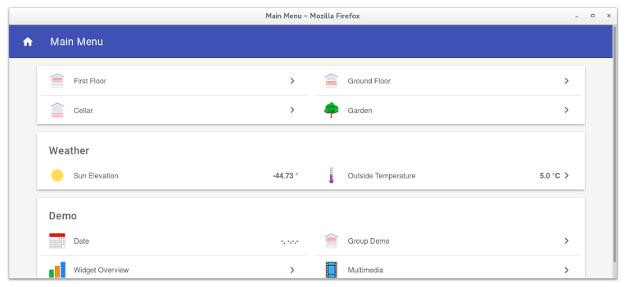
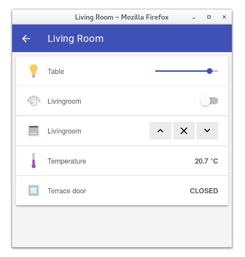

## Basic UI

The Basic UI is a web interface based on Material Design Lite from Google.

### Features

* Responsive layout suitable for various screen sizes
* AJAX navigation
* Live update

### Configuration

```
org.eclipse.smarthome.basicui:defaultSitemap=demo
# Icons can be disabled
org.eclipse.smarthome.basicui:enableIcons=true
# Icons can be shown as PNG or SVG images
# Default: PNG
org.eclipse.smarthome.basicui:iconType=svg
```

### Accessing Sitemaps

The Basic UI has a default layout showing all things and their corresponding items. You may create your own sitemaps and access them through the basic UI in 2 ways.

1. Set the default sitemap via the Paper UI via Configuration -> Services -> Basic UI -> Configure, and set the Default Sitemap name.

2. Passing the "sitemap" parameter to the URL used to access the server.

Example: http://hostname:8080/basicui/app?sitemap=sitemapname


### Screenshots:

[](doc/screenshot-1-full.png)
[](doc/screenshot-2-full.png)

