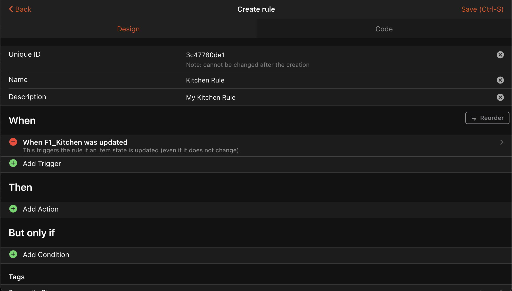
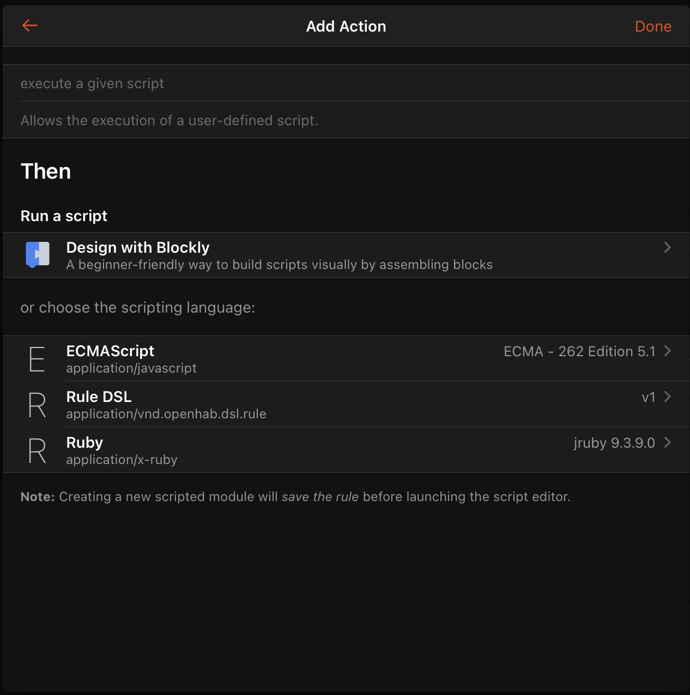
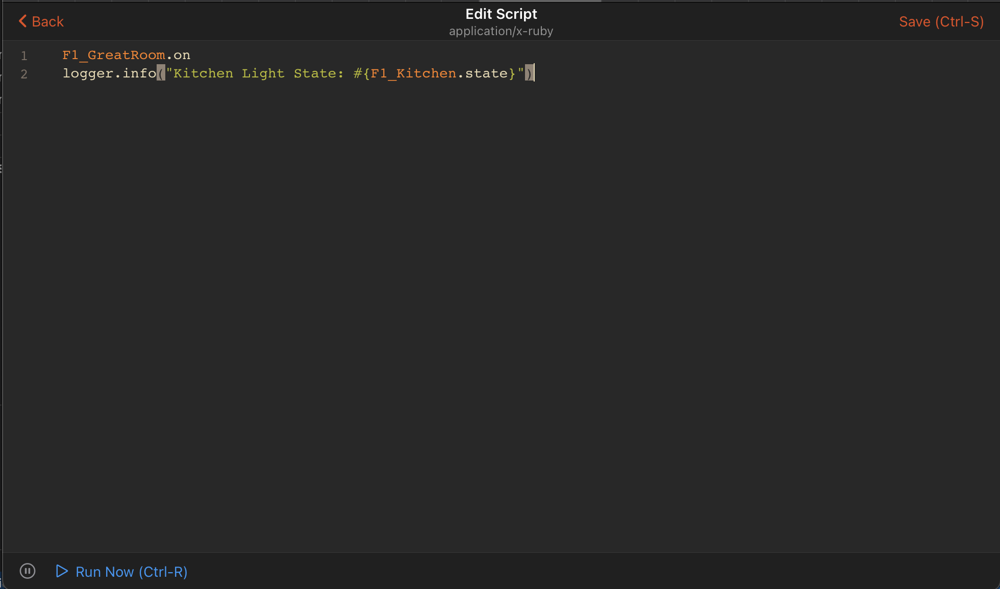

<!-- This file is auto-generated by YARD from https://github.com/openhab/openhab-jruby/blob/main/USAGE.md; please do not edit directly -->
<!-- To regenerate, run `bin/yard display -f markdown -o https://openhab.github.io/openhab-jruby/main file:USAGE.md` -->

# JRuby Scripting

This add-on provides [JRuby](https://www.jruby.org/) scripting language for automation rules.
Also included is [openhab-scripting](https://openhab.github.io/openhab-jruby/), a fairly high-level Ruby gem to support automation in openHAB.
It provides native Ruby access to common openHAB functionality within rules including items, things, actions, logging and more.
If you're new to Ruby, you may want to check out [Ruby Basics](https://openhab.github.io/openhab-jruby/main/file.ruby-basics.html).

- [Why Ruby?](#why-ruby)
- [Installation](#installation)
- [Configuration](#configuration)
- [Usage](#usage)
  - [UI Based Scripts](#ui-based-scripts)
  - [File Based Scripts](#file-based-scripts)
  - [Event Object](#event-object)
- [Library Details](#library-details)
  - [Items](#items)
    - [Groups](#groups)
    - [Commands](#commands)
    - [Updates](#updates)
    - [State](#state)
    - [Metadata](#metadata)
    - [Persistence](#persistence)
    - [Semantic Model](#semantic-model)
    - [Linked Things](#linked-things)
    - [Item Builder](#item-builder)
  - [Things](#things)
  - [Actions](#actions)
  - [Logging](#logging)
  - [Timers](#timers)
  - [Cache](#cache)
  - [Time](#time)
  - [Ephemeris](#ephemeris)
  - [Rules, Scripts, and Scenes](#rules-scripts-and-scenes)
  - [Gems](#gems)
  - [Shared Code](#shared-code)
  - [Transformations](#transformations)
  - [Profile](#profile)
- [File Based Rules](#file-based-rules)
  - [Basic Rule Structure](#basic-rule-structure)
  - [Rule Triggers](#rule-triggers)
    - [Item or Thing Changed](#item-or-thing-changed)
    - [Item Updated](#item-updated)
    - [Item Received a Command](#item-received-a-command)
    - [Member-of-Group Trigger](#member-of-group-trigger)
    - [Script is Loaded](#script-is-loaded)
    - [openHAB System Started](#openhab-system-started)
    - [Cron Trigger](#cron-trigger)
    - [Other Triggers](#other-triggers)
    - [Combining Multiple Triggers](#combining-multiple-triggers)
    - [Combining Multiple Conditions](#combining-multiple-conditions)
  - [Rule Conditions](#rule-conditions)
  - [Rule Executions](#rule-executions)
    - [Run Execution Block](#run-execution-block)
    - [Triggered Execution Block](#triggered-execution-block)
    - [Delay Execution Block](#delay-execution-block)
  - [Terse Rules](#terse-rules)
  - [Early Exit From a Rule](#early-exit-from-a-rule)
  - [Dynamic Generation of Rules](#dynamic-generation-of-rules)
  - [Hooks](#hooks)
- [Calling Java From JRuby](#calling-java-from-jruby)

Additional [example rules are available](https://openhab.github.io/openhab-jruby/main/file.examples.html), as well as examples of [conversions from DSL and Python rules](https://openhab.github.io/openhab-jruby/main/file.conversions.html).

## Why Ruby?

- Ruby is designed for programmers' productivity with the idea that programming should be fun for programmers.
- Ruby emphasizes the necessity for software to be understood by humans first and computers second.
- Ruby makes writing automation enjoyable without having to fight with compilers and interpreters.
- Rich ecosystem of tools, including things like Rubocop to help developers write clean code and RSpec to test the libraries.
- Ruby is really good at letting one express intent and create a DSL to make that expression easier.

### Design points

- Create an intuitive method of defining rules and automation
  - Rule language should "flow" in a way that you can read the rules out loud
- Abstract away complexities of openHAB
- Enable all the power of Ruby and openHAB
- Create a Frictionless experience for building automation
- The common, yet tricky tasks are abstracted and made easy. e.g. creating a timer that automatically reschedules itself.
- Tested
  - Designed and tested using [Test-Driven Development](https://en.wikipedia.org/wiki/Test-driven_development) with [RSpec](https://rspec.info/)
- Extensible.
  - Anyone should be able to customize and add/remove core language features
- Easy access to the Ruby ecosystem in rules through Ruby gems.

## Installation

### Prerequisites

1. openHAB 3.4+
1. The JRuby Scripting Language Addon

### From the User Interface

1. Go to `Settings -> Add-ons -> Automation` and install the jrubyscripting automation addon
   following the [openHAB instructions](https://www.openhab.org/docs/configuration/addons.html).
   In openHAB 4.0+ the defaults are set so the next step can be skipped.
1. Go to `Settings -> Other Services -> JRuby Scripting`:
   - **Ruby Gems**: `openhab-scripting=~>5.0`
   - **Require Scripts**: `openhab/dsl` (not required, but recommended)

### Using Files

1. Edit `<OPENHAB_CONF>/services/addons.cfg` and ensure that `jrubyscripting` is included in
   an uncommented `automation=` list of automations to install.
   In openHAB 4.0+ the defaults are set so the next step can be skipped.
1. Configure JRuby openHAB services

   Create a file called `jruby.cfg` in `<OPENHAB_CONF>/services/` with the following content:

   ```ini
   org.openhab.automation.jrubyscripting:gems=openhab-scripting=~>5.0
   org.openhab.automation.jrubyscripting:require=openhab/dsl
   ```

## Configuration

After installing this add-on, you will find configuration options in the openHAB portal under _Settings -> Other Services -> JRuby Scripting_.
Alternatively, JRuby configuration parameters may be set by creating a `jruby.cfg` file in `conf/services/`.

By default this add-on includes the [openhab-scripting](https://github.com/openhab/openhab-jruby) Ruby gem and automatically `require`s it.
This allows the use of [items](https://openhab.github.io/openhab-jruby/main/OpenHAB/DSL.html#items-class_method), [rules](https://openhab.github.io/openhab-jruby/main/OpenHAB/DSL.html#rules-class_method), [shared_cache](https://openhab.github.io/openhab-jruby/main/OpenHAB/DSL.html#shared_cache-class_method) and other objects in your scripts.
This functionality can be disabled for users who prefer to manage their own gems and `require`s via the add-on configuration options.
Simply change the `gems` and `require` configuration settings.

| Parameter             | Description                                                                                              |
| --------------------- | -------------------------------------------------------------------------------------------------------- |
| `gem_home`            | The path to store Ruby Gems. <br/><br/>Default: `$OPENHAB_CONF/automation/ruby/.gem/RUBY_ENGINE_VERSION` |
| `gems`                | A list of gems to install. <br/><br/>Default: `openhab-scripting=~>5.0`                                  |
| `check_update`        | Check for updated version of `gems` on start up or settings change. <br/><br/>Default: `true`            |
| `require`             | List of scripts to be required automatically. <br/><br/>Default: `openhab/dsl`                           |
| `rubylib`             | Search path for user libraries. <br/><br/>Default: `$OPENHAB_CONF/automation/ruby/lib`                   |
| `dependency_tracking` | Enable dependency tracking. <br/><br/>Default: `true`                                                    |
| `local_context`       | See notes below. <br/><br/>Default: `singlethread`                                                       |
| `local_variables`     | See notes below. <br/><br/>Default: `transient`                                                          |

When using file-based configuration, these parameters must be prefixed with `org.openhab.automation.jrubyscripting:`, for example:

```ini
org.openhab.automation.jrubyscripting:gems=openhab-scripting=~>5.0
org.openhab.automation.jrubyscripting:require=openhab/dsl
```

### gem_home

Path to where Ruby Gems will be installed to and loaded from. The directory will be created if necessary.
You can use `RUBY_ENGINE_VERSION`, `RUBY_ENGINE` and/or `RUBY_VERSION` replacements in this value
to automatically point to a new directory when the addon is updated with a new version of JRuby.

### gems

A comma separated list of [Ruby Gems](https://rubygems.org/) to install.

The default installs the version of the helper for this version of openHAB.
When overriding the default, be sure to still include the `openhab-scripting` gem in the
list of gems to install.

Each gem can have version specifiers which uses
[pessimistic versioning](https://thoughtbot.com/blog/rubys-pessimistic-operator).
Multiple version specifiers can be added by separating them with a semicolon.

Examples:

| gem setting                                      | Description                                                                                              |
| ------------------------------------------------ | -------------------------------------------------------------------------------------------------------- |
| `openhab-scripting`                              | install the latest version of `openhab-scripting` gem                                                    |
| `openhab-scripting=~>5.0.0`                      | install the latest version 5.0.x but not 5.1.x                                                           |
| `openhab-scripting=~>5.0`                        | install the latest version 5.x but not 6.x                                                               |
| `openhab-scripting=~>5.0, faraday=~>2.7;>=2.7.4` | install `openhab-scripting` gem version 5.x and `faraday` gem version 2.7.4 or higher, but less than 3.0 |
| `gem1= >= 2.2.1; <= 2.2.5`                       | install `gem1` gem version 2.2.1 or above, but less than or equal to version 2.2.5                       |

### check_update

Check RubyGems for updates to the above gems when openHAB starts or JRuby settings are changed.
Otherwise it will try to fulfil the requirements with locally installed gems, and you can manage them yourself
with an external Ruby by setting the same GEM_HOME.

### require

A comma separated list of script names to be required by the JRuby Scripting Engine at the beginning of user scripts.
The default is to require the helper library.

### rubylib

Search path for user libraries. Separate each path with a colon (semicolon in Windows).

### dependency_tracking

Dependency tracking allows your scripts to automatically reload when one of its dependencies is updated.
You may want to disable dependency tracking if you plan on editing or updating a shared library,
but don't want all your scripts to reload until you can test it.

### local_context

The local context holds Ruby runtime, name-value pairs for sharing variables between Java and Ruby.
Valid values are: `singleton`, `threadsafe`, `singlethread`, or `concurrent`.
See [this](https://github.com/jruby/jruby/wiki/RedBridge#context-instance-type) for options and details.

### local_variables

Defines how variables are shared between Ruby and Java. Valid values are: `transient`, `persistent`, or `global`.
See the [JRuby documentation](https://github.com/jruby/jruby/wiki/RedBridge#local-variable-behavior-options) for options and details.

## Usage

### UI Based Scripts

The quickest way to add rules is through the openHAB Web UI.

Advanced users, or users migrating scripts from existing systems may want to use
[File Based Scripts](#file-based-scripts) for managing rules using files in the user configuration directory.

#### Adding Triggers

Using the openHAB UI, first create a new rule and set a trigger condition.



#### Adding Actions

Select "Add Action" and then select "Run Script" with "Ruby".
This will bring up an empty script editor where you can enter your JavaScript.



You can now write rules using standard Ruby along with the included openHAB [library](#library-details).



For example, turning a light on:

```ruby
KitchenLight.on
logger.info("Kitchen Light State: #{KitchenLight.state}")
```

Sending a notification:

```ruby
notify("romeo@montague.org", "Balcony door is open")
```

Querying the status of a thing:

```ruby
logger.info("Thing status: #{things["zwave:serial_zstick:512"].status}")"
```

Theoretically you could even use a system start trigger with a UI rule, and then use the [syntax](#file-based-rules) mostly developed for file based rules to create multiple rules.

### File Based Scripts

The JRuby Scripting addon will load scripts from `automation/ruby` in the user configuration directory.
The system will automatically reload scripts when changes are detected to files.
Local variable state is not persisted among reloads, see using the [cache](#cache) for a convenient way to persist objects.
See [File Based Rules](#file-based-rules) for examples of creating rules within your scripts.

### Event Object

When you use "Item event" as trigger (i.e. "[item] received a command", "[item] was updated", "[item] changed"), there is additional context available for the action in a variable called `event`.

This tables gives an overview of the `event` object for most common trigger types. For full details, explore [OpenHAB::Core::Events](https://openhab.github.io/openhab-jruby/main/OpenHAB/Core/Events.html).

| Property Name | Type                                                                                         | Trigger Types                          | Description                                          | Rules DSL Equivalent   |
| ------------- | -------------------------------------------------------------------------------------------- | -------------------------------------- | ---------------------------------------------------- | ---------------------- |
| `state`       | [State](https://openhab.github.io/openhab-jruby/main/OpenHAB/Core/Types/State.html) or `nil` | `[item] changed`, `[item] was updated` | State that triggered event                           | `triggeringItem.state` |
| `was`         | [State](https://openhab.github.io/openhab-jruby/main/OpenHAB/Core/Types/State.html) or `nil` | `[item] changed`                       | Previous state of Item or Group that triggered event | `previousState`        |
| `command`     | [Command](https://openhab.github.io/openhab-jruby/main/OpenHAB/Core/Types/Command.html)      | `[item] received a command`            | Command that triggered event                         | `receivedCommand`      |
| `item`        | [Item](https://openhab.github.io/openhab-jruby/main/OpenHAB/Core/Items/Item.html)            | all                                    | Item that triggered event                            | `triggeringItem`       |

```ruby
logger.info(event.state == ON)
```

```ruby
event.item
```

Get the Triggering Item's Name:

```ruby
event.item.name
```

Get the Triggering Item's Label:

```ruby
event.item.label
```

Get the Triggering Item's State:

```ruby
event.state # this version retrieves the item's state when the event was generated
```

or

```ruby
event.item.state # this version will re-query the item for its state
```

```ruby
if event.item.state == ON
  # do something
end
# or (preferable)
if event.item.on?
  # do something
end
```

Get the Triggering Item's Previous State:

```ruby
event.was
```

```ruby
if event.was.on?
  # do something
end
```

Compare Triggering Item's State Against Previous State:

```ruby
event.state > event.was
```

Get the Received Command:

```ruby
event.command
```

```ruby
if event.command.on?
  # do something
end
```

## Library Details

The openHAB JRuby Scripting runtime attempts to provide a familiar environment to Ruby developers.

### Items

The [items](https://openhab.github.io/openhab-jruby/main/OpenHAB/DSL.html#items-class_method) object allows interactions with openHAB items.
However, most items can be referred to directly by name:

```ruby
My_Item
gWindowBlinds
```

Items can be retrieved dynamically:

```ruby
the_item = items['My_Item'] # This returns an Item object, not just its state
# For all intents and purposes, the_item variable is the same as My_Item in the previous example
```

Get the Item's Name as a String:

```ruby
My_Item.name
```

Get the Item's Label:

```ruby
My_Item.label
```

Get a Related Item:

```ruby
my_light_item = items[My_Switch.name.sub('_Switch', '_Light')]
```

#### Groups

Groups are regular items, but can also contain other items.

```ruby
# direct members
gTest.members

# direct members and all their descendents
gTest.all_members
```

Group members work like a [Ruby array](https://docs.ruby-lang.org/en/master/Array.html)
so you can use `&` for intersection, `|` for union, and `-` for difference.

```ruby
curtains_in_family_room = gFamilyRoom.members & gCurtains.members
```

You can iterate over group members with Ruby's ubiquitous `#each` method:

```ruby
gTest.members.each do |item|
  # process item
end

# Iterate over all members, including members of members
gTest.all_members.each do |item|
  # process item
end
```

Group members are also [Enumerable](https://docs.ruby-lang.org/en/master/Enumerable.html), so can use any of tthose included methods:

```ruby
members_that_are_on = gTest.members.select(&:on?)

# exclude state
members_that_are_not_on = gTest.members.reject(&:on?)

# Filter with code:
high_temperatures = gTemperatures.members.select(&:state?).select { |item| item.state > 30 | '°C' }
```

See also [Accessing elements in a Ruby array](https://docs.ruby-lang.org/en/master/Array.html#class-Array-label-Accessing+Elements).

Get a sorted list of Group members matching a condition:

```ruby
sorted_items_by_battery_level = gBattery.members
                                        .select(&:state?) # only include non NULL / UNDEF members
                                        .select { |item| item.state < 20 } # select only those with low battery
                                        .sort_by(&:state)
```

Get a list of values mapped from the members of a group:

```ruby
battery_levels = gBattery.select(&:state?) # only include non NULL / UNDEF members
                         .sort_by(&:state)
                         .map { |item| "#{item.label}: #{item.state}" } # Use item state default formatting
```

Perform arithmetic on values from members of a group:

```ruby
weekly_rainfall = gRainWeeklyForecast.members.sum(&:state)
```

#### Commands

These three variants do the same thing:

```ruby
My_Item.on
My_Item.command ON
My_Item << ON
```

Note: all possible commands are supported on the corresponding item types, e.g. `on`, `off`, `up`, `down`, `play`, `pause`, `stop`, etc.
For more details, see the individual item classes under [OpenHAB::Core::Items](https://openhab.github.io/openhab-jruby/main/OpenHAB/Core/Items.html).

##### Sending Commands to an Item Only When Its State is Different

```ruby
My_Item.ensure.on
My_Item.ensure.command ON
My_Item.ensure << ON

# ensure causes the command to return nil if the item is already in the same state
logger.info("Turning off the light") if My_Item.ensure.off
```

##### Timed Commands

A [Timed Command](https://openhab.github.io/openhab-jruby/main/OpenHAB/DSL/Items/TimedCommand.html) is similar to the openHAB Item's [expire parameter](https://www.openhab.org/docs/configuration/items.html#parameter-expire) but it offers more flexibility.
It removes the need to manually create a timer.
The command is sent to the item, then after the duration has elapsed, reverted.
It also handles automatically canceling the timer if the item changes states before it reverts.

```ruby
My_Switch.on for: 5.minutes
```

#### Updates

Post an update to an item:

```ruby
My_Switch.update ON
```

#### State

The Item's state is accessible through [Item#state](https://openhab.github.io/openhab-jruby/main/OpenHAB/Core/Items/GenericItem.html#state-instance_method):

```ruby
if My_Item.state == ON
  # do something
end

# This syntax is equivalent and preferred:
if My_Item.on?
  # do something
end

if Indoor_Temperature.state > 20 | '°C' || Indoor_Temperature.state > Outdoor_Temperature.state
  # do something
end
```

Note: Boolean helper methods are available depending on the item / state type.
For example `up?`, `down?`, `closed?`, `open?`, etc.

Check if an Item's state is [NULL](https://openhab.github.io/openhab-jruby/main/OpenHAB/Core/Types/UnDefType.html#NULL-constant) of [UNDEF](https://openhab.github.io/openhab-jruby/main/OpenHAB/Core/Types/UnDefType.html#UNDEF-constant):

```ruby
if My_Item.state?
  logger.info 'My_Item is not NULL nor UNDEF'
end
```

##### Comparing Item's State

```ruby
String_Item.state == 'test string'
Number_Item.state > 5.3
items['Number_Item'].state == 10

# Compare Quantity Types
Temperature_Item.state > 24 | '°C'
Indoor_Temperature.state > Outdoor_Temperature.state
Indoor_Temperature.state > Outdoor_Temperature.state + 5 | '°C'
Indoor_Temperature.state - Outdoor_Temperature.state > 5 | '°C'
```

See [unit block](https://openhab.github.io/openhab-jruby/main/OpenHAB/DSL.html#unit-class_method)

##### Range checking

Types that are comparable, such as [StringType](https://openhab.github.io/openhab-jruby/main/OpenHAB/Core/Types/StringType.html), [DateTimeType](https://openhab.github.io/openhab-jruby/main/OpenHAB/Core/Types/DateTimeType.html), [DecimalType](https://openhab.github.io/openhab-jruby/main/OpenHAB/Core/Types/DecimalType.html), [PercentType](https://openhab.github.io/openhab-jruby/main/OpenHAB/Core/Types/PercentType.html),
include Ruby's [Comparable](https://docs.ruby-lang.org/en/master/Comparable.html) module which provides
the handy [between?](https://docs.ruby-lang.org/en/master/Comparable.html#method-i-between-3F) method.

```ruby
String_Item.update("Freddy")
String_Item.state.between?("E", "G") # => true

Number_Item.update(10)
if Number_Item.state.between?(5, 20)
  logger.info "Number_Item falls within the expected range"
end

Temperature_Item.update(16 | "°C")
Temperature_Item.state.between?(20 | "°C", 24 | "°C") # => false
```

Alternatively, a Ruby [range](https://docs.ruby-lang.org/en/master/Range.html) can be used. This can be
handy for excluding the end of the range with the `...` operator.

```ruby
if (5..10).cover?(Number_Item.state)
  logger.info "Number_Item is in the expected range"
end

((20|"°C")..(24|"°C")).cover?(Temperature_Item.state)
```

##### Loose Type Comparisons

Some openHAB item types can accept different command types.
For example, a [DimmerItem](https://openhab.github.io/openhab-jruby/main/OpenHAB/Core/Items/DimmerItem.html) can accept a command with an [OnOffType](https://openhab.github.io/openhab-jruby/main/OpenHAB/Core/Types/OnOffType.html), [IncreaseDecreaseType](https://openhab.github.io/openhab-jruby/main/OpenHAB/Core/Types/IncreaseDecreaseType.html) or a [PercentType](https://openhab.github.io/openhab-jruby/main/OpenHAB/Core/Types/PercentType.html).
However, ultimately an item only stores its state in its native type, e.g. a [DimmerItems](https://openhab.github.io/openhab-jruby/main/OpenHAB/Core/Items/DimmerItem.html)'s native type is [PercentType](https://openhab.github.io/openhab-jruby/main/OpenHAB/Core/Types/PercentType.html).
In some contexts, you don't care about the precise value of a particular state, and just want to know if it fits the general definition of [ON](https://openhab.github.io/openhab-jruby/main/OpenHAB/Core/Types/OnOffType.html#ON-constant), etc.
You can either explicitly convert to the general type, _or_ all of the state predicate methods available on [Item](https://openhab.github.io/openhab-jruby/main/OpenHAB/Core/Items/Item.html), [ItemStateEvent](https://openhab.github.io/openhab-jruby/main/OpenHAB/Core/Events/ItemStateEvent.html), [ItemStateChangedEvent](https://openhab.github.io/openhab-jruby/main/OpenHAB/Core/Events/ItemStateChangedEvent.html), [ItemCommandEvent](https://openhab.github.io/openhab-jruby/main/OpenHAB/Core/Events/ItemCommandEvent.html), as well as specific types such as [PercentType](https://openhab.github.io/openhab-jruby/main/OpenHAB/Core/Types/PercentType.html) and [HSBType](https://openhab.github.io/openhab-jruby/main/OpenHAB/Core/Types/HSBType.html), will do the conversion internally.

```ruby
DimmerItem1.update(10)
sleep 1
DimmerItem1.state == 10 # => true
DimmerItem1.state == ON # => false
DimmerItem1.state.as(OnOffType) == ON # => true
DimmerItem1.state.on? # => true
DimmerItem1.on? # => true
DimmerItem1.off? # => false

rule 'command' do
  received_command DimmerItem1
  run do |event|
    if event.on?
      # This will be executed even when the command is a positive PercentType
      # instead of an actual ON command
      logger.info("DimmerItem1 is being turned on")
    end
  end
end

DimmerItem1 << 100 # => This will trigger the logger.info above
```

#### Metadata

Metadata is accessed through [Item#metadata](https://openhab.github.io/openhab-jruby/main/OpenHAB/Core/Items/Item.html#metadata-instance_method).

```ruby
metadata = My_Item.metadata['namespace'].value
```

#### Persistence

[Persistence](https://openhab.github.io/openhab-jruby/main/OpenHAB/Core/Items/Persistence.html) methods are available directly on [Items](https://openhab.github.io/openhab-jruby/main/OpenHAB/Core/Items/Item.html).

```ruby
logger.info("KitchenDimmer average_since #{KitchenDimmer.average_since(1.day.ago)}")
daily_max = My_Item.maximum_since(24.hours.ago)
```

#### Semantic Model

Many [helper methods](https://openhab.github.io/openhab-jruby/main/OpenHAB/Core/Items/Semantics.html) are available to make it easy to navigate the semantic model to get related items.

```ruby
LivingRoom_Motion.location                            # Location of the motion sensor
                 .equipments(Semantics::Lightbulb)    # Get all Lightbulb Equipments in the location
                 .members                             # Get all the member items of the equipments
                 .points(Semantics::Switch)           # Select only items that are Switch Points
                 .on                                  # Send an ON command to the items
```

#### Linked Things

If an [Item](https://openhab.github.io/openhab-jruby/main/OpenHAB/Core/Items/Item.html) is linked to a [Thing](https://openhab.github.io/openhab-jruby/main/OpenHAB/Core/Things/Thing.html), you can easily retrieve it.

```ruby
linked_thing = My_Item.thing
thing_uid = My_Item.thing.uid
```

An item can be linked to multiple things:

```ruby
My_Item.things.each do |thing|
  logger.info("Thing: #{thing.uid}")
end
```

#### Item Builder

New items can be created via [items.build](https://openhab.github.io/openhab-jruby/main/OpenHAB/Core/Items/Registry.html#build-instance_method).
Note that by default items are not persisted to storage, and will be removed when the script unloads.

```ruby
items.build do
  switch_item MySwitch, "My Switch"
  switch_item NotAutoupdating, autoupdate: false, channel: "mqtt:topic:1#light"
  group_item MyGroup do
    contact_item ItemInGroup, channel: "binding:thing#channel"
  end
  # passing `thing` to a group item will automatically use it as the base
  # for item channels
  group_item Equipment, tags: Semantics::HVAC, thing: "binding:thing"
    string_item Mode, tags: Semantics::Control, channel: "mode"
  end

  # dimension Temperature inferred
  number_item OutdoorTemp, format: "%.1f %unit%", unit: "°F"
    
  # unit lx, dimension Illuminance, format "%s %unit%" inferred
  number_item OutdoorBrightness, state: 10_000 | "lx"
end
```

### Things

The [things](https://openhab.github.io/openhab-jruby/main/OpenHAB/DSL.html#things-class_method) object allows interactions with openHAB things.

Get Thing Status:

```ruby
things['lgwebos:WebOSTV:main-tv'].status
```

Check if Thing is Online:

```ruby
things['lgwebos:WebOSTV:main-tv'].online?
```

or

```ruby
things['lgwebos:WebOSTV:main-tv'].status == ThingStatus::ONLINE
```

Enable/Disable a Thing:

```ruby
thing = things['lgwebos:WebOSTV:main-tv']

thing.disable
logger.info "TV enabled: #{thing.enabled?}"

thing.enable
logger.info "TV enabled: #{thing.enabled?}"
```

### Actions

[openHAB built-in actions](https://www.openhab.org/docs/configuration/actions.html) are available as children of the [Actions](https://openhab.github.io/openhab-jruby/main/OpenHAB/Core/Actions.html) module.
Action classes are also imported into the top-level namespace.
Thing actions can be called directly on the [Thing](https://openhab.github.io/openhab-jruby/main/OpenHAB/Core/Things/Thing.html).

Publish an MQTT Message:

```ruby
things['mqtt:broker:mybroker'].publish_mqtt('topic/name', 'payload')
```

Send an Email:

```ruby
things['mail:smtp:mymailthing'].send_mail('me@example.com', 'Subject', 'message body')
```

Play Sound Through the Default Audio Sink:

```ruby
Audio.play_sound 'sound_file.mp3'
```

Execute a Command:

```ruby
Exec.execute_command_line('/path/to/program')
```

### Logging

The JRuby Scripting addon has a global `logger` object for logging. To log a message on `INFO` log level:

```ruby
logger.info("The current time is #{Time.now}")
```

The default logger name for UI rules is `org.openhab.automation.jrubyscripting.script`.
For file-based rules, it's based on the rule's ID, such as `org.openhab.automation.jrubyscripting.rule.myrule.rb:15`

To use a custom logger name:

```ruby
logger = OpenHAB::Log.logger("org.openhab.custom")
```

Please be aware that messages might not appear in the logs if the logger name does not start with `org.openhab`.
This behaviour is due to [log4j2](https://logging.apache.org/log4j/2.x/) requiring definition for each logger prefix.

The [logger](https://openhab.github.io/openhab-jruby/main/OpenHAB/Logger.html) is similar to a standard [Ruby Logger](https://docs.ruby-lang.org/en/master/Logger.html).
Supported logging functions include:

- `logger.log(severity, obj)`
- `logger.info(obj)`
- `logger.warn(obj)`
- `logger.error(obj)`
- `logger.debug(obj)`
- `logger.trace(obj)`

`obj` is any Ruby (or Java) object.
`#to_s` (or `toString()` if it's a Java object) is called on `obj`, and the result is output to the openHAB log.
Additionally, all of these methods can take a [Ruby block](https://ruby-doc.com/docs/ProgrammingRuby/html/tut_containers.html#S2) instead, which will only be called if logging is enabled at the given level, and the result of the block will be treated as the log message.

### Timers

```ruby
sleep 1.5 # sleep for 1.5 seconds
```

See Ruby docs on [sleep](https://docs.ruby-lang.org/en/master/Kernel.html#method-i-sleep).

`sleep` should be avoided if possible. A [delay](https://openhab.github.io/openhab-jruby/main/OpenHAB/DSL/Rules/BuilderDSL.html#delay-instance_method) can be inserted in between two execution blocks to achieve the same result. This delay is implemented with a timer.
This is available only on file-based rules.

```ruby
rule "delay something" do
  on_load
  run { logger.info "This will run immediately" }
  delay 10.seconds
  run { logger.info "This will run 10 seconds after" }
end
```

Alternatively a timer can be used in either a file-based rule or in a UI based rule using [after](https://openhab.github.io/openhab-jruby/main/OpenHAB/DSL.html#after-class_method).
After takes a [Duration](#durations), e.g. `10.minutes` instead of using [ZonedDateTime](https://openhab.github.io/openhab-jruby/main/OpenHAB/CoreExt/Java/ZonedDateTime.html).

```ruby
rule "simple timer" do
  changed Watering_System, to: ON
  run do
    after(5.minutes) { Watering_System.off }
  end
end
```

When a script is unloaded, all created timers are automatically cancelled.

#### Accessing Variables

You can access all variables of the current context in the created timers.

Note: Variables can be mutated (changed) after the timer has been created.
Be aware that this can lead to unintentional side effects, e.g. when you change the variable after timer creation, which can make debugging quite difficult!

```ruby
my_var = "Hello world!";

# Schedule a timer that expires in ten seconds
after(10.seconds) do
  logger.info("Timer expired with my_var = '#{my_var}'")
end

my_var = "Hello mutation!" # When the timer runs, it will log "Hello mutation!" instead of "Hello world!"
```

#### Reschedule a Timer

A timer can be rescheduled inside the timer body

```ruby
after(3.minutes) do |timer|
  My_Light.on
  timer.reschedule # This will reschedule it for the same initial duration, i.e. 3 minutes in this case
end
```

Or it can be rescheduled from outside the timer

```ruby
my_timer = after(3.minutes) do
  My_Light.on
end

my_timer.reschedule # Use the same initial duration
```

It can be rescheduled to a different duration

```ruby
after(3.minutes) do |timer|
  My_Light.on
  my_timer.reschedule(1.minute)
end
```

It can also be canceled:

```ruby
rule 'cancel timer' do
  changed Light_Item, to: OFF
  run { my_timer&.cancel }
end
```

#### Manage Multiple Timers

Multiple timers can be managed in the traditional way by storing the timer objects in a Hash:

```ruby
@timers ||= {}

if @timers[event.item]
  @timers[event.item].reschedule
else
  @timers[event.item] = after 3.minutes do # Use the triggering item as the timer ID
    event.item.off
    @timers.delete(event.item)
  end
end
```

However, a built in mechanism is available to help manage multiple timers, and is done in a thread-safe manner.
This is done using timer IDs.
The following rule automatically finds and reschedules the timer matching the same ID, which corresponds to each group member.

```ruby
after 3.minutes, id: event.item do # Use the triggering item as the timer ID
  event.item.off
end
```

Furthermore, you can manipulate the managed timers using the built-in [timers](https://openhab.github.io/openhab-jruby/main/OpenHAB/DSL/TimerManager.html) object.

```ruby
# timers is a special object to access the timers created with an id
rule "cancel all timers" do
  received_command Cancel_All_Timers, to: ON # Send a command to this item to cancel all timers
  run do
    gOutdoorLights.members.each do |item_as_timer_id|
      timers.cancel(item_as_timer_id)
    end
  end
end

rule "reschedule all timers" do
  received_command Reschedule_All_Timers, to: ON # Send a command to this item to restart all timers
  run do
    gOutdoorLights.members.each do |item_as_timer_id|
      timers.reschedule(item_as_timer_id)
    end
  end
end
```

### Cache

The [shared_cache](https://openhab.github.io/openhab-jruby/main/OpenHAB/DSL.html#shared_cache-class_method) object provides a cache that can be used to set and retrieve objects that will be persisted between reloads of scripts, and available between different rules.
It acts similarly to a regular Ruby Hash.
Just be wary of Ruby-only data types (such as Symbols) that won't be accessible between different scripts.

Get a previously set object with a default value:

```ruby
counter_object = shared_cache.compute_if_absent(:counter) { { "times" => 0 } }
logger.info("Count: #{counter_object["times"] += 1}")"
```

Get a previously set object, or assign it (this version is subject to race conditions with other scripts):

```ruby
counter_object = shared_cache[:counter] ||= { "times" => 0 }
logger.info("Count: #{counter_object["times"] += 1}")"
```

Get a previously set object with a default value, without assigning it (this version has an even longer amount of time between fetchig the value and assigning it):

```ruby
count = shared_count.fetch(:counter) { 0 }
shared_count[:counter] = count + 1
```

### Time

Several options are available for time related code, including but not limited to:

- Java [LocalDate](https://openhab.github.io/openhab-jruby/main/OpenHAB/CoreExt/Java/LocalDate.html) - represents a date with no time
- Java [LocalTime](https://openhab.github.io/openhab-jruby/main/OpenHAB/CoreExt/Java/LocalTime.html) - represents a time with no date
- Java [Month](https://openhab.github.io/openhab-jruby/main/OpenHAB/CoreExt/Java/Month.html)
- Java [MonthDay](https://openhab.github.io/openhab-jruby/main/OpenHAB/CoreExt/Java/MonthDay.html) - represents a date with no time or year
- Java [ZonedDateTime](https://openhab.github.io/openhab-jruby/main/OpenHAB/CoreExt/Java/ZonedDateTime.html) - represents a specific instance with a date and time
- Java [Duration](https://openhab.github.io/openhab-jruby/main/OpenHAB/CoreExt/Java/Duration.html)
- Java [Period](https://openhab.github.io/openhab-jruby/main/OpenHAB/CoreExt/Java/Period.html)
- Ruby [Date](https://docs.ruby-lang.org/en/master/Date.html) - represents a date with no time
- Ruby [Time](https://docs.ruby-lang.org/en/master/Time.html) - represents a specific instant with a date and time
- Ruby [DateTime](https://docs.ruby-lang.org/en/master/DateTime.html) - represents a specific instant with a date and time

#### Durations

Ruby [integers](https://docs.ruby-lang.org/en/master/Integer.html) and [floats](https://docs.ruby-lang.org/en/master/Float.html) are extended with several methods to support durations.
These methods create a new [Duration](https://openhab.github.io/openhab-jruby/main/OpenHAB/CoreExt/Java/Duration.html) or [Period](https://openhab.github.io/openhab-jruby/main/OpenHAB/CoreExt/Java/Period.html) object that is used by the [every](https://openhab.github.io/openhab-jruby/main/OpenHAB/DSL/Rules/BuilderDSL.html#every-instance_method) trigger, [delay](https://openhab.github.io/openhab-jruby/main/OpenHAB/DSL/Rules/BuilderDSL.html#delay-instance_method) block, the for option of [changed](https://openhab.github.io/openhab-jruby/main/OpenHAB/DSL/Rules/BuilderDSL.html#changed-instance_method) triggers, and [timers](https://openhab.github.io/openhab-jruby/main/OpenHAB/Core/Timer.html).

```ruby
rule "run every 30 seconds" do
  every 30.seconds
  run { logger.info("Hello") }
end
```

```ruby
rule "Warn about open door" do
  changed FrontDoor, to: OPEN, for: 10.minutes
  run { |event| logger.info("#{event.item.name} has been open for 10 minutes") }
end
```

```ruby
rule "Timer example" do
  on_load
  run do
    after(3.hours) { logger.info("3 hours have passed") }
  end
end
```

#### Time Comparisons, Conversions, and Arithmetic

Comparisons, conversions and arithmetic are automatic between Java and Ruby types.
Note that anytime you do a comparison between a type with more specific data, and a type missing specific data, the comparison is done as if the more specific data is at the beginning of its period.
I.e. comparing a time to a month, the month will be treated as 00:00:00 on the first day of the month.
When comparing with a type that's missing more generic data, it will be filled in from the other object.
I.e. comparing a time to a month, the month will be assumed to be in the same year as the time.

```ruby
# Get current date/time
now = ZonedDateTime.now
one_hour_from_now = ZonedDateTime.now + 60.minutes
one_hour_from_now = 1.hour.from_now # or use the simpler helper method that also returns a ZonedDateTime
# Or use Ruby time
ruby_now = Time.now

# Compare them
if one_hour_from_now > now
  logger.info "As it should be"
end

# Comparing Ruby Time and ZonedDateTime works just fine
if one_hour_from_now > ruby_now
  logger.info "It works too"
end

if Time.now > LocalTime.parse('7am')
  logger.info 'Wake up!'
end

if MonthDay.now == MonthDay.parse('02-14')
  logger.info "Happy Valentine's Day!"
end

# Ranges can cross midnight
if Time.now.between?('10pm'..'5am')
  logger.info 'Sleep time'
end

# Explicit conversions
ZonedDateTime.now.to_time
Time.now.to_zoned_date_time

# You can parse string as time
wake_up_time = LocalTime.parse("6:00 am")

# Compare now against LocalTime
if ZonedDateTime.now >= wake_up_time
  Wake_Up_Alarm.on
end

# Even compare against Ruby Time
if Time.now >= wake_up_time
  Wake_Up_Alarm.on
end

# Get today's start of the day (midnight)
start_of_day = ZonedDateTime.now.with(LocalTime::MIDNIGHT)
# or
start_of_day = LocalTime::MIDNIGHT.to_zoned_date_time

# Comparing ZonedDateTime against LocalTime with `<`
max = Solar_Power.maximum_since(24.hours.ago)
if max.timestamp < LocalTime::NOON
  logger.info "Max solar power #{max} happened before noon, at: #{max.timestamp}"
end

# Comparing Time against ZonedDateTime with `>`
sunset = things["astro:sun:home"].get_event_time("SUN_SET", nil, nil)
if Time.now > sunset
  logger.info "it is after sunset"
end

# Subtracting Duration from Time and comparing Time against ZonedDateTime
Motion_Sensor.last_update < Time.now - 10.minutes
# Alternatively:
Motion_Sensor.last_update < 10.minutes.ago

# Finding The Duration Between Two Times
elapsed_time = Time.now - Motion_Sensor.last_update
# Alternatively:
elapsed_time = ZonedDateTime.now - Motion_Sensor.last_update

# Using `-` operator with ZonedDateTime
# Comparing two ZonedDateTime using `<`
Motion_Sensor.last_update < Light_Item.last_update - 10.minutes
# is the same as:
Motion_Sensor.last_update.before?(Light_Item.last_update.minus_minutes(10))

# Getting Epoch Second
Time.now.to_i
ZonedDateTime.now.to_i
ZonedDateTime.now.to_epoch_second

# Convert Epoch second to time
Time.at(1669684403)

# Convert Epoch second to ZonedDateTime
Time.at(1669684403).to_zoned_date_time
# or
java.time.Instant.of_epoch_second(1669684403).at_zone(ZoneId.system_default)
```

#### Ranges

Ranges of date time objects work as expected.
Make sure to use `#cover?` instead of `#include?` to do a simple comparison, instead of generating an array and searching it linearly.
Ranges of non-absolute, "circular" types ([LocalTime](https://openhab.github.io/openhab-jruby/main/OpenHAB/CoreExt/Java/LocalTime.html), [Month](https://openhab.github.io/openhab-jruby/main/OpenHAB/CoreExt/Java/Month.html), [MonthDay](https://openhab.github.io/openhab-jruby/main/OpenHAB/CoreExt/Java/MonthDay.html)) are smart enough to automatically handle boundary issues.
Coarse types (like [LocalDate](https://openhab.github.io/openhab-jruby/main/OpenHAB/CoreExt/Java/LocalDate.html), [Month](https://openhab.github.io/openhab-jruby/main/OpenHAB/CoreExt/Java/Month.html), [MonthDay](https://openhab.github.io/openhab-jruby/main/OpenHAB/CoreExt/Java/MonthDay.html)) will also work correctly when checking against a more specific type.
To easily parse strings into date-time ranges, use the [OpenHAB::DSL.between](https://openhab.github.io/openhab-jruby/main/OpenHAB/DSL.html#between-class_method) helper.
[Duration](https://openhab.github.io/openhab-jruby/main/OpenHAB/CoreExt/Java/Duration.html), [ZonedDateTime](https://openhab.github.io/openhab-jruby/main/OpenHAB/CoreExt/Java/ZonedDateTime.html), [LocalTime](https://openhab.github.io/openhab-jruby/main/OpenHAB/CoreExt/Java/LocalTime.html), [LocalDate](https://openhab.github.io/openhab-jruby/main/OpenHAB/CoreExt/Java/LocalDate.html), [MonthDay](https://openhab.github.io/openhab-jruby/main/OpenHAB/CoreExt/Java/MonthDay.html), [Month](https://openhab.github.io/openhab-jruby/main/OpenHAB/CoreExt/Java/Month.html), [Time](https://openhab.github.io/openhab-jruby/main/Time.html), [Date](https://openhab.github.io/openhab-jruby/main/Date.html), and [DateTime](https://openhab.github.io/openhab-jruby/main/DateTime.html) classes include [between?](https://openhab.github.io/openhab-jruby/main/OpenHAB/CoreExt/Between.html#between%3F-instance_method) method that accepts a range of string or any of the date/time objects.

```ruby
between("10:00".."14:00").cover?(Time.now)
between("11pm".."1am").cover?(Time.now)

# Or use the alternative syntax:
Time.now.between?("10:00".."14:00")
Time.now.between?("11pm".."1am")

case Time.now
when between("6:00"..."12:00")
  logger.info("Morning Time")
when between('12:00'..'15:00')
  logger.info("Afternoon")
else
  logger.info("Not in time range")
end

# Compare against Month
Time.now.between?(Month::NOVEMBER..Month::DECEMBER)
Date.today.between?(Month::NOVEMBER..Month::DECEMBER)
ZonedDateTime.now.between?(Month::NOVEMBER..Month::DECEMBER)

# Compare against MonthDay
Time.now.between?("05-01".."12-01")

# Compare against time of day
Time.now.between?("5am".."11pm")
```

### Ephemeris

[Helper methods](https://openhab.github.io/openhab-jruby/main/OpenHAB/CoreExt/Ephemeris.html) to easily access [openHAB's Ephemeris action](https://www.openhab.org/docs/configuration/actions.html#ephemeris) are provided on all date-like objects:

```ruby
Time.now.holiday? # => false
MonthDay.parse("12-25").holiday # => :christmas
1.day.from_now.next_holiday # => :thanksgiving
notify("It's #{Ephemeris.holiday_name(Date.today)}!") if Date.today.holiday?

Date.today.weekend? # => true
Date.today.in_dayset?(:school) # => false
```

### Rules, Scripts, and Scenes

[Rules](https://openhab.github.io/openhab-jruby/main/OpenHAB/Core/Rules/Rule.html), Scenes and Scripts can be accessed using the
[rules](https://openhab.github.io/openhab-jruby/main/OpenHAB/Core/Rules/Registry.html) object. For example, to execute/trigger a rule:

```ruby
rules[rule_uid].trigger
```

Scenes are rules with a `Scene` tag, and Scripts are rules with a `Script` tag. They can be found
using their uid just like normal rules, i.e. `rules[uid]`. For convenience, a list of all Scenes are
available through the enumerable [rules.scenes](https://openhab.github.io/openhab-jruby/main/OpenHAB/Core/Rules/Registry.html#scenes-instance_method),
and a list of all Scripts through [rules.scripts](https://openhab.github.io/openhab-jruby/main/OpenHAB/Core/Rules/Registry.html#scripts-instance_method).

Example: All scenes tagged `sunrise` will be triggered at sunrise, and all scenes tagged
`sunset` will be triggered at sunset. Note: these use the [Terse Rule](https://openhab.github.io/openhab-jruby/main/OpenHAB/DSL/Rules/Terse.html) syntax.

```ruby
channel("astro:sun:home:rise#event") { rules.scenes.tagged("sunrise").each(&:trigger) }
channel("astro:sun:home:set#event") { rules.scenes.tagged("sunset").each(&:trigger) }
```

Or it can be written as one rule with the help of [trigger attachments](https://openhab.github.io/openhab-jruby/main/OpenHAB/DSL/Rules/BuilderDSL.html#Triggers-group).

```ruby
rule "Activate scenes at sunset/sunrise" do
  channel "astro:sun:home:rise#event", attach: "sunrise"
  channel "astro:sun:home:set#event", attach: "sunset"
  run { |event| rules.scenes.tagged(event.attachment).each(&:trigger) }
end
```

Get the UID of a Rule

```ruby
rule_obj = rule 'my rule name' do
  received_command My_Item
  run do
    # rule code here
  end
end

rule_uid = rule_obj.uid
```

A rule's UID can also be specified at rule creation

```ruby
rule "my rule name", id: "my_unique_rule_uid" do
  # ...
end

# or
rule "my rule name" do
  uid "my_unique_rule_uid"
  # ...
end
```

Get the UID of a Rule by Name

```ruby
rule_uid = rules.find { |rule| rule.name == 'This is the name of my rule' }.uid
```

Enable or Disable a Rule by UID

```ruby
rules[rule_uid].enable
rules[rule_uid].disable
```

### Gems

[Bundler](https://bundler.io/) is integrated, enabling any [Ruby gem](https://rubygems.org/) compatible with JRuby to be used within rules. This permits easy access to the vast ecosystem of libraries within the Ruby community.
Gems are available using the [inline bundler syntax](https://bundler.io/guides/bundler_in_a_single_file_ruby_script.html).
The require statement can be omitted.

```ruby
gemfile do
  source 'https://rubygems.org'
  gem 'json', require: false
  gem 'nap', '1.1.0', require: 'rest'
end

logger.info("The nap gem is at version #{REST::VERSION}")
```

### Shared Code

If you would like to easily share code among multiple scripts, you can place it in `<OPENHAB_CONF>/automation/ruby/lib`.
You can then simply `require` the file from your rules files.
Files located in `$RUBYLIB` won't be automatically loaded individually by openHAB, only when you `require` them.

`automation/ruby/myrule.rb` OR a UI Rule's script:

```ruby
require "my_lib"

logger.info(my_lib_version)
```

`automation/ruby/lib/my_lib.rb`

```ruby
def my_lib_version
  "1.0"
end
```

### Transformations

This add-on also provides the necessary infrastructure to use Ruby for writing [transformations](https://www.openhab.org/docs/configuration/transformations.html).

The main value to be transformed is given to the script in a variable called `input`.
Note that the values are passed to the transformation as Strings even for numeric items and data types.

**Note**: In openHAB 3.4, due to an [issue](https://github.com/jruby/jruby/issues/5876) in the current version of JRuby,
you will need to begin your script with `input ||= nil` (and `a ||= nil` etc. for additional query variables) so that
JRuby will recognize the variables as variables--rather than method calls--when it's parsing the script.
Otherwise you will get errors like `(NameError) undefined local variable or method 'input' for main:Object`.
This is not necessary in openHAB 4.0+.

#### File Based Transformations

Once the addon is installed, you can create a Ruby file in the `$OPENHAB_CONF/transform` directory, with the extension `.rb`.
When referencing the file, you need to specify the `RB` transform: `RB(mytransform.rb):%s`.

You can also specify additional variables to be set in the script using a URI-like query syntax: `RB(mytransform.rb?a=1&b=c):%s`
in order to share a single script with slightly different parameters for different items.

##### Example: Display the wind direction in degrees and cardinal direction

`weather.items`

```Xtend
Number:Angle Exterior_WindDirection "Wind Direction [RB(compass.rb):%s]" <wind>
```

`compass.rb`

```ruby
DIRECTIONS = %w[N NE E SE S SW W NW N].freeze

if input.nil? || input == "NULL" || input == "UNDEF"
  "-"
else
  cardinal = DIRECTIONS[(input.to_f / 45).round]
  "#{cardinal} (#{input.to_f.round}°)"
end
```

Given a state of `82 °`, this will produce a formatted state of `E (82°)`.

##### Example: Display the number of lights that are on/off within a group

```Xtend
Group gIndoorLights "Indoor Lights [RB(group_count.rb?group=gIndoorLights):%s]"
Group gOutdoorLights "Outdoor Lights [RB(group_count.rb?group=gOutdoorLights):%s]"
```

`group_count.rb`

```ruby
items[group].all_members.then { |all| "#{all.select(&:on?).size}/#{all.size}" }
```

When 3 lights out of 10 lights are on, this will produce a formatted state of `3/10`

#### Inline Transformations

Inline transformations are supported too. For example, to display the temperature in both °C and °F:

```Xtend
Number:Temperature Outside_Temperature "Outside Temperature [RB(|  input.to_f.|('°C').then { |t| %(#{t.format('%d °C')} / #{t.to_unit('°F').format('%d °F')}) }   ):%s]"
```

When the item contains `0 °C`, this will produce a formatted state of `0 °C / 32 °F`.

### Profile

You can create an openHAB profile in JRuby that can be applied to item channel links.
For more details, see [#profile](https://openhab.github.io/openhab-jruby/main/OpenHAB/DSL.html#profile-class_method).

## File Based Rules

### Basic Rule Structure

See [OpenHAB::DSL::Rules::Builder](https://openhab.github.io/openhab-jruby/main/OpenHAB/DSL/Rules/Builder.html) for full details.

```ruby
rule "name" do
  <one or more triggers>
  <one or more execution blocks>
  <zero or more guards or conditions>
end
```

Jump to: [Rule Triggers](#rule-triggers), [Rule Executions](#rule-executions), [Rule Conditions](#rule-conditions)

### Rule Triggers

#### Item or Thing Changed

```ruby
rule "Log (or notify) when the secret door is open" do
  changed SecretDoor, to: OPEN
  run { |event| logger.info("#{event.item} is opened") }
end
```

```ruby
rule "Log when Fronius Inverter goes offline" do
  changed things["fronius:bridge:mybridge"], from: :online, to: :offline
  run { |event| logger.info("Thing #{event.uid} went #{event.status}!") }
end
```

See [#changed](https://openhab.github.io/openhab-jruby/main/OpenHAB/DSL/Rules/BuilderDSL.html#changed-instance_method)

##### Detecting Change Duration

Only execute a rule when an item state changed and stayed the same for a period of time. This method
can only be done using a file-based rule.

```ruby
rule "Garage Door Alert" do
  changed GarageDoor, to: OPEN, for: 20.minutes
  run { Voice.say "The garage door has been open for 20 minutes!" }
end
```

#### Item Updated

```ruby
rule "Calculate" do
  updated Camera_Event_Data
  run do |event|
    logger.info "Camera event: #{event.state}"
  end
end
```

See [#updated](https://openhab.github.io/openhab-jruby/main/OpenHAB/DSL/Rules/BuilderDSL.html#updated-instance_method)

#### Item Received a Command

```ruby
rule "Received a command" do
  received_command DoorBell, to: ON
  run do |event|
    notify "Someone pressed the door bell"
    play_sound "doorbell.mp3"
  end
end
```

See [#received_command](https://openhab.github.io/openhab-jruby/main/OpenHAB/DSL/Rules/BuilderDSL.html#received_command-instance_method)

#### Member-of-Group Trigger

Add `.members` to the GroupItem in order to trigger on its members.

```ruby
rule "Trigger by Member of" do
  changed gGroupName.members
  run do |event|
    logger.info "Triggered item: #{event.item.name}"
  end
end
```

#### Script is Loaded

```ruby
rule "initialize things" do
  on_load # This triggers whenever the script (re)loads
  run { logger.info "Here we go!" }
end
```

See [#on_load](https://openhab.github.io/openhab-jruby/main/OpenHAB/DSL/Rules/BuilderDSL.html#on_load-instance_method)

#### openHAB System Started

```ruby
rule "System startup rule" do
  on_start at_level: 80
  run { logger.info "I'm glad to be alive!" }
end
```

See [#on_start](https://openhab.github.io/openhab-jruby/main/OpenHAB/DSL/Rules/BuilderDSL.html#on_start-instance_method)

#### Cron Trigger

Traditional cron trigger:

```ruby
rule "cron rule" do
  cron "0 0,15 15-19 L * ?""
  run { logger.info "Cron run" }
end
```

Or an easier syntax:

```ruby
rule "cron rule" do
  cron second: 0, minute: "0,15", hour: "15-19", dom: "L"
  run { logger.info "Cron run" }
end
```

See [#cron](https://openhab.github.io/openhab-jruby/main/OpenHAB/DSL/Rules/BuilderDSL.html#cron-instance_method)

##### `every` Trigger

```ruby
rule "run every day" do
  every :day, at: "2:35pm"
  run { Amazon_Echo_TTS << "It's time to pick up the kids!" }
end
```

```ruby
rule "run every 5 mins" do
  every 5.minutes
  run { logger.info "openHAB is awesome" }
end
```

```ruby
rule "Anniversary Reminder" do
  every "10-15" # This takes a MM-DD syntax to trigger on 15th of October at midnight
  run do
    things["mail:smtp:mymailthing"].send_mail("me@example.com", "Anniversary Reminder!", "Today is your anniversary!")
  end
end
```

See [#every](https://openhab.github.io/openhab-jruby/main/OpenHAB/DSL/Rules/BuilderDSL.html#every-instance_method)

#### Other Triggers

There are more triggers supported by this library.
See the [full list of supported triggers](https://openhab.github.io/openhab-jruby/main/OpenHAB/DSL/Rules/BuilderDSL.html#Triggers-group).

#### Combining Multiple Triggers

```ruby
rule "multiple triggers" do
  changed Switch1, to: ON
  changed Switch2, to: ON
  run { |event| logger.info "Switch: #{event.item.name} changed to: #{event.state}" }
end
```

When the trigger conditions are the same, the triggers can be combined.

```ruby
rule "multiple triggers" do
  changed Switch1, Switch2, to: ON
  run { |event| logger.info "Switch: #{event.item.name} changed to: #{event.state}" }
end
```

#### Combining Multiple Conditions

```ruby
rule "multiple conditions" do
  changed Button_Action, to: ["single", "double"]
  run { |event| logger.info "Action: #{event.state}" }
end
```

### Rule Conditions

```ruby
rule "motion sensor" do
  updated Motion_Sensor, to: ON
  only_if { Sensor_Enable.on? } # Run rule only if Sensor_Enable item is ON
  not_if { Sun_Elevation.positive? } # and not while the sun is up
  run { LightItem.on }
end
```

Restrict Rule Executions to Certain Time of Day:

```ruby
rule "doorbell" do
  updated DoorBell_Button, to: "single"
  between "6am".."8:30pm"
  run { play_sound "doorbell_chime.mp3" }
end
```

See [Rule Guards](https://openhab.github.io/openhab-jruby/main/OpenHAB/DSL/Rules/BuilderDSL.html#Guards-group)

### Rule Executions

Execution blocks are executed when a rule is triggered and all the rule conditions are met.
Multiple execution blocks can be specified. This can be useful especially when using a delay execution
block inbetween two run or triggered blocks.

#### Run Execution Block

A run execution block is the most commonly used execution block. It provides the full [event object](#event-object)
to the block.

```ruby
rule "Rule with a run block" do
  received_command SwitchItem1
  run do |event|
    logger.info "#{event.item} received this command: #{event.command}"
  end
end
```

#### Triggered Execution Block

A triggered execution block passes the `TriggeringItem` object directly to the block. It is handy when combined with
Ruby's pretzel-colon operator to act directly on the object.

```ruby
rule "Limit the duration of TV watching" do
  changed gTVPower.members, to: ON, for: 2.hours
  triggered(&:off)
end
```

#### Delay Execution Block

A delay exection block is useful for adding a delay inbetween rule executions or even at the beginning of the
trigger event without having to manually create a timer. Unlike `sleep`, a delay block does not block
the current executing thread. It actually sets a timer for you behind the scenes.

```ruby
rule "Check for offline things 15 minutes after openHAB had started" do
  on_start
  delay 15.minutes
  run do
    offline_things = things.select(&:offline?).map(&:uid).join(", ")
    notify("Things that are still offline: #{offline_things}")
  end
end
```

See [Execution Blocks](https://openhab.github.io/openhab-jruby/main/OpenHAB/DSL/Rules/BuilderDSL.html#Execution-Blocks-group)

### Terse Rules

A rule with a trigger and an execution block can be created with just one line.

```ruby
received_command(My_Switch, to: ON) { My_Light.on }
```

See [Terse Rules](https://openhab.github.io/openhab-jruby/main/OpenHAB/DSL/Rules/Terse.html) for full details.

### Early Exit From a Rule

You can use `next` within a file-based rule, because it's in a block:

```ruby
rule "doorbell" do
  updated DoorBell_Button, to: "single"
  run do
    next unless Time.now.between?("6am".."8:30pm")

    play_sound "doorbell_chime.mp3"
  end
end

```

Use `return` within a UI rule:

```ruby
return unless Time.now.between?("6am".."8:30pm")

play_sound "doorbell_chime.mp3"
```

### Dynamic Generation of Rules

The rule definition itself is just Ruby code, which means you can use code to generate your rules.
Take care when doing this as the the items/groups are processed when the rules file is processed, meaning that new items/groups will not automatically generate new rules.

```ruby
rule "Log whenever a Virtual Switch Changes" do
  items.grep(SwitchItem)
       .select { |item| item.label&.include?("Virtual") }
       .each do |item|
         changed item
       end

  run { |event| logger.info "#{event.item.name} changed from #{event.was} to #{event.state}" }
end
```

This rule is effectively the same:

```ruby
virtual_switches = items.grep(SwitchItem)
                        .select { |item| item.label&.include?("Virtual") }

rule "Log whenever a Virtual Switch Changes 2" do
  changed(*virtual_switches)
  run { |event| logger.info "#{event.item.name} changed from #{event.was} to #{event.state} 2" }
end
```

This will accomplish the same thing, but create a new rule for each virtual switch:

```ruby
virtual_switches = items.grep(SwitchItem)
                        .select { |item| item.label&.include?("Virtual") }

virtual_switches.each do |switch|
  rule "Log whenever a #{switch.label} Changes" do
    changed switch
    run { |event| logger.info "#{event.item.name} changed from #{event.was} to #{event.state} 2" }
  end
end
```

### Hooks

File based scripts can also register [hooks](https://openhab.github.io/openhab-jruby/main/OpenHAB/Core/ScriptHandling.html) that will be called when the script has completed loading (`script_loaded`) and when it gets unloaded (`script_unloaded`).

```ruby
x = 1

script_loaded do
  logger.info("script loaded!")
  logger.info(x) # this will log 2, since it won't execute until the entire script loads.
end

x = 2

script_unloaded do
  logger.info("script unloaded")
end
```

## Calling Java From JRuby

JRuby can access almost any Java object that's available in the current JVM.
This is how the library is implemented internally.

```ruby
# you can `java_import` classes and interfaces, which will become Ruby constants
java_import java.time.format.DateTimeFormatter

formatter = DateTimeFormatter.of_pattern("yyyy MM dd")

# or you can just reference them directly to avoid polluting the global namespace
formatter = java.time.format.DateTimeFormatter.of_pattern("yyyy MM dd")
```

See [full documentation from JRuby](https://github.com/jruby/jruby/wiki/CallingJavaFromJRuby)
