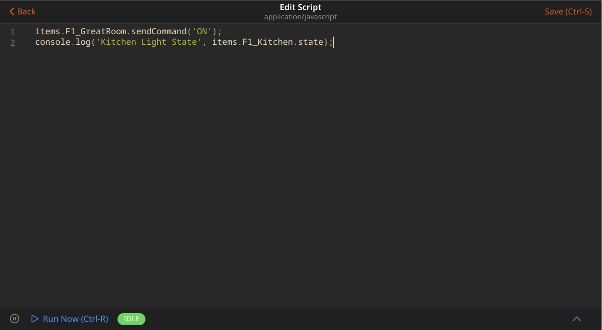

# JavaScript Scripting

This add-on provides support for JavaScript (ECMAScript 2021+) that can be used as a scripting language within automation rules.

Also included is [openhab-js](https://github.com/openhab/openhab-js/), a fairly high-level ES6 library to support automation in openHAB. It provides convenient access
to common openHAB functionality within rules including items, things, actions, logging and more.

- [Configuration](#configuration)
  - [UI Based Rules](#ui-based-rules)
  - [Adding Triggers](#adding-triggers)
  - [Adding Actions](#adding-actions)
  - [UI Event Object](#ui-event-object)
- [Scripting Basics](#scripting-basics)
  - [Require](#require)
  - [Console](#console)
  - [Timers](#timers)
  - [Paths](#paths)
- [Standard Library](#standard-library)
  - [Items](#items)
  - [Things](#things)
  - [Actions](#actions)
  - [Cache](#cache)
  - [Log](#log)
  - [Time](#time)
  - [Utils](#utils)
- [File Based Rules](#file-based-rules)
  - [JSRule](#jsrule)
  - [Rule Builder](#rule-builder)
  - [Event Object](#event-object)
  - [Initialization hook: scriptLoaded](#initialization-hook-scriptloaded)
  - [Deinitialization hook: scriptUnloaded](#deinitialization-hook-scriptunloaded)
- [Advanced Scripting](#advanced-scripting)
  - [@runtime](#runtime)

## Configuration

This add-on includes by default the [openhab-js](https://github.com/openhab/openhab-js/) NPM library and exports its namespaces onto the global namespace.
This allows the use of `items`, `actions`, `cache` and other objects without the need to explicitly import using `require()`.
This functionality can be disabled for users who prefer to manage their own imports via the add-on configuration options.


<!-- Paste the copied docs from openhab-js under this comment. -->

### UI Based Rules

The quickest way to add rules is through the openHAB Web UI.

Advanced users, or users migrating scripts from existing systems may want to use [File Based Rules](#file-based-rules) for managing rules using files in the user configuration directory.

### Adding Triggers

Using the openHAB UI, first create a new rule and set a trigger condition.


### Adding Actions

Select "Add Action" and then select "Run Script" with "ECMAScript 262 Edition 11".
It’s important this is "Edition 11" or higher, earlier versions will not work.
This will bring up an empty script editor where you can enter your JavaScript.


You can now write rules using standard ES6 JavaScript along with the included openHAB [standard library](#standard-library).



For example, turning a light on:

```javascript
items.getItem("KitchenLight").sendCommand("ON");
console.log("Kitchen Light State", items.getItem("KitchenLight").state);
```

Sending a notification

```javascript
actions.NotificationAction.sendNotification("romeo@montague.org", "Balcony door is open");
```

Querying the status of a thing

```javascript
const thingStatusInfo = actions.Things.getThingStatusInfo("zwave:serial_zstick:512");
console.log("Thing status",thingStatusInfo.getStatus());
```

See [openhab-js](https://openhab.github.io/openhab-js) for a complete list of functionality.

### UI Event Object

**NOTE**: Note that `event` object is different in UI based rules and file based rules! This section is only valid for UI based rules. If you use file based rules, refer to [file based rules event object documentation](#event-object).

When you use "Item event" as trigger (i.e. "[item] received a command", "[item] was updated", "[item] changed"), there is additional context available for the action in a variable called `event`.

This tables gives an overview over the `event` object for most common trigger types:

| Property Name  | Type                                                                                                                 | Trigger Types                          | Description                                                                                                   | Rules DSL Equivalent   |
|----------------|----------------------------------------------------------------------------------------------------------------------|----------------------------------------|---------------------------------------------------------------------------------------------------------------|------------------------|
| `itemState`    | sub-class of [org.openhab.core.types.State](https://www.openhab.org/javadoc/latest/org/openhab/core/types/state)     | `[item] changed`, `[item] was updated` | State that triggered event                                                                                    | `triggeringItem.state` |
| `oldItemState` | sub-class of [org.openhab.core.types.State](https://www.openhab.org/javadoc/latest/org/openhab/core/types/state)     | `[item] changed`                       | Previous state of Item or Group that triggered event                                                          | `previousState`        |
| `itemCommand`  | sub-class of [org.openhab.core.types.Command](https://www.openhab.org/javadoc/latest/org/openhab/core/types/command) | `[item] received a command`            | Command that triggered event                                                                                  | `receivedCommand`      |
| `itemName`     | string                                                                                                               | all                                    | Name of Item that triggered event                                                                             | `triggeringItem.name`  |
| `type`         | string                                                                                                               | all                                    | Type of event that triggered event (`"ItemStateEvent"`, `"ItemStateChangedEvent"`, `"ItemCommandEvent"`, ...) | N/A                    |

Note that in UI based rules `event.itemState`, `event.oldItemState`, and `event.itemCommand` are Java types (not JavaScript), and care must be taken when comparing these with JavaScript types:

```javascript
var { ON } = require("@runtime")

console.log(event.itemState == "ON")  // WRONG. Java type does not equal with string, not even with "relaxed" equals (==) comparison
console.log(event.itemState.toString() == "ON")  // OK. Comparing strings
console.log(event.itemState == ON)  // OK. Comparing Java types
```

**NOTE**: Even with `String` items, simple comparison with `==` is not working as one would expect! See below example:

```javascript
// Example assumes String item trigger
console.log(event.itemState == "test") // WRONG. Will always log "false"
console.log(event.itemState.toString() == "test") // OK
```

## Scripting Basics

The openHAB JSScripting runtime attempts to provide a familiar environment to Javascript developers.

### Require

Scripts may include standard NPM based libraries by using CommonJS `require`.
The library search will look in the path `automation/js/node_modules` in the user configuration directory.

### Console

The JS Scripting binding supports the standard `console` object for logging.
Script debug logging is enabled by default at the `INFO` level, but can be configured using the console logging commands.

```text
log:set DEBUG org.openhab.automation.script
```

The default logger name prefix is `org.openhab.automation.script`, this can be changed by assigning a new prefix to the `loggerName` property of the console.

```javascript
console.loggerName = "custom"
```

Supported logging functions include:

- `console.log(obj1 [, obj2, ..., objN])`
- `console.info(obj1 [, obj2, ..., objN])`
- `console.warn(obj1 [, obj2, ..., objN])`
- `console.error(obj1 [, obj2, ..., objN])`
- `console.debug(obj1 [, obj2, ..., objN])`
- `console.trace(obj1 [, obj2, ..., objN])`

Where `obj1 ... objN` is a list of JavaScript objects to output.
The string representations of each of these objects are appended together in the order listed and output.

See <https://developer.mozilla.org/en-US/docs/Web/API/console> for more information about console logging.

### Timers

#### SetTimeout

The global `setTimeout()` method sets a timer which executes a function or specified piece of code once the timer expires.

```javascript
var ohTimer = setTimeout(callbackFunction, delay);
```

The global `clearTimeout()` method cancels a timeout previously established by calling `setTimeout()`.

The openHAB implementation of `setTimeout()` differs from the [HTML DOM API's `setTimeout()`](https://developer.mozilla.org/en-US/docs/Web/API/setTimeout).
openHAB does not return the integer timeoutID as standard JS does, instead it returns an instance of [openHAB Timer](#openhab-timer).

#### SetInterval

The setInterval() method repeatedly calls a function or executes a code snippet, with a fixed time delay between each call.

```javascript
var ohIntervalTimer = setInterval(callbackFunction, delay);
```

The global `clearInterval()` method cancels a timed, repeating action which was previously established by a call to `setInterval()`.

NOTE: Timers will not be canceled if a script is deleted or modified, it is up to the user to manage timers.
See using the [cache](#cache) namespace as well as [ScriptLoaded](#initialization-hook-scriptloaded) and [ScriptUnLoaded](#deinitialization-hook-scriptunloaded) for a convenient way of managing persisted objects, such as timers between reloads or deletions of scripts.

The openHAB implementation of `setInterval()` differs from the [HTML DOM API's `setInterval()`](https://developer.mozilla.org/en-US/docs/Web/API/setInterval).
openHAB does not return the integer timeoutID as standard JS does, instead it returns an instance of [openHAB Timer](#openhab-timer).

#### openHAB Timer

A native openHAB Timer instance has the following methods:

- `cancel()`: Cancels the timer. ⇒ `boolean`: true, if cancellation was successful
- `getExecutionTime()`: The scheduled execution time or null if timer was cancelled. ⇒ `time.ZonedDateTime` or `null`
- `isActive()`: Whether the scheduled execution is yet to happen. ⇒ `boolean`
- `isCancelled()`: Whether the timer has been cancelled. ⇒ `boolean`
- `isRunning()`: Whether the scheduled code is currently executed. ⇒ `boolean`
- `hasTerminated()`: Whether the scheduled execution has already terminated. ⇒ `boolean`
- `reschedule(time.ZonedDateTime)`: Reschedules a timer to a new starting time. This can also be called after a timer has terminated, which will result in another execution of the same code. ⇒ `boolean`: true, if rescheduling was successful

Examples:

```javascript
var timer = setTimeout(() => { console.log('Timer expired.'); }, 10000); // Would log 'Timer expired.' in 10s.
if (timer.isActive()) console.log('Timer is waiting to execute.');
timer.cancel();
if (timer.isCancelled()) console.log('Timer has been cancelled.');
timer.reschedule(time.ZonedDateTime.now().plusSeconds(2)); // Logs 'Timer expired.' in 2s.
```

See [openHAB JavaDoc - Timer](https://www.openhab.org/javadoc/latest/org/openhab/core/model/script/actions/timer) for full API documentation.

### Paths

For [file based rules](#file-based-rules), scripts will be loaded from `automation/js` in the user configuration directory.

NPM libraries will be loaded from `automation/js/node_modules` in the user configuration directory.

## Standard Library

Full documentation for the openHAB JavaScript library can be found at [openhab-js](https://openhab.github.io/openhab-js).

### Items

The items namespace allows interactions with openHAB items.

See [openhab-js : items](https://openhab.github.io/openhab-js/items.html) for full API documentation.

- items : <code>object</code>
  - .getItem(name, nullIfMissing) ⇒ <code>Item</code>
  - .getItems() ⇒ <code>Array.&lt;Item&gt;</code>
  - .getItemsByTag(...tagNames) ⇒ <code>Array.&lt;Item&gt;</code>
  - .addItem([itemConfig](#itemconfig))
  - .removeItem(itemOrItemName) ⇒ <code>Boolean</code>
  - .replaceItem([itemConfig](#itemconfig))
  - .safeItemName(s) ⇒ <code>String</code>

```javascript
const item = items.getItem("KitchenLight");
console.log("Kitchen Light State", item.state);
```

#### `getItem(name, nullIfMissing)`

Calling `getItem(...)` returns an `Item` object with the following properties:

- Item : <code>object</code>
  - .type ⇒ <code>String</code>
  - .name ⇒ <code>String</code>
  - .label ⇒ <code>String</code>
  - .history ⇒ [`ItemHistory`](#itemhistory)
  - .state ⇒ <code>String</code>
  - .rawState ⇒ <code>HostState</code>
  - .members ⇒ <code>Array.&lt;Item&gt;</code>
  - .descendents ⇒ <code>Array.&lt;Item&gt;</code>
  - .isUninitialized ⇒ <code>Boolean</code>
  - .groupNames ⇒ <code>Array.&lt;String&gt;</code>
  - .tags ⇒ <code>Array.&lt;String&gt;</code>
  - .getMetadataValue(namespace) ⇒ <code>String</code>
  - .updateMetadataValue(namespace, value) ⇒ <code>String</code>
  - .upsertMetadataValue(namespace, value) ⇒ <code>Boolean</code>
  - .updateMetadataValues(namespaceToValues)
  - .sendCommand(value)
  - .sendCommandIfDifferent(value) ⇒ <code>Boolean</code>
  - .postUpdate(value)
  - .addGroups(...groupNamesOrItems)
  - .removeGroups(...groupNamesOrItems)
  - .addTags(...tagNames)
  - .removeTags(...tagNames)

```javascript
const item = items.getItem("KitchenLight");
//send a ON command
item.sendCommand("ON");
//Post an update
item.postUpdate("OFF");
//Get state
console.log("KitchenLight state", item.state)
```

#### `itemConfig`

Calling `addItem(itemConfig)` or `replaceItem(itemConfig)` requires the `itemConfig` object with the following properties:

- itemConfig : <code>object</code>
  - .type ⇒ <code>String</code>
  - .name ⇒ <code>String</code>
  - .label ⇒ <code>String</code>
  - .category (icon) ⇒ <code>String</code>
  - .groups ⇒ <code>Array.&lt;String&gt;</code>
  - .tags ⇒ <code>Array.&lt;String&gt;</code>
  - .channels ⇒ <code>String|Object { channeluid: { config } }</code>
  - .metadata ⇒ <code>Object { namespace: value }|Object { namespace: { value: value , config: { config } } }</code>
  - .giBaseType ⇒ <code>String</code>
  - .groupFunction ⇒ <code>String</code>

Note: `.type` and `.name` are required.
Basic UI and the mobile apps need `metadata.stateDescription.config.pattern` to render the state of an Item.

Example:

```javascript
// more advanced example
items.replaceItem({
  type: 'String',
  name: 'Hallway_Light',
  label: 'Hallway Light',
  category: 'light',
  groups: ['Hallway', 'Light'],
  tags: ['Lightbulb'],
  channels: {
    'binding:thing:device:hallway#light': {},
    'binding:thing:device:livingroom#light': { 
      profile: 'system:follow' 
    }
  },
  metadata: {
    expire: '10m,command=1',
    stateDescription: {
      config: {
        pattern: '%d%%',
        options: '1=Red, 2=Green, 3=Blue'
      }
    }
  }
});
// minimal example
items.replaceItem({
  type: 'Switch',
  name: 'MySwitch',
  metadata: {
    stateDescription: {
      config: {
        pattern: '%s'
      }
    }
  }
});
```

See [openhab-js : ItemConfig](https://openhab.github.io/openhab-js/global.html#ItemConfig) for full API documentation.

#### `ItemHistory`

Calling `Item.history` returns a `ItemHistory` object with the following functions:

- ItemHistory :`object`
  - .averageBetween(begin, end, serviceId) ⇒ `number | null`
  - .averageSince(timestamp, serviceId) ⇒ `number | null`
  - .changedBetween(begin, end, serviceId) ⇒ `boolean`
  - .changedSince(timestamp, serviceId) ⇒ `boolean`
  - .deltaBetween(begin, end, serviceId) ⇒ `number | null`
  - .deltaSince(timestamp, serviceId) ⇒ `number | null`
  - .deviationBetween(begin, end, serviceId) ⇒ `number | null`
  - .deviationSince(timestamp, serviceId) ⇒ `number | null`
  - .evolutionRateBetween(begin, end, serviceId) ⇒ `number | null`
  - .evolutionRateSince(timestamp, serviceId) ⇒ `number | null`
  - .historicState(timestamp, serviceId) ⇒ `string | null`
  - .lastUpdate(serviceId) ⇒ `ZonedDateTime | null`
  - .latestState(serviceId) ⇒ `string | null`
  - .maximumBetween(begin, end, serviceId) ⇒ `string | null`
  - .maximumSince(timestamp,serviceId) ⇒ `string | null`
  - .minimumSince(begin, end, serviceId) ⇒ `string | null`
  - .minimumSince(timestamp, serviceId) ⇒ `string | null`
  - .persist(serviceId)
  - .previousState(skipEqual, serviceId) ⇒ `string | null`
  - .sumBetween(begin, end, serviceId) ⇒ `number | null`
  - .sumSince(timestamp, serviceId) ⇒ `number | null`
  - .updatedBetween(begin, end, serviceId) ⇒ `boolean`
  - .updatedSince(timestamp, serviceId) ⇒ `boolean`
  - .varianceBetween(begin, end, serviceId) ⇒ `number | null`
  - .varianceSince(timestamp, serviceId) ⇒ `number | null`

Note: `serviceId` is optional, if omitted, the default persistence service will be used.

```javascript
var yesterday = new Date(new Date().getTime() - (24 * 60 * 60 * 1000));
var item = items.getItem('KitchenDimmer');
console.log('KitchenDimmer averageSince', item.history.averageSince(yesterday));
```

See [openhab-js : ItemHistory](https://openhab.github.io/openhab-js/items.ItemHistory.html) for full API documentation.

### Things

The Things namespace allows to interact with openHAB Things.

See [openhab-js : things](https://openhab.github.io/openhab-js/things.html) for full API documentation.

- things : <code>object</code>
  - .getThing(uid, nullIfMissing) ⇒ <code>Thing</code>
  - .getThings() ⇒ <code>Array.&lt;Thing&gt;</code>

#### `getThing(uid, nullIfMissing)`

Calling `getThing(...)` returns a `Thing` object with the following properties:

- Thing : <code>object</code>
  - .bridgeUID ⇒ <code>String</code>
  - .label ⇒ <code>String</code>
  - .location ⇒ <code>String</code>
  - .status ⇒ <code>String</code>
  - .statusInfo ⇒ <code>String</code>
  - .thingTypeUID ⇒ <code>String</code>
  - .uid ⇒ <code>String</code>
  - .isEnabled ⇒ <code>Boolean</code>
  - .setLabel(label)
  - .setLocation(location)
  - .setProperty(name, value)
  - .setEnabled(enabled)

```javascript
const thing = things.getThing('astro:moon:home');
console.log('Thing label: ' + thing.label);
// Set Thing location
thing.setLocation('living room');
// Disable Thing
thing.setEnabled(false);
```

### Actions

The actions namespace allows interactions with openHAB actions.
The following are a list of standard actions.

Additional actions provided by user installed addons can be accessed using their common name on the actions name space
(example:  `actions.Pushsafer.pushsafer(...)`)

See [openhab-js : actions](https://openhab.github.io/openhab-js/actions.html) for full API documentation and additional actions.

#### Audio Actions

See [openhab-js : actions.Audio](https://openhab.github.io/openhab-js/actions.html#.Audio) for complete documentation.

#### BusEvent

See [openhab-js : actions.BusEvent](https://openhab.github.io/openhab-js/actions.html#.BusEvent) for complete documentation.

#### Ephemeris Actions

See [openhab-js : actions.Ephemeris](https://openhab.github.io/openhab-js/actions.html#.Ephemeris) for complete documentation.

Ephemeris is a way to determine what type of day today or a number of days before or after today is. For example, a way to determine if today is a weekend, a bank holiday, someone’s birthday, trash day, etc.

Additional information can be found on the  [Ephemeris Actions Docs](https://www.openhab.org/docs/configuration/actions.html#ephemeris) as well as the [Ephemeris JavaDoc](https://www.openhab.org/javadoc/latest/org/openhab/core/model/script/actions/ephemeris).

```javascript
// Example
let weekend = actions.Ephemeris.isWeekend();
```

#### Exec Actions

See [openhab-js : actions.Exec](https://openhab.github.io/openhab-js/actions.html#.Exec) for complete documentation.

Execute a command line.

```javascript

// Execute command line.
actions.Exec.executeCommandLine('echo', 'Hello World!');

// Execute command line with timeout.
let Duration = Java.type('java.time.Duration');
actions.Exec.executeCommandLine(Duration.ofSeconds(20), 'echo', 'Hello World!');

// Get response from command line.
let response = actions.Exec.executeCommandLine('echo', 'Hello World!');

// Get response from command line with timeout.
response = actions.Exec.executeCommandLine(Duration.ofSeconds(20), 'echo', 'Hello World!');
```

#### HTTP Actions

See [openhab-js : actions.HTTP](https://openhab.github.io/openhab-js/actions.html#.HTTP) for complete documentation.

```javascript
// Example GET Request
var response = actions.HTTP.sendHttpGetRequest('<url>');
```

Replace `<url>` with the request url.

#### ScriptExecution Actions

See [openhab-js : actions.ScriptExecution](https://openhab.github.io/openhab-js/actions.html#.ScriptExecution) for complete documentation.

```javascript
let now = time.ZonedDateTime.now();

// Function to run when the timer goes off.
function timerOver () {
  console.info('The timer is over.');
}

// Create the Timer.
this.myTimer = actions.ScriptExecution.createTimer('My Timer', now.plusSeconds(10), timerOver);

// Cancel the timer.
this.myTimer.cancel();

// Check whether the timer is active. Returns true if the timer is active and will be executed as scheduled.
let active = this.myTimer.isActive();

// Reschedule the timer.
this.myTimer.reschedule(now.plusSeconds(5));
```

#### Semantics Actions

See [openhab-js : actions.Semantics](https://openhab.github.io/openhab-js/actions.html#.Semantics) for complete documentation.

#### Things Actions

See [openhab-js : actions.Things](https://openhab.github.io/openhab-js/actions.html#.Things) for complete documentation.

#### Voice Actions

See [openhab-js : actions.Voice](https://openhab.github.io/openhab-js/actions.html#.Voice) for complete documentation.

#### Cloud Notification Actions

Note: Optional action if [openHAB Cloud Connector](https://www.openhab.org/addons/integrations/openhabcloud/) is installed.

Notification actions may be placed in rules to send alerts to mobile devices registered with an [openHAB Cloud instance](https://github.com/openhab/openhab-cloud) such as [myopenHAB.org](https://myopenhab.org/).

For available actions have a look at the [Cloud Notification Actions Docs](https://www.openhab.org/docs/configuration/actions.html#cloud-notification-actions).

```javascript
// Example
actions.NotificationAction.sendNotification('<email>', '<message>'); // to a single myopenHAB user identified by e-mail
actions.NotificationAction.sendBroadcastNotification('<message>'); // to all myopenHAB users
```

Replace `<email>` with the e-mail address of the user.
Replace `<message>` with the notification text.

### Cache

The cache namespace provides a default cache that can be used to set and retrieve objects that will be persisted between reloads of scripts.

See [openhab-js : cache](https://openhab.github.io/openhab-js/cache.html) for full API documentation.

- cache : <code>object</code>
  - .get(key, defaultSupplier) ⇒ <code>Object | null</code>
  - .put(key, value) ⇒ <code>Previous Object | null</code>
  - .remove(key) ⇒ <code>Previous Object | null</code>
  - .exists(key) ⇒ <code>boolean</code>

The `defaultSupplier` provided function will return a default value if a specified key is not already associated with a value.

**Example** *(Get a previously set value with a default value (times &#x3D; 0))*

```js
let counter = cache.get("counter", () => ({ "times": 0 }));
console.log("Count",counter.times++);
```

**Example** *(Get a previously set object)*

```js
let counter = cache.get("counter");
if(counter == null){
     counter = {times: 0};
     cache.put("counter", counter);
}
console.log("Count",counter.times++);
```

### Log

By default, the JS Scripting binding supports console logging like `console.log()` and `console.debug()` to the openHAB default log.
Additionally, scripts may create their own native openHAB logger using the log namespace.

```javascript
let logger = log('my_logger');

//prints "Hello World!"
logger.debug("Hello {}!", "world");
```

### Time

openHAB internally makes extensive use of the `java.time` package.
openHAB-JS exports the excellent [JS-Joda](https://js-joda.github.io/js-joda/) library via the `time` namespace, which is a native JavaScript port of the same API standard used in Java for `java.time`.
Anywhere that a native Java `ZonedDateTime` or `Duration` is required, the runtime will automatically convert a JS-Joda `ZonedDateTime` or `Duration` to its Java counterpart.

The exported JS-Joda library is also extended with convenient functions relevant to openHAB usage.

Examples:

```javascript
var now = time.ZonedDateTime.now();
var yesterday = time.ZonedDateTime.now().minusHours(24);
var item = items.getItem("Kitchen");
console.log("averageSince", item.history.averageSince(yesterday));
```

```javascript
actions.Exec.executeCommandLine(time.Duration.ofSeconds(20), 'echo', 'Hello World!');
```

See [JS-Joda](https://js-joda.github.io/js-joda/) for more examples and complete API usage.

#### `time.toZDT()`

There will be times when this automatic conversion is not available (for example when working with date times within a rule).
To ease having to deal with these cases a `time.toZDT()` function will accept almost any type that can be converted to a `time.ZonedDateTime`.
The following rules are used during the conversion:

| Argument Type                                              | Rule                                                                                                                                                                                                   | Examples                                                        |
|------------------------------------------------------------|--------------------------------------------------------------------------------------------------------------------------------------------------------------------------------------------------------|-----------------------------------------------------------------|
| `null` or `undefined`                                      | `time.ZonedDateTime.now()`                                                                                                                                                                             | `time.toZDT();`                                                 |
| `time.ZonedDateTime`                                       | passed through unmodified                                                                                                                                                                              |                                                                 |
| `java.time.ZonedDateTime`                                  | converted to the `time.ZonedDateTime` equivalent                                                                                                                                                       |                                                                 |
| JavaScript native `Date`                                   | converted to the equivalent `time.ZonedDateTime` using `SYSTEM` as the timezone                                                                                                                        |                                                                 |
| `number`, `bingint`, `java.lang.Number`, `DecimalType`     | rounded to the nearest integer and added to `now` as milliseconds                                                                                                                                      | `time.toZDT(1000);`                                             |
| `QuantityType`                                             | if the units are `Time`, that time is added to `now`                                                                                                                                                   | `time.toZDT(item.getItem('MyTimeItem').rawState);`              |
| `items.Item` or `org.openhab.core.types.Item`              | if the state is supported (see the `Type` rules in this table, e.g. `DecimalType`), the state is converted                                                                                             | `time.toZDT(items.getItem('MyItem'));`                          |
| `String`, `java.lang.String`, `StringType`                 | parsed based on the following rules                                                                                                                                                                    |                                                                 |
| RFC String (output from a Java `ZonedDateTime.toString()`) | parsed                                                                                                                                                                                                 | `time.toZDT(new DateTimeType().getZonedDateTime().toString());` |
| `"HH:MM[:ss]"` (24 hour time)                              | today's date with the time indicated, seconds is optional                                                                                                                                              | `time.toZDT('13:45:12');`                                       |
| `"kk:mm[:ss][ ]a"` (12 hour time)                          | today's date with the time indicated, the space between the time and am/pm and seconds are optional                                                                                                    | `time.toZDT('1:23:45 PM');`                                     |
| Duration String                                            | any duration string supported by `time.Duration` added to `now()`, see [the docs](https://js-joda.github.io/js-joda/class/packages/core/src/Duration.js~Duration.html#static-method-parse) for details | `time.toZDT('PT1H4M6.789S');`                                   |

When a type or string that cannot be handled is encountered, an error is thrown.

#### `toToday()`

When you have a `time.ZonedDateTime`, a new `toToday()` method was added which will return a new `time.ZonedDateTime` with today's date but the original's time, accounting for DST changes.

For example, if the time was 13:45 and today was a DST changeover, the time will still be 13:45 instead of one hour off.

```javascript
const alarm = items.getItem('Alarm');
alarm.postUpdate(time.toZDT(alarm).toToday());
```

#### `isBetweenTimes(start, end)`

Tests whether this `time.ZonedDateTime` is between the passed in `start` and `end`.
However, the function only compares the time portion of the three, ignoring the date portion.
The function takes into account times that span midnight.
`start` and `end` can be anything supported by `time.toZDT()`.

Examples:

```javascript
time.toZDT().isBetweenTimes('22:00', '05:00') // currently between 11:00 pm and 5:00 am
time.toZDT().isBetweenTimes(items.getItem('Sunset'), '11:30 PM') // is now between sunset and 11:30 PM?
time.toZDT(items.getItem('StartTime')).isBetweenTimes(time.toZDT(), 'PT1H'); // is the state of StartTime between now and one hour from now
```

#### `isClose(zdt, maxDur)`

Tests to see if the delta between the `time.ZonedDateTime` and the passed in `time.ZonedDateTime` is within the passed in `time.Duration`.

```javascript
const timestamp = time.toZDT();
// do some stuff
if(timestamp.isClose(time.toZDT(), time.Duration.ofMillis(100))) {
  // did "do some stuff" take longer than 100 msecs to run?
}
```

#### `getMillisFromNow`

This method on `time.ZonedDateTime` returns the milliseconds from now to the passed in `time.ZonedDateTime`.

```javascript
const timestamp = time.ZonedDateTime.now().plusMinutes(5);
console.log(timestamp.getMillisFromNow());
```

### Utils

openHAB internally is a Java program.
openHAB-JS converts between Java and JavaScript data types and reverse.

See [openhab-js : utils](https://openhab.github.io/openhab-js/utils.html) for full API documentation.

## File Based Rules

The JS Scripting binding will load scripts from `automation/js` in the user configuration directory.
The system will automatically reload scripts when changes are detected to files.
Local variable state is not persisted among reloads, see using the [cache](#cache) for a convenient way to persist objects.

File based rules can be created in 2 different ways: using [JSRule](#jsrule) or the [Rule Builder](#rule-builder).

See [openhab-js : rules](https://openhab.github.io/openhab-js/rules.html) for full API documentation.

### JSRule

JSRules provides a simple, declarative syntax for defining rules that will be executed based on a trigger condition

```javascript
const email = "juliet@capulet.org"

rules.JSRule({
  name: "Balcony Lights ON at 5pm",
  description: "Light will turn on when it's 5:00pm",
  triggers: [triggers.GenericCronTrigger("0 0 17 * * ?")],
  execute: (event) => {
    items.getItem("BalconyLights").sendCommand("ON");
    actions.NotificationAction.sendNotification(email, "Balcony lights are ON");
  },
  tags: ["Balcony", "Lights"],
  id: "BalconyLightsOn"
});
```

Note: `description`, `tags` and `id` are optional.

Note: You can use the passed `event` object to get information about the trigger that triggered the rule.
See [Event Object](#event-object) for documentation.

Multiple triggers can be added, some example triggers include:

```javascript
triggers.ChannelEventTrigger('astro:sun:local:rise#event', 'START');

triggers.ItemStateChangeTrigger('my_item', 'OFF', 'ON');

triggers.ItemStateUpdateTrigger('my_item', 'OFF');

triggers.ItemCommandTrigger('my_item', 'OFF');

triggers.GroupStateChangeTrigger('my_group', 'OFF', 'ON');

triggers.GroupStateUpdateTrigger('my_group', 'OFF');

triggers.GroupCommandTrigger('my_group', 'OFF');

triggers.ThingStatusUpdateTrigger('some:thing:uuid','OFFLINE');

triggers.ThingStatusChangeTrigger('some:thing:uuid','ONLINE','OFFLINE');

triggers.SystemStartlevelTrigger(40)  // Rules loaded

triggers.SystemStartlevelTrigger(50)  // Rule engine started

triggers.SystemStartlevelTrigger(70)  // User interfaces started

triggers.SystemStartlevelTrigger(80)  // Things initialized

triggers.SystemStartlevelTrigger(100) // Startup Complete

triggers.GenericCronTrigger('0 30 16 * * ? *');

triggers.TimeOfDayTrigger('19:00');

triggers.DateTimeTrigger('MyDateTimeItem');
```

You can use `null` for a trigger parameter to skip its configuration.

See [openhab-js : triggers](https://openhab.github.io/openhab-js/triggers.html) in the API documentation for a full list of all triggers.

### Rule Builder

The Rule Builder provides a convenient API to write rules in a high-level, readable style using a builder pattern.

Rules are started by calling `rules.when()` and can chain together [triggers](#rule-builder-triggers),
[conditions](#rule-builder-conditions) and [operations](#rule-builder-operations) in the following pattern:

```javascript
rules.when().triggerType()...if().conditionType().then().operationType()...build(name, description, tags, id);
```

Rule are completed by calling `.build(name, description, tags, id)` , all parameters are optional and reasonable defaults will be used if omitted.

- `name` String rule name - defaults generated name
- `description` String Rule description - defaults generated description
- `tags` Array of string tag names - defaults empty array
- `id` String id - defaults random UUID

A simple example of this would look like:

```javascript
rules.when().item("F1_Light").changed().then().send("changed").toItem("F2_Light").build("My Rule", "My First Rule");
```

Operations and conditions can also optionally take functions:

```javascript
rules.when().item("F1_light").changed().then(event => {
    console.log(event);
}).build("Test Rule", "My Test Rule");
```

See [Examples](#rule-builder-examples) for further patterns.

#### Rule Builder Triggers

- `when()`
- `or()`
  - `.channel(channelName)` Specifies a channel event as a source for the rule to fire.
    - `.triggered(event)` Trigger on a specific event name
  - `.cron(cronExpression)` Specifies a cron schedule for the rule to fire.
  - `.item(itemName)` Specifies an item as the source of changes to trigger a rule.
    - `.for(duration)`
    - `.from(state)`
    - `.to(state)`
    - `.fromOff()`
    - `.toOn()`
    - `.receivedCommand()`
    - `.receivedUpdate()`
  - `.memberOf(groupName)`
    - `.for(duration)`
    - `.from(state)`
    - `.to(state)`
    - `.fromOff()`
    - `.toOn()`
    - `.receivedCommand()`
    - `.receivedUpdate()`
  - `.system()`
    - `.ruleEngineStarted()`
    - `.rulesLoaded()`
    - `.startupComplete()`
    - `.thingsInitialized()`
    - `.userInterfacesStarted()`
    - `.startLevel(level)`
  - `.thing(thingName)`
    - `changed()`
    - `updated()`
    - `from(state)`
    - `to(state)`

Additionally all the above triggers have the following functions:

- `.if()` or `.if(fn)` -> a [rule condition](#rule-builder-conditions)
- `.then()` or `.then(fn)` -> a [rule operation](#rule-builder-operations)
- `.or()` -> a [rule trigger](#rule-builder-triggers) (chain additional triggers)

#### Rule Builder Conditions

- `if(optionalFunction)`
  - `.stateOfItem(itemName)`
    - `is(state)`
    - `in(state...)`

#### Rule Builder Operations

- `then(optionalFunction)`
  - `.build(name, description, tags, id)`
  - `.copyAndSendState()`
  - `.copyState()`
  - `.inGroup(groupName)`
  - `.postIt()`
  - `.postUpdate(state)`
  - `.send(command)`
  - `.sendIt()`
  - `.sendOff()`
  - `.sendOn()`
  - `.sendToggle()`

#### Rule Builder Examples

```javascript
// Basic rule, when the BedroomLight1 is changed, run a custom function
rules.when().item('BedroomLight1').changed().then(e => {
    console.log("BedroomLight1 state", e.newState)
}).build();

// Turn on the kitchen light at SUNSET
rules.when().timeOfDay("SUNSET").then().sendOn().toItem("KitchenLight").build("Sunset Rule","turn on the kitchen light at SUNSET");

// Turn off the kitchen light at 9PM and tag rule
rules.when().cron("0 0 21 * * ?").then().sendOff().toItem("KitchenLight").build("9PM Rule", "turn off the kitchen light at 9PM", ["Tag1", "Tag2"]);

// Set the colour of the hall light to pink at 9PM, tag rule and use a custom ID
rules.when().cron("0 0 21 * * ?").then().send("300,100,100").toItem("HallLight").build("Pink Rule", "set the colour of the hall light to pink at 9PM", ["Tag1", "Tag2"], "MyCustomID");

// When the switch S1 status changes to ON, then turn on the HallLight
rules.when().item('S1').changed().toOn().then(sendOn().toItem('HallLight')).build("S1 Rule");

// When the HallLight colour changes pink, if the function fn returns true, then toggle the state of the OutsideLight
rules.when().item('HallLight').changed().to("300,100,100").if(fn).then().sendToggle().toItem('OutsideLight').build();

// And some rules which can be toggled by the items created in the 'gRules' Group:

// When the HallLight receives a command, send the same command to the KitchenLight
rules.when().item('HallLight').receivedCommand().then().sendIt().toItem('KitchenLight').build("Hall Light", "");

// When the HallLight is updated to ON, make sure that BedroomLight1 is set to the same state as the BedroomLight2
rules.when().item('HallLight').receivedUpdate().then().copyState().fromItem('BedroomLight1').toItem('BedroomLight2').build();
```

### Event Object

**NOTE**: The `event` object is different in UI Based Rules and File Based Rules!
This section is only valid for File Based Rules.
If you use UI Based Rules, refer to [UI based rules event object documentation](#ui-event-object).

When a rule is triggered, the script is provided the event instance that triggered it.
The specific data depends on the event type.
The `event` object provides some information about that trigger.

This tables gives an overview over the `event` object:
| Property Name     | Trigger Types                                        | Description                                                                         | Rules DSL Equivalent   |
|-------------------|------------------------------------------------------|-------------------------------------------------------------------------------------|------------------------|
| `oldState`        | `ItemStateChangeTrigger`, `GroupStateChangeTrigger`  | Previous state of Item or Group that triggered event                                | `previousState`        |
| `newState`        | `ItemStateChangeTrigger`, `GroupStateChangeTrigger`  | New state of Item or Group that triggered event                                     | N/A                    |
| `receivedState`   | `ItemStateUpdateTrigger`, `GroupStateUpdateTrigger`  | State of Item that triggered event                                                  | `triggeringItem.state` |
| `receivedCommand` | `ItemCommandTrigger`, `GroupCommandTrigger`          | Command that triggered event                                                        | `receivedCommand`      |
| `itemName`        | `Item****Trigger`                                    | Name of Item that triggered event                                                   | `triggeringItem.name`  |
| `receivedEvent`   | `ChannelEventTrigger`                                | Channel event that triggered event                                                  | N/A                    |
| `channelUID`      | `ChannelEventTrigger`                                | UID of channel that triggered event                                                 | N/A                    |
| `oldStatus`       | `ThingStatusChangeTrigger`                           | Previous state of Thing that triggered event                                        | N/A                    |
| `newStatus`       | `ThingStatusChangeTrigger`                           | New state of Thing that triggered event                                             | N/A                    |
| `status`          | `ThingStatusUpdateTrigger`                           | State of Thing that triggered event                                                 | N/A                    |
| `thingUID`        | `Thing****Trigger`                                   | UID of Thing that triggered event                                                   | N/A                    |
| `eventType`       | all except `PWMTrigger`, `PIDTrigger`, time triggers | Type of event that triggered event (change, command, triggered, update)             | N/A                    |
| `triggerType`     | all except `PWMTrigger`, `PIDTrigger`, time triggers | Type of trigger that triggered event                                                | N/A                    |

All properties are typeof `string`.

**NOTE:**
`Group****Trigger`s use the equivalent `Item****Trigger` as trigger for each member.
Time triggers do not provide any event instance, therefore no property is populated.

See [openhab-js : EventObject](https://openhab.github.io/openhab-js/rules.html#.EventObject) for full API documentation.

### Initialization hook: scriptLoaded

For file based scripts, this function will be called if found when the script is loaded.

```javascript
scriptLoaded = function () {
  console.log("script loaded");
  loadedDate = Date.now();
};
```

### Deinitialization hook: scriptUnloaded

For file based scripts, this function will be called if found when the script is unloaded.

```javascript
scriptUnloaded = function () {
  console.log("script unloaded");
  // clean up rouge timers
  clearInterval(timer);
};
```

## Advanced Scripting

### @runtime

One can access many useful utilities and types using `require("@runtime")`, e.g.

```javascript
var { ON, OFF, QuantityType } = require("@runtime");
// Alternative, more verbose way to achieve the same:
//
// var runtime = require("@runtime");
//
// var ON = runtime.ON;
// var OFF = runtime.OFF;
// var QuantityType = runtime.QuantityType;
```

| Variable                | Description                                                                                                                                           |
|-------------------------|-------------------------------------------------------------------------------------------------------------------------------------------------------|
| `State`                 | [`org.openhab.core.types.State`](https://www.openhab.org/javadoc/latest/org/openhab/core/types/state)                                                 |
| `Command`               | [`org.openhab.core.types.Command`](https://www.openhab.org/javadoc/latest/org/openhab/core/types/command)                                             |
| `URLEncoder`            | [`java.net.URLEncoder`](https://docs.oracle.com/en/java/javase/11/docs/api/java.base/java/net/URLEncoder.html)                                        |
| `File`                  | [`java.io.File`](https://docs.oracle.com/en/java/javase/11/docs/api/java.base/java/io/File.html)                                                      |
| `Files`                 | [`java.nio.file.Files`](https://docs.oracle.com/en/java/javase/11/docs/api/java.base/java/nio/file/Files.html)                                        |
| `Path`                  | [`java.nio.file.Path`](https://docs.oracle.com/en/java/javase/11/docs/api/java.base/java/nio/file/Path.html)                                          |
| `Paths`                 | [`java.nio.file.Paths`](https://docs.oracle.com/en/java/javase/11/docs/api/java.base/java/nio/file/Paths.html)                                        |
| `IncreaseDecreaseType`  | [`org.openhab.core.library.types.IncreaseDecreaseType`](https://www.openhab.org/javadoc/latest/org/openhab/core/library/types/increasedecreasetype)   |
| `DECREASE`              | `IncreaseDecreaseType` enum item                                                                                                                      |
| `INCREASE`              | `IncreaseDecreaseType` enum item                                                                                                                      |
| `OnOffType`             | [`org.openhab.core.library.types.OnOffType`](https://www.openhab.org/javadoc/latest/org/openhab/core/library/types/onofftype)                         |
| `ON`                    | `OnOffType` enum item                                                                                                                                 |
| `OFF`                   | `OnOffType` enum item                                                                                                                                 |
| `OpenClosedType`        | [`org.openhab.core.library.types.OpenClosedType`](https://www.openhab.org/javadoc/latest/org/openhab/core/library/types/openclosedtype)               |
| `OPEN`                  | `OpenClosedType` enum item                                                                                                                            |
| `CLOSED`                | `OpenClosedType` enum item                                                                                                                            |
| `StopMoveType`          | [`org.openhab.core.library.types.StopMoveType`](https://www.openhab.org/javadoc/latest/org/openhab/core/library/types/stopmovetype)                   |
| `STOP`                  | `StopMoveType` enum item                                                                                                                              |
| `MOVE`                  | `StopMoveType` enum item                                                                                                                              |
| `UpDownType`            | [`org.openhab.core.library.types.UpDownType`](https://www.openhab.org/javadoc/latest/org/openhab/core/library/types/updowntype)                       |
| `UP`                    | `UpDownType` enum item                                                                                                                                |
| `DOWN`                  | `UpDownType` enum item                                                                                                                                |
| `UnDefType`             | [`org.openhab.core.library.types.UnDefType`](https://www.openhab.org/javadoc/latest/org/openhab/core/types/undeftype)                                 |
| `NULL`                  | `UnDefType` enum item                                                                                                                                 |
| `UNDEF`                 | `UnDefType` enum item                                                                                                                                 |
| `RefreshType`           | [`org.openhab.core.library.types.RefreshType`](https://www.openhab.org/javadoc/latest/org/openhab/core/types/refreshtype)                             |
| `REFRESH`               | `RefreshType` enum item                                                                                                                               |
| `NextPreviousType`      | [`org.openhab.core.library.types.NextPreviusType`](https://www.openhab.org/javadoc/latest/org/openhab/core/library/types/nextprevioustype)            |
| `NEXT`                  | `NextPreviousType` enum item                                                                                                                          |
| `PREVIOUS`              | `NextPreviousType` enum item                                                                                                                          |
| `PlayPauseType`         | [`org.openhab.core.library.types.PlayPauseType`](https://www.openhab.org/javadoc/latest/org/openhab/core/library/types/playpausetype)                 |
| `PLAY`                  | `PlayPauseType` enum item                                                                                                                             |
| `PAUSE`                 | `PlayPauseType` enum item                                                                                                                             |
| `RewindFastforwardType` | [`org.openhab.core.library.types.RewindFastforwardType`](https://www.openhab.org/javadoc/latest/org/openhab/core/library/types/rewindfastforwardtype) |
| `REWIND`                | `RewindFastforwardType` enum item                                                                                                                     |
| `FASTFORWARD`           | `RewindFastforwardType` enum item                                                                                                                     |
| `QuantityType`          | [`org.openhab.core.library.types.QuantityType`](https://www.openhab.org/javadoc/latest/org/openhab/core/library/types/quantitytype)                   |
| `StringListType`        | [`org.openhab.core.library.types.StringListType`](https://www.openhab.org/javadoc/latest/org/openhab/core/library/types/stringlisttype)               |
| `RawType`               | [`org.openhab.core.library.types.RawType`](https://www.openhab.org/javadoc/latest/org/openhab/core/library/types/rawtype)                             |
| `DateTimeType`          | [`org.openhab.core.library.types.DateTimeType`](https://www.openhab.org/javadoc/latest/org/openhab/core/library/types/datetimetype)                   |
| `DecimalType`           | [`org.openhab.core.library.types.DecimalType`](https://www.openhab.org/javadoc/latest/org/openhab/core/library/types/decimaltype)                     |
| `HSBType`               | [`org.openhab.core.library.types.HSBType`](https://www.openhab.org/javadoc/latest/org/openhab/core/library/types/hsbtype)                             |
| `PercentType`           | [`org.openhab.core.library.types.PercentType`](https://www.openhab.org/javadoc/latest/org/openhab/core/library/types/percenttype)                     |
| `PointType`             | [`org.openhab.core.library.types.PointType`](https://www.openhab.org/javadoc/latest/org/openhab/core/library/types/pointtype)                         |
| `StringType`            | [`org.openhab.core.library.types.StringType`](https://www.openhab.org/javadoc/latest/org/openhab/core/library/types/stringtype)                       |
| `SIUnits`               | [`org.openhab.core.library.unit.SIUnits`](https://www.openhab.org/javadoc/latest/org/openhab/core/library/unit/siunits)                               |
| `ImperialUnits`         | [`org.openhab.core.library.unit.ImperialUnits`](https://www.openhab.org/javadoc/latest/org/openhab/core/library/unit/imperialunits)                   |
| `MetricPrefix`          | [`org.openhab.core.library.unit.MetricPrefix`](https://www.openhab.org/javadoc/latest/org/openhab/core/library/unit/metricprefix)                     |
| `Units`                 | [`org.openhab.core.library.unit.Units`](https://www.openhab.org/javadoc/latest/org/openhab/core/library/unit/units)                                   |
| `BinaryPrefix`          | [`org.openhab.core.library.unit.BinaryPrefix`](https://www.openhab.org/javadoc/latest/org/openhab/core/library/unit/binaryprefix)                     |
| `ChronoUnit`            | [`java.time.temporal.ChronoUnit`](https://docs.oracle.com/en/java/javase/11/docs/api/java.base/java/time/temporal/ChronoUnit.html)                    |
| `Duration`              | [`java.time.Duration`](https://docs.oracle.com/en/java/javase/11/docs/api/java.base/java/time/Duration.html)                                          |
| `ZoneId`                | [`java.time.ZoneId`](https://docs.oracle.com/en/java/javase/11/docs/api/java.base/java/time/ZoneId.html)                                              |
| `ZonedDateTime`         | [`java.time.ZonedDateTime`](https://docs.oracle.com/en/java/javase/11/docs/api/java.base/java/time/ZonedDateTime.html)                                |

`require("@runtime")` also defines "services" such as `items`, `things`, `rules`, `events`, `actions`, `ir`, `itemRegistry`.
You can use these services for backwards compatibility purposes or ease migration from JSR223 scripts.
Generally speaking, you should prefer to use [Standard Library](#standard-library) provided by this library instead.
