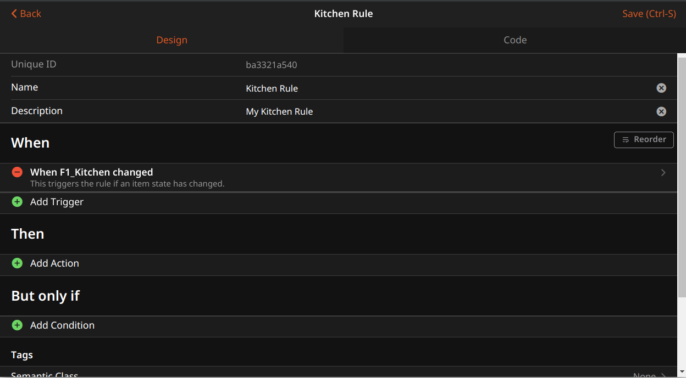
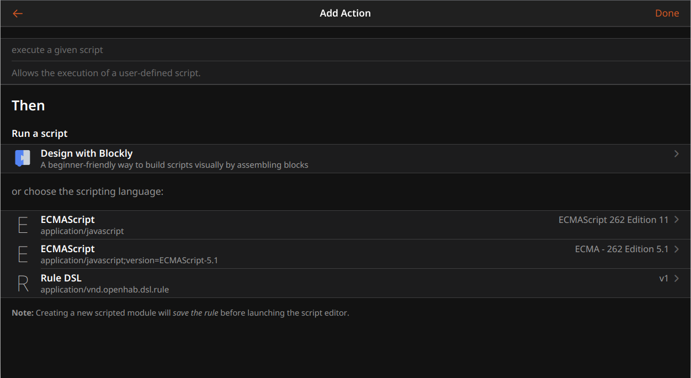

# JavaScript Scripting

This add-on provides support for JavaScript (ECMAScript 2021+) that can be used as a scripting language within automation rules.

Also included is [openhab-js](https://github.com/openhab/openhab-js/), a fairly high-level ES6 library to support automation in openHAB. It provides convenient access
to common openHAB functionality within rules including items, things, actions, logging and more.

- [Configuration](#configuration)
- [UI Based Rules](#ui-based-rules)
  - [Adding Triggers](#adding-triggers)
  - [Adding Actions](#adding-actions)
- [Scripting Basics](#scripting-basics)
  - [Require](#require)
  - [Console](#console)
  - [SetTimeout](#settimeout)
  - [SetInterval](#setinterval)
  - [ScriptLoaded](#scriptloaded)
  - [ScriptUnLoaded](#scriptunloaded)
  - [Paths](#paths)
- [Standard Library](#standard-library)
  - [Items](#items)
  - [Actions](#actions)
  - [Cache](#cache)
  - [Log](#log)
  - [Time](#time)
  - [Utils](#utils)
- [File Based Rules](#file-based-rules)
  - [JSRule](#jsrule)
  - [Rule Builder](#rule-builder)


## Configuration

This add-on includes by default the [openhab-js](https://github.com/openhab/openhab-js/) NPM library and exports it's namespaces onto the global namespace. This allows the use of `items`, `actions`, `cache` and other objects without the need to explicitly import using `require()`.  This functionality can be disabled for users who prefer to manage their own imports via the add-on configuration options. 


## UI Based Rules

The quickest way to add rules is through the openHAB Web UI.

Advanced users, or users migrating scripts from existing systems may want to use [File Based Rules](#file-based-rules) for managing rules using files in the user configuration directory.

### Adding Triggers
Using the openHAB UI, first create a new rule and set a trigger condition




### Adding Actions
Select "Add Action" and then select "ECMAScript 262 Edition 11".
Its important this is "Edition 11" or higher, earlier versions will not work.
This will bring up a empty script editor where you can enter your javascript.



You can now write rules using standard ES6 Javascript along with the included openHAB [standard library](#standard-library).


For example, turning a light on:
```javascript
items.getItem("KitchenLight").sendCommand("ON");
console.log("Kitchen Light State", items.getItem("KitchenLight").state);
```

Sending a notification
```javascript
actions.NotificationAction.sendNotification("romeo@montague.org", "Balcony door is open");
```

Querying the status of a thing
```javascript
const thingStatusInfo = actions.Things.getThingStatusInfo("zwave:serial_zstick:512");
console.log("Thing status",thingStatusInfo.getStatus());
```

See [openhab-js](https://openhab.github.io/openhab-js) for a complete list of functionality

## Scripting Basics

The openHAB JSScripting runtime attempts to provide a familiar environment to Javascript developers.

### Require

Scripts may include standard NPM based libraries by using CommonJS require.
The library search path will look in `automation/js/node_modules` in the user configuration directory.

### Console

The JSScripting binding supports the standard `console` object for logging.
Script debug logging is enabled by default at the `INFO` level, but can be configured using the [console logging]({{base}}/administration/logging.html) commands.

```text
log:set DEBUG org.openhab.automation.script
```

Supported logging functions include:
- `console.log(obj1 [, obj2, ..., objN])`
- `console.info(obj1 [, obj2, ..., objN])`
- `console.warn(obj1 [, obj2, ..., objN])`
- `console.error(obj1 [, obj2, ..., objN])`
- `console.debug(obj1 [, obj2, ..., objN])`
- `console.trace(obj1 [, obj2, ..., objN])`

where `obj1 ... objN` is a list of JavaScript objects to output.
The string representations of each of these objects are appended together in the order listed and output.

see https://developer.mozilla.org/en-US/docs/Web/API/console for more information about console logging.

### SetTimeout

The global setTimeout() method sets a timer which executes a function or specified piece of code once the timer expires.
```javascript
var timeoutID = setTimeout(function[, delay, arg1, arg2, ...]);
var timeoutID = setTimeout(function[, delay]);
```

The global `clearTimeout()` method cancels a timeout previously established by calling `setTimeout()`.

see https://developer.mozilla.org/en-US/docs/Web/API/setTimeout for more information about setTimeout.

### SetInterval

The setInterval() method repeatedly calls a function or executes a code snippet, with a fixed time delay between each call.

```javascript
var intervalID = setInterval(func, [delay, arg1, arg2, ...]);
var intervalID = setInterval(function[, delay]);
```

The global `clearInterval()` method cancels a timed, repeating action which was previously established by a call to `setInterval()`.

NOTE: Timers will not be canceled if a script is deleted or modified, it is up to the user to manage timers.  See using the [cache](#cache) namespace as well as [ScriptLoaded](#scriptloaded) and [ScriptUnLoaded](#scriptunloaded) for a convenient way of managing persisted objects, such as timers between reloads or deletions of scripts.

see https://developer.mozilla.org/en-US/docs/Web/API/setInterval for more information about setInterval.

### ScriptLoaded

For file based scripts, this function will be called if found when the script is loaded.

```javascript
scriptLoaded = function () {
    console.log("script loaded");
    loadedDate = Date.now();
}
```

### ScriptUnLoaded

For file based scripts, this function will be called if found when the script is unloaded.

```javascript
scriptUnloaded = function () {
    console.log("script unloaded");
    //clean up rouge timers
    clearInterval(timer);
}
```

### Paths

For [file based rules](#file-based-rules), scripts will be loaded from `automation/js` in the user configuration directory.

NPM libraries will be loaded from `automation/js/node_modules` in the user configuration directory.

## Standard Library

Full documentation for the openHAB JavaScript library can be found at [openhab-js](https://openhab.github.io/openhab-js)

### Items

The items namespace allows interactions with openHAB items.

See [openhab-js : items](https://openhab.github.io/openhab-js/items.html) for full API documentation

* items : <code>object</code>
    * .getItem(name, nullIfMissing) ⇒ <code>Item</code>
    * .getItems() ⇒ <code>Array.&lt;Item&gt;</code>
    * .getItemsByTag(...tagNames) ⇒ <code>Array.&lt;Item&gt;</code>
    * .createItem(itemName, [itemType], [category], [groups], [label], [tags], [giBaseType], [groupFunction], [itemMetadata])
    * .addItem(itemName, [itemType], [category], [groups], [label], [tags], [giBaseType], [groupFunction])
    * .removeItem(itemOrItemName) ⇒ <code>Boolean</code>
    * .replaceItem(itemName, [itemType], [category], [groups], [label], [tags], [giBaseType], [groupFunction])
    * .safeItemName(s) ⇒ <code>String</code>

```javascript
const item = items.getItem("KitchenLight");
console.log("Kitchen Light State", item.state);
```

Calling `getItem(...)` returns an `Item` object with the following properties:

* Item : <code>object</code>
    * .type ⇒ <code>String</code>
    * .name ⇒ <code>String</code>
    * .label ⇒ <code>String</code>
    * .history ⇒ <code>ItemHistory</code>
    * .state ⇒ <code>String</code>
    * .rawState ⇒ <code>HostState</code>
    * .members ⇒ <code>Array.&lt;Item&gt;</code>
    * .descendents ⇒ <code>Array.&lt;Item&gt;</code>
    * .isUninitialized ⇒ <code>Boolean</code>
    * .groupNames ⇒ <code>Array.&lt;String&gt;</code>
    * .tags ⇒ <code>Array.&lt;String&gt;</code>
    * .getMetadataValue(namespace) ⇒ <code>String</code>
    * .updateMetadataValue(namespace, value) ⇒ <code>String</code>
    * .upsertMetadataValue(namespace, value) ⇒ <code>Boolean</code>
    * .updateMetadataValues(namespaceToValues)
    * .sendCommand(value)
    * .sendCommandIfDifferent(value) ⇒ <code>Boolean</code>
    * .postUpdate(value)
    * .addGroups(...groupNamesOrItems)
    * .removeGroups(...groupNamesOrItems)
    * .addTags(...tagNames)
    * .removeTags(...tagNames)

```javascript
const item = items.getItem("KitchenLight");
//send a ON command
item.sendCommand("ON");
//Post an update
item.postUpdate("OFF");
//Get state
console.log("KitchenLight state", item.state)
```

calling `item.history...` returns a ItemHistory object with the following functions:

Note `serviceId` is optional, if omitted, the default persistance service will be used.

* ItemHistory : <code>object</code>
    * .averageSince(timestamp, serviceId) ⇒ <code>Number</code>
    * .changedSince(timestamp, serviceId) ⇒ <code>Number</code>
    * .deltaSince(timestamp, serviceId) ⇒ <code>Number</code>
    * .deviationSince(timestamp, serviceId) ⇒ <code>Number</code>
    * .evolutionRate(timestamp, serviceId) ⇒ <code>Number</code>
    * .historicState(timestamp, serviceId) ⇒ <code>state</code>
    * .lastUpdate(serviceId) ⇒ <code>Date</code>
    * .latestState(serviceId) ⇒ <code>state</code>
    * .maximumSince(timestamp,serviceId) ⇒ <code>state</code>
    * .minimumSince(timestamp,serviceId) ⇒ <code>state</code>
    * .persist(serviceId)
    * .previousState(skipEqual,serviceId) ⇒ <code>state</code>
    * .sumSince(timestamp, serviceId) ⇒ <code>Number</code>
    * .updatedSince(timestamp, serviceId) ⇒ <code>Boolean</code>
    * .varianceSince(timestamp,serviceId) ⇒ <code>state</code>

```javascript
var yesterday = new Date(new Date().getTime() - (24 * 60 * 60 * 1000));
var item = items.getItem("KitchenDimmer");
console.log("KitchenDimmer averageSince", item.history.averageSince(yesterday));
```

### Actions

The actions namespace allows interactions with openHAB actions.
The following are a list of standard actions.

Additional actions provided by user installed addons can be accessed using their common name on the actions name space
(example:  `actions.Pushsafer.pushsafer(...)`)

See [openhab-js : actions](https://openhab.github.io/openhab-js/actions.html) for full API documentation and additional actions.

#### Audio Actions

See [openhab-js : actions.Audio](https://openhab.github.io/openhab-js/actions.html#.Audio) for complete documentation

#### BusEvent

See [openhab-js : actions.BusEvent](https://openhab.github.io/openhab-js/actions.html#.BusEvent) for complete documentation

#### Ephemeris Actions

See [openhab-js : actions.Ephemeris](https://openhab.github.io/openhab-js/actions.html#.Ephemeris) for complete documentation

Ephemeris is a way to determine what type of day today or a number of days before or after today is. For example, a way to determine if today is a weekend, a bank holiday, someone’s birthday, trash day, etc.

Additional information can be found on the  [Ephemeris Actions Docs](https://www.openhab.org/docs/configuration/actions.html#ephemeris) as well as the [Ephemeris JavaDoc](https://www.openhab.org/javadoc/latest/org/openhab/core/model/script/actions/ephemeris).

```javascript
// Example
let weekend = actions.Ephemeris.isWeekend();
```

#### Exec Actions

See [openhab-js : actions.Exec](https://openhab.github.io/openhab-js/actions.html#.Exec) for complete documentation

Execute a command line.

```javascript

// Execute command line.
actions.Exec.executeCommandLine('echo', 'Hello World!');

// Execute command line with timeout.
let Duration = Java.type('java.time.Duration');
actions.Exec.executeCommandLine(Duration.ofSeconds(20), 'echo', 'Hello World!');

// Get response from command line.
let response = actions.Exec.executeCommandLine('echo', 'Hello World!');

// Get response from command line with timeout.
response = actions.Exec.executeCommandLine(Duration.ofSeconds(20), 'echo', 'Hello World!');
```

#### HTTP Actions

See [openhab-js : actions.HTTP](https://openhab.github.io/openhab-js/actions.html#.HTTP) for complete documentation

```javascript
// Example GET Request
var response = actions.HTTP.sendHttpGetRequest('<url>');
```

Replace `<url>` with the request url.

#### ScriptExecution Actions

See [openhab-js : actions.ScriptExecution](https://openhab.github.io/openhab-js/actions.html#.ScriptExecution) for complete documentation


```javascript
let now = time.ZonedDateTime.now();

// Function to run when the timer goes off.
function timerOver () {
  logger.info('The timer is over.');
}

// Create the Timer.
this.myTimer = actions.ScriptExecution.createTimer(now.plusSeconds(10), timerOver);

// Cancel the timer.
this.myTimer.cancel();

// Check whether the timer is active. Returns true if the timer is active and will be executed as scheduled.
let active = this.myTimer.isActive();

// Reschedule the timer.
this.myTimer.reschedule(now.plusSeconds(5));
```
#### Semantics Actions

See [openhab-js : actions.Semantics](https://openhab.github.io/openhab-js/actions.html#.Semantics) for complete documentation

#### Things Actions

See [openhab-js : actions.Things](https://openhab.github.io/openhab-js/actions.html#.Things) for complete documentation

#### Voice Actions

See [openhab-js : actions.Voice](https://openhab.github.io/openhab-js/actions.html#.Voice) for complete documentation

#### Cloud Notification Actions

(optional action if openhab-cloud is installed)

Notification actions may be placed in Rules to send alerts to mobile devices registered with an [openHAB Cloud instance](https://github.com/openhab/openhab-cloud) such as [myopenHAB.org](https://myopenhab.org/).

For available actions have a look at the [Cloud Notification Actions Docs](https://www.openhab.org/docs/configuration/actions.html#cloud-notification-actions).

```javascript
// Example
actions.NotificationAction.sendNotification('<email>', '<message>'); // to a single myopenHAB user identified by e-mail
actions.NotificationAction.sendBroadcastNotification('<message>'); // to all myopenHAB users
```

Replace `<email>` with the e-mail address of the user.
Replace `<message>` with the notification text.

### Cache

The cache namespace provides a default cache that can be use to set and retrieve objects that will be persisted between reloads of scripts.

See [openhab-js : cache](https://openhab.github.io/openhab-js/cache.html) for full API documentation

* cache : <code>object</code>
    * .get(key, defaultSupplier) ⇒ <code>Object | null</code>
    * .put(key, value) ⇒ <code>Previous Object | null</code>
    * .remove(key) ⇒ <code>Previous Object | null</code>

The `defaultSupplier` provided function will return a default value if a specified key is not already associated with a value

**Example** *(Get a previously set value with a default value (times &#x3D; 0))*
```js
let counter = cache.get("counter", () => ({ "times": 0 }));
console.log("Count",counter.times++);
```

**Example** *(Get a previously set object)*
```js
let counter = cache.get("counter");
if(counter == null){
     counter = {times: 0};
     cache.put("counter", counter);
}
console.log("Count",counter.times++);
```
### Log

By default the JS Scripting binding supports console logging like `console.log()` and `console.debug()` to the openHAB default log.
Additionally scripts may create their own native openHAB logs using the log namespace.

```javascript
let logger = log('my_logger');

//prints "Hello World!"
logger.debug("Hello {}!", "world");
```

### Time

openHAB internally makes extensive use of the `java.time` package.
openHAB-JS exports the excellent [JS-Joda](#https://js-joda.github.io/js-joda/) library via the `time` namespace, which is a native Javascript port of the same API standard used in Java for `java.time`.
Anywhere that a native Java `ZonedDateTime` or `Duration` is required, the runtime will automatically convert a JS-Joda `ZonedDateTime` or `Duration` to its Java counterpart.

Examples:
```javascript
var now = time.ZonedDateTime.now();
var yesterday = time.ZonedDateTime.now().minusHours(24);

var item = items.getItem("Kitchen");
console.log("averageSince", item.history.averageSince(yesterday));
```

```javascript
actions.Exec.executeCommandLine(time.Duration.ofSeconds(20), 'echo', 'Hello World!');
```

See [JS-Joda](https://js-joda.github.io/js-joda/) for more examples and complete API usage.

### Utils

openHAB internally is a Java program. 
openHAB-JS converts between Java and JavaScript data types and reverse.

See [openhab-js : utils](https://openhab.github.io/openhab-js/utils.html) for full API documentation


## File Based Rules

The JSScripting binding  will load scripts from `automation/js` in the user configuration directory.
The system will automatically reload scripts when changes are detected to files.
Local variable state is not persisted among reloads, see using the [cache](#cache) for a connivent way to persist objects.

File based rules can be created in 2 different ways: using [JSRule](#jsrule) or the [Rule Builder](#rule-builder).

See [openhab-js : rules ](https://openhab.github.io/openhab-js/rules.html) for full API documentation

### JSRule

JSRules provides a simple, declarative syntax for defining rules that will be executed based on a trigger condition

```javascript
const email = "juliet@capulet.org"

rules.JSRule({
  name: "Balcony Lights ON at 5pm",
  description: "Light will turn on when it's 5:00pm",
  triggers: [triggers.GenericCronTrigger("0 0 17 * * ?")],
  execute: data => {
    items.getItem("BalconyLights").sendCommand("ON");
    actions.NotificationAction.sendNotification(email, "Balcony lights are ON");
  },
  tags: ["Balcony", "Lights"],
  id: "BalconyLightsOn"
});
```

Note: `description`, `tags` and `id` are optional.

Multiple triggers can be added,  some example triggers include:

```javascript
triggers.ChannelEventTrigger('astro:sun:local:rise#event', 'START')

triggers.ItemStateChangeTrigger('my_item', 'OFF', 'ON')

triggers.ItemStateUpdateTrigger('my_item', 'OFF')

triggers.ItemCommandTrigger('my_item', 'OFF')

triggers.GroupStateChangeTrigger('my_group', 'OFF', 'ON')

triggers.GroupStateUpdateTrigger('my_group', 'OFF')

triggers.GroupCommandTrigger('my_group', 'OFF')

triggers.ThingStatusUpdateTrigger('some:thing:uuid','OFFLINE')

triggers.ThingStatusChangeTrigger('some:thing:uuid','ONLINE','OFFLINE')

triggers.SystemStartlevelTrigger(40)  //Rules loaded

triggers.SystemStartlevelTrigger(50)  //Rule engine started

triggers.SystemStartlevelTrigger(70)  //User interfaces started

triggers.SystemStartlevelTrigger(80)  //Things initialized

triggers.SystemStartlevelTrigger(100) //Startup Complete

triggers.GenericCronTrigger('0 30 16 * * ? *')

triggers.TimeOfDayTrigger('19:00')

```

See [openhab-js : triggers ](https://openhab.github.io/openhab-js/triggers.html) in the API documentation for a full list of all triggers.

### Rule Builder

The Rule Builder provides a convenient API to write rules in a high-level, readable style using a builder pattern.

Rules are started by calling `rules.when()` and can chain together [triggers](#rule-builder-triggers),
[conditions](#rule-builder-conditions) and [operations](#rule-builder-operations) in the following pattern:

```javascript
rules.when().triggerType()...if().conditionType().then().operationType()...build(name, description, tags, id);
```

Rule are completed by calling `.build(name, description, tags, id)` , all parameters are optional and reasonable defaults will be used if omitted.  

- `name` String rule name - defaults generated name
- `description` String Rule description - defaults generated description
- `tags` Array of string tag names - defaults empty array
- `id` String id - defaults random UUID  

A simple example of this would look like:

```javascript
rules.when().item("F1_Light").changed().then().send("changed").toItem("F2_Light").build("My Rule", "My First Rule");
```

Operations and conditions can also optionally take functions:

```javascript
rules.when().item("F1_light").changed().then(event => {
    console.log(event);
}).build("Test Rule", "My Test Rule");
```
see [Examples](#rule-builder-examples) for further patterns

#### Rule Builder Triggers

* `when()`
* `or()`
    * `.channel(channelName)` Specifies a channel event as a source for the rule to fire.
        * `.triggered(event)` Trigger on a specific event name
    * `.cron(cronExpression)` Specifies a cron schedule for the rule to fire.
    * `.item(itemName)` Specifies an item as the source of changes to trigger a rule.
        * `.for(duration)`
        * `.from(state)`
        * `.to(state)`
        * `.fromOff()`
        * `.toOn()`
        * `.receivedCommand()`
        * `.receivedUpdate()`
    * `.memberOf(groupName)`
        * `.for(duration)`
        * `.from(state)`
        * `.to(state)`
        * `.fromOff()`
        * `.toOn()`
        * `.receivedCommand()`
        * `.receivedUpdate()`
    * `.system()`
        * `.ruleEngineStarted()`
        * `.rulesLoaded()`
        * `.startupComplete()`
        * `.thingsInitialized()`
        * `.userInterfacesStarted()`
        * `.startLevel(level)`
    * `.thing(thingName)`
        * `changed()`
        * `updated()`
        * `from(state)`
        * `to(state)`

Additionally all the above triggers have the following functions:
* `.if()` or `.if(fn)` -> a [rule condition](#rule-builder-conditions)
* `.then()` or `.then(fn)` -> a [rule operation](#rule-builder-operations)
* `.or()` -> a [rule trigger](#rule-builder-triggers) (chain additional triggers)

#### Rule Builder Conditions

* `if(optionalFunction)`
    * `.stateOfItem(itemName)`
        * `is(state)`
        * `in(state...)`

#### Rule Builder Operations
* `then(optionalFunction)`
    * `.build(name, description, tags, id)`
    * `.copyAndSendState()`
    * `.copyState()`
    * `.inGroup(groupName)`
    * `.postIt()`
    * `.postUpdate(state)`
    * `.send(command)`
    * `.sendIt()`
    * `.sendOff()`
    * `.sendOn()`
    * `.sendToggle()`

#### Rule Builder Examples

```javascript
//Basic rule, when the BedroomLight1 is changed, run a custom function
rules.when().item('BedroomLight1').changed().then(e => {
    console.log("BedroomLight1 state", e.newState)
}.build();

//turn on the kitchen light at SUNSET
rules.when().timeOfDay("SUNSET").then().sendOn().toItem("KitchenLight").build("Sunset Rule","turn on the kitchen light
at SUNSET");

//turn off the kitchen light at 9PM and tag rule
rules.when().cron("0 0 21 * * ?").then().sendOff().toItem("KitchenLight").build("9PM Rule", "turn off the kitchen light
at 9PM", ["Tag1", "Tag2"]);

//set the colour of the hall light to pink at 9PM, tag rule and use a custom ID
rules.when().cron("0 0 21 * * ?").then().send("300,100,100").toItem("HallLight").build("Pink Rule", "set the colour of
the hall light to pink at 9PM", ["Tag1", "Tag2"], "MyCustomID");

//when the switch S1 status changes to ON, then turn on the HallLight
rules.when().item('S1').changed().toOn().then(sendOn().toItem('HallLight')).build("S1 Rule");

//when the HallLight colour changes pink, if the function fn returns true, then toggle the state of the OutsideLight
rules.when().item('HallLight').changed().to("300,100,100").if(fn).then().sendToggle().toItem('OutsideLight').build();

//and some rules which can be toggled by the items created in the 'gRules' Group:

//when the HallLight receives a command, send the same command to the KitchenLight
rules.when().item('HallLight').receivedCommand().then().sendIt().toItem('KitchenLight').build("Hall Light", "");

//when the HallLight is updated to ON, make sure that BedroomLight1 is set to the same state as the BedroomLight2
rules.when().item('HallLight').receivedUpdate().then().copyState().fromItem('BedroomLight1').toItem('BedroomLight2').build();

```
