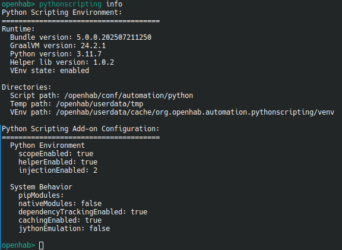

# Python Scripting

This add-on provides support for Python 3 that can be used as a scripting language within automation rules.
It is based on [GraalPy](https://www.graalvm.org/python/) from the [GraalVM project](https://www.graalvm.org/).

Also included is [openhab-python](https://github.com/openhab/openhab-python), a Python library to support automation in openHAB.
It provides convenient access to common core openHAB functions that make the full range of Java APIs easily accessible and usable.

[[toc]]

## Creating Python Scripts

When this add-on is installed, you can select Python 3 as a scripting language when creating a script action within the rule editor of the UI.

Alternatively, you can create scripts in the `automation/python` configuration directory.
If you create an empty file called `test.py`, you will see a log line with information similar to:

```text
... [INFO ] [ort.loader.AbstractScriptFileWatcher] - (Re-)Loading script '/openhab/conf/automation/python/test.py'
```

To enable debug logging, use the [console logging](https://openhab.org/docs/administration/logging.html) commands to
enable debug logging for the automation functionality:

```text
log:set DEBUG org.openhab.automation.pythonscripting
```

### Rules

Lets start with a simple rule

```python
from openhab import rule
from openhab.triggers import GenericCronTrigger

@rule( triggers = [ GenericCronTrigger("*/5 * * * * ?") ] )
class Test:
    def execute(self, module, input):
        self.logger.info("Rule was triggered")
```

### `PY` Transformation

Or as transformation inline script

```text
String Test "Test [PY(|'String has ' + str(len(input)) + 'characters'):%s]"
```

### More Scripting

A complete Documentation about Python Scripting Rules and Transformation Scripts can be found at

[>> openHAB Python Scripting <<](https://github.com/openhab/openhab-python/blob/main/README.md)

including all examples above, much more detailed.

## Add-on Administration

### Configuration

Check via Web UI => Settings / Add-on Settings / Python Scripting


### Console

The [openHAB Console](https://www.openhab.org/docs/administration/console.html) provides access to additional features of these Add-on.

1. `pythonscripting info` is showing you additional data like version numbers, activated features and used path locations<br/><br/>

2. `pythonscripting console` provides an interactive python console where you can try live python features<br/><br/>

3. `pythonscripting update` allowes you to check, list, update or downgrade your helper lib<br/><br/>

4. `pythonscripting pip` allowes you check, install or remove external python modules.<br/><br/>Check [pip usage](#using-pip-to-install-external-modules) for details

5. `pythonscripting typing` generates python type hint stub files.<br/><br/>Check [python autocompletion](#enable-pyhton-autocompletion) for details

### Enabling VEnv

VEnv based python runtimes are optional, but needed to provide support for additional modules via 'pip' and for native modules. To activate this feature, simply follow the steps below.

1. Login into [openHAB console](https://www.openhab.org/docs/administration/console.html) and check your current pythonscripting environment by calling `pythonscripting info`<br/><br/>Important values are:

- `GraalVM version: 24.2.1`
- `VEnv path: /openhab/userdata/cache/org.openhab.automation.pythonscripting/venv`<br/><br/>

These values are needed during the next step

2. Download graalpy-community and create venv

    ```shell
    # The downloaded graalpy-community tar.gz must match your operating system (linux, windows or macos), your architecture (amd64, aarch64) and your "GraalVM version" of openHAB
    wget -qO- https://github.com/oracle/graalpython/releases/download/graal-24.2.1/graalpy-community-24.2.1-linux-amd64.tar.gz | gunzip | tar xvf -
    cd graalpy-community-24.2.1-linux-amd64/

    # The venv target dir must match your "VEnv path" of openHAB
    ./bin/graalpy -m venv /openhab/userdata/cache/org.openhab.automation.pythonscripting/venv
    ```

3. Install 'patchelf' which is needed for native module support in graalpy (optional).

    ```
    apt-get install patchelf
    # zypper install patchelf
    # yum install patchelf
    ```

After these steps, venv setup is done and will be detected automatically during next openHAB restart.

::: tip VEnv note
Theoretically you can create venvs with a native python installation too. But it is strongly recommended to use graalpy for it. It will install a "special" version of pip in this venv, which will install patched python modules if available. This increases the compatibility of python modules with graalpython.

In container environments, you should mount the 'graalpy' folder to, because the venv is using symbolik links.
:::

### Using pip to install external modules

As first, you must enable [VEnv](#enabling-venv). After this is enabled, you can use pip in 2 ways.

1. Using the pythonscripting console<br/><br/>

2. Using venv pip on your host system

    ```
    /openhab/userdata/cache/org.openhab.automation.pythonscripting/venv/bin/pip install requests
    ```

### Enable Pyhton Autocompletion

Before you can enable autocompletion, you must generate the required type hint stub files. Login into [openHAB console](https://www.openhab.org/docs/administration/console.html) and run

```
pythonscripting typing
```

This will scan your current openHAB instance, including all installed Add-ons, for public java class methods and create corresponding python type hint stub files.


The files are stored in the folder `/openhab/conf/automation/python/typings/`.

As a final step, the folders `/openhab/conf/automation/python/libs/` and `/openhab>/conf/automation/python/typings/` must be added as "extraPaths" in your IDE.


## Typical log errors

### Graal python language not initialized. ...

```log
2025-07-25 12:10:06.001 [ERROR] [g.internal.PythonScriptEngineFactory] - Graal python language not initialized. Restart openhab to initialize available graal languages properly.
```

This can happen after a new Add-on installation, if JSScripting is active at the same time.

Just restart openhab to initialize available graal languages properly.

### User timezone 'XYZ' is different than openhab regional timezone ...

```log
2025-07-22 09:15:53.705 [WARN ] [g.internal.PythonScriptEngineFactory] - User timezone 'Europe/London' is different than openhab regional timezone 'Europe/Berlin'. Python Scripting is running with timezone 'Europe/London'.
```

These error happens if timezone settings are provided in several ways and some of them are different.

- Check that your EXTRA_JAVA_OPTS="-Duser.timezone=" setting is matching your openHAB regional setting.
- Additionally the ENVIRONMENT variable 'TZ', if provided, must match your openHAB regional setting.

e.g. in openHABian this can be changed in /etc/default/openhab

or for containers, this can be provided as a additional environment variable.

### Can't install pip modules. VEnv not enabled.

```log
2025-07-22 09:19:05.759 [ERROR] [rnal.PythonScriptEngineConfiguration] - Can't install pip modules. VEnv not enabled.
```

You configured preinstalled pip modules, but the mandatory VEnv setup is not initialized or detected. Please confirm the correct setup, by following the steps about [Enabling VEnv](#enabling-venv)

### Exception during helper lib initialisation

```log
2025-07-20 09:15:05.100 [ERROR] [rnal.PythonScriptEngineConfiguration] - Exception during helper lib initialisation
```

There were problems during the deployment of the helper libs.
A typical error is an insufficient permission.
The folder "conf/automation/python/" must be writeable by openHAB.

### Failed to inject import wrapper for engine ...

```log
2025-07-20 10:01:17.211 [ERROR] [cripting.internal.PythonScriptEngine] - Failed to inject import wrapper for engine
```

The reading the Python source file "conf/automation/python/lib/openhab/\_\_wrapper\_\_.py" failed.

This could either a permission/owner problem or a problem during deployment of the helper libs.
You should check that this file exists and it is readable by openHAB.
You should also check your logs for a message related to the helper lib deployment by just grep for "helper lib".

### SystemError, Option python.NativeModules is set to 'true' and a second GraalPy context ...

```log
SystemError, Option python.NativeModules is set to 'true' and a second GraalPy context attempted to load a native module '<xyz>' from path '<lib_path>.so'. At least one context in this process runs with 'IsolateNativeModules' set to false. Depending on the order of context creation, this means some contexts in the process cannot use native module, all other contexts must fall back and set python.NativeModules to 'false' to run native extensions in LLVM mode. This is recommended only for extensions included in the Python standard library. Running a 3rd party extension in LLVM mode requires a custom build of the extension and is generally discouraged due to compatibility reasons.
```

These errors can occur if you use a native library in your external module but forgot to enable "native modules". Check the [Add-on configuration](#configuration) and enable 

## Limitations

- GraalPy can't handle arguments in constructors of Java objects. Means you can't instantiate a Java object in Python with a parameter. https://github.com/oracle/graalpython/issues/367
