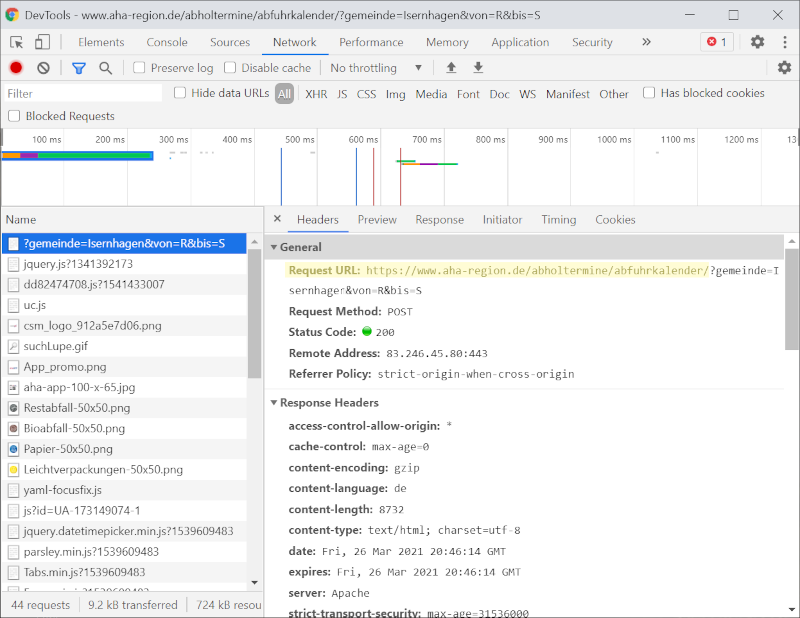
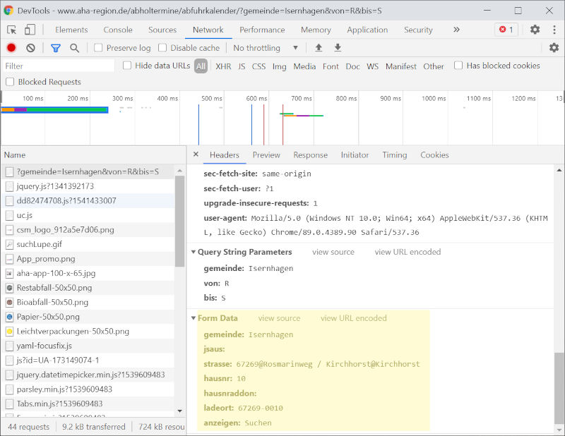

# aha Waste Collection Binding

This binding provides information about the upcoming waste collection dates for places, that are served by aha, the waste collection company for the region of Hannover. The values are retrieved from the online aha waste collection schedule available at: [aha Abfuhrkalender](https://www.aha-region.de/abholtermine/abfuhrkalender).

## Supported Things

- **collectionSchedule:** Represents the connection to the **aha Waste Collection Schedule** with four channels for the different waste types.

## Discovery

Discovery is not possible, due to some form input values from the website above are required.

## Thing Configuration

For configuration of the **collectionSchedule** thing, you need the form inputs from the aha collections schedule web page. Follow the steps below to get the required configuration parameters from the form input values.

1. Open [aha Abfuhrkalender](https://www.aha-region.de/abholtermine/abfuhrkalender) in your favorite browser with developer-console.
1. Open the developer console and switch to network tab (for example press F12 in chrome / edge / firefox).
1. Fill in the form: Select your commune, Street and house number and hit "Suchen".
1. Select the first request to [https://www.aha-region.de/abholtermine/abfuhrkalender](https://www.aha-region.de/abholtermine/abfuhrkalender) (see first screenshot below)
1. Check the form data at the end of the request for the form values (see second screenshot below)
1. Fill in the values from the form input in thing configuration (see examples below)



Check if you've selected the correct request, that contains the form data



Grab the values for the configuration parameters from the form data section at the end of the request

**collectionSchedule** parameters:

| Property | Default | Required | Description |
|-|-|-|-|
| `commune` | | Yes | The selected commune, taken from the form field `gemeinde`. |
| `street` | | Yes | The selected street, taken from the form field `strasse`. This value must look like 67269@Rosmarinweg+/+Kirchhorst@Kirchhorst |
| `houseNumber` |  | Yes | The selected house number, taken from the form field `hausnr`. |
| `houseNumberAddon` | | No | The selected house number addon, taken from the form field `hausnraddon`, may be empty. |
| `collectionPlace` | | Yes | Form value for the collection place, taken from the form field `ladeort`. This value must look like 67269-0010+ |

## Channels

The thing **aha Waste Collection Schedule** provides four channels for the upcoming day of waste collection for the different waste types.

| channel  | type   | description                  |
|----------|--------|------------------------------|
| generalWaste  | DateTime | Next collection day for general waste  |
| leightweightPackaging  | DateTime | Next collection day for lightweight packaging  |
| bioWaste  | DateTime | Next collection day for bio waste  |
| paper  | DateTime | Next collection day for paper  |

## Full Example

wasteCollection.things

```java
Thing ahawastecollection:collectionSchedule:wasteCollectionSchedule "aha Abfuhrkalender" [ commune="Isernhagen", street="67269@Rosmarinweg+/+Kirchhorst@Kirchhorst", houseNumber="10", houseNumberAddon="", collectionPlace="67269-0010+" ]
```

wasteCollection.items

```java
DateTime collectionDay_generalWaste "Next general waste collection" {channel="ahawastecollection:collectionSchedule:wasteCollectionSchedule:generalWaste"}
DateTime collectionDay_lightweightPackaging "Next lightweight packaging collection" {channel="ahawastecollection:collectionSchedule:wasteCollectionSchedule:leightweightPackaging"}
DateTime collectionDay_bioWaste "Next bio waste collection" {channel="ahawastecollection:collectionSchedule:wasteCollectionSchedule:bioWaste"}
DateTime collectionDay_paper "Next paper collection" {channel="ahawastecollection:collectionSchedule:wasteCollectionSchedule:paper"}
```

Example for rule that sends a notification with collected waste types on day before collection

```yaml
triggers:
  - id: "1"
    configuration:
      time: 18:00
    type: timer.TimeOfDayTrigger
conditions: []
actions:
  - inputs: {}
    id: "2"
    configuration:
      type: application/javascript
      script: >-
        // Determine next day with time 00:00:00
        var today = items['LokaleZeit_DatumundZeit'];

        var tomorrow = today
          .getZonedDateTime()
          .plusDays(1)
          .withHour(0)
          .withMinute(0)
          .withSecond(0)
          .withNano(0);

        // Get next collection dates from items
        var biomuellDate = items['collectionDay_bioWaste'].getZonedDateTime();
        var leichtverpackungDate = items['collectionDay_leightweightPackaging'].getZonedDateTime();
        var papierDate = items['collectionDay_paper'].getZonedDateTime();
        var restmuellDate = items['collectionDay_generalWaste'].getZonedDateTime();

        // Check which waste types are collected on the next day
        var biomuellCollection = biomuellDate.equals(tomorrow);
        var leichtverpackungCollection = leichtverpackungDate.equals(tomorrow);
        var papierCollection = papierDate.equals(tomorrow);
        var restmuellCollection = restmuellDate.equals(tomorrow);

        // Transfer booleans to waste type names
        var toBeCollected = [];

        if (biomuellCollection) {
          toBeCollected.push('bio waste');
        }

        if (leichtverpackungCollection) {
          toBeCollected.push('leihtweight packaging');
        }

        if (papierCollection) {
          toBeCollected.push('paper');
        }

        if (restmuellCollection) {
          toBeCollected.push('general waste');
        }

        // Send message (or something else) if at least one waste type is collected
        if (toBeCollected.length > 0) {
            var message = "Tomorrow the following waste will be collected:\n" + toBeCollected.join(', ');
            events.sendCommand('SignalSmartHome_Eingabewert', message);
        }
    type: script.ScriptAction
```
