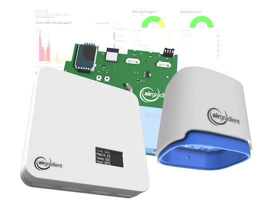

# AirGradient Binding

AirGradient provides open source and open hardware air quality monitors.

This binding reads air quality data from the AirGradient (https://www.airgradient.com/) API.

This API is documented at https://api.airgradient.com/public/docs/api/v1/

## Supported Things



This binding supports all the different AirGradient sensors, providing most of the sensor data.

- `bridge`: Connection to the API
- `location`: Location in the API to read values for

## Discovery

Autodiscovery of locations is implemented.
Start by adding an AirGradient API thing.
When that is added and online, run a scan for new things in the AirGradient binding.

## Thing Configuration

This binding supports reading data both directly from AirGradient sensors and from the AirGradient API.
If you don't specify any path on the server, the binding will behave as if the hostname is the hostname of the AirGradient API server, and append paths and tokens for it.

The binding will adapt to the content type of the returned content to support different formats for getting data both from local and cloud installations.

| Name              | Hostname                                                        | Content-Type                 | Parser |
|-------------------|-----------------------------------------------------------------|------------------------------|--------|
| API               | Hostnames without any path (e.g., https://api.airgradient.com/) | application/json             | JSON parser for the AirGradient API, correct paths will be appended to the calls |
| Local OpenMetrics | Hostnames with path (e.g., http://192.168.x.x/metrics)          | application/openmetrics-text | OpenMetrics parser |
| Local Web         | Hostnames with path (e.g., http://192.168.x.x/measures/current) | application/json             | JSON parser for the AirGradient API, as if you returned the value of sendToServer() payload |
| Local Prometheus  | Hostnames with path (e.g., http://192.168.x.x/measures)         | text/plain                   | Prometheus parser for [Prometheus format](https://prometheus.io/docs/instrumenting/exposition_formats/) |

### AirGradient API

The connection to the API needs setup and configuration

1. Log in to the AirGradient Dashboard: https://app.airgradient.com/dashboard
2. Navigate to Place->Connectivity Settings from the upper left hamburger menu.
3. Enable API access, and take a copy of the Token, which will be used in the token setting to configure the connection to the API.

To add a location, you need to know the location ID. To get the location ID, you

1. Log in to the AirGradient Dashboard: https://app.airgradient.com/dashboard
2. Navigate to Locations from the upper left hamburger menu.
3. Here you will find a list of all of your sensors, with a location ID in the left column. Use that id when you add new Location things.

### `API` Thing Configuration

| Name            | Type    | Description                           | Default                      | Required | Advanced |
|-----------------|---------|---------------------------------------|------------------------------|----------|----------|
| token           | text    | Token to access the device            | N/A                          | yes      | no       |
| hostname        | text    | Hostname or IP address of the API     | https://api.airgradient.com/ | no       | yes      |
| refreshInterval | integer | Interval the device is polled in sec. | 600                          | no       | yes      |

### `Location` Thing Configuration

| Name            | Type    | Description                                                       | Default | Required | Advanced |
|-----------------|---------|-------------------------------------------------------------------|---------|----------|----------|
| location        | text    | A number identifying the location id in the AirGradient Dashboard | N/A     | yes      | no       |

## Channels

For more information about the data in the channels, please refer to the models in https://api.airgradient.com/public/docs/api/v1/

| Channel            | Type                 | Read/Write | Description                                                                      |
|--------------------|----------------------|------------|----------------------------------------------------------------------------------|
| pm01               | Number:Density       | Read       | Particulate Matter 1 (0.001mm)                                                   |
| pm02               | Number:Density       | Read       | Particulate Matter 2 (0.002mm)                                                   |
| pm10               | Number:Density       | Read       | Particulate Matter 10 (0.01mm)                                                   |
| pm003-count        | Number:Dimensionless | Read       | The number of particles with a diameter beyond 0.3 microns in 1 deciliter of air |
| rco2               | Number:Density       | Read       | Carbon dioxide PPM                                                               |
| tvoc               | Number:Density       | Read       | Total Volatile Organic Compounds                                                 |
| atmp               | Number:Temperature   | Read       | Ambient Temperature                                                              |
| rhum               | Number:Dimensionless | Read       | Relative Humidity Percentage                                                     |
| wifi               | Number               | Read       | Received signal strength indicator                                               |
| uploads-since-boot | Number:Dimensionless | Read       | Number of measure uploads since last reboot (boot)                               |
| leds               | String               | Read/Write | Sets the leds mode (off/co2/pm)                                                  |
| calibration        | String               | Write      | Triggers co2 calibration on the device                                           |

Some configuration channels are only available for local devices (for cloud devices use the AirGradient dashboard to configure these instead).
These configuration settings needs AirGradient firmware on the sensor of version 3.1.1 or later.

| Channel               | Type                 | Read/Write | Description                                                                      |
|-----------------------|----------------------|------------|----------------------------------------------------------------------------------|
| country-code          | String               | Read/Write | The ALPHA-2 Country code used for the device                                     |
| pm-standard           | String               | Read/Write | Standard used for Parts per Million measurements (us-aqi or ugm3)                |
| abc-days              | Number:Days          | Read/Write | Co2 calibration automatic baseline calibration days                              |
| tvoc-learning-offset  | Number:Dimensionless | Read/Write | Time constant of long-term estimator for offset.                                 |
| nox-learning-offset   | Number:Dimensionless | Read/Write | Time constant of long-term estimator for offset.                                 |
| mqtt-broker-url       | String               | Read/Write | MQTT Broker URL                                                                  |
| temperature-unit      | String               | Read/Write | Temperature unit used on the display                                             |
| configuration-control | String               | Read/Write | Where the unit is configured from (local/cloud/both)                             |
| post-to-cloud         | Switch               | Read/Write | Send data to the AirGradient cloud                                               |
| led-bar-brightness    | Number:Dimensionless | Read/Write | Brightness of the LED bar                                                        |
| display-brightness    | Number:Dimensionless | Read/Write | Brightness of the display                                                        |
| model                 | String               | Read/Write | The model of the device (can be changed e.g. if you change sensors)              |
| led-bar-test          | String               | Write      | Trigger test of LED bar                                                          |


## Full Example

### Thing Configuration

```java
Bridge airgradient:airgradient-api:home "My Home" [ token="abc123...." ] {
    Thing location      "654321"               "Outside"      [ location="654321" ]
}
```

### Item Configuration

```java
Number:Density      AirGradient_Location_PM2        "%.0f kg/m³"                         <density>       {channel="airgradient:location:654321:pm2"}"
Number:Temperature  AirGradient_Location_PM2        "Temperature [%.1f °C]"              <temperature>   {channel="airgradient:location:654321:atmp"}"
```


