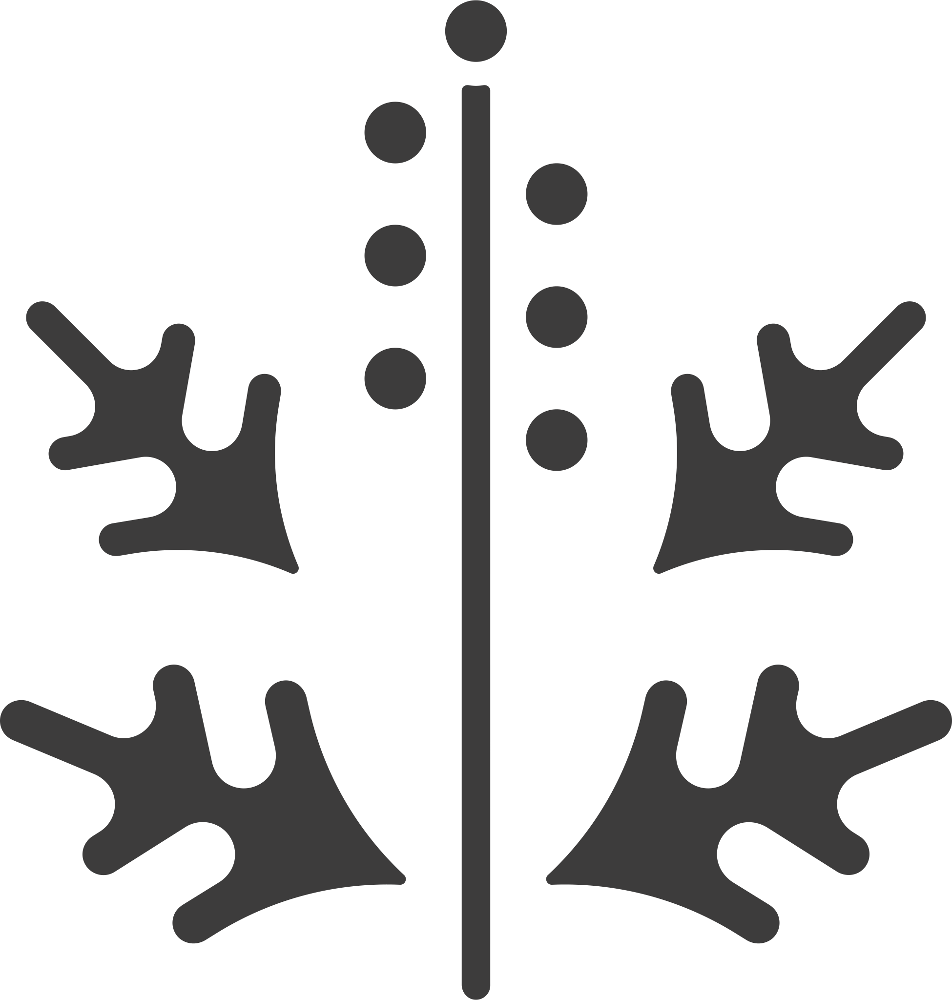
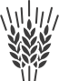

# AirParif Binding

This binding uses the [AirParif service](https://www.airparif.fr/) for providing air quality information for Paris and departments of the Ile-de-France.
To use it, you first need to [register and get your API key](https://www.airparif.fr/interface-de-programmation-applicative).
You'll receive your API Key by mail.

## Supported Things

- `api`: bridge used to connect to the AirParif service. Provides some general information for the whole area.
- `location`: Presents the pollen and air quality information for a given location.

Of course, you can add multiple `location`s, e.g. for gathering pollen or air quality data for different locations.

## Discovery

Once your `api` bridge is created and configured with the API Key, a default `location` can be auto-discovered based on system location.
It will be configured with the system location and detected department.

## Thing Configuration

### `api` Thing Configuration

| Name            | Type    | Description                       | Default | Required | Advanced |
|-----------------|---------|-----------------------------------|---------|----------|----------|
| apikey          | text    | Token used to access the service  | N/A     | yes      | no       |

### `location` Thing Configuration

| Name            | Type    | Description                                                                    | Default | Required | Advanced |
|-----------------|---------|--------------------------------------------------------------------------------|---------|----------|----------|
| location        | text    | Geo coordinates to be considered (as `{latitude},{longitude}[,{altitude in m}]`) | N/A     | yes      | no       |
| department      | text    | Code of the department (two digits) (*)                                        | N/A     | yes      | no       |

(*) When auto-discovered, the department will be pre-filled based on the location and bounding limits defined in the internal department database.
Please check that proposed value is correct according to the place.

## Channels

### `api` Thing Channels

| Group                | Channel        | Type           | Read/Write | Description                                  |
|----------------------|----------------|----------------|------------|----------------------------------------------|
| pollens              | comment        | String         | R          | Current pollens situation                    |
| pollens              | begin-validity | DateTime       | R          | Bulletin validity start                      |
| pollens              | end-validity   | DateTime       | R          | Bulletin validity end                        |
| aq-bulletin          | comment        | String         | R          | General message for the air quality bulletin |
| aq-bulletin          | no2-min        | Number:Density | R          | Minimum level of NO2 concentration           |
| aq-bulletin          | no2-max        | Number:Density | R          | Maximum level of NO2 concentration           |
| aq-bulletin          | o3-min         | Number:Density | R          | Minimum level of O3 concentration            |
| aq-bulletin          | o3-max         | Number:Density | R          | Maximum level of O3 concentration            |
| aq-bulletin          | pm10-min       | Number:Density | R          | Minimum level of PM 10 concentration         |
| aq-bulletin          | pm10-max       | Number:Density | R          | Maximum level of PM 10 concentration         |
| aq-bulletin          | pm25-min       | Number:Density | R          | Minimum level of PM 2.5 concentration        |
| aq-bulletin          | pm25-max       | Number:Density | R          | Maximum level of PM 2.5 concentration        |
| aq-bulletin-tomorrow | comment        | String         | R          | General message for the air quality bulletin |
| aq-bulletin-tomorrow | no2-min        | Number:Density | R          | Minimum level of NO2 concentration           |
| aq-bulletin-tomorrow | no2-max        | Number:Density | R          | Maximum level of NO2 concentration           |
| aq-bulletin-tomorrow | o3-min         | Number:Density | R          | Minimum level of O3 concentration            |
| aq-bulletin-tomorrow | o3-max         | Number:Density | R          | Maximum level of O3 concentration            |
| aq-bulletin-tomorrow | pm10-min       | Number:Density | R          | Minimum level of PM 10 concentration         |
| aq-bulletin-tomorrow | pm10-max       | Number:Density | R          | Maximum level of PM 10 concentration         |
| aq-bulletin-tomorrow | pm25-min       | Number:Density | R          | Minimum level of PM 2.5 concentration        |
| aq-bulletin-tomorrow | pm25-max       | Number:Density | R          | Maximum level of PM 2.5 concentration        |
| daily                | message        | String         | R          | Today's daily general information            |
| daily                | tomorrow       | String         | R          | Tomorrow's daily general information         |

### `location` Thing Channels

| Group   | Channel    | Type           | Read/Write | Description                                              |
|---------|------------|----------------|------------|----------------------------------------------------------|
| pollens | cypress    | Number         | R          | Alert level associated to this taxon (*)                 |
| pollens | hazel      | Number         | R          | Alert level associated to this taxon (*)                 |
| pollens | alder      | Number         | R          | Alert level associated to this taxon (*)                 |
| pollens | poplar     | Number         | R          | Alert level associated to this taxon (*)                 |
| pollens | willow     | Number         | R          | Alert level associated to this taxon (*)                 |
| pollens | ash        | Number         | R          | Alert level associated to this taxon (*)                 |
| pollens | hornbeam   | Number         | R          | Alert level associated to this taxon (*)                 |
| pollens | birch      | Number         | R          | Alert level associated to this taxon (*)                 |
| pollens | plane      | Number         | R          | Alert level associated to this taxon (*)                 |
| pollens | oak        | Number         | R          | Alert level associated to this taxon (*)                 |
| pollens | olive      | Number         | R          | Alert level associated to this taxon (*)                 |
| pollens | linden     | Number         | R          | Alert level associated to this taxon (*)                 |
| pollens | chestnut   | Number         | R          | Alert level associated to this taxon (*)                 |
| pollens | rumex      | Number         | R          | Alert level associated to this taxon (*)                 |
| pollens | grasses    | Number         | R          | Alert level associated to this taxon (*)                 |
| pollens | plantain   | Number         | R          | Alert level associated to this taxon (*)                 |
| pollens | urticaceae | Number         | R          | Alert level associated to this taxon (*)                 |
| pollens | wormwood   | Number         | R          | Alert level associated to this taxon (*)                 |
| pollens | ragweed    | Number         | R          | Alert level associated to this taxon (*)                 |
| indice  | message    | String         | R          | Alert message associated to the value of the index       |
| indice  | timestamp  | DateTime       | R          | Timestamp of the evaluation                              |
| indice  | alert      | Number         | R          | ATMO Index associated to highest pollutant concentration |
| o3      | message    | String         | R          | Polllutant concentration alert message                   |
| o3      | value      | Number:Density | R          | Concentration of the given pollutant                     |
| o3      | alert      | Number         | R          | Alert Level associated to pollutant concentration (**)   |
| no2     | message    | String         | R          | Polllutant concentration alert message                   |
| no2     | value      | Number:Density | R          | Concentration of the given pollutant                     |
| no2     | alert      | Number         | R          | Alert Level associated to pollutant concentration (**)   |
| pm25    | message    | String         | R          | Polllutant concentration alert message                   |
| pm25    | value      | Number:Density | R          | Concentration of the given pollutant                     |
| pm25    | alert      | Number         | R          | Alert Level associated to pollutant concentration (**)   |
| pm10    | message    | String         | R          | Polllutant concentration alert message                   |
| pm10    | value      | Number:Density | R          | Concentration of the given pollutant                     |
| pm10    | alert      | Number         | R          | Alert Level associated to pollutant concentration (**)   |

(*) Each pollen alert level has an associated color and description:

| Code | Color  | Description           |
|------|--------|-----------------------|
| 0    | Green  | No allergic risk      |
| 1    | Yellow | Low allergic risk     |
| 2    | Orange | Average allergic risk |
| 3    | Red    | High allergic risk    |

(*) Each pollutant concentration is associated to an alert level (and an icon) :

| Code | Description   |
|------|---------------|
| 0    | Good          |
| 1    | Average       |
| 2    | Degrated      |
| 3    | Bad           |
| 4    | Very Bad      |
| 5    | Extremely Bad |

## Provided icon set

This binding has its own IconProvider and makes available the following list of icons

| Icon Name              | Dynamic | Illustration |
|------------------------|---------|--------------|
| oh:airparif:aq         |   Yes   |  |
| oh:airparif:alder      |   Yes   |  |
| oh:airparif:ash        |   Yes   |  |
| oh:airparif:birch      |   Yes   |  |
| oh:airparif:chestnut   |   Yes   |  |
| oh:airparif:cypress    |   Yes   |  |
| oh:airparif:grasses    |   Yes   |  |
| oh:airparif:hazel      |   Yes   |  |
| oh:airparif:hornbeam   |   Yes   |  |
| oh:airparif:linden     |   Yes   |  |
| oh:airparif:oak        |   Yes   |  |
| oh:airparif:olive      |   Yes   |  |
| oh:airparif:plane      |   Yes   |  |
| oh:airparif:plantain   |   Yes   |  |
| oh:airparif:pollen     |   Yes   | x |
| oh:airparif:poplar     |   Yes   |  |
| oh:airparif:ragweed    |   Yes   |  |
| oh:airparif:rumex      |   Yes   |  |
| oh:airparif:urticaceae |   Yes   |  |
| oh:airparif:willow     |   Yes   |  |
| oh:airparif:wormwood   |   Yes   |  |

## Full Example

### Thing Configurationn

```java
Bridge airparif:api:local "AirParif" [ apikey="xxxxx-dddd-cccc-4321-zzzzzzzzzzzzz" ] {
    location 78 "Yvelines" [ department="78", location="52.639,1.8284" ]
}
```

### Item Configurationn

```java
String           AirParifPollensComment              "Situation"        {channel="airparif:api:local:pollens#comment"}
DateTime         AirParifPollensBeginValidity        "Begin validity"   {channel="airparif:api:local:pollens#begin-validity"}
DateTime         AirParifPollensEndValidity          "End validity"     {channel="airparif:api:local:pollens#end-validity"}
String           AirParifAqBulletinComment           "Message"          {channel="airparif:api:local:aq-bulletin#comment"}
Number:Density   AirParifAqBulletinNo2Min            "No2 min"          {channel="airparif:api:local:aq-bulletin#no2-min"}
Number:Density   AirParifAqBulletinNo2Max            "No2 max"          {channel="airparif:api:local:aq-bulletin#no2-max"}
Number:Density   AirParifAqBulletinO3Min             "O3 min"           {channel="airparif:api:local:aq-bulletin#o3-min"}
Number:Density   AirParifAqBulletinO3Max             "O3 max"           {channel="airparif:api:local:aq-bulletin#o3-max"}
Number:Density   AirParifAqBulletinPm10Min           "Pm 10 min"        {channel="airparif:api:local:aq-bulletin#pm10-min"}
Number:Density   AirParifAqBulletinPm10Max           "Pm 10 max"        {channel="airparif:api:local:aq-bulletin#pm10-max"}
Number:Density   AirParifAqBulletinPm25Min           "Pm 2.5 min"       {channel="airparif:api:local:aq-bulletin#pm25-min"}
Number:Density   AirParifAqBulletinPm25Max           "Pm 2.5 max"       {channel="airparif:api:local:aq-bulletin#pm25-max"}
String           AirParifAqBulletinTomorrowComment   "Message"          {channel="airparif:api:local:aq-bulletin-tomorrow#comment"}
Number:Density   AirParifAqBulletinTomorrowNo2Min    "No2 min"          {channel="airparif:api:local:aq-bulletin-tomorrow#no2-min"}
Number:Density   AirParifAqBulletinTomorrowNo2Max    "No2 max"          {channel="airparif:api:local:aq-bulletin-tomorrow#no2-max"}
Number:Density   AirParifAqBulletinTomorrowO3Min     "O3 min"           {channel="airparif:api:local:aq-bulletin-tomorrow#o3-min"}
Number:Density   AirParifAqBulletinTomorrowO3Max     "O3 max"           {channel="airparif:api:local:aq-bulletin-tomorrow#o3-max"}
Number:Density   AirParifAqBulletinTomorrowPm10Min   "Pm 10 min"        {channel="airparif:api:local:aq-bulletin-tomorrow#pm10-min"}
Number:Density   AirParifAqBulletinTomorrowPm10Max   "Pm 10 max"        {channel="airparif:api:local:aq-bulletin-tomorrow#pm10-max"}
Number:Density   AirParifAqBulletinTomorrowPm25Min   "Pm 2.5 min"       {channel="airparif:api:local:aq-bulletin-tomorrow#pm25-min"}
Number:Density   AirParifAqBulletinTomorrowPm25Max   "Pm 2.5 max"       {channel="airparif:api:local:aq-bulletin-tomorrow#pm25-max"}
String           AirParifDailyMessage                "Message"          {channel="airparif:api:local:daily#message"}
String           AirParifDailyTomorrow               "Tomorrow"         {channel="airparif:api:local:daily#tomorrow"}

Number           Yvelines_Pollens_Cypress      "Cypress"         {channel="airparif:location:local:78:pollens#cypress"}
Number           Yvelines_Pollens_Hazel        "Hazel level"     {channel="airparif:location:local:78:pollens#hazel"}
Number           Yvelines_Pollens_Alder        "Alder"           {channel="airparif:location:local:78:pollens#alder"}
Number           Yvelines_Pollens_Poplar       "Poplar"          {channel="airparif:location:local:78:pollens#poplar"}
Number           Yvelines_Pollens_Willow       "Willow"          {channel="airparif:location:local:78:pollens#willow"}
Number           Yvelines_Pollens_Ash          "Ash"             {channel="airparif:location:local:78:pollens#ash"}
Number           Yvelines_Pollens_Hornbeam     "Hornbeam"        {channel="airparif:location:local:78:pollens#hornbeam"}
Number           Yvelines_Pollens_Birch        "Birch level"     {channel="airparif:location:local:78:pollens#birch"}
Number           Yvelines_Pollens_Plane        "Plane"           {channel="airparif:location:local:78:pollens#plane"}
Number           Yvelines_Pollens_Oak          "Oak"             {channel="airparif:location:local:78:pollens#oak"}
Number           Yvelines_Pollens_Olive        "Olive"           {channel="airparif:location:local:78:pollens#olive"}
Number           Yvelines_Pollens_Linden       "Linden"          {channel="airparif:location:local:78:pollens#linden"}
Number           Yvelines_Pollens_Chestnut     "Chestnut"        {channel="airparif:location:local:78:pollens#chestnut"}
Number           Yvelines_Pollens_Rumex        "Rumex"           {channel="airparif:location:local:78:pollens#rumex"}
Number           Yvelines_Pollens_Grasses      "Grasses"         {channel="airparif:location:local:78:pollens#grasses"}
Number           Yvelines_Pollens_Plantain     "Plantain"        {channel="airparif:location:local:78:pollens#plantain"}
Number           Yvelines_Pollens_Urticaceae   "Urticacea"       {channel="airparif:location:local:78:pollens#urticaceae"}
Number           Yvelines_Pollens_Wormwood     "Wormwood"        {channel="airparif:location:local:78:pollens#wormwood"}
Number           Yvelines_Pollens_Ragweed      "Ragweed"         {channel="airparif:location:local:78:pollens#ragweed"}
String           Yvelines_Indice_Message       "Message"         {channel="airparif:location:local:78:indice#message"}
DateTime         Yvelines_Indice_Timestamp     "Timestamp"       {channel="airparif:location:local:78:indice#timestamp"}
Number           Yvelines_Indice_Alert         "Index"           {channel="airparif:location:local:78:indice#alert"}
String           Yvelines_O3_Message           "Message"         {channel="airparif:location:local:78:o3#message"}
Number:Density   Yvelines_O3_Value             "Concentration"   {channel="airparif:location:local:78:o3#value"}
Number           Yvelines_O3_Alert             "Alert level"     {channel="airparif:location:local:78:o3#alert"}
String           Yvelines_No2_Message          "Message"         {channel="airparif:location:local:78:no2#message"}
Number:Density   Yvelines_No2_Value            "Concentration"   {channel="airparif:location:local:78:no2#value"}
Number           Yvelines_No2_Alert            "Alert level"     {channel="airparif:location:local:78:no2#alert"}
String           Yvelines_Pm25_Message         "Message"         {channel="airparif:location:local:78:pm25#message"}
Number:Density   Yvelines_Pm25_Value           "Concentration"   {channel="airparif:location:local:78:pm25#value"}
Number           Yvelines_Pm25_Alert           "Alert level"     {channel="airparif:location:local:78:pm25#alert"}
String           Yvelines_Pm10_Message         "Message"         {channel="airparif:location:local:78:pm10#message"}
Number:Density   Yvelines_Pm10_Value           "Concentration"   {channel="airparif:location:local:78:pm10#value"}
Number           Yvelines_Pm10_Alert           "Alert level"     {channel="airparif:location:local:78:pm10#alert"}
``

