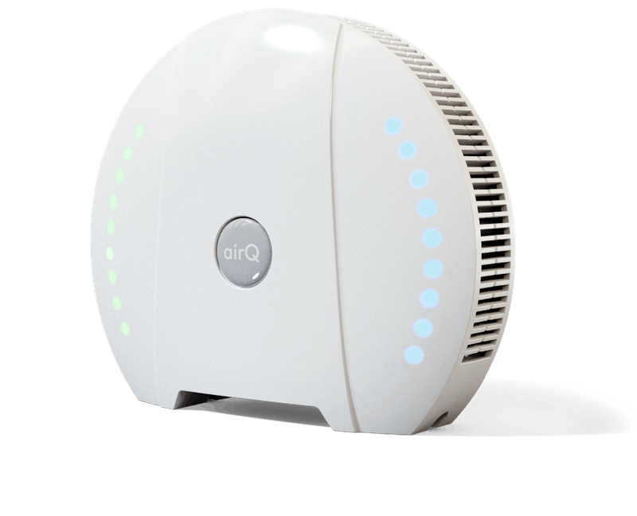

# air-Q Binding

The air-Q Binding integrates the air analyzer [air-Q](http://www.air-q.com) device into the openHAB system.

With the binding, it is possible to subscribe to all data delivered by the air-Q device.



## Supported Things

Only one Thing is supported: The `airq` device.
This Binding was tested with an `air-Q Pro` device with 14 sensors. It also works with an `air-Q` device with 11 sensors.

## Discovery

Auto-discovery is not supported.

## Thing Configuration

The air-Q Thing must be configured with (both mandatory):

| Parameter | Description                        |
|-----------|------------------------------------|
| ipAddress | Network address, e.g. 192.168.0.68 |
| password  | Password of the air-Q device       |

The Thing provides the following properties:

| Parameter              | Description                   |
|------------------------|-------------------------------|
| id                     | Device ID                     |
| hardwareVersion        | Hardware version              |
| softwareVersion        | Firmware version              |
| sensorList             | Available sensors             |
| sensorInfo             | Information about the sensors |
| industry               | Industry version              |

## Channels

The air-Q Thing offers access to all sensor data of the air-Q, according to its version.
This includes also the Maximum Error per sensor value.
For the Maximum Error channels just add `_maxerr` to the channel names.

The rw column is empty if the channel is only readable, w if the channel can be written and rw if it allows both to be read and written.

| channel                   | type                 | rw | description                                                         |
|---------------------------|----------------------|----|---------------------------------------------------------------------|
| status                    | String               |    | Status of the sensors (usually "OK")                                |
| avgFineDustSize           | Number:Length        |    | Average size of Fine Dust [experimental]                            |
| fineDustCnt00_3           | Number:Dimensionless |    | Fine Dust >0,3 µm                                                   |
| fineDustCnt00_5           | Number:Dimensionless |    | Fine Dust >0,5 µm                                                   |
| fineDustCnt01             | Number:Dimensionless |    | Fine Dust >1 µm                                                     |
| fineDustCnt02_5           | Number:Dimensionless |    | Fine Dust >2,5 µm                                                   |
| fineDustCnt05             | Number:Dimensionless |    | Fine Dust >5 µm                                                     |
| fineDustCnt10             | Number:Dimensionless |    | Fine Dust >10 µm                                                    |
| co                        | Number               |    | CO concentration                                                    |
| co2                       | Number:Dimensionless |    | CO₂ concentration                                                   |
| dCO2dt                    | Number               |    | Change of CO₂ concentration                                         |
| dHdt                      | Number               |    | Change of Humidity                                                  |
| dewpt                     | Number:Temperature   |    | Dew Point                                                           |
| doorEvent                 | Number               |    | Door Event (experimental, might not work reliably)                  |
| health                    | Number:Dimensionless |    | Health Index (0 to 1000, -200 for gas alarm, -800 for fire alarm)   |
| humidityRelative          | Number:Dimensionless |    | Humidity in percent                                                 |
| humidityAbsolute          | Number               |    | Absolute Humidity                                                   |
| measureTime               | Number:Time          |    | Milliseconds needed for measurement                                 |
| no2                       | Number               |    | NO₂ concentration                                                   |
| o3                        | Number               |    | Ozone (O₃) concentration                                            |
| o2                        | Number:Dimensionless |    | Oxygen (O₂) concentration                                           |
| performance               | Number:Dimensionless |    | Performance Index (0 to 1000)                                       |
| fineDustConc01            | Number               |    | Fine Dust concentration >1 µm                                       |
| fineDustConc02_5          | Number               |    | Fine Dust concentration >2.5 µm                                     |
| fineDustConc10            | Number               |    | Fine Dust concentration >10 µm             fni                      |
| pressure                  | Number:Pressure      |    | Pressure                                                            |
| so2                       | Number               |    | SO₂ concentration                                                   |
| sound                     | Number:Dimensionless |    | Noise                                                               |
| temperature               | Number:Temperature   |    | Temperature                                                         |
| timestamp                 | DateTime             |    | Timestamp of measurement                                            |
| tvoc                      | Number:Dimensionless |    | VOC concentration                                                   |
| uptime                    | Number:Time          |    | uptime in seconds                                                   |
| wifi                      | Switch               |    | WLAN on or off                                                      |
| ssid                      | String               |    | WLAN SSID                                                           |
| password                  | String               | w  | Device Password                                                     |
| wifiInfo                  | Switch               | rw | Show WLAN status with LED                                           |
| timeServer                | String               | rw | Name of Timeserver address                                          |
| location                  | Location             | rw | Location of air-Q device                                            |
| nightmodeStartDay         | String               | rw | Time to start day operation                                         |
| nightmodeStartNight       | String               | rw | End of day operation                                                |
| nightmodeBrightnessDay    | Number:Dimensionless | rw | Brightness of LED during the day                                    |
| nightmodeBrightnessNight  | Number:Dimensionless | rw | Brightness of LED at night                                          |
| nightmodeFanNightOff      | Switch               | rw | Switch off fan at night                                             |
| nightmodeWifiNightOff     | Switch               | rw | Switch off WLAN at night                                            |
| deviceName                | String               |    | Device Name                                                         |
| roomType                  | String               | rw | Type of room                                                        |
| logLevel                  | String               | w  | Logging level                                                       |
| deleteKey                 | String               | w  | Settings to be deleted                                              |
| fireAlarm                 | Switch               | rw | Send Fire Alarm if certain levels are met                           |
| wlanConfigGateway         | String               | rw | Network Gateway                                                     |
| wlanConfigMac             | String               | rw | MAC Address                                                         |
| wlanConfigSsid            | String               | rw | WLAN SSID                                                           |
| wlanConfigIPAddress       | String               | rw | Assigned IP address                                                 |
| wlanConfigNetMask         | String               | rw | Network mask                                                        |
| wlanConfigBssid           | String               | rw | Network BSSID                                                       |
| cloudUpload               | Switch               | rw | Upload to air-Q cloud                                               |
| averagingRhythm           | Number               | rw | Rhythm of measurement for historic average                          |
| powerFreqSuppression      | String               | rw | Power Frequency                                                     |
| autoDriftCompensation     | Switch               | rw | Compensate automatic drift                                          |
| autoUpdate                | Switch               | rw | Install Firmware updates automatically                              |
| advancedDataProcessing    | Switch               | rw | Use advanced algorithms eg. for open window or presence of a person |
| ppm_and_ppb               | Switch               | rw | Output CO as ppm and NO₂, O₃ and SO₂ as ppb value instead of mg/m3  |
| gasAlarm                  | Switch               | rw | Send Gas Alarm if certain levels are met                            |
| soundPressure             | Switch               | rw | Sound Pressure Level                                                |
| alarmForwarding           | Switch               | rw | Forward gas or fire alarm to other air-Q devices in the household   |
| userCalib                 | String               |    | Last sensor calibration                                             |
| initialCalFinished        | Switch               |    | Initial calibration has finished                                    |
| averaging                 | Switch               | rw | Do an average                                                       |
| errorBars                 | Switch               | rw | Calculate Maximum Errors                                            |
| warmupPhase               | Switch               | rw | Output data as Warmup Phase                                         |

## Example

### air-Q.things

```java
Thing airq:airq:1 "air-Q" [ ipAddress="192.168.0.68", password="myAirQPassword" ]
```

### air-Q.items

```java
String                airQ_status                 "Status of Sensors"                     {channel="airq:airq:1:status"}
Number:Length         airQ_avgFineDustSize        "Average Size of Fine Dust"             {channel="airq:airq:1:avgFineDustSize"}
Number:Dimensionless  airQ_fineDustCnt00_3        "Fine Dust >0,3 µm"                     {channel="airq:airq:1:fineDustCnt00_3"}
Number:Dimensionless  airQ_fineDustCnt00_5        "Fine Dust >0,5 µm"                     {channel="airq:airq:1:fineDustCnt00_5"}
Number:Dimensionless  airQ_fineDustCnt01          "Fine Dust >1,0 µm"                     {channel="airq:airq:1:fineDustCnt01"}
Number:Dimensionless  airQ_fineDustCnt02_5        "Fine Dust >2,5 µm"                     {channel="airq:airq:1:fineDustCnt02_5"}
Number:Dimensionless  airQ_fineDustCnt05          "Fine Dust >5 µm"                       {channel="airq:airq:1:fineDustCnt05"}
Number:Dimensionless  airQ_fineDustCnt10          "Fine Dust >10 µm"                      {channel="airq:airq:1:fineDustCnt10"}
Number                airQ_co                     "CO Concentration"                      {channel="airq:airq:1:co"}
Number:Dimensionless  airQ_co2                    "CO2 Concentration"                     {channel="airq:airq:1:co2"}
Number                airQ_dCO2dt                 "Change of CO2 Concentration"           {channel="airq:airq:1:dCO2dt"}
Number                airQ_dHdt                   "Change of Humidity"                    {channel="airq:airq:1:dHdt"}
Number:Temperature    airQ_dewpt                  "Dew Point"                             {channel="airq:airq:1:dewpt"}
Number                airQ_doorEvent              "Door Event (exp.)"                     {channel="airq:airq:1:doorEvent"}
Number:Dimensionless  airQ_health                 "Health Index"                          {channel="airq:airq:1:health"}
Number:Dimensionless  airQ_humidityRelative       "Humidity"                              {channel="airq:airq:1:humidityRelative"}
Number                airQ_humidityAbsolute       "Absolute Humidity"                     {channel="airq:airq:1:humidityAbsolute"}
Number:Time           airQ_measureTime            "Time needed for measurement"           {channel="airq:airq:1:measureTime"}
Number                airQ_no2                    "NO2 concentration"                     {channel="airq:airq:1:no2"}
Number                airQ_o3                     "O3 concentration"                      {channel="airq:airq:1:o3"}
Number:Dimensionless  airQ_o2                     "Oxygen concentration"                  {channel="airq:airq:1:o2"}
Number:Dimensionless  airQ_performance            "Performance Index"                     {channel="airq:airq:1:performance"}
Number                airQ_fineDustConc01         "Fine Dust Concentration >1µ"           {channel="airq:airq:1:fineDustConc01"}
Number                airQ_fineDustConc02_5       "Fine Dust Concentration >2.5µ"         {channel="airq:airq:1:fineDustConc02_5"}
Number                airQ_fineDustConc10         "Fine Dust Concentration >10µ"          {channel="airq:airq:1:fineDustConc10"}
Number:Pressure       airQ_pressure               "Pressure"                              {channel="airq:airq:1:pressure"}
Number                airQ_so2                    "SO2 concentration"                     {channel="airq:airq:1:so2"}
Number:Dimensionless  airQ_sound                  "Noise"                                 {channel="airq:airq:1:sound"}
Number:Temperature    airQ_temperature            "Temperature"                           {channel="airq:airq:1:temperature"}
DateTime              airQ_timestamp              "TimeStamp [%1$td.%1$tm.%1$tY %1$tH:%1$tM]"                            {channel="airq:airq:1:timestamp"}
Number:Dimensionless  airQ_voc                    "VOC concentration"                     {channel="airq:airq:1:tvoc"}
Number:Time           airQ_uptime                 "Uptime"                                {channel="airq:airq:1:uptime"}

Number:Dimensionless  airQ_cnt03_maxerr        "Maximum error of Fine Dust >0,3 µm"             {channel="airq:airq:1:cnt0_3_maxerr"}
Number:Dimensionless  airQ_cnt05_maxerr        "Maximum error of Fine Dust >0,5 µm"             {channel="airq:airq:1:cnt0_5_maxerr"}
Number:Dimensionless  airQ_cnt1_maxerr         "Maximum error of Fine Dust >1,0 µm"             {channel="airq:airq:1:cnt1_maxerr"}
Number:Dimensionless  airQ_cnt25_maxerr        "Maximum error of Fine Dust >2,5 µm"             {channel="airq:airq:1:cnt2_5_maxerr"}
Number:Dimensionless  airQ_cnt5_maxerr         "Maximum error of Fine Dust >5 µm"               {channel="airq:airq:1:cnt5_maxerr"}
Number:Dimensionless  airQ_cnt10_maxerr        "Maximum error of Fine Dust >10 µm"              {channel="airq:airq:1:cnt10_maxerr"}
Number:Dimensionless  airQ_co2_maxerr          "Maximum error of CO2 Concentration"             {channel="airq:airq:1:co2_maxerr"}
Number:Dimensionless  airQ_dewpt_maxerr        "Maximum error of Dew Point"                     {channel="airq:airq:1:dewpt_maxerr"}
Number:Dimensionless  airQ_humidity_maxerr     "Maximum error of Humidity"                      {channel="airq:airq:1:humidity_maxerr"}
Number:Dimensionless  airQ_humidity_abs_maxerr "Maximum error of Absolute Humidity"             {channel="airq:airq:1:humidity_abs_maxerr"}
Number:Dimensionless  airQ_no2_maxerr          "Maximum error of NO2 concentration"             {channel="airq:airq:1:no2_maxerr"}
Number:Dimensionless  airQ_o3_maxerr           "Maximum error of O3 concentration"              {channel="airq:airq:1:o3_maxerr"}
Number:Dimensionless  airQ_oxygen_maxerr       "Maximum error of Oxygen concentration"          {channel="airq:airq:1:o2_maxerr"}
Number:Dimensionless  airQ_pm1_maxerr          "Maximum error of Fine Dust Concentration >1µ"   {channel="airq:airq:1:pm1_maxerr"}
Number:Dimensionless  airQ_pm2_5_maxerr        "Maximum error of Fine Dust Concentration >2.5µ" {channel="airq:airq:1:pm2_5_maxerr"}
Number:Dimensionless  airQ_pm10_maxerr         "Maximum error of Fine Dust Concentration >10µ"  {channel="airq:airq:1:pm10_maxerr"}
Number:Dimensionless  airQ_pressure_maxerr     "Maximum error of Pressure"                      {channel="airq:airq:1:pressure_maxerr"}
Number:Dimensionless  airQ_so2_maxerr          "Maximum error of SO2 concentration"             {channel="airq:airq:1:so2_maxerr"}
Number:Dimensionless  airQ_sound_maxerr        "Maximum error of Noise"                         {channel="airq:airq:1:sound_maxerr"}
Number:Dimensionless  airQ_temperature_maxerr  "Maximum error of Temperature"                   {channel="airq:airq:1:temperature_maxerr"}
Number:Dimensionless  airQ_voc_maxerr          "Maximum error of VOC concentration"             {channel="airq:airq:1:tvoc_maxerr"}

Switch airQ_wifi                    "WLAN on or off"                                 {channel="airq:airq:1:wifi"}
String airQ_SSID                    "WLAN SSID"                                      {channel="airq:airq:1:ssid"}
String airQ_password                "Device Password"                                {channel="airq:airq:1:password"}
Switch airQ_wifiInfo                "Show WLAN status with LED"                      {channel="airq:airq:1:wifiInfo"}
String airQ_timeServer              "Name of Timeserver address"                     {channel="airq:airq:1:timeServer"}
Location airQ_location              "Location of air-Q device"                       {channel="airq:airq:1:location"}
String airQ_nightMode_startDay      "Time to start day operation"                    {channel="airq:airq:1:nightModeStartDay"}
String airQ_nightMode_startNight    "End of day operation"                           {channel="airq:airq:1:nightModeStartNight"}
Number:Dimensionless airQ_nightMode_brightnessDay "Brightness of LED during the day" {channel="airq:airq:1:nightModeBrightnessDay"}
Number:Dimensionless airQ_nightMode_brightnessNight   "Brightness of LED at night"   {channel="airq:airq:1:nightModeBrightnessNight"}
Switch airQ_nightMode_fanNightOff   "Switch off fan at night"                        {channel="airq:airq:1:nightModeFanNightOff"}
Switch airQ_nightMode_wifiNightOff  "Switch off WLAN at night"                       {channel="airq:airq:1:nightModeWifiNightOff"}
String airQ_deviceName              "Device Name"                                    {channel="airq:airq:1:deviceName"}
String airQ_roomType                "Type of room"                                   {channel="airq:airq:1:roomType"}
String airQ_logLevel                "Logging level"                                  {channel="airq:airq:1:logLevel"}
String airQ_deleteKey               "Settings to be deleted"                         {channel="airq:airq:1:deleteKey"}
Switch airQ_fireAlarm               "Send Fire Alarm if certain levels are met"      {channel="airq:airq:1:fireAlarm"}
String airQ_WLAN_config_gateway     "Network Gateway"                                {channel="airq:airq:1:wlanConfigGateway"}
String airQ_WLAN_config_MAC         "MAC Address"                                    {channel="airq:airq:1:wlanConfigMac"}
String airQ_WLAN_config_SSID        "WLAN SSID"                                      {channel="airq:airq:1:wlanConfigSsid"}
String airQ_WLAN_config_IPAddress   "Assigned IP address"                            {channel="airq:airq:1:wlanConfigIPAddress"}
String airQ_WLAN_config_netMask     "Network mask"                                   {channel="airq:airq:1:wlanConfigNetMask"}
String airQ_WLAN_config_BSSID       "Network BSSID"                                  {channel="airq:airq:1:wlanConfigBssid"}
Switch airQ_cloudUpload             "Upload to air-Q cloud"                          {channel="airq:airq:1:cloudUpload"}
Number airQ_averagingRhythm         "Rhythm of measurement for historic average"     {channel="airq:airq:1:averagingRhythm"}
String airQ_powerFreqSuppression    "Power Frequency"                                {channel="airq:airq:1:powerFreqSuppression"}
Switch airQ_autoDriftCompensation   "Compensate automatic drift"                     {channel="airq:airq:1:autoDriftCompensation"}
Switch airQ_autoUpdate              "Install Firmware updates automatically"         {channel="airq:airq:1:autoUpdate"}
Switch airQ_advancedDataProcessing  "Use advanced algorithms eg. for open window or presence of a person"   {channel="airq:airq:1:advancedDataProcessing"}
Switch airQ_ppm_and_ppb             "Output CO as ppm and NO2, O3 and SO2 as ppb value instead of mg/m3"    {channel="airq:airq:1:ppm_and_ppb"}
Switch airQ_gasAlarm                "Send Gas Alarm if certain levels are met"       {channel="airq:airq:1:gasAlarm"}
Switch airQ_soundPressure           "Sound Pressure Level"                           {channel="airq:airq:1:soundPressure"}
Switch airQ_alarmForwarding         "Forward gas or fire alarm to other air-Q devices in the household"     {channel="airq:airq:1:alarmForwarding"}
String airQ_userCalib               "Last sensor calibration"                        {channel="airq:airq:1:userCalib"}
Switch airQ_initialCalFinished      "Initial calibration has finished"               {channel="airq:airq:1:initialCalFinished"}
Switch airQ_averaging               "Do an average"                                  {channel="airq:airq:1:averaging"}
Switch airQ_errorBars               "Calculate Maximum Errors"                       {channel="airq:airq:1:errorBars"}
Switch airQ_warmupPhase             "Output Data as Warmup Phase"                    {channel="airq:airq:1:warmupPhase"}
```
