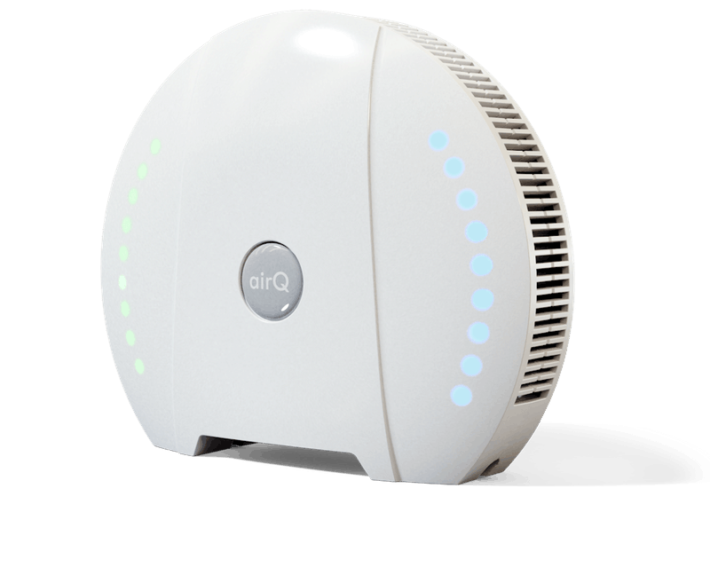

# air-Q Binding

The air-Q Binding integrates the air analyzer [air-Q](http://www.air-q.com) device into the openHAB system.

With the binding, it is possible to subscribe to supported measurement and configuration data delivered by the air-Q device.



## Supported Things

Only one Thing is supported: The `airq` device.
This Binding was tested with an `air-Q Pro` device with 14 sensors. It also works with an `air-Q` device with 11 sensors.

## Discovery

air-Q devices on the local network are discovered automatically via mDNS.
Discovered devices appear in the openHAB Inbox.
To add a discovered device, click **OK → EDIT** in the Inbox dialog, then enter the device password in the Configuration section and save.
The device IP address is filled in automatically by discovery.

If auto-discovery does not work (e.g. due to network segmentation), you can still add the device manually using its IP address.

## Thing Configuration

The air-Q Thing must be configured with:

| Parameter | Description                        | Required                       |
|-----------|------------------------------------|--------------------------------|
| ipAddress | Network address, e.g. 192.168.0.68 | Yes (auto-filled by discovery) |
| password  | Password of the air-Q device       | Yes                            |

The Thing provides the following properties:

| Parameter       | Description                   |
|-----------------|-------------------------------|
| id              | Device ID                     |
| hardwareVersion | Hardware version              |
| softwareVersion | Firmware version              |
| sensorList      | Available sensors             |
| sensorInfo      | Information about the sensors |
| industry        | Industry version              |

## Channels

The available sensor data depends on the air-Q model and installed sensor package.
This includes also the Maximum Error per sensor value.
Legacy Maximum Error channels use the `_maxerr` suffix.
The advanced gas, relative-pressure, and maximum-noise channels introduced in Thing version 5 use the `-maxerr` suffix.
Channels are grouped into General, Measurements, Advanced Measurements, Maximum Errors, and Advanced Maximum Errors.
Things created before Thing version 5 keep their existing flat channels, so existing Item links stay valid.
New Things, and the channels added in version 5, use the group-qualified channel address `airq:airq:<thing-id>:<group-id>#<channel-id>`.

The rw column is empty if the channel is only readable, w if the channel can be written and rw if it allows both to be read and written.

| channel                  | type                             | rw  | description                                                                            |
|--------------------------|----------------------------------|-----|----------------------------------------------------------------------------------------|
| status                   | String                           |     | Status of the sensors (usually "OK")                                                   |
| avgFineDustSize          | Number:Length                    |     | Average size of Fine Dust [experimental]                                               |
| fineDustCnt00_3          | Number:Dimensionless             |     | Fine Dust >0,3 µm                                                                      |
| fineDustCnt00_5          | Number:Dimensionless             |     | Fine Dust >0,5 µm                                                                      |
| fineDustCnt01            | Number:Dimensionless             |     | Fine Dust >1 µm                                                                        |
| fineDustCnt02_5          | Number:Dimensionless             |     | Fine Dust >2,5 µm                                                                      |
| fineDustCnt05            | Number:Dimensionless             |     | Fine Dust >5 µm                                                                        |
| fineDustCnt10            | Number:Dimensionless             |     | Fine Dust >10 µm                                                                       |
| co                       | Number:Density                   |     | Carbon monoxide (CO) concentration                                                     |
| co2                      | Number:Dimensionless             |     | Carbon dioxide (CO₂) concentration                                                     |
| dCO2dt                   | Number                           |     | Change of CO₂ concentration                                                            |
| dHdt                     | Number                           |     | Change of Humidity                                                                     |
| dewpt                    | Number:Temperature               |     | Dew Point                                                                              |
| doorEvent                | Number                           |     | Door Event (experimental, might not work reliably)                                     |
| h2s                      | Number:Density                   |     | Hydrogen sulfide (H₂S)                                                                 |
| healthIndex              | Number:Dimensionless             |     | Health Index in percent                                                                |
| health                   | Number:Dimensionless             |     | Health Index (0 to 1000, -200 for gas alarm, -800 for fire alarm)                      |
| humidityRelative         | Number:Dimensionless             |     | Humidity in percent                                                                    |
| humidityAbsolute         | Number:Density                   |     | Absolute Humidity                                                                      |
| measureTime              | Number:Time                      |     | Milliseconds needed for measurement                                                    |
| no2                      | Number:Density                   |     | Nitrogen Dioxide (NO₂) concentration                                                   |
| o3                       | Number:Density                   |     | Ozone (O₃) concentration                                                               |
| o2                       | Number:Dimensionless             |     | Oxygen (O₂) concentration                                                              |
| performanceIndex         | Number:Dimensionless             |     | Performance Index in percent                                                           |
| performance              | Number:Dimensionless             |     | Performance Index (0 to 1000)                                                          |
| fineDustConc01           | Number                           |     | Fine Dust concentration >1 µm                                                          |
| fineDustConc02_5         | Number                           |     | Fine Dust concentration >2.5 µm                                                        |
| fineDustConc10           | Number                           |     | Fine Dust concentration >10 µm                                                         |
| pressure                 | Number:Pressure                  |     | Barometric Pressure                                                                    |
| radon                    | Number:RadiationSpecificActivity |     | Radon concentration                                                                    |
| so2                      | Number                           |     | Sulfur dioxide (SO₂) concentration                                                     |
| sound                    | Number:Dimensionless             |     | Noise                                                                                  |
| temperature              | Number:Temperature               |     | Temperature                                                                            |
| timestamp                | DateTime                         |     | Timestamp of measurement                                                               |
| tvoc                     | Number:Dimensionless             |     | VOC concentration                                                                      |
| virus_free               | Number:Dimensionless             | r   | Virus-Free index in percent; the lower the index, the higher the potential virus risk. |
| mold_free                | Number:Dimensionless             | r   | Mold-Free index in percent; the lower the index, the higher the potential mold risk.   |
| uptime                   | Number:Time                      |     | uptime in seconds                                                                      |
| c2h4o                    | Number:Density                   |     | Acetaldehyde in µg/m³ (advanced)                                                       |
| nh3-mr100                | Number:Density                   |     | Ammonia in µg/m³ (advanced)                                                            |
| ash3                     | Number:Density                   |     | Arsine in µg/m³ (advanced)                                                             |
| br2                      | Number:Density                   |     | Bromine in µg/m³ (advanced)                                                            |
| ch4s                     | Number:Density                   |     | Methanethiol in µg/m³ (advanced)                                                       |
| cl2-m20                  | Number:Density                   |     | Chlorine in µg/m³ (advanced)                                                           |
| clo2                     | Number:Density                   |     | Chlorine dioxide in µg/m³ (advanced)                                                   |
| cs2                      | Number:Density                   |     | Carbon disulfide in µg/m³ (advanced)                                                   |
| ethanol                  | Number:Density                   |     | Ethanol in µg/m³ (advanced)                                                            |
| c2h4                     | Number:Density                   |     | Ethylene in µg/m³ (advanced)                                                           |
| ch2o-m10                 | Number:Density                   |     | Formaldehyde in µg/m³ (advanced)                                                       |
| f2                       | Number:Density                   |     | Fluorine in µg/m³ (advanced)                                                           |
| hcl                      | Number:Density                   |     | Hydrochloric acid in µg/m³ (advanced)                                                  |
| hcn                      | Number:Density                   |     | Hydrogen cyanide in µg/m³ (advanced)                                                   |
| hf                       | Number:Density                   |     | Hydrogen fluoride in µg/m³ (advanced)                                                  |
| h2-m1000                 | Number:Density                   |     | Hydrogen in µg/m³ (advanced)                                                           |
| h2o2                     | Number:Density                   |     | Hydrogen peroxide in µg/m³ (advanced)                                                  |
| n2o                      | Number:Density                   |     | Nitrous oxide in µg/m³ (advanced)                                                      |
| no-m250                  | Number:Density                   |     | Nitrogen monoxide in µg/m³ (advanced)                                                  |
| acid-m100                | Number:Dimensionless             |     | Organic acid in ppb (advanced)                                                         |
| ph3                      | Number:Density                   |     | Hydrogen phosphide in µg/m³ (advanced)                                                 |
| sih4                     | Number:Density                   |     | Silane in µg/m³ (advanced)                                                             |
| tvoc-ionsc               | Number:Dimensionless             |     | Industrial VOC in ppb (advanced)                                                       |
| pressure-rel             | Number:Pressure                  |     | Relative barometric pressure in hPa (advanced)                                         |
| sound-max                | Number:Dimensionless             |     | Maximum A-weighted noise in dB (advanced)                                              |
| ch4-mipex                | Number:Dimensionless             |     | Methane in percent (advanced)                                                          |
| c3h8-mipex               | Number:Dimensionless             |     | Propane in percent (advanced)                                                          |
| r32                      | Number:Dimensionless             |     | Refrigerant R32 in percent (advanced)                                                  |
| r454b                    | Number:Dimensionless             |     | Refrigerant R454B in percent (advanced)                                                |
| r454c                    | Number:Dimensionless             |     | Refrigerant R454C in percent (advanced)                                                |
| wifi                     | Switch                           |     | WLAN on or off                                                                         |
| ssid                     | String                           |     | WLAN SSID                                                                              |
| password                 | String                           | w   | Device Password                                                                        |
| wifiInfo                 | Switch                           | rw  | Show WLAN status with LED                                                              |
| timeServer               | String                           | rw  | Name of Timeserver address                                                             |
| location                 | Location                         | rw  | Location of air-Q device                                                               |
| nightmodeStartDay        | String                           | rw  | Time to start day operation                                                            |
| nightmodeStartNight      | String                           | rw  | End of day operation                                                                   |
| nightmodeBrightnessDay   | Number:Dimensionless             | rw  | Brightness of LED during the day                                                       |
| nightmodeBrightnessNight | Number:Dimensionless             | rw  | Brightness of LED at night                                                             |
| nightmodeFanNightOff     | Switch                           | rw  | Switch off fan at night                                                                |
| nightmodeWifiNightOff    | Switch                           | rw  | Switch off WLAN at night                                                               |
| deviceName               | String                           |     | Device Name                                                                            |
| roomType                 | String                           | rw  | Type of room                                                                           |
| logLevel                 | String                           | w   | Logging level                                                                          |
| deleteKey                | String                           | w   | Settings to be deleted                                                                 |
| fireAlarm                | Switch                           | rw  | Send Fire Alarm if certain levels are met                                              |
| wlanConfigGateway        | String                           | rw  | Network Gateway                                                                        |
| wlanConfigMac            | String                           | rw  | MAC Address                                                                            |
| wlanConfigSsid           | String                           | rw  | WLAN SSID                                                                              |
| wlanConfigIPAddress      | String                           | rw  | Assigned IP address                                                                    |
| wlanConfigNetMask        | String                           | rw  | Network mask                                                                           |
| wlanConfigBssid          | String                           | rw  | Network BSSID                                                                          |
| cloudUpload              | Switch                           | rw  | Upload to air-Q cloud                                                                  |
| averagingRhythm          | Number                           | rw  | Rhythm of measurement for historic average                                             |
| powerFreqSuppression     | String                           | rw  | Power Frequency                                                                        |
| autoDriftCompensation    | Switch                           | rw  | Compensate automatic drift                                                             |
| autoUpdate               | Switch                           | rw  | Install Firmware updates automatically                                                 |
| advancedDataProcessing   | Switch                           | rw  | Use advanced algorithms eg. for open window or presence of a person                    |
| ppm_and_ppb              | Switch                           | rw  | Output CO as ppm and NO₂, O₃ and SO₂ as ppb value instead of mg/m3                     |
| gasAlarm                 | Switch                           | rw  | Send Gas Alarm if certain levels are met                                               |
| soundPressure            | Switch                           | rw  | Sound Pressure Level                                                                   |
| alarmForwarding          | Switch                           | rw  | Forward gas or fire alarm to other air-Q devices in the household                      |
| userCalib                | String                           |     | Last sensor calibration                                                                |
| initialCalFinished       | Switch                           |     | Initial calibration has finished                                                       |
| averaging                | Switch                           | rw  | Do an average                                                                          |
| errorBars                | Switch                           | rw  | Calculate Maximum Errors                                                               |
| warmupPhase              | Switch                           | rw  | Output data as Warmup Phase                                                            |

The advanced gas, relative-pressure, and maximum-noise measurements have advanced `-maxerr` channels with the same Item type and unit as their measurements.
For example, `ch2o-m10-maxerr` contains the formaldehyde measurement uncertainty in µg/m³.
For maximum noise, the error channel is `sound-max-maxerr`, distinct from the existing `sound_maxerr` channel.
These channels support scalar readings as well as `[value, uncertainty]` pairs; for scalars, the error channel is `UNDEF`.
Absent readings for these channels are silently ignored, since not every device has every sensor.
Explicit `null` or malformed readings set these measurements and their error channels to `UNDEF` and recover on the next valid reading.
Legacy channels retain their existing value, unit, and missing-reading behavior.

### Reporting Missing Measurements

To diagnose unsupported data points, enable trace logging in the openHAB console:

```shell
log:set TRACE org.openhab.binding.airq
```

Look for `Received measurement data` entries after the next poll.
These include numeric values for known measurements and the names of other received fields with their values replaced by `<omitted>`.
Passwords, device identifiers, location, configuration, free-form status text, and unknown values are not included.
Malformed responses are not logged verbatim either.
Include a sanitized trace entry and your device's sensor package when reporting a missing measurement.
Restore normal logging afterwards:

```shell
log:set DEFAULT org.openhab.binding.airq
```

## Usage with Docker

This binding requires the JVM cryptographic strength policy to be set to "unlimited".
Otherwise the connection to the device will fail.
See the [openHAB Docker image documentation](https://github.com/openhab/openhab-docker/blob/main/README.md#java-cryptographic-strength-policy) for details.

## Example

### air-Q.things

```java
Thing airq:airq:1 "air-Q" [ ipAddress="192.168.0.68", password="myAirQPassword" ]
```

### air-Q.items

```java
String                airQ_status                 "Status of Sensors"                     {channel="airq:airq:1:general#status"}
Number:Length         airQ_avgFineDustSize        "Average Size of Fine Dust"             {channel="airq:airq:1:measurements#avgFineDustSize"}
Number:Dimensionless  airQ_fineDustCnt00_3        "Fine Dust >0,3 µm"                     {channel="airq:airq:1:measurements#fineDustCnt00_3"}
Number:Dimensionless  airQ_fineDustCnt00_5        "Fine Dust >0,5 µm"                     {channel="airq:airq:1:measurements#fineDustCnt00_5"}
Number:Dimensionless  airQ_fineDustCnt01          "Fine Dust >1,0 µm"                     {channel="airq:airq:1:measurements#fineDustCnt01"}
Number:Dimensionless  airQ_fineDustCnt02_5        "Fine Dust >2,5 µm"                     {channel="airq:airq:1:measurements#fineDustCnt02_5"}
Number:Dimensionless  airQ_fineDustCnt05          "Fine Dust >5 µm"                       {channel="airq:airq:1:measurements#fineDustCnt05"}
Number:Dimensionless  airQ_fineDustCnt10          "Fine Dust >10 µm"                      {channel="airq:airq:1:measurements#fineDustCnt10"}
Number                airQ_co                     "CO Concentration"                      {channel="airq:airq:1:measurements#co"}
Number:Dimensionless  airQ_co2                    "CO2 Concentration"                     {channel="airq:airq:1:measurements#co2"}
Number                airQ_dCO2dt                 "Change of CO2 Concentration"           {channel="airq:airq:1:measurements#dCO2dt"}
Number                airQ_dHdt                   "Change of Humidity"                    {channel="airq:airq:1:measurements#dHdt"}
Number:Temperature    airQ_dewpt                  "Dew Point"                             {channel="airq:airq:1:measurements#dewpt"}
Number                airQ_doorEvent              "Door Event (exp.)"                     {channel="airq:airq:1:measurements#doorEvent"}
Number:Dimensionless  airQ_health                 "Health Index"                          {channel="airq:airq:1:measurements#health"}
Number:Dimensionless  airQ_humidityRelative       "Humidity"                              {channel="airq:airq:1:measurements#humidityRelative"}
Number                airQ_humidityAbsolute       "Absolute Humidity"                     {channel="airq:airq:1:measurements#humidityAbsolute"}
Number:Time           airQ_measureTime            "Time needed for measurement"           {channel="airq:airq:1:measurements#measureTime"}
Number                airQ_no2                    "NO2 concentration"                     {channel="airq:airq:1:measurements#no2"}
Number                airQ_o3                     "O3 concentration"                      {channel="airq:airq:1:measurements#o3"}
Number:Dimensionless  airQ_o2                     "Oxygen concentration"                  {channel="airq:airq:1:measurements#o2"}
Number:Dimensionless  airQ_performance            "Performance Index"                     {channel="airq:airq:1:measurements#performance"}
Number                airQ_fineDustConc01         "Fine Dust Concentration >1µ"           {channel="airq:airq:1:measurements#fineDustConc01"}
Number                airQ_fineDustConc02_5       "Fine Dust Concentration >2.5µ"         {channel="airq:airq:1:measurements#fineDustConc02_5"}
Number                airQ_fineDustConc10         "Fine Dust Concentration >10µ"          {channel="airq:airq:1:measurements#fineDustConc10"}
Number:Pressure       airQ_pressure               "Pressure"                              {channel="airq:airq:1:measurements#pressure"}
Number:RadiationSpecificActivity airQ_radon       "Radon Concentration"                   {channel="airq:airq:1:measurements#radon"}
Number                airQ_so2                    "SO2 concentration"                     {channel="airq:airq:1:measurements#so2"}
Number:Dimensionless  airQ_sound                  "Noise"                                 {channel="airq:airq:1:measurements#sound"}
Number:Temperature    airQ_temperature            "Temperature"                           {channel="airq:airq:1:measurements#temperature"}
DateTime              airQ_timestamp              "TimeStamp [%1$td.%1$tm.%1$tY %1$tH:%1$tM]"                            {channel="airq:airq:1:measurements#timestamp"}
Number:Dimensionless  airQ_voc                    "VOC concentration"                     {channel="airq:airq:1:measurements#tvoc"}
Number:Time           airQ_uptime                 "Uptime"                                {channel="airq:airq:1:measurements#uptime"}
Number:Dimensionless  airQ_Virus_free             "Virus-Free index"                      {unit="%",channel="airq:airq:1:virus_free"}
Number:Dimensionless  airQ_Mold_free              "Mold-Free index"                       {unit="%",channel="airq:airq:1:mold_free"}

Number:Dimensionless  airQ_cnt03_maxerr        "Maximum error of Fine Dust >0,3 µm"             {channel="airq:airq:1:maxerr#cnt0_3_maxerr"}
Number:Dimensionless  airQ_cnt05_maxerr        "Maximum error of Fine Dust >0,5 µm"             {channel="airq:airq:1:maxerr#cnt0_5_maxerr"}
Number:Dimensionless  airQ_cnt1_maxerr         "Maximum error of Fine Dust >1,0 µm"             {channel="airq:airq:1:maxerr#cnt1_maxerr"}
Number:Dimensionless  airQ_cnt25_maxerr        "Maximum error of Fine Dust >2,5 µm"             {channel="airq:airq:1:maxerr#cnt2_5_maxerr"}
Number:Dimensionless  airQ_cnt5_maxerr         "Maximum error of Fine Dust >5 µm"               {channel="airq:airq:1:maxerr#cnt5_maxerr"}
Number:Dimensionless  airQ_cnt10_maxerr        "Maximum error of Fine Dust >10 µm"              {channel="airq:airq:1:maxerr#cnt10_maxerr"}
Number:Dimensionless  airQ_co2_maxerr          "Maximum error of CO2 Concentration"             {channel="airq:airq:1:maxerr#co2_maxerr"}
Number:Dimensionless  airQ_dewpt_maxerr        "Maximum error of Dew Point"                     {channel="airq:airq:1:maxerr#dewpt_maxerr"}
Number:Dimensionless  airQ_humidity_maxerr     "Maximum error of Humidity"                      {channel="airq:airq:1:maxerr#humidity_maxerr"}
Number:Dimensionless  airQ_humidity_abs_maxerr "Maximum error of Absolute Humidity"             {channel="airq:airq:1:maxerr#humidity_abs_maxerr"}
Number:Dimensionless  airQ_no2_maxerr          "Maximum error of NO2 concentration"             {channel="airq:airq:1:maxerr#no2_maxerr"}
Number:Dimensionless  airQ_o3_maxerr           "Maximum error of O3 concentration"              {channel="airq:airq:1:maxerr#o3_maxerr"}
Number:Dimensionless  airQ_oxygen_maxerr       "Maximum error of Oxygen concentration"          {channel="airq:airq:1:maxerr#o2_maxerr"}
Number:Dimensionless  airQ_pm1_maxerr          "Maximum error of Fine Dust Concentration >1µ"   {channel="airq:airq:1:maxerr#pm1_maxerr"}
Number:Dimensionless  airQ_pm2_5_maxerr        "Maximum error of Fine Dust Concentration >2.5µ" {channel="airq:airq:1:maxerr#pm2_5_maxerr"}
Number:Dimensionless  airQ_pm10_maxerr         "Maximum error of Fine Dust Concentration >10µ"  {channel="airq:airq:1:maxerr#pm10_maxerr"}
Number:Dimensionless  airQ_pressure_maxerr     "Maximum error of Pressure"                      {channel="airq:airq:1:maxerr#pressure_maxerr"}
Number:Dimensionless  airQ_so2_maxerr          "Maximum error of SO2 concentration"             {channel="airq:airq:1:maxerr#so2_maxerr"}
Number:Dimensionless  airQ_sound_maxerr        "Maximum error of Noise"                         {channel="airq:airq:1:maxerr#sound_maxerr"}
Number:Dimensionless  airQ_temperature_maxerr  "Maximum error of Temperature"                   {channel="airq:airq:1:maxerr#temperature_maxerr"}
Number:Dimensionless  airQ_voc_maxerr          "Maximum error of VOC concentration"             {channel="airq:airq:1:maxerr#tvoc_maxerr"}
Number:Dimensionless  airQ_virus_free_maxerr   "Maximum error of Virus-Free"                    {unit="%",channel="airq:airq:1:virus_free_maxerr"}
Number:Dimensionless  airQ_mold_free_maxerr    "Maximum error of Mold-Free"                     {unit="%",channel="airq:airq:1:mold_free_maxerr"}

Switch airQ_wifi                    "WLAN on or off"                                 {channel="airq:airq:1:general#wifi"}
String airQ_SSID                    "WLAN SSID"                                      {channel="airq:airq:1:general#ssid"}
String airQ_password                "Device Password"                                {channel="airq:airq:1:general#password"}
Switch airQ_wifiInfo                "Show WLAN status with LED"                      {channel="airq:airq:1:general#wifiInfo"}
String airQ_timeServer              "Name of Timeserver address"                     {channel="airq:airq:1:general#timeServer"}
Location airQ_location              "Location of air-Q device"                       {channel="airq:airq:1:general#location"}
String airQ_nightMode_startDay      "Time to start day operation"                    {channel="airq:airq:1:general#nightModeStartDay"}
String airQ_nightMode_startNight    "End of day operation"                           {channel="airq:airq:1:general#nightModeStartNight"}
Number:Dimensionless airQ_nightMode_brightnessDay "Brightness of LED during the day" {channel="airq:airq:1:general#nightModeBrightnessDay"}
Number:Dimensionless airQ_nightMode_brightnessNight   "Brightness of LED at night"   {channel="airq:airq:1:general#nightModeBrightnessNight"}
Switch airQ_nightMode_fanNightOff   "Switch off fan at night"                        {channel="airq:airq:1:general#nightModeFanNightOff"}
Switch airQ_nightMode_wifiNightOff  "Switch off WLAN at night"                       {channel="airq:airq:1:general#nightModeWifiNightOff"}
String airQ_deviceName              "Device Name"                                    {channel="airq:airq:1:general#deviceName"}
String airQ_roomType                "Type of room"                                   {channel="airq:airq:1:general#roomType"}
String airQ_logLevel                "Logging level"                                  {channel="airq:airq:1:general#logLevel"}
String airQ_deleteKey               "Settings to be deleted"                         {channel="airq:airq:1:general#deleteKey"}
Switch airQ_fireAlarm               "Send Fire Alarm if certain levels are met"      {channel="airq:airq:1:general#fireAlarm"}
String airQ_WLAN_config_gateway     "Network Gateway"                                {channel="airq:airq:1:general#wlanConfigGateway"}
String airQ_WLAN_config_MAC         "MAC Address"                                    {channel="airq:airq:1:general#wlanConfigMac"}
String airQ_WLAN_config_SSID        "WLAN SSID"                                      {channel="airq:airq:1:general#wlanConfigSsid"}
String airQ_WLAN_config_IPAddress   "Assigned IP address"                            {channel="airq:airq:1:general#wlanConfigIPAddress"}
String airQ_WLAN_config_netMask     "Network mask"                                   {channel="airq:airq:1:general#wlanConfigNetMask"}
String airQ_WLAN_config_BSSID       "Network BSSID"                                  {channel="airq:airq:1:general#wlanConfigBssid"}
Switch airQ_cloudUpload             "Upload to air-Q cloud"                          {channel="airq:airq:1:general#cloudUpload"}
Number airQ_averagingRhythm         "Rhythm of measurement for historic average"     {channel="airq:airq:1:general#averagingRhythm"}
String airQ_powerFreqSuppression    "Power Frequency"                                {channel="airq:airq:1:general#powerFreqSuppression"}
Switch airQ_autoDriftCompensation   "Compensate automatic drift"                     {channel="airq:airq:1:general#autoDriftCompensation"}
Switch airQ_autoUpdate              "Install Firmware updates automatically"         {channel="airq:airq:1:general#autoUpdate"}
Switch airQ_advancedDataProcessing  "Use advanced algorithms eg. for open window or presence of a person"   {channel="airq:airq:1:general#advancedDataProcessing"}
Switch airQ_ppm_and_ppb             "Output CO as ppm and NO2, O3 and SO2 as ppb value instead of mg/m3"    {channel="airq:airq:1:general#ppm_and_ppb"}
Switch airQ_gasAlarm                "Send Gas Alarm if certain levels are met"       {channel="airq:airq:1:general#gasAlarm"}
Switch airQ_soundPressure           "Sound Pressure Level"                           {channel="airq:airq:1:general#soundPressure"}
Switch airQ_alarmForwarding         "Forward gas or fire alarm to other air-Q devices in the household"     {channel="airq:airq:1:general#alarmForwarding"}
String airQ_userCalib               "Last sensor calibration"                        {channel="airq:airq:1:general#userCalib"}
Switch airQ_initialCalFinished      "Initial calibration has finished"               {channel="airq:airq:1:general#initialCalFinished"}
Switch airQ_averaging               "Do an average"                                  {channel="airq:airq:1:general#averaging"}
Switch airQ_errorBars               "Calculate Maximum Errors"                       {channel="airq:airq:1:general#errorBars"}
Switch airQ_warmupPhase             "Output Data as Warmup Phase"                    {channel="airq:airq:1:general#warmupPhase"}
```
