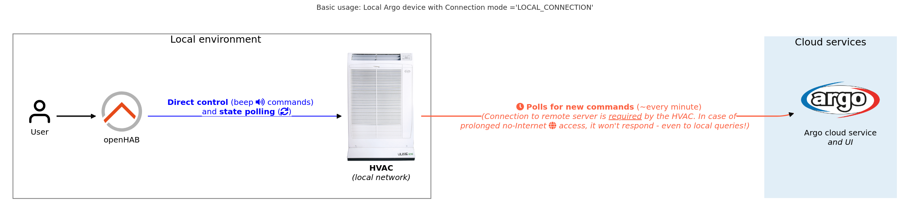
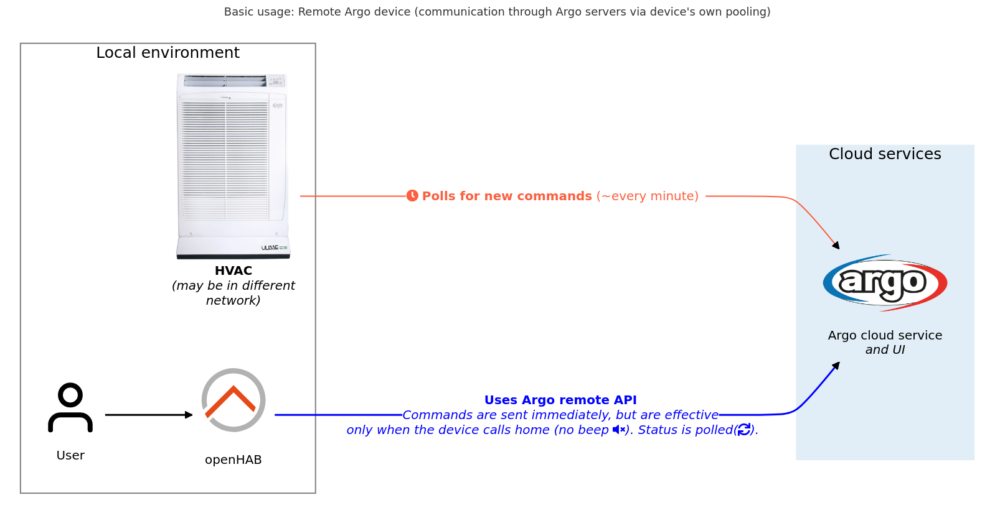
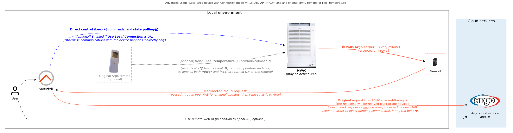
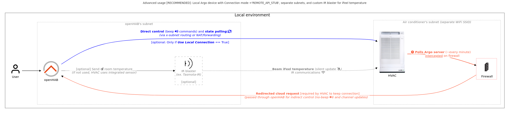

# ArgoClima Binding

The binding provides support for [ArgoClima](https://argoclima.com/en/) Wi-Fi-enabled air conditioning devices which use ***Argo Web APP*** for control.
Refer to [Argo Web APP details](#argo-web-app-details) section for an example.

> ***IMPORTANT:***  The same vendor also manufactures HVAC devices supported by a [phone application](https://www.youtube.com/playlist?list=PLQiJByZqkxY-4IjmviF2U-Grg_qYTzpKn).
>
> These devices are using a different protocol and are ***not*** supported by this binding.
> There are good chances these will be supported by the [Gree](https://www.openhab.org/addons/bindings/gree/) binding, though!

The binding supports all HVAC remote functions (including built-in schedule and settings) except for ***iFeel*** (room) temperature which is not supported by the Argo remote protocol and has to be sent via infrared.
The binding can operate in local, remote and hybrid modes.
Refer to [Connection Modes](#connection-modes) for more details.

See also [Argo protocol details](#argo-protocol-details) to find out more about how the device operates.

## Supported Things

- `remote`: Represents a HVAC device which is controlled remotely - through vendor's web application
- `local`: Represents a locally available device, which openHAB interacts with directly *(or indirectly, through a stub server)*. Refer to [Connection Modes](#connection-modes) for more details.

The binding has been primarily developed and tested using [Ulisse 13 DCI ECO Wi-Fi](https://argoclima.com/en/prodotti/argo-ulisse-eco/) device.

## Discovery

The binding does not support device auto-discovery (as the devices don't announce themselves locally).

- Note it is *technically* possible for the advanced mode with API stub to discover devices, but as it requires manual firewall reconfiguration, it won't be an "auto" anyway so was not implemented.

## Thing Configuration

### `remote` Thing Configuration

| Name             | Type    | Description                                                   | Default       | Required | Advanced |
|------------------|---------|---------------------------------------------------------------|---------------|----------|----------|
| **username**     | text    | Remote site login (can be retrieved from device during setup) | N/A           | yes      | no       |
| **password**     | text    | Password to access the device                                 | N/A           | yes      | no       |
| refreshInterval  | integer | Interval the remote API is polled with (in sec.)              | 30            | no       | yes      |
| oemServerAddress | text    | The Argo server's IP or hostname, used for communications.    | 31.14.128.210 | no       | yes      |
| oemServerPort    | integer | The Argo server's port.                                       | 80            | no       | yes      |

### `local` Thing Configuration

| Name                                      | Type           | Description                                                                                                                                                                        | Default          | Required | Advanced |
|-------------------------------------------|----------------|------------------------------------------------------------------------------------------------------------------------------------------------------------------------------------|------------------|----------|----------|
| **hostname**                              | text           | Hostname or IP address of the HVAC device. If ```useLocalConnection``` setting is enabled, **this** address will be used for direct communication with the device.                 | N/A              | yes      | no       |
| connectionMode                            | text           | Type of connection to use. One of: ```LOCAL_CONNECTION```, ```REMOTE_API_STUB```, ```REMOTE_API_PROXY```. Refer to [Connection Modes](#connection-modes)                           | LOCAL_CONNECTION | yes      | no       |
| hvacListenPort                            | integer        | Port at which the HVAC listens on (used if ```useLocalConnection== true```)                                                                                                        | 1001             | no       | yes      |
| localDeviceIP                             | text           | Local IP address of the device for matching intercepted requests (may be different from **hostname**, if behind NAT). Used in ```REMOTE_API_*``` modes.                            | N/A              | no       | yes      |
| deviceCpuId                               | text           | CPU ID of the device. Optional, value is used for detecting device update in proxy mode.  Used in ```REMOTE_API_*``` modes.                                                        | N/A              | no       | yes      |
| useLocalConnection                        | boolean        | Whether the binding is permitted to talk to the device directly.                                                                                                                   | yes              | no       | yes      |
| refreshInterval                           | integer        | Interval the device is polled in (in sec.). Used if ```useLocalConnection== true```                                                                                                | 30               | no       | yes      |
| stubServerPort                            | integer        | Stub server listen port  Used in ```REMOTE_API_*``` modes.                                                                                                                         | 8239             | no       | yes      |
| stubServerListenAddresses                 | text(multiple) | List of interfaces the stub server will listen on  Used in ```REMOTE_API_*``` modes.                                                                                               | 0.0.0.0          | no       | yes      |
| oemServerAddress                          | text           | The Argo server's IP or hostname, used for pass-through. Used in ```REMOTE_API_PROXY``` mode                                                                                       | 31.14.128.210    | no       | yes      |
| oemServerPort                             | integer        | The Argo server's port. Used in ```REMOTE_API_PROXY``` mode                                                                                                                        | 80               | no       | yes      |
| includeDeviceSidePasswordsInProperties    | text           | Whether to show the intercepted passwords (in ```REMOTE_API_*``` modes) as Thing Properties. One of: ```NEVER```, ```MASKED```, ```CLEARTEXT```                                    | NEVER            | no       | yes      |
| matchAnyIncomingDeviceIp                  | boolean        | If enabled, will accept any Argo message as matching this Thing (instead of requiring an exact-match by ```hostname``` or ```localDeviceIP```).  Used in ```REMOTE_API_*``` modes. | no               | no       | yes      |

### General Device Configuration (dynamic)

These parameters are modeled as thing configuration, but are actually configuring behavior of the HVAC device itself (when in certain modes).
The same values apply to **both** `remote`  and `local`.

| Name                   | Type            | Description                                                                                                                                                                                                                                                     | Default                              | Required | Advanced |
|------------------------|-----------------|-----------------------------------------------------------------------------------------------------------------------------------------------------------------------------------------------------------------------------------------------------------------|--------------------------------------|----------|----------|
| schedule1DayOfWeek     | text(multiple)  | Days (set comprising of values  ```MON```, ```TUE```, ```WED```, ```THU```, ```FRI```, ```SAT```, ``SUN``), when Schedule Timer 1 actions should be performed. This is used only if ```active-timer``` [channel](#channels) is in ```SCHEDULE_TIMER_1``` mode.  | [MON, TUE, WED, THU, FRI, SAT, SUN]  | no       | yes      |
| schedule1OnTime        | text            | The time of day (HH:MM) the device should turn **ON** *(in the last used mode)* on the ```schedule1DayOfWeek```-specified days. In effect only if ```active-timer``` [channel](#channels) is in ```SCHEDULE_TIMER_1``` mode                                     |  8:00                                | no       | yes      |
| schedule1OffTime       | text            | The time of day (HH:MM) the device should turn **OFF** on the ```schedule1DayOfWeek```-specified days. In effect only if ```active-timer``` [channel](#channels) is in ```SCHEDULE_TIMER_1``` mode                                                              | 18:00                                | no       | yes      |
| schedule2DayOfWeek     | text(multiple)  | Days (set comprising of values  ```MON```, ```TUE```, ```WED```, ```THU```, ```FRI```, ```SAT```, ``SUN``), when Schedule Timer 1 actions should be performed. This is used only if ```active-timer``` [channel](#channels) is in ```SCHEDULE_TIMER_1``` mode.  | [MON, TUE, WED, THU, FRI]            | no       | yes      |
| schedule2OnTime        | text            | The time of day (HH:MM) the device should turn **ON** *(in the last used mode)* on the ```schedule2DayOfWeek```-specified days. In effect only if ```active-timer``` [channel](#channels) is in ```SCHEDULE_TIMER_2``` mode                                     | 15:00                                | no       | yes      |
| schedule2OffTime       | text            | The time of day (HH:MM) the device should turn **OFF** on the ```schedule2DayOfWeek```-specified days. In effect only if ```active-timer``` [channel](#channels) is in ```SCHEDULE_TIMER_2``` mode                                                              | 20:00                                | no       | yes      |
| schedule3DayOfWeek     | text(multiple)  | Days (set comprising of values  ```MON```, ```TUE```, ```WED```, ```THU```, ```FRI```, ```SAT```, ``SUN``), when Schedule Timer 1 actions should be performed. This is used only if ```active-timer``` [channel](#channels) is in ```SCHEDULE_TIMER_1``` mode.  | [SAT, SUN]                           | no       | yes      |
| schedule3OnTime        | text            | The time of day (HH:MM) the device should turn **ON** *(in the last used mode)* on the ```schedule3DayOfWeek```-specified days. In effect only if ```active-timer``` [channel](#channels) is in ```SCHEDULE_TIMER_3``` mode                                     | 11:00                                | no       | yes      |
| schedule3OffTime       | text            | The time of day (HH:MM) the device should turn **OFF** on the ```schedule3DayOfWeek```-specified days. In effect only if ```active-timer``` [channel](#channels) is in ```SCHEDULE_TIMER_3``` mode                                                              | 22:00                                | no       | yes      |
| resetToFactoryDefaults | boolean(action) | When set, upon successful Thing initialization, the binding will issue a one-time factory reset request to the device (and flip this value back do OFF)                                                                                                         | false                                | no       | yes      |

## Channels

Both thing types are functionally equivalent and support the same channels.

| Channel                  | Type                 | Read/Write | Description                                                                                                                                                                                                            |
|--------------------------|----------------------|------------|------------------------------------------------------------------------------------------------------------------------------------------------------------------------------------------------------------------------|
| - **A/C Controls** (#ac-controls)                                                                                                                                                                                                                                                  ||||
| power                    | Switch               | RW         | This is the control channel                                                                                                                                                                                            |
| mode                     | String               | RW         | Operation mode. One of: ```COOL```, ```DRY```, ```FAN```, ```AUTO```                                                                                                                                                   |
| set-temperature          | Number:Temperature   | RW         | The device's target temperature                                                                                                                                                                                        |
| current-temperature      | Number:Temperature   | R          | Actual (ambient) temperature. Either from device's built-in sensor or iFeel. Read-only, see also: [Room Temperature Support](#room-temperature-support)                                                                |
| fan-speed                | String               | RW         | Fan mode. One of: ```AUTO```, ```LEVEL_1```, ```LEVEL_2```, ```LEVEL_3```, ```LEVEL_4```, ```LEVEL_5```, ```LEVEL_6```                                                                                                 |
| - **Operation Modes** (#modes)                                                                                                                                                                                                                                                     ||||
| eco-mode                 | Switch               | RW         | Economy (Energy Saving) Mode (cap device max power to the ```eco-power-limit```)                                                                                                                                       |
| turbo-mode               | Switch               | RW         | Turbo mode (max power). *While the device API (similarly to original remote) allows enabling ```turbo``` **while** ```night``` and/or ```economy``` modes are **active**, actual effect of such a combo is unknown :)* |
| night-mode               | Switch               | RW         | Night mode *(lowers device noise by lowering the fan speed and automatically raising the set temperature by 1°C after 60 minutes of enabling this option)*                                                             |
| - **Timers (advanced)** (#timers)                                                                                                                                                                                                                                                  ||||
| active-timer             | String               | RW         | Active timer. One of ```NO_TIMER```, ```DELAY_TIMER```, ```SCHEDULE_TIMER_1```, ```SCHEDULE_TIMER_2```, ```SCHEDULE_TIMER_3```. See also [schedule configuration](#general-device-configuration-dynamic)               |
| delay-timer              | Number:Time          |  W         | Delay timer value. In effect only if ```active-timer``` is in ```DELAY_TIMER``` mode. The delay timer toggles the current ```power``` (ex. OFF->ON) after the configured period elapses                                |
| - **Settings** (#settings)                                                                                                                                                                                                                                                         ||||
| ifeel-enabled            | Switch               | RW         | Use iFeel Temperature updates for ```current-temperature```                                                                                                                                                            |
| device-lights            | Switch               | RW         | Device Lights                                                                                                                                                                                                          |
| temperature-display-unit | String               |  W         | **(advanced)** Unit's display temperature display unit. One of ```SCALE_CELSIUS```, ```SCALE_FARHENHEIT```                                                                                                             |
| eco-power-limit          | Number:Dimensionless |  W         | **(advanced)** Power limit in eco mode (in %, factory default is 75%),                                                                                                                                                 |
| - **Advanced (not supported by all devices)** (#unsupported)                                                                                                                                                                                                                       ||||
| mode-ex                  | String               | RW         | Extended Operation mode. Same as ```mode```, but also supports ```WARM```                                                                                                                                              |
| swing-mode               | String               | RW         | Airflow Direction (flap setting). One of ```AUTO```, ```LEVEL_1```, ```LEVEL_2```, ```LEVEL_3```, ```LEVEL_4```, ```LEVEL_5```, ```LEVEL_6```, ```LEVEL_7```                                                           |
| filter-mode              | Switch               | RW         | Filter Mode                                                                                                                                                                                                            |

## Full Example

### argoclima.things

```java
//BASIC MODES examples
Thing argoclima:remote:argoHvacRemote "Argo HVAC (via Argo remote API)" @ "Living Room" [
    username="<yourArgoLogin>",
    password="<yourArgoPassword>"
]


Thing argoclima:local:argoHvacLocalDirect "Argo HVAC (connected locally)" @ "Living Room" [
    hostname="192.168.0.3"
]

Thing argoclima:local:argoHvacLocalDirectEx "Argo HVAC (connected locally) - extended example (with explicit options)" [
    hostname="192.168.0.3",
    connectionMode="LOCAL_CONNECTION",
    refreshInterval=30,    
    hvacListenPort=1001,

    // Schedule options (these are valid for all thing types)
    schedule1DayOfWeek="[FRI, SAT, SUN, MON]", 
    schedule1OnTime="7:35", 
    schedule1OffTime="18:00",
    schedule2DayOfWeek="[MON, TUE, WED, THU, FRI]", 
    schedule2OnTime="15:00",
    schedule2OffTime="22:00",
    schedule3DayOfWeek="SUN","SAT", //Alternative syntax for the weekdays list
    schedule3OnTime="11:00", 
    schedule3OffTime="22:00"   
    //,resetToFactoryDefaults=true  //This triggers a one-shot command each time the thing
                                    //  definition is (re)loaded from file.  
                                    // Use only intermittently - it is not designed with prolonged
                                    //  usage via Things text file in mind (mostly a MainUI feature!) 
]

//ADVANCED MODES examples
Thing argoclima:local:argoHvacLocalWithPassthroughIndirect "Argo HVAC (accessible only indirectly, via pass-through mode)" [
    hostname="192.168.4.2", // Doesn't have to be reachable!
    connectionMode="REMOTE_API_PROXY",
    useLocalConnection=false
]


Thing argoclima:local:argoHvacLocalWithPassthroughPlusDirectEx "Argo HVAC (accessible both indirectly and directly, via pass-through mode, with explicit options)" [
    hostname="192.168.0.3",             // Direct address of the device (reachable from openHAB)
    connectionMode="REMOTE_API_PROXY",
        
    hvacListenPort=1001,
    refreshInterval=30,
    useLocalConnection=true,
    
    // Stub server-specific
    stubServerPort=8240, 
    stubServerListenAddresses="7d47:86bd:0bfe:0413:4688:4523:4284:5936","192.168.0.195",    
    includeDeviceSidePasswordsInProperties="MASKED", 
    matchAnyIncomingDeviceIp=false, 
    deviceCpuId="deadbeefdeadbeef",     // For direct match to a concrete device (optional)
    localDeviceIP="192.168.4.2",        // Address in local subnet (used for indirect request matching)
    
    // Pass-through-specific
    oemServerAddress="uisetup.ddns.net",
    oemServerPort=80
]


Thing argoclima:local:argoHvacLocalWithStub "Argo HVAC (accessible both indirectly and directly with a stub) - **RECOMMENDED MODE**" [
    hostname="192.168.0.3",           // Has to be reachable, since useLocalConnection is true (default)
    connectionMode="REMOTE_API_STUB",    
    localDeviceIP="192.168.4.2"       // Or use matchAnyIncomingDeviceIp=true
]
```

### argoclima.items

```java
Group GArgoClimaHVACRemote "Ulisse 13 DCI ECO - remote mode" ["HVAC"]

Switch  ArgoClimaHVACRemote_Power   "Power" <switch>   (GArgoClimaHVACRemote)  {
    channel="argoclima:remote:argoHvacRemote:ac-controls#power"    
}

String  ArgoClimaHVACRemote_Mode    "Mode"  <climate>  (GArgoClimaHVACRemote)  ["Control"] {
    channel="argoclima:remote:argoHvacRemote:ac-controls#mode"    
}

Number:Temperature  ArgoClimaHVACRemote_SetTemperature  "Set Temperature"  <temperature> (GArgoClimaHVACRemote)  ["Temperature", "Setpoint"] {
    channel="argoclima:remote:argoHvacRemote:ac-controls#set-temperature",
    unit="°C",
    stateDescription="" [ pattern="%.1f °C", readOnly=false, min=10.0, max=36.0, step=0.5],
    widget="oh-stepper-card" [ min=10, max=36, step=0.5, autorepeat=true],
    listWidget="oh-stepper-item" [min=10, max=36, step=0.5, autorepeat=true]
}

Number:Temperature  ArgoClimaHVACRemote_CurrentTemperature  "Current Temperature" <temperature>   (GArgoClimaHVACRemote) ["Temperature", "Measurement"] {
    channel="argoclima:remote:argoHvacRemote:ac-controls#current-temperature"    
}

String  ArgoClimaHVACRemote_FanSpeed    "Fan Speed" <fan> (GArgoClimaHVACRemote) {
    channel="argoclima:remote:argoHvacRemote:ac-controls#fan-speed"    
}

Switch  ArgoClimaHVACRemote_EcoMode "Eco Mode"   <vacation> (GArgoClimaHVACRemote) {
    channel="argoclima:remote:argoHvacRemote:modes#eco-mode"    
}

Switch  ArgoClimaHVACRemote_TurboMode   "Turbo Mode"  <party> (GArgoClimaHVACRemote) {
    channel="argoclima:remote:argoHvacRemote:modes#turbo-mode"    
}

Switch  ArgoClimaHVACRemote_NightMode       "Night Mode"  <moon> (GArgoClimaHVACRemote) {
    channel="argoclima:remote:argoHvacRemote:modes#night-mode"    
}

String  ArgoClimaHVACRemote_ActiveTimer "Active timer"  <calendar> (GArgoClimaHVACRemote) {
    channel="argoclima:remote:argoHvacRemote:timers#active-timer"    
}

Number:Time ArgoClimaHVACRemote_DelayTimer  "Delay timer value"  <time> (GArgoClimaHVACRemote) ["Setpoint"] {
    channel="argoclima:remote:argoHvacRemote:timers#delay-timer",
    unit="min",
    stateDescription="" [ pattern="%d min", readOnly=false, min=10, max=1190, step=10 ],
    widget="oh-stepper-card" [ min=10, max=1190, step=10, autorepeat=true],
    listWidget="oh-stepper-item" [min=10, max=1190, step=10, autorepeat=true]
}

Switch  ArgoClimaHVACRemote_IFeelEnabled    "Use iFeel Temperature"  <network>  (GArgoClimaHVACRemote) {
    channel="argoclima:remote:argoHvacRemote:settings#ifeel-enabled"    
}

Switch  ArgoClimaHVACRemote_DeviceLights    "Device Lights" <light> (GArgoClimaHVACRemote) {
    channel="argoclima:remote:argoHvacRemote:settings#device-lights"    
}

String  ArgoClimaHVACRemote_TemperatureDisplayUnit  "Temperature Display Unit []"   <settings>  (GArgoClimaHVACRemote) {
    stateDescription="" [ options="SCALE_CELSIUS=°C,SCALE_FAHRENHEIT=°F" ],
    commandDescription="" [ options="SCALE_CELSIUS=°C,SCALE_FAHRENHEIT=°F" ],
    channel="argoclima:remote:argoHvacRemote:settings#temperature-display-unit"    
}

Number:Dimensionless    ArgoClimaHVACRemote_EcoPowerLimit    "Power limit in eco mode"  <price>   (GArgoClimaHVACRemote) ["Setpoint"] {
    channel="argoclima:remote:argoHvacRemote:settings#eco-power-limit",
    unit="%",
    stateDescription=" " [ pattern="%d %%", readOnly=false, min=30, max=99, step=1 ],
    widget="oh-stepper-card" [ min=30, max=99, step=1, autorepeat=true],
    listWidget="oh-stepper-item" [min=30, max=99, step=1, autorepeat=true]
}

String  ArgoClimaHVACRemote_ModeEx  "Extended Mode"   <heating>  (GArgoClimaHVACRemote) {
    channel="argoclima:remote:argoHvacRemote:unsupported#mode-ex"    
}

String  ArgoClimaHVACRemote_SwingMode   "Airflow Direction"   <flow>  (GArgoClimaHVACRemote) {
    channel="argoclima:remote:argoHvacRemote:unsupported#swing-mode"    
}

Switch  ArgoClimaHVACRemote_FilterMode  "Filter Mode"    <switch> (GArgoClimaHVACRemote) {
    channel="argoclima:remote:argoHvacRemote:unsupported#filter-mode"    
}
```

### argoclima.sitemap

```java
// All things in all modes expose the same channels
Frame label="❄ HVAC Control" {
    Switch item=ArgoClimaHVACRemote_Power
    Switch item=ArgoClimaHVACRemote_Mode label="Mode []" mappings=[
        COOL="Cool", DRY="Dry", FAN="Fan", AUTO="Auto"
    ]
    Setpoint item=ArgoClimaHVACRemote_SetTemperature minValue=19 maxValue=36 step=0.5
    Text item=ArgoClimaHVACRemote_CurrentTemperature
    Selection item=ArgoClimaHVACRemote_FanSpeed mappings=[
        LEVEL_1="1", LEVEL_2="2", LEVEL_3="3", LEVEL_4="4", LEVEL_5="5", LEVEL_6="6",AUTO="Auto"
    ]
    Default item=GArgoClimaHVACRemote label="All settings"
}
Frame label="⛄ HVAC Modes"
{        
    Switch item=ArgoClimaHVACRemote_TurboMode
    Switch item=ArgoClimaHVACRemote_NightMode
    Switch item=ArgoClimaHVACRemote_EcoMode
    Slider item=ArgoClimaHVACRemote_EcoPowerLimit minValue=30 maxValue=99 step=1
    Switch item=ArgoClimaHVACRemote_IFeelEnabled
    Switch item=ArgoClimaHVACRemote_DeviceLights
}
Frame label="⏲ HVAC timers" {
    Selection item=ArgoClimaHVACRemote_ActiveTimer mappings=[
        NO_TIMER="No Timer", DELAY_TIMER="Delay Timer", 
        SCHEDULE_TIMER_1="Schedule 1", SCHEDULE_TIMER_2="Schedule 2", SCHEDULE_TIMER_3="Schedule 3"
    ]
    Setpoint item=ArgoClimaHVACRemote_DelayTimer minValue=10 maxValue=1190 step=10
    Slider item=ArgoClimaHVACRemote_DelayTimer label="Delay time [%.1f h]" minValue=0.17 maxValue=19.83 step=0.1
}
```

## Connection Modes

### Basic Modes

These modes assume the HVAC device is connected directly to the Internet.
This is the default (vendor-recommended) configuration which does not require any special network-level changes.
There are [security considerations](#argo-protocol-details) when using these modes, though.

#### Basic: Local connection

The device is locally available through the LAN. openHAB sends commands directly (and polls for status).


#### Basic: Remote connection

The device may not be locally available through the LAN (or the user wants silent/no-beep behavior).
openHAB sends commands to a remote vendor's service (and polls it for device status), while the device also talks to the same service and eventually learns the updates.
Commands are delayed in this mode.


### Advanced Modes

In these modes, the HVAC traffic which is originally targeted towards vendor's servers is **rerouted on the network layer**, and flows to openHAB instead.
This is possible as the device does use plain HTTP (no TLS, certificate pinning etc.)

The following ```nftables``` snippet provides an example rule redirecting traffic to ```31.14.128.210``` (Argo server) to a local openHAB instance listening at ```192.168.0.15:8239```.
Please note this is **not** a complete configuration, and an actual secure configuration requires a few more rules and network setup.

```text
table inet fw4 {
    (...)
    chain dstnat_iot {
        ip daddr 31.14.128.210 tcp dport 1-8000 counter packets 2593 bytes 114092 dnat ip to 192.168.0.15:8239 comment "!fw4: Argo 2 lan"
    }
    (...)
}
```

For example, if your home router is based on [OpenWrt](https://openwrt.org/) ```LuCI``` interface, a graphical representation of the forwarding rule might look similar to the below.


Please note this forwarding rule would need to be accompanied with other traffic rules (and separate WLAN/SSID) for the device (this configuration is not covered here - refer to your network equipment's manual for more).

#### Advanced: Local connection with pass-through proxy

In this mode openHAB is acting as an **almost** transparent proxy, and does a pass-through of device-side messages and remote-side responses (a man-in-the-middle).
This allows to have the device fully controllable via openHAB **as well as** vendor's application (at the expense of security!).
Possible other use of this mode is for firmware update or ad-hoc controlling some settings which are not easily accessible via openHAB.
> ***IMPORTANT***: Most of the time, openHAB serves as a fully transparent proxy, not interfering with the traffic, **except for** cases when cloud has no updates for the device while openHAB **has** a command pending send to the device.
> In such case, the binding injects it into the communication flow as-if it was cloud-issued!



#### Advanced: Local connection with STUB (simulated server) - RECOMMENDED

In this mode openHAB is simulating vendor's server (which is out of the picture).
The HVAC is functioning fully locally.
This is the recommended mode for maximum security.



## Argo protocol details

The HVAC device accepts multiple command in one request (similarly to how the remote control works).
Dual APIs (local and remote) are exposed:

- The **local** API uses direct HTTP communication (all requests are ```HTTP GET```) and polling for getting the device state.
  Sending any command through this interface effects an *immediate* change, and audible confirmation (beep).
- The **remote** API involves the device periodically (for example, every minute) reaching out to manufacturer's server, and getting any withstanding commands.
  Commands sent through this interface will be *delayed*, and not yield an audible confirmation (no beep).

**IMPORTANT**: The Argo HVAC device ***has to*** be connected to Wi-Fi and communicating with a vendor (or vendor-like) server for either of its APIs to work.
This is true even if the device is desired to be controlled via local APIs only!

> ***A NOTE ON SECURITY:***  The device protocol is plain HTTP (no TLS), and it transmits all the device secrets to the cloud service in cleartext (that includes device password as well as **your Wi-Fi password**!)
>
> Hence, security-savvy users may choose to not only connect it to a dedicated ```IOT```-specific Wi-Fi network, but also deny its Internet access (ex. to prevent a malicious firmware update converting it to a network backdoor).
> While the device needs to communicate with **a** protocol-compatible server to work, this binding provides a convenient simulated server exactly for this purpose!
> Its use requires a specialized forwarding rules set-up on the home router, hence is only recommended to advanced users, though. Refer to [Connection Modes](#connection-modes) for more details.

### Room temperature support

The Argo APIs support all functionalities of the device's remote, and two-way communication, except for **room temperature** (iFeel) provided from external sensor (the device's remote control).
Its value is read-only in the API protocol.

While using the temperature sensor built-in into the device is sufficient for most cases, for certain scenarios it may be desired to be able to set the room temperature from openHAB (for example: to have multi-sensor aggregate temperature display on the built-in HVAC display).

Since the iFeel temperature updates **have to** be sent via infrared, there are two notable options to consider:

- **Use the original remote**:
As long as the remote control is pointing towards the HVAC and A/C status on the remote is ```ON``` (with iFeel option enabled), it will periodically beam current temperature (which the HVAC will accept if its iFeel option is ```ON```, which can be configured through the binding).

- **Use openHAB-controlled (custom) IR Blaster**:

  The Argo protocol is fully supported by the [IRremoteESP8266](https://github.com/crankyoldgit/IRremoteESP8266) library, and [Tasmota](https://github.com/arendst/Tasmota). Hence, any [Tasmota-IR](https://tasmota.github.io/docs/Tasmota-IR/)-compatible device would be able to send iFeel data to the HVAC (and the device itself can be controlled via openHAB's [MQTT Binding](https://www.openhab.org/addons/bindings/mqtt/)).

  For example, (by default) the following command sent to ```cmnd/<tasmota_dev_id>/irhvac``` channel does send the iFeel temperature.

  ```jsonc
  // Hint: You may use JINJA transform to fill the room temperature (in Celsius) from a channel.
  //       The status of IR command execution is available through [stat/<tasmota_dev_id>/RESULT] channel
  { "Vendor": "Argo", "Model": "WREM3", "Command": "iFeel Report", "SensorTemp": <the_room_temperature_value> }
  ```

## Argo Web APP details

The supported devices will typically have a web interface similar to the one shown on the image below.


For example, the original web application for **Ulisse 13 DCI ECO** air conditioner is available through [http://31.14.128.210/UI/WEBAPP/webapp.php?logo=Argo](http://31.14.128.210/UI/WEBAPP/webapp.php?logo=Argo) link, as referenced in the [manual](https://www.pumppujapaneli.fi/flaria/media/ulisse-kayttoohje.pdf).

## Credits

The author would like to thank the following individuals:

- Maintainers of [IRremoteESP8266](https://github.com/crankyoldgit/IRremoteESP8266) and [Tasmota](https://github.com/arendst/Tasmota) projects - for reviewing an accepting the infrared-related part of Argo protocol into their libraries!
- [@nyffchanium](https://github.com/nyffchanium) for creating an awesome [Argoclima integration for HomeAssistant](https://github.com/nyffchanium/argoclima-integration) which was used to confirm & speed up the analysis of device's protocol.
While most of the learnings come from analyzing the JavaScript code in Argo's own application and network captures, the HA integration has proven **invaluable** as a secondary/confirmed source and allowed to validate a few concepts early on!
  - In case you're experiencing issues, make sure to read the HomeAssistant binding's [README](https://github.com/nyffchanium/argoclima-integration/blob/master/readme.md) as well, for useful troubleshooting info!
- [@lallinger](https://github.com/lallinger) for a [dummy server](https://github.com/nyffchanium/argoclima-integration/tree/master/dummy-server) which was the idea that served as the cornerstone of the stub server built into this binding (which later got extended to do something useful, instead of just keeping the device happy).

## Disclaimer

This project is not affiliated with, funded, or in any way associated with Argoclima S.p.A.
All third-party product, company names, logos and trademarks™ or registered® trademarks remain the property of their respective holders.
