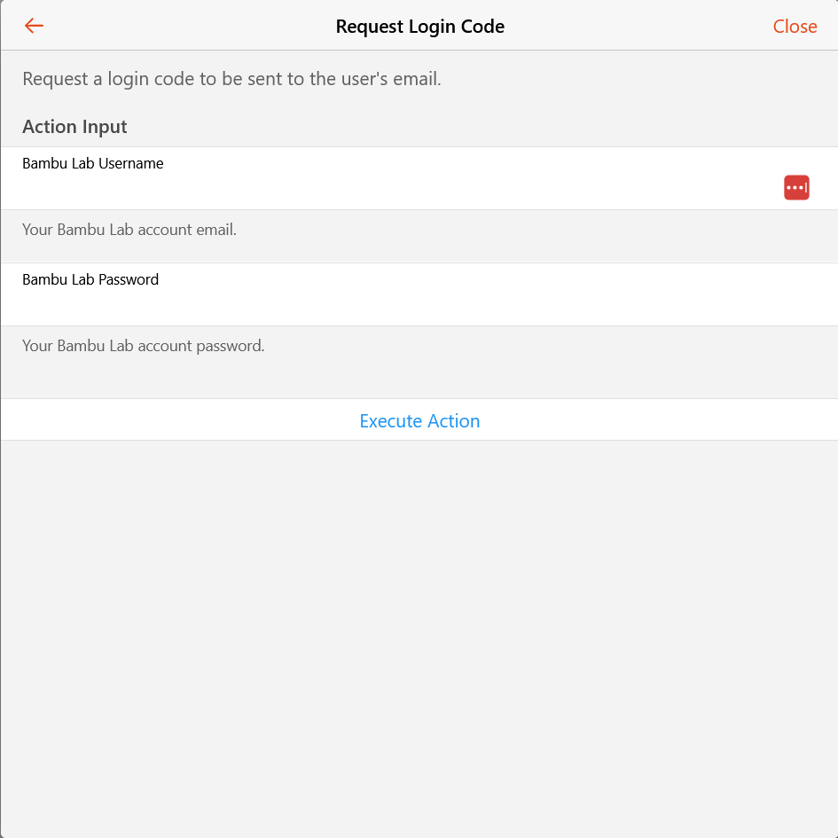
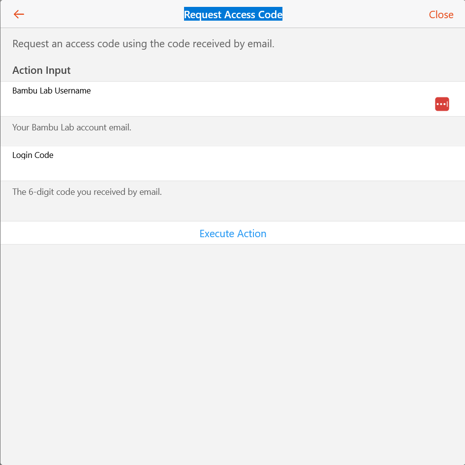

# BambuLab Binding

This addon supports connecting with BambuLab 3D printers in local mode.
While cloud mode is theoretically possible, it is not supported by the addon developers.

## Local Mode

1. **Find your printer credentials**
   On **Windows**, open the Bambu Studio configuration file:

   ```json
      "access_code": {
      "00ABCDEFG123456": "12345678"
   }
   ```

   Look for a section like:

   ```json
      "access_code": {
      "00ABCDEFG123456": "12345678"
   }
   ```

* `00ABCDEFG123456` → Serial number
* `12345678` → Access code

2. **Enter the details in openHAB**

   - **Serial number** → Enter the serial number from the config file
   - **Access code** → Enter the access code from the config file
   - **IP / Hostname** → Enter your printer’s network address
   - **Username** → `bblp`
   - **Series** → Select your printer model
   - **Other settings** → Leave defaults for now

## Cloud Mode

Cloud mode is possible but not officially supported by the addon developers.

To use cloud mode, follow these steps:

### Find Username

Log in to Maker World and visit [my-preferences](https://makerworld.com/api/v1/design-user-service/my/preference) to retrieve a JSON response containing your data.
The relevant field is `uid`, which represents the unique ID of your account.
Use this value as the `username` in the configuration (advanced field) with the prefix `u_`.

### Access Token

To obtain an access token, you can use the `requestLoginCode` and `requestAccessCode` actions available on the printer thing.

1.  **Request Login Code**: Use the `requestLoginCode` action with your Bambu Lab username (email) and password. This will send a 6-digit verification code to your email address.
    
2.  **Request Access Code**: Once you receive the verification code, use the `requestAccessCode` action with your Bambu Lab username (email) and the received 6-digit code. This will retrieve the access token and automatically update the printer thing's configuration with the new `accessCode` and set the `hostname` to `us.mqtt.bambulab.com`.
    

Alternatively, you can use the `bambu.sh` script as described below:

To obtain an access token, you can use the provided `bambu.sh` script. This script simplifies the process of logging in and retrieving your access token.

Make the script executable:
```shell
chmod +x bambu.sh
```

Then, run the script and follow the prompts:
```shell
./bambu.sh
```
The script will ask for your email, password, and the verification code sent to your email.

Alternatively, you can provide your credentials as command-line arguments:
```shell
./bambu.sh -e "you@email.io" -p "superduperpassword123"
```

The script will output your access token, which you can then use as the `accessCode` parameter in your thing configuration.

For more options, like quiet mode for automation, use the help flag:
```shell
./bambu.sh --help
```

**Note:** This access code expires after three months. When it expires, repeat the process to obtain a new one.

### Hostname

Use `us.mqtt.bambulab.com` as the hostname.

## Supported Things

- `printer`: Represents a BambuLab 3D printer.

## Thing Configuration

| Parameter           | Group  | Type    | Required | Description                                                                                                                                                                                                                                     |
|---------------------|--------|---------|----------|-------------------------------------------------------------------------------------------------------------------------------------------------------------------------------------------------------------------------------------------------|
| `series`            | N/A    | Text    | Yes      | `A`, `P` or `X` depending on your printer series.                                                                                                                                                                                               |
| `serial`            | N/A    | Text    | Yes      | Unique serial number of the printer.                                                                                                                                                                                                            |
| `hostname`          | N/A    | Text    | Yes      | IP address of the printer or `us.mqtt.bambulab.com` for cloud mode.                                                                                                                                                                             |
| `accessCode`        | N/A    | Text    | Yes      | Access code for the printer. The method of obtaining this varies between local and cloud modes.                                                                                                                                                 |
| `username`          | N/A    | Text    | No       | `bblp` for local mode or your Bambu Lab user (starting with `u_`). (Advanced)                                                                                                                                                                   |
| `reconnectTime`     | MQTT   | Integer | No       | Time in seconds to wait before reconnect. (Advanced)                                                                                                                                                                                            |
| `reconnectMax`      | MQTT   | Integer | No       | Max times to try reconnections. (Advanced)                                                                                                                                                                                                      |
| `scheme`            | MQTT   | Text    | No       | URI scheme. (Advanced)                                                                                                                                                                                                                          |
| `port`              | MQTT   | Integer | No       | URI port. (Advanced)                                                                                                                                                                                                                            |
| `cameraPort`        | Camera | Integer | No       | Camera server port. (Advanced)                                                                                                                                                                                                                  |
| `cameraCertificate` | Camera | Text    | No       | To disable the use of your own certificate, enter <b>none</b>. If providing your own certificate, ensure it includes the header <i>-----BEGIN CERTIFICATE-----</i> at the beginning and <i>-----END CERTIFICATE-----</i> at the end. (Advanced) |

## Channels

| Channel ID                   | Type                | Description                                                                                                                        |
|------------------------------|---------------------|------------------------------------------------------------------------------------------------------------------------------------|
| `command`                    | String RW Channel   | Send yor commands to this channel so they will be send to the printer. Check `Actions` > `sendCommand` for detailed documentation. |
| `nozzle-temperature`         | Temperature Channel | Current temperature of the nozzle.                                                                                                 |
| `nozzle-target-temperature`  | Temperature Channel | Target temperature of the nozzle.                                                                                                  |
| `bed-temperature`            | Temperature Channel | Current temperature of the heated bed.                                                                                             |
| `bed-target-temperature`     | Temperature Channel | Target temperature of the heated bed.                                                                                              |
| `chamber-temperature`        | Temperature Channel | Current temperature inside the printer chamber.                                                                                    |
| `mc-print-stage`             | String Channel      | Current stage of the print process.                                                                                                |
| `mc-percent`                 | Percent Channel     | Percentage of the print completed.                                                                                                 |
| `mc-remaining-time`          | Number Channel      | Estimated time remaining for the print (in seconds).                                                                               |
| `wifi-signal`                | WiFi Channel        | Current WiFi signal strength.                                                                                                      |
| `bed-type`                   | String Channel      | Type of the printer's heated bed.                                                                                                  |
| `gcode-file`                 | String Channel      | Name of the currently loaded G-code file.                                                                                          |
| `gcode-state`                | String Channel      | Current state of the G-code execution.                                                                                             |
| `reason`                     | String Channel      | Reason for pausing or stopping the print.                                                                                          |
| `result`                     | String Channel      | Final result or status of the print job.                                                                                           |
| `gcode-file-prepare-percent` | Percent Channel     | Percentage of G-code file preparation completed.                                                                                   |
| `big-fan1-speed`             | Number Channel      | Speed of the first large cooling fan (RPM).                                                                                        |
| `big-fan2-speed`             | Number Channel      | Speed of the second large cooling fan (RPM).                                                                                       |
| `heat-break-fan-speed`       | Number Channel      | Speed of the heat break cooling fan (RPM).                                                                                         |
| `layer-num`                  | Number Channel      | Current layer being printed.                                                                                                       |
| `speed-level`                | Number Channel      | Current speed setting of the print job.                                                                                            |
| `time-laps`                  | Boolean Channel     | Indicates whether time-lapse recording is enabled.                                                                                 |
| `use-ams`                    | Boolean Channel     | Indicates whether the Automatic Material System (AMS) is active.                                                                   |
| `vibration-calibration`      | Boolean Channel     | Indicates whether vibration calibration has been performed.                                                                        |
| `led-chamber`                | On/Off Command      | Controls the LED lighting inside the printer chamber.                                                                              |
| `led-work`                   | On/Off Command      | Controls the LED lighting for the work area.                                                                                       |
| `camera-record`              | Boolean RW Command  | Turns on/off OpenHAB's capability of recording.                                                                                    |
| `camera-image`               | Image               | Current image from the printer's camera.                                                                                           |

## Full Example

### `bambulab.things` Example

```java
Thing bambulab:printer:myprinter "My BambuLab Printer" @ "3D Printing Area" [
    serial="ABC123456789",
    hostname="192.168.1.100",
    accessCode="your_access_code_here"
]
```

### `bambulab.items` Example

```java
Number:Temperature NozzleTemperature "Nozzle Temperature [%.1f °C]" { channel="bambulab:printer:myprinter:nozzle-temperature" }
Number:Temperature BedTemperature "Bed Temperature [%.1f °C]" { channel="bambulab:printer:myprinter:bed-temperature" }
String PrintStage "Print Stage [%s]" { channel="bambulab:printer:myprinter:mc-print-stage" }
Switch LedChamber "Chamber LED" { channel="bambulab:printer:myprinter:led-chamber" }
```

## Actions

The printer thing supports actions:

```java
rule "test"
when
        /* when */
then
val actions = getActions("bambulab", "bambulab:printer:as8af03m38")
    if(actions !==null){
        // Refresh all channels
        actions.refreshChannels()
        actions.sendCommand("Pushing:1:1")
    }
end
```

### `refreshChannels`

Reports the complete status of the printer.
This is unnecessary for the X1 series since it already transmits the full object each time.
However, the P1 series only sends the values that have been updated compared to the previous report.
As a rule of thumb, refrain from executing this command at intervals less than 5 minutes on the P1P, as it may cause lag due to its hardware limitations.

### `sendCommand`

The `sendCommand` method expects a string command in the format:

```text
CommandType:Parameter1:Parameter2:...
```

#### Possible Commands

| Command Type         | Parameters                                                                                                                               | Description                                                                                       |
|----------------------|------------------------------------------------------------------------------------------------------------------------------------------|---------------------------------------------------------------------------------------------------|
| `Pushing`            | `version(int)`,`pushTarget(int)` (optional)                                                                                              | Sends a push command.                                                                             |
| `Print`              | `START` / `STOP` / `PAUSE`                                                                                                               | Controls the print job.                                                                           |
| `ChangeFilament`     | `target(int)`,`currentTemperature(int))`,`targetTemperature(int)`                                                                        | Changes filament using AMS.                                                                       |
| `AmsUserSetting`     | `amsId(int)`,`startupReadOption(boolean)`,`trayReadOption(boolean)`                                                                      | Sets AMS user settings.                                                                           |
| `AmsFilamentSetting` | `amsId(int)`,`trayId(int)`,`trayInfoIdx(string)`,`trayColor(string)`,`nozzleTempMin(int)`,`nozzleTempMax(int)`,`trayType(string)`        | Configures filament settings.                                                                     |
| `AmsControl`         | `RESUME` / `RESET` / `PAUSE`                                                                                                             | Sends an AMS control command.                                                                     |
| `PrintSpeed`         | `SILENT` / `STANDARD` / `SPORT` / `LUDICROUS`                                                                                            | Adjusts print speed.                                                                              |
| `GCodeFile`          | `filename(string)`                                                                                                                       | Loads a G-code file.                                                                              |
| `GCodeLine`          | `userId(string)\nlines(string...)`                                                                                                       | Sends multiple G-code lines. Lines are enter (`\n`) separated                                     |
| `LedControl`         | (`CHAMBER_LIGHT` / `WORK_LIGHT`),(`ON` / `OFF` / `FLASHING`),`ledOnTime(int)?`,`ledOffTime(int)?`,`loopTimes(int)?`,`intervalTime(int)?` | Controls LED lighting.                                                                            |
| `System`             | `GET_ACCESS_CODE`                                                                                                                        | Executes a system command.                                                                        |
| `IpCamRecord`        | `enable(boolean)`                                                                                                                        | Starts or stops IP camera recording.                                                              |
| `Info`               | `GET_VERSION`                                                                                                                            | Sends a info command.                                                                             |
| `IpCamTimelaps`      | `enable(boolean)`                                                                                                                        | Enables or disables timelapse recording.                                                          |
| `XCamControl`        | (`FIRST_LAYER_INSPECTOR` / `SPAGHETTI_DETECTOR`),`control(boolean)`,`printHalt(boolean)`                                                 | Controls XCam settings.                                                                           |
| `Raw`                | `topic`,`raw-message`                                                                                                                    | Allows to send raw message to MQTT. Please add `%sequence_id%` in your message to put current ID. |
