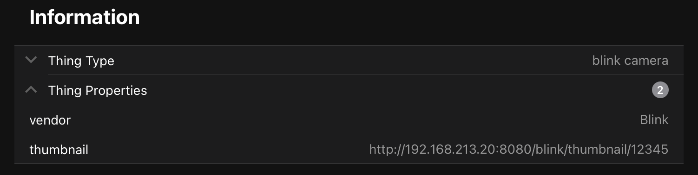

# blink Binding

With this binding, you can use blink security cameras in OpenHAB.

Communication with the cameras is done using the blink API, as used by the official blink app.

Since the API can only be used for polling information, status information from the server is not received in real time.
A refresh interval can be set to poll the server for device information.

## Supported Things

- blink Account
- blink Network (Sync Module)
- blink Camera

## Discovery

In order to discover cameras, a blink account bridge has to be configured. After configuration, all available cameras
and networks will show up in auto-discovery. This is the only way to retrieve the correct IDs for both networks and
cameras.

## Thing Configuration

### blink Account (bridge)

The blink account is used to authenticate against the API. blink does not support OAuth or any other authorization
protocol, so the credentials have to be provided in the bridge configuration.

Configuration parameters are:

| Parameter         | Description                                    |
| ---------         | ---------------------------------------------- |
| email             | E-Mail address which is used in the blink app. |
| password          | Password which is used in the blink app.       |
| refreshInterval   | Refresh interval for camera and network status. This should be used with caution, since there is the possibility that blink might enforce a lockout if the server gets hit too often. The official app polls every 30 seconds, so this should be considered the lowest value. |

blink has implemented a 2-factor-authentication, so after the first login, a email or text message (as configured in
your app settings) will be sent to you. This pin code needs to be entered into a form generated for each blink account
bridge.

The URL for pin verification is `<youropenhaburl>/blink/<accountUID>`. The easiest way to get this, is to copy the
validationURL thing property:

### blink Camera

One single blink camera, belonging to a blink network (see below).

Configuration parameters should be set by auto-discovery after configuration of an account exclusively (i.e. no manual
setup). For completeness, the configuration parameters set by auto-discovery are:

| Parameter         | Description                       |
| ---------         | ----------------------------------|
| networkId         | Internal blink network ID         |
| cameraId          | Internal blink camera ID          |

Besides the channels, the current thumbnail is also provided by a servlet. The url is set in the thing properties.

### blink Network

A blink network basically corresponds to the blink sync modules and groups cameras. A blink network can be armed,
activating all cameras which have motion detection enabled. Cameras with motion detection in a disarmed network won't
trigger alerts.

Configuration parameters should be set by auto-discovery after configuration of an account exclusively (i.e. no manual
setup). For completeness, the configuration parameters set by auto-discovery are:

| Parameter         | Description                       |
| ---------         | ----------------------------------|
| networkId         | Internal blink network ID         |

## Channels

### blink Camera

| channel  | type   | description                  |
|----------|--------|------------------------------|
| motiondetection  | Switch | Enables/disables motion detection for this camera.  |
| battery | LowBattery | Read-only channel, triggering ON when battery status is low |
| temperature | Number | Read-only channel, outputting camera temperature |
| setThumbnail | Switch | Write-only channel, triggering taking a new snapshot as thumbnail. Also triggers a new getThumbnail state on completion. |
| getThumbnail | Image | Read-only channel, returns the current thumbnail. Triggers a state change on new thumbnail.  |
| motionTriggered | Trigger | Triggered when motion event is detected during account refresh. Therefore, this is linked to the refresh interval of the account and will not be in real-time.|

### blink Network

| channel  | type   | description                  |
|----------|--------|------------------------------|
| armed  | Switch | Arms/disarms the network. Overrides schedules which are set in the app.  |