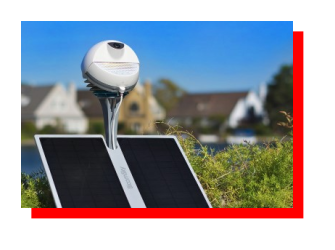
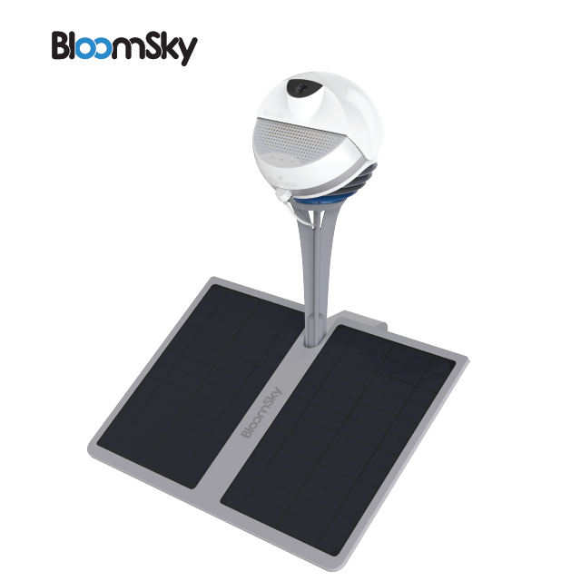
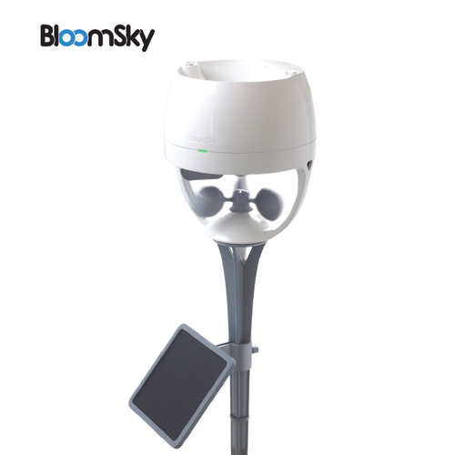

# BloomSky Binding



This is a "read-only" binding that uses the [BloomSky API](http://weatherlution.com/bloomsky-api/?doing_wp_cron=1615241711.4678061008453369140625) to retrieve the sensor data from the **SKY1, SKY2** and **STORM** personal weather stations.

For those not familiar with these weather stations, you can find out more at the [BloomSky Home Page](https://www.bloomsky.com/).

If you already have this weather station, you will need to obtain an API authorization key at the [BloomSky Device Owners Portal](https://dashboard.bloomsky.com/) using the [Developers Link](https://dashboard.bloomsky.com/user#api) found on the left side of the screen after you log in.

 This binding's refresh rate cannot be set for less than 5 minutes (300 seconds); BloomSky posts updates every 5 minutes (this is not configurable and a drawback if you want real-time updates). 

The [API Documentation](./doc/v1.6BloomskyDeviceOwnerAPIDocumentationforBusinessOwners.pdf) is bare-bones; it was last updated in 2017 along with the addition of the STORM weather station.  

While the WeatherUnderground/WeatherCompany does have an integration with personal weather stations including BloomSky, it is limited in the observations it provides and does not provide a way to retrieve the images or videos that are captured by the BloomSky weather station.  


## Supported Things

The following thing types are supported:

| Thing | ID | Description |
| --- | --- | --- |
| | bridge | Represents the connection to the owners BloomSky device account through the API key for accessing the weather station details and sensor readings |
|  | sky | Provides station details for a specific location, weather sensor data and camera images captured for the most recent 5-minute interval by the _SKY1 or SKY2_ weather station:  <br> &#9726; City, Street Name <br> &#9726; Device Id, Name <br> &#9726; Latitude, Longitude, Altitude <br> &#9726; Number of Followers <br> &#9726; UTC, Daylight Savings Time <br> &#9726; Device Type (SKY1 or SKY2)  <br> &#9726; Temperature, Humidity, Barometric Pressure  <br> &#9726; UV Index, Luminance <br> &#9726; Battery Voltage, Rain, Night Indicator <br> &#9726; Image - URL & Time Stamp <br> &#9726; Video List Fahrenheit, Celsius   |
| | storm | Provides weather sensor data captured for the most recent 5-minute interval by the _STORM_ weather station: <br> &#9726; UV Index <br> &#9726; Wind Speed, Direction, Gust <br> &#9726; Rain Rate, Daily & Rolling 24-Hour Accumulation |

&#9888; **Note:** BloomSky _Indoor_ devices were discontinued in October-2015; they are not supported by this binding.  

## Discovery

Once a Bridge thing is configured with a valid API key, the binding will auto-discover the _SKY1/SKY2_ and optionally (if you have one installed), a _STORM_ weather station thing associated with that account.  

The binding will use the openHAB locale setting to determine if readings are to be returned in imperial or metric units.

If the system location (locale) is changed, the background discovery updates the configuration of the device sensor data automatically.

If a bridge is correctly configured, the discovered thing will automatically go online.

## Binding Configuration

The binding has no configuration options, all configuration is done at Thing and Channel levels.

## Thing Configuration

The **bridge** thing has three (3) configuration parameters:

| Parameter | Parameter ID | Required/Optional |Description |
| :---      | :---         | ---               | ---        |
| API Key | apiKey | Required | API key to access the BloomSky personal weather station API service.  Obtain this key from the BloomSky Device Owners page. |
| Refresh Interval | refreshInterval | Required | Default (minimumn) value is 5 minutes. This is based on the API which updates on 5 minute intervals. |
| Measurement Display Units | units | Required | Observations can be displayed in either Imperial (US) or Metric (SI) units.  Default is set to system locale. |  

The **sky** and **storm** things do not have configuration parameters, they will refresh and display units based on the bridge configuration.

The refresh request for either the sky or storm things will also pull its associated device's information/observations.

## Channels

### Bridge (Account) Channels

The bridge does not have any channels.

### SKY Channels 

**SKY Device Information Group Channels**

| Channel Type ID   | Item Type | Description                                                        | Read Write |
|:------------------|:----------|:-------------------------------------------------------------------|:----------:|
| alt               | Number    | Weather station altitude in decimal format                         | R          |
| boundedPoint      | String    | Indoor device setting (Obsolete)                                   | R          |
| cityName          | String    | Weather observation city location                                  | R          |
| deviceID          | String    | SKY Device unique identifier                                       | R          |
| dst               | Number    | Daylight savings time on (1) or off (0)                            | R          |
| fullAddress       | String    | Weather observation full address                                   | R          |
| lat               | Number    | Weather station latitude in decimal format                         | R          |
| location          | Location  | Device location in lat.,lon.,height coordinates.  | R          |
| lon               | Number    | Weather station longitude in decimal format                        | R          |
| numOfFollowers    | Number    | Number of followers this PWS has as a favorite                     | R          |
| previewImageList  | String    | Array list - URLs to last 5 image snapshots for timelapse video    | R          |
| searchable        | String    | Public can find this weather station on Bloomsky map               | R          |
| streetName        | String    | Weather observation street name                                    | R          |
| videoList         | String    | Array list - URLs to last 5 days mp4 timelapse's in Fahrenheit     | R          |
| videoListC        | String    | Array list - URLs to last 5 days mp4 timelapse's in Celsius        | R          |
| utc               | Number    | Weather observation UTC offset                                     | R          |

**SKY Device Weather Observations Group Channels**

| Channel Type ID   | Item Type | Description                                                        | Read Write |
|:------------------|:----------|:-------------------------------------------------------------------|:----------:|
| currentSkyImage   | Image     | Snapshot image from the Sky camera taken at Image timestamp        | R          |
| deviceType        | String    | Device type (model) SKY1 or SKY2                                   | R          |
| dewPoint          | Number:Temperature    | Dew Point in Fahrenheit or Celsius                                 | R          |
| heatIndex         | Number:Temperature    | Heat Index in Fahrenheit or Celsius                                | R          |
| humidity          | Number:Dimensionless    | Atmospheric humidity in percent.          | R          |
| imageTS           | DateTime  | Current image time stamp in epoch format (Unix time stamp)         | R          |
| imageURL          | String    | URL to jpg snapshot image from Sky camera taken at Image timestamp | R          |
| luminance         | Number:Illuminance    | Luminance (brightness) given in candelas per square meter cd/m2    | R          |
| night             | String    | Night detected after sunset/before sunrise                         | R          |
| pressure          | Number:Pressure    | Barometric pressure inHG or mbar                                   | R          |
| rain              | String    | Rain detected true or false (is it raining)                        | R          |
| skyUVIndex        | Number    | UV index                                                           | R          |
| temperature       | Number:Temperature    | Outside temperature in Fahrenheit or Celsius                       | R          |
| tS                | DateTime  | Observation time stamp in epoch format (Unix time stamp)           | R          |
| batteryLevel           | Number    | Battery voltage to indicate charge level 100% = 2600+ mv           | R          |

**SKY Video List F&#176; Group Channels**

| Channel Type ID | Item Type | Description                                                              | Read Write |
|:----------------|:----------|:-------------------------------------------------------------------------|:----------:|
| videoDay1       | String    | Day long time-lapse mp4 video URL from yesterday (today - 1 day) F&#176; | R          |
| videoDay2       | String    | Day long time-lapse mp4 video URL from (today - 2 days) F&#176;          | R          |
| videoDay3       | String    | Day long time-lapse mp4 video URL from (today - 3 days) F&#176;          | R          |
| videoDay4       | String    | Day long time-lapse mp4 video URL from (today - 4 days) F&#176;          | R          |
| videoDay5       | String    | Day long time-lapse mp4 video URL from (today - 5 days) F&#176;          | R          |

**SKY Video List C&#176; Group Channels**

| Channel Type ID | Item Type | Description                                                              | Read Write |
|:----------------|:----------|:-------------------------------------------------------------------------|:----------:|
| videoCDay1      | String    | Day long time-lapse mp4 video URL from yesterday (today - 1 day) C&#176; | R          |
| videoCDay2      | String    | Day long time-lapse mp4 video URL from (today - 2 days) C&#176;          | R          |
| videoCDay3      | String    | Day long time-lapse mp4 video URL from (today - 3 days) C&#176;          | R          |
| videoCDay4      | String    | Day long time-lapse mp4 video URL from (today - 4 days) C&#176;          | R          |
| videoCDay5      | String    | Day long time-lapse mp4 video URL from (today - 5 days) C&#176;          | R          |

**SKY Video Preview Image List Group Channels**

| Channel Type ID | Item Type | Description                                                              | Read Write |
|:----------------|:----------|:-------------------------------------------------------------------------|:----------:|
| previewImage1   | Image     | Time lapse video preview image snapshot from yesterday (today - 1 day)   | R          |
| previewImage2   | Image     | Time lapse video preview image snapshot from (today - 2 days)            | R          |
| previewImage3   | Image     | Time lapse video preview image snapshot from (today - 3 days)            | R          |
| previewImage4   | Image     | Time lapse video preview image snapshot from (today - 4 days)            | R          |
| previewImage5   | Image     | Time lapse video preview image snapshot from (today - 5 days)            | R          |

### STORM Channels 

**STORM Weather Observation Group Channels**

| Channel Type ID    | Item Type | Description                                                        | Read Write |
|:-------------------|:----------|:-------------------------------------------------------------------|:----------:|
| rain24h            | Number:Length    | Precipitation last last 24 hours                                   | R          |
| rainDaily          | Number:Lenght    | Precipitation total current day                                    | R          |
| rainRate           | String    | Precipitation rate                                                 | R          |
| stormTimeStamp     | DateTime  | Storm update - date and time when observations were last updated   | R          |
| stormUVIndex       | Number    | UV index (overrides the SKY value)                                 | R          |
| sustainedWindSpeed | Number:Speed    | Sustained Wind Speed                                               | R          |
| windChill          | Number:Temperature    | Wind chill in Fahrenheit or Celsius                                | R          |
| windDirectionCompass      | String    | Wind direction as compass point (N, NE, E, SE...)                                                    | R          |
| windDirectionAngle      | Number:Angle    | Wind direction in degrees (0-360°).)                                                    | R          |

| windGust           | Number:Speed    | Wind Gust                                                          | R          |

## Full Example

### bloomsky.things

You can use the discovery functionality of the binding to obtain the deviceId and values for defining Nest things in files.

```
    // Use OH 3 to add BloomSky bridge and weather station things.  The BloomSky API stores the device id's 
    // and is the best way to know what the Storm device unique ID is.  The binding will also autodiscover the 
    // weather stations and allow you to add them, especially if you have more than one weather station.
    // Use the code below as a last resort, substitute the appropriate values in the item described
    // in the brackets < > (remove the brackets around those values). 

    Bridge bloomsky:bridge-api:<ID_from_bingding> "BloomSky Bridge" [ apikey="xxxxxxxxxxxxxxxxxxxxxxx", refreshInterval=5, units="Imperial" ] {
        Thing bloomsky:sky:<id from binding>:<device_id_from_device_discovery> "<your location name here (SKY at [your full address])>" 
        Thing bloomsky:storm:<id from binding>:<device_id_from_device_discovery> "<your location name here (STORM at [your full address]>" 
    }
	
```

### bloomsky.items

```
    // SKY Weather Station Items
    Number                  SKY1_Utc                              "Universal time coordinated offset"         <time>               {channel="bloomsky:sky:23464ce621:94A1A2733046:sky-device-information#utc"}
    String                  SKY1_CityName                         "Observation location city"                                      {channel="bloomsky:sky:23464ce621:94A1A2733046:sky-device-information#cityName"}
    String                  SKY1_Searchable                       "Pws is visible to public"                                       {channel="bloomsky:sky:23464ce621:94A1A2733046:sky-device-information#searchable"}
    String                  SKY1_DeviceName                       "Device name"                                                    {channel="bloomsky:sky:23464ce621:94A1A2733046:sky-device-information#deviceName"}
    DateTime                SKY1_RegisterTime                     "Device registration time stamp"            <time>               {channel="bloomsky:sky:23464ce621:94A1A2733046:sky-device-information#registerTime"}
    Number                  SKY1_Dst                              "Daylight savings time"                     <time>               {channel="bloomsky:sky:23464ce621:94A1A2733046:sky-device-information#dst"}
    String                  SKY1_BoundedPoint                     "Bounded point (obsolete)"                                       {channel="bloomsky:sky:23464ce621:94A1A2733046:sky-device-information#boundedPoint"}
    Number                  SKY1_Lon                              "Longitude"                                                      {channel="bloomsky:sky:23464ce621:94A1A2733046:sky-device-information#lon"}
    Location                SKY1_Location                         "Device location latitude, longitude"                            {channel="bloomsky:sky:23464ce621:94A1A2733046:sky-device-information#location"}
    String                  SKY1_VideoList                        "Video list (fahrenheit)"                   <camera>             {channel="bloomsky:sky:23464ce621:94A1A2733046:sky-device-information#videoList"}
    String                  SKY1_VideoListC                       "Video list (celsius)"                      <camera>             {channel="bloomsky:sky:23464ce621:94A1A2733046:sky-device-information#videoListC"}
    String                  SKY1_DeviceID                         "Device"                                                         {channel="bloomsky:sky:23464ce621:94A1A2733046:sky-device-information#deviceID"}
    Number                  SKY1_NumOfFollowers                   "Number of followers"                                            {channel="bloomsky:sky:23464ce621:94A1A2733046:sky-device-information#numOfFollowers"}
    Number                  SKY1_Lat                              "Latitude"                                                       {channel="bloomsky:sky:23464ce621:94A1A2733046:sky-device-information#lat"}
    Number                  SKY1_Alt                              "Altitude"                                                       {channel="bloomsky:sky:23464ce621:94A1A2733046:sky-device-information#alt"}
    String                  SKY1_FullAddress                      "Observation location address"                                   {channel="bloomsky:sky:23464ce621:94A1A2733046:sky-device-information#fullAddress"}
    String                  SKY1_StreetName                       "Observation location street"                                    {channel="bloomsky:sky:23464ce621:94A1A2733046:sky-device-information#streetName"}
    String                  SKY1_PreviewImageList                 "Preview image snapshots"                                        {channel="bloomsky:sky:23464ce621:94A1A2733046:sky-device-information#previewImageList"}
    Number:Illuminance      SKY1_Luminance                        "Luminance"                                 <lightbulb>          {channel="bloomsky:sky:23464ce621:94A1A2733046:sky-observations#luminance"}
    Number:Temperature      SKY1_Temperature                      "Outside temperature"                       <temperature>        {channel="bloomsky:sky:23464ce621:94A1A2733046:sky-observations#temperature"}
    Number:Temperature      SKY1_DewPoint                         "Dew point"                                 <temperature>        {channel="bloomsky:sky:23464ce621:94A1A2733046:sky-observations#dewPoint"}
    Number:Temperature      SKY1_HeatIndex                        "Heat index"                                <temperature_hot>    {channel="bloomsky:sky:23464ce621:94A1A2733046:sky-observations#heatIndex"}
    String                  SKY1_ImageURL                         "Current sky image url"                     <camera>             {channel="bloomsky:sky:23464ce621:94A1A2733046:sky-observations#imageURL"}
    Image                   SKY1_CurrentSkyImage                  "Current sky image"                         <camera>             {channel="bloomsky:sky:23464ce621:94A1A2733046:sky-observations#currentSkyImage"}
    DateTime                SKY1_TS                               "Observation time stamp"                    <time>               {channel="bloomsky:sky:23464ce621:94A1A2733046:sky-observations#tS"}
    String                  SKY1_Rain                             "Rain detected"                             <rain>               {channel="bloomsky:sky:23464ce621:94A1A2733046:sky-observations#rain"}
    Number:Dimensionless    SKY1_Humidity                         "Relative humidity"                         <humidity>           {channel="bloomsky:sky:23464ce621:94A1A2733046:sky-observations#humidity"}
    Number:Pressure         SKY1_Pressure                         "Barometric pressure"                       <pressure>           {channel="bloomsky:sky:23464ce621:94A1A2733046:sky-observations#pressure"}
    String                  SKY1_DeviceType                       "Sky device model"                                               {channel="bloomsky:sky:23464ce621:94A1A2733046:sky-observations#deviceType"}
    Number                  SKY1_Voltage                          "Battery level (voltage)"                   <batterylevel>       {channel="bloomsky:sky:23464ce621:94A1A2733046:sky-observations#voltage"}
    String                  SKY1_Night                            "Night detected"                            <moon>               {channel="bloomsky:sky:23464ce621:94A1A2733046:sky-observations#night"}
    String                  SKY1_SkyUVIndex                       "Uv index"                                  <sun>                {channel="bloomsky:sky:23464ce621:94A1A2733046:sky-observations#skyUVIndex"}
    DateTime                SKY1_ImageTS                          "Current image time stamp"                  <time>               {channel="bloomsky:sky:23464ce621:94A1A2733046:sky-observations#imageTS"}
    String                  SKY1_VideoListVideoDay1               "24hr time lapse video 1"                   <camera>             {channel="bloomsky:sky:23464ce621:94A1A2733046:sky-video-list#videoDay1"}
    String                  SKY1_VideoListVideoDay2               "24hr time lapse video 2"                   <camera>             {channel="bloomsky:sky:23464ce621:94A1A2733046:sky-video-list#videoDay2"}
    String                  SKY1_VideoListVideoDay3               "24hr time lapse video 3"                   <camera>             {channel="bloomsky:sky:23464ce621:94A1A2733046:sky-video-list#videoDay3"}
    String                  SKY1_VideoListVideoDay4               "24hr time lapse video 4"                   <camera>             {channel="bloomsky:sky:23464ce621:94A1A2733046:sky-video-list#videoDay4"}
    String                  SKY1_VideoListVideoDay5               "24hr time lapse video 5"                   <camera>             {channel="bloomsky:sky:23464ce621:94A1A2733046:sky-video-list#videoDay5"}
    String                  SKY1_VideoListCVideoCDay1             "24hr time lapse video celsius 1"           <camera>             {channel="bloomsky:sky:23464ce621:94A1A2733046:sky-video-list-c#videoCDay1"}
    String                  SKY1_VideoListCVideoCDay2             "24hr time lapse video celsius 2"           <camera>             {channel="bloomsky:sky:23464ce621:94A1A2733046:sky-video-list-c#videoCDay2"}
    String                  SKY1_VideoListCVideoCDay3             "24hr time lapse video celsius 3"           <camera>             {channel="bloomsky:sky:23464ce621:94A1A2733046:sky-video-list-c#videoCDay3"}
    String                  SKY1_VideoListCVideoCDay4             "24hr time lapse video celsius 4"           <camera>             {channel="bloomsky:sky:23464ce621:94A1A2733046:sky-video-list-c#videoCDay4"}
    String                  SKY1_VideoListCVideoCDay5             "24hr time lapse video celsius 5"           <camera>             {channel="bloomsky:sky:23464ce621:94A1A2733046:sky-video-list-c#videoCDay5"}
    Image                   SKY1_PreviewImageListPreviewImage1    "Video preview image 1"                     <camera>             {channel="bloomsky:sky:23464ce621:94A1A2733046:sky-preview-image-list#previewImage1"}
    Image                   SKY1_PreviewImageListPreviewImage2    "Video preview image 2"                     <camera>             {channel="bloomsky:sky:23464ce621:94A1A2733046:sky-preview-image-list#previewImage2"}
    Image                   SKY1_PreviewImageListPreviewImage3    "Video preview image 3"                     <camera>             {channel="bloomsky:sky:23464ce621:94A1A2733046:sky-preview-image-list#previewImage3"}
    Image                   SKY1_PreviewImageListPreviewImage4    "Video preview image 4"                     <camera>             {channel="bloomsky:sky:23464ce621:94A1A2733046:sky-preview-image-list#previewImage4"}
    Image                   SKY1_PreviewImageListPreviewImage5    "Video preview image 5"                     <camera>             {channel="bloomsky:sky:23464ce621:94A1A2733046:sky-preview-image-list#previewImage5"}
    // STORM Weather Station Items
    String                  STORM_StormUVIndex                    "Uv index"                                  <sun>                {channel="bloomsky:storm:23464ce621:94A1A2733046:storm-observations#stormUVIndex"}
    String                  STORM_WindDirection                   "Wind direction"                            <wind>               {channel="bloomsky:storm:23464ce621:94A1A2733046:storm-observations#windDirection"}
    Number:Length           STORM_RainDaily                       "Precipitation total past 24h [%.2f in]"    <rain>               {channel="bloomsky:storm:23464ce621:94A1A2733046:storm-observations#rainDaily"}
    Number:Speed            STORM_WindGust                        "Wind gust"                                 <wind>               {channel="bloomsky:storm:23464ce621:94A1A2733046:storm-observations#windGust"}
    Number:Temperature      STORM_WindChill                       "Wind chill"                                <temerature_cold>    {channel="bloomsky:storm:23464ce621:94A1A2733046:storm-observations#windChill"}
    Number:Speed            STORM_SustainedWindSpeed              "Sustained wind speed"                      <wind>               {channel="bloomsky:storm:23464ce621:94A1A2733046:storm-observations#sustainedWindSpeed"}
    String                  STORM_RainRate                        "Precipitation rate [%.2f in/hr]"           <rain>               {channel="bloomsky:storm:23464ce621:94A1A2733046:storm-observations#rainRate"}
    Number:Length           STORM_Rain24H                         "Precipitation 24h [%.2f in]"               <rain>               {channel="bloomsky:storm:23464ce621:94A1A2733046:storm-observations#rain24h"}
    DateTime                STORM_StormTimeStamp                  "Storm observation update time stamp"       <time>               {channel="bloomsky:storm:23464ce621:94A1A2733046:storm-observations#stormTimeStamp"}
```


### bloomsky.sitemap

```
    sitemap bloomsky label="OH3.1.0 BloomSky Binding Sitemap Example" 
    {
        Frame {
            Text label="Bloomsky Weather Station" {
                Frame label="Current Conditions" {
                    Default item=SKY1_Temperature label="Outside temperature"
                    Default item=SKY1_HeatIndex label="Heat index"
                    Default item=SKY1_Humidity label="Relative humidity"
                    Default item=SKY1_DewPoint label="Dew point"
                    Default item=SKY1_Pressure label="Barometric pressure"
                    Default item=STORM_StormUVIndex label="Uv index"
                    Default item=STORM_WindDirection label="Wind direction"
                    Default item=STORM_SustainedWindSpeed label="Sustained wind speed"
                    Default item=STORM_Rain24H label="Precipitation 24h"
                    Default item=STORM_RainDaily label="Precipitation total past day"
                }

                Frame label="Device Details" {
                    Default item=SKY1_DeviceName label="Name"
                    Default item=SKY1_DeviceID label="Unique ID"
                    Default item=SKY1_FullAddress label="Full address"
                    Default item=SKY1_Voltage label="Battery level (voltage)"
                }
            }
        }
}

```
