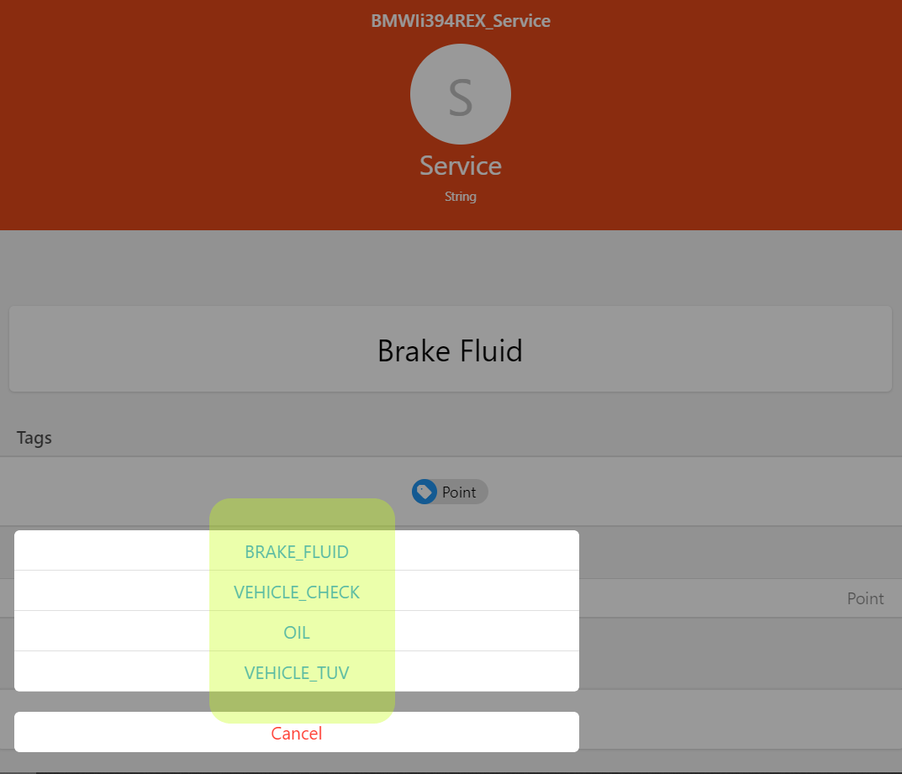

# BMW ConnectedDrive Binding


The binding provides a connection between [BMW's ConnectedDrive Portal](https://www.bmw-connecteddrive.com/country-region-select/country-region-selection.html) and openHAB.
All vehicles connected to an account will be detected by the discovery with the correct type 

* Conventional Fuel Vehicle
* Plugin-Hybrid Electrical Vehicle 
* Battery Electric Vehicle with Range Extender
* Battery Electric Vehicle 

In addition properties are attached with information and services provided by this vehicle.
The provided data depends on 

1. the [Thing Type](#things) and 
2. the [Properties](#properties) mentioned in Services

Different channel groups are clustering all informations.
Check for each group if it's supported for this Vehicle.

Please note **this isn't a real-time binding**. 
If a door is opened the state isn't transmitted and changed immediately. 
This isn't a flaw in the binding itself because the state in BMW's own ConnectedDrive App is also updated with some delay. 

## Supported Things

### Bridge

The bridge establishes the connection between BMW's ConnectedDrive Portal and openHAB.

| Name                       | Bridge Type ID | Description                                                |
|----------------------------|----------------|------------------------------------------------------------|
| BMW ConnectedDrive Account | account        | Access to BMW ConnectedDrive Portal for a specific user    |


### Things

Four different vehicle types are provided. 
They differ in the supported channel groups & channels. 
Conventional Fuel Vehicles have no _Charging Profile_, Electric Vehicles don't provide a _Fuel Range_. 
For hybrid vehicles in addition to _Fuel and Electric Range_ the _Hybrid Range_ is shown.
 
| Name                                | Thing Type ID | Supported Channel Groups                               |
|-------------------------------------|---------------|--------------------------------------------------------|
| BMW Electric Vehicle                | bev           | status, range, location, service, check, charge, image |
| BMW Electric Vehicle with REX       | bev_rex       | status, range, location, service, check, charge, image |
| BMW Plug-In-Hybrid Electric Vehicle | phev          | status, range, location, service, check, charge, image |
| BMW Conventional Vehicle            | conv          | status, range, location, service, check, image         |

 
#### Properties


For each vehicle properties are available. 
Basically 3 types of information are registered as properties

* Informations regarding your dealer with address and phone number
* Which services are available / not available
* Vehicle properties like color, model type, drive train and construction year

In the right picture can see in *Services Activated* e.g. the *DoorLock* and *DoorUnlock* services are mentioned. 
This ensures channel group [Remote Services](#remote-services) is supporting door lock and unlock remote control.

In  *Services Supported* the entry *LastDestination* is mentioned.
So it's valid to connect channel group [Last Destinations](#destinations) in order to display and select the last navigation destinations.

| Property Key       | Property Value      |  Supported Channel Groups    |
|--------------------|---------------------|------------------------------|
| servicesSupported  | Statistics          | last-trip, lifetime          |
| servicesSupported  | LastDestinations    | destinations                 |
| servicesActivated  | _list of services_  | remote                       |


## Discovery

Auto discovery is starting after the bridge towards BMW's ConnectedDrive is created. 
A list of your registered vehicles is queried and all found things are added in the inbox.
Unique identifier is the *Vehicle Identification Number* (VIN). 
If a thing is already declared in a  _.things_ configuration, discovery won't highlight it again.
Properties will be attached to predefined vehicles if the VIN is matching.

## Configuration

### Bridge Configuration

| Parameter       | Type    | Description                                                        |           
|-----------------|---------|--------------------------------------------------------------------|
| userName        | text    | BMW ConnectedDrive Username                                       |
| password        | text    | BMW ConnectedDrive Password                                       |
| region          | text    | Select region in order to connect to the appropriate BMW server.   |

The region Configuration has 3 different options

* _NORTH_AMERICA_
* _CHINA_
* _ROW_  (Rest of World)

### Thing Configuration

Same configuration is needed for all things

| Parameter       | Type    | Description                           |           
|-----------------|---------|---------------------------------------|
| vin             | text    | Vehicle Identification Number (VIN)   |
| refreshInterval | integer | Refresh Interval in Minutes           |
| units           | text    | Unit Selection. See below.            |
| imageSize       | integer | Image Size                            |
| imageViewport   | text    | Image Viewport                        |

The unit configuration has 3 options

* _AUTODETECT_ selects miles for US & UK, kilometer otherwise
* _METRIC_ selects directly kilometers
* _IMPERIAL_ selects directly miles

The _imageVieport_ allows to show the vehicle from different angels.
Possible options are 

* _FRONT_
* _REAR_
* _SIDE_
* _DASHBOARD_
* _DRIVERDOOR_

## Channels

There are many channels available for each vehicle. 
For better overview they are clustered in different channel groups.
They differ for each vehicle type, build-in sensors and activated services.


### Thing Channel Groups 

#### Vehicle Status

Reflects overall status of the vehicle.

* Channel Group ID is **status**
* Available for all vehicles
* Read-only values

| Channel Label             | Channel ID          | Type          | Description                                    |
|---------------------------|---------------------|---------------|------------------------------------------------|
| Overall Door Status       | doors               | String        | Combined status for all doors                  |
| Overall Window Status     | windows             | String        | Combined status for all windows                |
| Doors Locked              | lock                | String        | Status if doors are locked or unlocked         |
| Next Service Date         | service-date        | DateTime      | Date of upcoming service                       |
| Mileage till Next Service | service-mileage     | Number:Length | Mileage till upcoming service                  |
| Check Control             | check-control       | String        | Presence of active warning messages            |
| Charging Status           | charge              | String        | Only available for phev, bev_rex and bev       |
| Last Status Timestamp     | last-update         | DateTime      | Date and time of last status update            |

Overall Door Status values

* _Closed_ - all doors closed
* _Open_ - at least one door is open
* _Undef_ - no door data delivered at all

Overall Windows Status values

* _Closed_ - all windows closed
* _Open_ - at least one window is completely open
* _Intermediate_ - at least one window is partially open
* _Undef_ - no window data delivered at all

Check Control values

* _Active_ - at least one warning message is active
* _Not Active_ - no warning message is active
* _Undef_ - no data for warnings delivered

Charging Status values

* _Charging_
* _Error_
* _Finished Fully Charged_
* _Finished Not Full_
* _Invalid_
* _Not Charging_
* _Charging Goal reached_
* _Waiting For Charging_

#### Services

Group for all upcoming services with description, service date and/or service mileage.
If more than one service is scheduled in the future the channel _name_ contains all future services as options.

* Channel Group ID is **service**
* Available for all vehicles
* Read/Write access

| Channel Label                  | Channel ID          | Type           | Access     |
|--------------------------------|---------------------|----------------|------------|
| Service Name                   | name                | String         | Read/Write |
| Service Date                   | date                | Number         | Read       |
| Mileage till Service           | mileage             | Number:Length  | Read       |

#### Check Control

Group for all current active CheckControl messages.
If more than one message is active the channel _name_ contains all active messages as options.

* Channel Group ID is **check**
* Available for all vehicles
* Read/Write access

| Channel Label                   | Channel ID          | Type           | Access     |
|---------------------------------|---------------------|----------------|------------|
| CheckControl Description        | name                | String         | Read/Write |
| Mileage Occurrence              | mileage             | Number:Length  | Read       |

#### Doors Details

Detailed status of all doors and windows.

* Channel Group ID is **doors**
* Available for all vehicles if corresponding sensors are built-in 
* Read-only values
 
| Channel Label              | Channel ID              | Type          | 
|----------------------------|-------------------------|---------------|
| Driver Door                | driver-front            | String        |
| Driver Door Rear           | driver-rear             | String        |
| Passenger Door             | passenger-front         | String        |
| Passenger Door Rear        | passenger-rear          | String        |
| Trunk                      | trunk                   | String        |
| Hood                       | hood                    | String        |
| Driver Window              | win-driver-front        | String        |
| Driver Rear Window         | win-driver-rear         | String        |
| Passenger Window           | win-passenger-front     | String        |
| Passenger Rear Window      | win-passenger-rear      | String        |
| Rear Window                | win-rear                | String        |
| Sunroof                    | sunroof                 | String        |

Possible states

* _Undef_ - no status data available
* _Invalid_ - this door / window isn't applicable for this vehicle
* _Closed_ - the door / window is closed
* _Open_ - the door / window is open
* _Intermediate_ - window in intermediate position, not applicable for doors

#### Range Data

Based on vehicle type some channels are present or not. 
Conventional fuel vehicles don't provide *Electric Range* and battery electric vehicles don't show *Fuel Range*.
Hybrid vehicles have both and in addition *Hybrid Range*.
See description [Range vs Range Radius](#range-vs-range-radius) to get more information.

* Channel Group ID is **range**
* Availability according to table
* Read-only values

| Channel Label         | Channel ID            | Type                 | conv | phev | bev_rex | bev |
|-----------------------|-----------------------|----------------------|------|------|---------|-----|
| Mileage               | mileage               | Number:Length        |  X   |  X   |    X    |  X  |
| Fuel Range            | range-fuel            | Number:Length        |  X   |  X   |    X    |     |
| Battery Range         | range-electric        | Number:Length        |      |  X   |    X    |  X  | 
| Hybrid Range          | range-hybrid          | Number:Length        |      |  X   |    X    |     | 
| Battery Charge Level  | soc                   | Number:Dimensionless |      |  X   |    X    |  X  |
| Remaining Fuel        | remaining-fuel        | Number:Volume        |  X   |  X   |    X    |     | 
| Fuel Range Radius     | range-radius-fuel     | Number:Length        |  X   |  X   |    X    |     | 
| Electric Range Radius | range-radius-electric | Number:Length        |      |  X   |    X    |  X  | 
| Hybrid Range Radius   | range-radius-hybrid   | Number:Length        |      |  X   |    X    |     | 


#### Charge Profile

Charging options with date and time for preferred time windows and charging modes.

* Channel Group ID is **charge**
* Available for electric and hybrid vehicles
* Read-only values

| Channel Label                         | Channel Group ID | Channel ID                | Type     | 
|---------------------------------------|------------------|---------------------------|----------| 
| Charging Mode for Profile             | charge           | profile-mode              | String   | 
| Charging Preferences for Profile      | charge           | profile-prefs             | String   | 
| Charging Window Start Time            | charge           | window-start              | DateTime | 
| Charging Window Start Time Hour       | charge           | window-start-hour         | Number   | 
| Charging Window Start Time Minute     | charge           | window-start-minute       | Number   | 
| Charging Window End Time              | charge           | window-end                | DateTime | 
| Charging Window End Time Hour         | charge           | window-end-hour           | Number   | 
| Charging Window End Time Minute       | charge           | window-end-minute         | Number   | 
| Air Conditioning at Departure Time    | charge           | profile-climate           | Switch   | 
| Timer 1: Enabled                      | charge           | timer1-enabled            | Switch   | 
| Timer 1: Departure Time               | charge           | timer1-departure          | DateTime | 
| Timer 1: Departure Time Hour          | charge           | timer1-departure-hour     | Number   | 
| Timer 1: Departure Time Minute        | charge           | timer1-departure-minute   | Number   | 
| Timer 1: Monday                       | charge           | timer1-day-mon            | Switch   | 
| Timer 1: Tuesday                      | charge           | timer1-day-tue            | Switch   | 
| Timer 1: Wednesday                    | charge           | timer1-day-wed            | Switch   | 
| Timer 1: Thursday                     | charge           | timer1-day-thu            | Switch   | 
| Timer 1: Friday                       | charge           | timer1-day-fri            | Switch   | 
| Timer 1: Saturday                     | charge           | timer1-day-sat            | Switch   | 
| Timer 1: Sunday                       | charge           | timer1-day-sun            | Switch   | 
| Timer 2: Enabled                      | charge           | timer2-enabled            | Switch   | 
| Timer 2: Departure Time               | charge           | timer2-departure          | DateTime | 
| Timer 2: Departure Time Hour          | charge           | timer2-departure-hour     | Number   | 
| Timer 2: Departure Time Minute        | charge           | timer2-departure-minute   | Number   | 
| Timer 2: Monday                       | charge           | timer2-day-mon            | Switch   | 
| Timer 2: Tuesday                      | charge           | timer2-day-tue            | Switch   | 
| Timer 2: Wednesday                    | charge           | timer2-day-wed            | Switch   | 
| Timer 2: Thursday                     | charge           | timer2-day-thu            | Switch   | 
| Timer 2: Friday                       | charge           | timer2-day-fri            | Switch   | 
| Timer 2: Saturday                     | charge           | timer2-day-sat            | Switch   | 
| Timer 2: Sunday                       | charge           | timer2-day-sun            | Switch   | 
| Timer 3: Enabled                      | charge           | timer3-enabled            | Switch   | 
| Timer 3: Departure Time               | charge           | timer3-departure          | DateTime | 
| Timer 3: Departure Time Hour          | charge           | timer3-departure-hour     | Number   | 
| Timer 3: Departure Time Minute        | charge           | timer3-departure-minute   | Number   | 
| Timer 3: Monday                       | charge           | timer3-day-mon            | Switch   | 
| Timer 3: Tuesday                      | charge           | timer3-day-tue            | Switch   | 
| Timer 3: Wednesday                    | charge           | timer3-day-wed            | Switch   | 
| Timer 3: Thursday                     | charge           | timer3-day-thu            | Switch   | 
| Timer 3: Friday                       | charge           | timer3-day-fri            | Switch   | 
| Timer 3: Saturday                     | charge           | timer3-day-sat            | Switch   | 
| Timer 3: Sunday                       | charge           | timer3-day-sun            | Switch   | 
| Override Timer: Enabled               | charge           | override-enabled          | Switch   | 
| Override Timer: Departure Time        | charge           | override-departure        | DateTime | 
| Override Timer: Departure Time Hour   | charge           | override-departure-hour   | Number   | 
| Override Timer: Departure Time Minute | charge           | override-departure-minute | Number   | 

#### Location

GPS location and heading of the vehicle.

* Channel Group ID is **location**
* Available for all vehicles with built-in GPS sensor. Function can be enabled/disabled in the head unit
* Read-only values

| Channel Label   | Channel ID          | Type         | 
|-----------------|---------------------|--------------|
| GPS Coordinates | gps                 | Location     | 
| Heading         | heading             | Number:Angle | 

#### Last Trip

Statistic values of duration, distance and consumption of the last trip.

* Channel Group ID is **last-trip**
* Available if *Statistics* is present in *Services Supported*. See [Vehicle Properties](#properties) for further details
* Read-only values
* Depending on units configuration in [Thing Configuration](#thing-configuration) average values are given for 100 kilometers or miles

| Channel Label                           | Channel ID                   | Type          |
|-----------------------------------------|------------------------------|---------------|
| Last Trip Date                          | date                         | DateTime      |
| Last Trip Duration                      | duration                     | Number:Time   |
| Last Trip Distance                      | distance                     | Number:Length |
| Distance since Charge                   | distance-since-charging      | Number:Length |
| Avg. Power Consumption                  | avg-consumption              | Number:Power  |
| Avg. Power Recuperation                 | avg-recuperation             | Number:Power  |
| Avg. Combined Consumption               | avg-combined-consumption     | Number:Volume |


#### Lifetime Statistics

Providing lifetime consumption values.

* Channel Group ID is **lifetime**
* Available if *Statistics* is present in *Services Supported*. See [Vehicle Properties](#properties) for further details
* Read-only values
* Depending on units configuration in [Thing Configuration](#thing-configuration) average values are given for 100 kilometers or miles

| Channel Label                           | Channel ID                   | Type          | 
|-----------------------------------------|------------------------------|---------------|
| Total Electric Distance                 | total-driven-distance        | Number:Length |
| Longest 1-Charge Distance               | single-longest-distance      | Number:Length |
| Avg. Power Consumption                  | avg-consumption              | Number:Power  |
| Avg. Power Recuperation                 | avg-recuperation             | Number:Power  |
| Avg. Combined Consumption               | avg-combined-consumption     | Number:Volume |


#### Remote Services

Remote control of the vehicle. 
Send a *command* to the vehicle and the *state* is reporting the execution progress.
Only one command can be executed each time.
Parallel execution isn't supported.

* Channel Group ID is **remote**
* Available for all commands mentioned in *Services Activated*. See [Vehicle Properties](#properties) for further details
* Read/Write access


| Channel Label           | Channel ID          | Type    | Access |
|-------------------------|---------------------|---------|--------|
| Remote Service Command  | command             | String  | Write  |
| Service Execution State | state               | String  | Read   |

The channel _command_ provides options

* _Flash Lights_
* _Vehicle Finder_
* _Door Lock_
* _Door Unlock_
* _Horn Blow_
* _Climate Control_
* _Start Charging_
* _Send Charging Profile_

The channel _state_ shows the progress of the command execution in the following order

1) _Initiated_ 
2) _Pending_
3) _Delivered_
4) _Executed_

#### Destinations

Shows the last destinations stored in the navigation system.
If several last destinations are stored in the navigation system the channel _name_ contains all addresses as options.

* Channel Group ID is **destination**
* Available if *LastDestinations* is present in *Services Supported*. Check [Vehicle Properties](#properties) for further details
* Read/Write access


| Channel Label        | Channel ID    | Type      | Access      |
|----------------------|---------------|-----------|-------------|
| Name                 | name          | String    | Read/Write  |
| GPS Coordinates      | gps           | Location  | Read        |


#### Image

Image representation of the vehicle. Size and viewport are writable and can be 
The possible values are the same mentioned in [Thing Configuration](#thing-configuration).

* Channel Group ID is **image**
* Available for all vehicles
* Read/Write access

| Channel Label              | Channel ID          | Type   |  Access  |
|----------------------------|---------------------|--------|----------|
| Rendered Vehicle Image     | png                 | Image  | Read     |
| Image Viewport             | view                | String | Write    |
| Image Picture Size         | size                | Number | Write    |


## Further Descriptions

### Dynamic Data



There are 3 occurrences of dynamic data delivered

* Upcoming Services delivered in group [Services](#services)
* Check Control Messages delivered in group [Check Control](#check-control)
* Last Destinations delivered in group [Destinations](#destinations)

The channel id _name_ shows the first element as default. 
All other possibilities are attached as options. 
The picture on the right shows the _Service Name_ item and all four possible options. 
Select the desired service and the corresponding _Service Date & Milage_ will be shown.  

### TroubleShooting

BMW has a high range of vehicles supported by ConnectedDrive.
In case of any issues with this binding help to resolve it! 
Please perform the following steps:

* Can you [log into ConnectedDrive](https://www.bmw-connecteddrive.com/country-region-select/country-region-selection.html) with your credentials? Please note this isn't the BMW Customer portal - it's the ConnectedDrive portal
* Is the vehicle listed in your account? There's a one-to-one relation from user to vehicle

If the access to the portal is working and the vehicle is listed some debug data is needed in order to identify the issue. 

#### Generate Debug Fingerprint

If you checked the above pre-conditions you need to get the debug fingerprint from the logs.
First [enable debug logging](https://www.openhab.org/docs/administration/logging.html#defining-what-to-log) for the binding.

```
log:set DEBUG org.openhab.binding.bmwconnecteddrive
```

The debug fingerprint is generated immediately after the vehicle thing is initialized the first time, e.g. after openHAB startup. 
To force a new fingerprint disable the thing shortly and enable it again. 
Personal data is eliminated from the log entries so it should be possible to share them in public.
Data like

* Dealer Properties
* Vehicle Identification Number (VIN)
* Location latitude / longitude 

are anonymized.
You'll find the fingerprint in the logs with the command

```
grep "BMW ConnectedDrive Binding" openhab.log
```

After the corresponding fingerprint is generated please [follow the instructions to raise an issue](https://community.openhab.org/t/how-to-file-an-issue/68464) and attach the fingerprint data!
Your feedback is highly appreciated!


### Range vs Range Radius


You will observe differences in the vehicle range and range radius values. 
While range is indicating the possible distance to be driven on roads the range radius indicates the reachable range on the map.

The right picture shows the distance between Kassel and Frankfurt in Germany. 
While the air-line distance is ~145 kilometer the route distance is ~192 kilometer.
So range value is the normal remaining range while the range radius values can be used e.g. on [Mapview](https://www.openhab.org/docs/configuration/sitemaps.html#element-type-mapview) to indicate the reachable range on map.
Please note this is just an indicator of the effective range.
Especially for electric vehicles it depends on many factors like driving style and usage of electric consumers. 

## Full Example

The example is based on a BMW i3 with range extender (REX). 
Exchange the three configuration parameters in the Things section

* YOUR_USERNAME - with your ConnectedDrive login username
* YOUR_PASSWORD - with your ConnectedDrive password credentials
* VEHICLE_VIN - the vehicle identification number

In addition search for all occurrences of *i3* and replace it with your Vehicle Identification like *x3* or *535d* and you're ready to go!

### Things File

```
Bridge bmwconnecteddrive:account:user   "BMW ConnectedDrive Account" [userName="YOUR_USERNAME",password="YOUR_PASSWORD",region="ROW"] {
         Thing bev_rex i3       "BMW i3 94h REX"                [ vin="VEHICLE_VIN",units="AUTODETECT",imageSize=600,imageViewport="FRONT",refreshInterval=5]
}
```

### Items File

```
Number:Length           i3Mileage                 "Odometer [%d %unit%]"                        <line>          (i3)        {channel="bmwconnecteddrive:bev_rex:user:i3:range#mileage" }                                                                           
Number:Length           i3Range                   "Range [%d %unit%]"                           <motion>        (i3)        {channel="bmwconnecteddrive:bev_rex:user:i3:range#hybrid"}
Number:Length           i3RangeElectric           "Electric Range [%d %unit%]"                  <motion>        (i3,long)   {channel="bmwconnecteddrive:bev_rex:user:i3:range#electric"}   
Number:Length           i3RangeFuel               "Fuel Range [%d %unit%]"                      <motion>        (i3)        {channel="bmwconnecteddrive:bev_rex:user:i3:range#fuel"}
Number:Dimensionless    i3BatterySoc              "Battery Charge [%.1f %%]"                    <battery>       (i3,long)   {channel="bmwconnecteddrive:bev_rex:user:i3:range#soc"}
Number:Volume           i3Fuel                    "Fuel [%.1f %unit%]"                          <oil>           (i3)        {channel="bmwconnecteddrive:bev_rex:user:i3:range#remaining-fuel"}
Number:Length           i3RadiusElectric          "Electric Radius [%d %unit%]"                 <zoom>          (i3)        {channel="bmwconnecteddrive:bev_rex:user:i3:range#radius-electric" }
Number:Length           i3RadiusHybrid            "Hybrid Radius [%d %unit%]"                   <zoom>          (i3)        {channel="bmwconnecteddrive:bev_rex:user:i3:range#radius-hybrid" }

String                  i3DoorStatus              "Door Status [%s]"                            <lock>          (i3)        {channel="bmwconnecteddrive:bev_rex:user:i3:status#doors" }
String                  i3WindowStatus            "Window Status [%s]"                          <lock>          (i3)        {channel="bmwconnecteddrive:bev_rex:user:i3:status#windows" }
String                  i3LockStatus              "Lock Status [%s]"                            <lock>          (i3)        {channel="bmwconnecteddrive:bev_rex:user:i3:status#lock" }
DateTime                i3NextServiceDate         "Next Service Date [%1$tb %1$tY]"             <calendar>      (i3)        {channel="bmwconnecteddrive:bev_rex:user:i3:status#service-date" }
String                  i3NextServiceMileage      "Next Service Mileage [%d %unit%]"            <line>          (i3)        {channel="bmwconnecteddrive:bev_rex:user:i3:status#service-mileage" }
String                  i3CheckControl            "Check Control [%s]"                          <error>         (i3)        {channel="bmwconnecteddrive:bev_rex:user:i3:status#check-control" }
String                  i3ChargingStatus          "Charging [%s]"                               <energy>        (i3)        {channel="bmwconnecteddrive:bev_rex:user:i3:status#charge" } 
DateTime                i3LastUpdate              "Update [%1$tA, %1$td.%1$tm. %1$tH:%1$tM]"    <calendar>      (i3)        {channel="bmwconnecteddrive:bev_rex:user:i3:status#last-update"}

DateTime                i3TripDateTime            "Trip Date [%1$tA, %1$td.%1$tm. %1$tH:%1$tM]" <calendar>      (i3)        {channel="bmwconnecteddrive:bev_rex:user:i3:last-trip#date"}
Number:Time             i3TripDuration            "Trip Duration [%d %unit%]"                   <time>          (i3)        {channel="bmwconnecteddrive:bev_rex:user:i3:last-trip#duration"}
Number:Length           i3TripDistance            "Distance [%d %unit%]"                        <line>          (i3)        {channel="bmwconnecteddrive:bev_rex:user:i3:last-trip#distance" }                                                                           
Number:Length           i3TripDistanceSinceCharge "Distance since last Charge [%d %unit%]"      <line>          (i3,long)   {channel="bmwconnecteddrive:bev_rex:user:i3:last-trip#distance-since-charging" }                                                                           
Number:Energy           i3AvgTripConsumption      "Average Consumption [%.1f %unit%]"           <energy>        (i3)        {channel="bmwconnecteddrive:bev_rex:user:i3:last-trip#avg-consumption" }                                                                           
Number:Volume           i3AvgTripCombined         "Average Combined Consumption [%.1f %unit%]"  <oil>           (i3)        {channel="bmwconnecteddrive:bev_rex:user:i3:last-trip#avg-combined-consumption" }                                                                           
Number:Energy           i3AvgTripRecuperation     "Average Recuperation [%.1f %unit%]"          <energy>        (i3)        {channel="bmwconnecteddrive:bev_rex:user:i3:last-trip#avg-recuperation" }                                                                           

Number:Length           i3TotalElectric           "Electric Distance Driven [%d %unit%]"        <line>          (i3)        {channel="bmwconnecteddrive:bev_rex:user:i3:lifetime#total-driven-distance" }                                                                           
Number:Length           i3LongestEVTrip           "Longest Electric Trip [%d %unit%]"           <line>          (i3)        {channel="bmwconnecteddrive:bev_rex:user:i3:lifetime#single-longest-distance" }                                                                           
Number:Energy           i3AvgConsumption          "Average Consumption [%.1f %unit%]"           <energy>        (i3)        {channel="bmwconnecteddrive:bev_rex:user:i3:lifetime#avg-consumption" }                                                                           
Number:Volume           i3AvgCombined             "Average Combined Consumption [%.1f %unit%]"  <oil>           (i3)        {channel="bmwconnecteddrive:bev_rex:user:i3:lifetime#avg-combined-consumption" }                                                                           
Number:Energy           i3AvgRecuperation         "Average Recuperation [%.1f %unit%]"          <energy>        (i3)        {channel="bmwconnecteddrive:bev_rex:user:i3:lifetime#avg-recuperation" }  

Location                i3Location                "Location  [%s]"                              <zoom>          (i3)        {channel="bmwconnecteddrive:bev_rex:user:i3:location#gps" }                                                                           
Number:Angle            i3Heading                 "Heading [%.1f %unit%]"                       <zoom>          (i3)        {channel="bmwconnecteddrive:bev_rex:user:i3:location#heading" }  

String                  i3RemoteCommand           "Command [%s]"                                <switch>        (i3)        {channel="bmwconnecteddrive:bev_rex:user:i3:remote#command" } 
String                  i3RemoteState             "Remote Execution State [%s]"                 <status>        (i3)        {channel="bmwconnecteddrive:bev_rex:user:i3:remote#state" } 

String                  i3DriverDoor              "Driver Door [%s]"                            <lock>          (i3)        {channel="bmwconnecteddrive:bev_rex:user:i3:doors#driver-front" }
String                  i3DriverDoorRear          "Driver Door Rear [%s]"                       <lock>          (i3)        {channel="bmwconnecteddrive:bev_rex:user:i3:doors#driver-rear" }
String                  i3PassengerDoor           "Passenger Door [%s]"                         <lock>          (i3)        {channel="bmwconnecteddrive:bev_rex:user:i3:doors#passenger-front" }
String                  i3PassengerDoorRear       "Passenger Door Rear [%s]"                    <lock>          (i3)        {channel="bmwconnecteddrive:bev_rex:user:i3:doors#passenger-rear" }
String                  i3Hood                    "Hood [%s]"                                   <lock>          (i3)        {channel="bmwconnecteddrive:bev_rex:user:i3:doors#hood" }
String                  i3Trunk                   "Trunk [%s]"                                  <lock>          (i3)        {channel="bmwconnecteddrive:bev_rex:user:i3:doors#trunk" }
String                  i3DriverWindow            "Driver Window [%s]"                          <lock>          (i3)        {channel="bmwconnecteddrive:bev_rex:user:i3:doors#win-driver-front" }
String                  i3DriverWindowRear        "Driver Window Rear [%s]"                     <lock>          (i3)        {channel="bmwconnecteddrive:bev_rex:user:i3:doors#win-driver-rear" }
String                  i3PassengerWindow         "Passenger Window [%s]"                       <lock>          (i3)        {channel="bmwconnecteddrive:bev_rex:user:i3:doors#win-passenger-front" }
String                  i3PassengerWindowRear     "Passenger Window Rear [%s]"                  <lock>          (i3)        {channel="bmwconnecteddrive:bev_rex:user:i3:doors#win-passenger-rear" }
String                  i3RearWindow              "Rear Window [%s]"                            <lock>          (i3)        {channel="bmwconnecteddrive:bev_rex:user:i3:doors#win-rear" }
String                  i3Sunroof                 "Sunroof [%s]"                                <lock>          (i3)        {channel="bmwconnecteddrive:bev_rex:user:i3:doors#sunroof" }

String                  i3ServiceName             "Service Name [%s]"                           <text>          (i3)        {channel="bmwconnecteddrive:bev_rex:user:i3:service#name" }
Number:Length           i3ServiceMileage          "Service Mileage [%d %unit%]"                 <line>          (i3)        {channel="bmwconnecteddrive:bev_rex:user:i3:service#mileage" }
DateTime                i3ServiceDate             "Service Date [%1$tb %1$tY]"                  <calendar>      (i3)        {channel="bmwconnecteddrive:bev_rex:user:i3:service#date" }

String                  i3CCName                  "CheckControl Name [%s]"                      <text>          (i3)        {channel="bmwconnecteddrive:bev_rex:user:i3:check#name" }
Number:Length           i3CCMileage               "CheckControl Mileage [%d %unit%]"            <line>          (i3)        {channel="bmwconnecteddrive:bev_rex:user:i3:check#mileage" }

String                  i3DestName                "Destination [%s]"                            <house>         (i3)        {channel="bmwconnecteddrive:bev_rex:user:i3:destination#name" } 
Location                i3DestLocation            "GPS [%s]"                                    <zoom>          (i3)        {channel="bmwconnecteddrive:bev_rex:user:i3:destination#gps" }                                                                           
 
Switch                  i3ChargeProfileClimate    "Charge Profile Climatization"                <temperature>   (i3)        {channel="bmwconnecteddrive:bev_rex:user:i3:charge#profile-climate" }  
String                  i3ChargeProfileMode       "Charge Profile Mode [%s]"                    <energy>        (i3)        {channel="bmwconnecteddrive:bev_rex:user:i3:charge#profile-mode" } 
DateTime                i3ChargeWindowStart       "Charge Window Start [%1$tH:%1$tM]"           <time>          (i3)        {channel="bmwconnecteddrive:bev_rex:user:i3:charge#window-start" } 
Number                  i3ChargeWindowStartHour   "Charge Window Start Hour [%d]"               <time>          (i3)        {channel="bmwconnecteddrive:bev_rex:user:i3:charge#window-start-hour" } 
Number                  i3ChargeWindowStartMinute "Charge Window Start Minute [%d]"             <time>          (i3)        {channel="bmwconnecteddrive:bev_rex:user:i3:charge#window-start-minute" } 
DateTime                i3ChargeWindowEnd         "Charge Window End [%1$tH:%1$tM]"             <time>          (i3)        {channel="bmwconnecteddrive:bev_rex:user:i3:charge#window-end" } 
Number                  i3ChargeWindowEndHour     "Charge Window End Hour [%d]"                 <time>          (i3)        {channel="bmwconnecteddrive:bev_rex:user:i3:charge#window-end-hour" } 
Number                  i3ChargeWindowEndMinute   "Charge Window End Minute [%d]"               <time>          (i3)        {channel="bmwconnecteddrive:bev_rex:user:i3:charge#window-end-minute" } 
DateTime                i3Timer1Departure         "Timer 1 Departure [%1$tH:%1$tM]"             <time>          (i3)        {channel="bmwconnecteddrive:bev_rex:user:i3:charge#timer1-departure" } 
Number                  i3Timer1DepartureHour     "Timer 1 Departure Hour [%d]"                 <time>          (i3)        {channel="bmwconnecteddrive:bev_rex:user:i3:charge#timer1-departure-hour" } 
Number                  i3Timer1DepartureMinute   "Timer 1 Departure Minute [%d]"               <time>          (i3)        {channel="bmwconnecteddrive:bev_rex:user:i3:charge#timer1-departure-minute" } 
String                  i3Timer1Days              "Timer 1 Days [%s]"                           <calendar>      (i3)        {channel="bmwconnecteddrive:bev_rex:user:i3:charge#timer1-days" } 
Switch                  i3Timer1DayMon            "Timer 1 Monday"                              <calendar>      (i3)        {channel="bmwconnecteddrive:bev_rex:user:i3:charge#timer1-day-mon" } 
Switch                  i3Timer1DayTue            "Timer 1 Tuesday"                             <calendar>      (i3)        {channel="bmwconnecteddrive:bev_rex:user:i3:charge#timer1-day-tue" } 
Switch                  i3Timer1DayWed            "Timer 1 Wednesday"                           <calendar>      (i3)        {channel="bmwconnecteddrive:bev_rex:user:i3:charge#timer1-day-wed" } 
Switch                  i3Timer1DayThu            "Timer 1 Thursday"                            <calendar>      (i3)        {channel="bmwconnecteddrive:bev_rex:user:i3:charge#timer1-day-thu" } 
Switch                  i3Timer1DayFri            "Timer 1 Friday"                              <calendar>      (i3)        {channel="bmwconnecteddrive:bev_rex:user:i3:charge#timer1-day-fri" } 
Switch                  i3Timer1DaySat            "Timer 1 Saturday"                            <calendar>      (i3)        {channel="bmwconnecteddrive:bev_rex:user:i3:charge#timer1-day-sat" } 
Switch                  i3Timer1DaySun            "Timer 1 Sunday"                              <calendar>      (i3)        {channel="bmwconnecteddrive:bev_rex:user:i3:charge#timer1-day-sun" } 
Switch                  i3Timer1Enabled           "Timer 1 Enabled"                             <switch>        (i3)        {channel="bmwconnecteddrive:bev_rex:user:i3:charge#timer1-enabled" }  
DateTime                i3Timer2Departure         "Timer 2 Departure [%1$tH:%1$tM]"             <time>          (i3)        {channel="bmwconnecteddrive:bev_rex:user:i3:charge#timer2-departure" } 
Number                  i3Timer2DepartureHour     "Timer 2 Departure Hour [%d]"                 <time>          (i3)        {channel="bmwconnecteddrive:bev_rex:user:i3:charge#timer2-departure-hour" } 
Number                  i3Timer2DepartureMinute   "Timer 2 Departure Minute [%d]"               <time>          (i3)        {channel="bmwconnecteddrive:bev_rex:user:i3:charge#timer2-departure-minute" } 
String                  i3Timer2Days              "Timer 2 Days [%s]"                           <calendar>      (i3)        {channel="bmwconnecteddrive:bev_rex:user:i3:charge#timer2-days" } 
Switch                  i3Timer2DayMon            "Timer 2 Monday"                              <calendar>      (i3)        {channel="bmwconnecteddrive:bev_rex:user:i3:charge#timer2-day-mon" } 
Switch                  i3Timer2DayTue            "Timer 2 Tuesday"                             <calendar>      (i3)        {channel="bmwconnecteddrive:bev_rex:user:i3:charge#timer2-day-tue" } 
Switch                  i3Timer2DayWed            "Timer 2 Wednesday"                           <calendar>      (i3)        {channel="bmwconnecteddrive:bev_rex:user:i3:charge#timer2-day-wed" } 
Switch                  i3Timer2DayThu            "Timer 2 Thursday"                            <calendar>      (i3)        {channel="bmwconnecteddrive:bev_rex:user:i3:charge#timer2-day-thu" } 
Switch                  i3Timer2DayFri            "Timer 2 Friday"                              <calendar>      (i3)        {channel="bmwconnecteddrive:bev_rex:user:i3:charge#timer2-day-fri" } 
Switch                  i3Timer2DaySat            "Timer 2 Saturday"                            <calendar>      (i3)        {channel="bmwconnecteddrive:bev_rex:user:i3:charge#timer2-day-sat" } 
Switch                  i3Timer2DaySun            "Timer 2 Sunday"                              <calendar>      (i3)        {channel="bmwconnecteddrive:bev_rex:user:i3:charge#timer2-day-sun" } 
Switch                  i3Timer2Enabled           "Timer 2 Enabled"                             <switch>        (i3)        {channel="bmwconnecteddrive:bev_rex:user:i3:charge#timer2-enabled" }  
DateTime                i3Timer3Departure         "Timer 3 Departure [%1$tH:%1$tM]"             <time>          (i3)        {channel="bmwconnecteddrive:bev_rex:user:i3:charge#timer3-departure" } 
Number                  i3Timer3DepartureHour     "Timer 3 Departure Hour [%d]"                 <time>          (i3)        {channel="bmwconnecteddrive:bev_rex:user:i3:charge#timer3-departure-hour" } 
Number                  i3Timer3DepartureMinute   "Timer 3 Departure Minute [%d]"               <time>          (i3)        {channel="bmwconnecteddrive:bev_rex:user:i3:charge#timer3-departure-minute" } 
String                  i3Timer3Days              "Timer 3 Days [%s]"                           <calendar>      (i3)        {channel="bmwconnecteddrive:bev_rex:user:i3:charge#timer3-days" } 
Switch                  i3Timer3DayMon            "Timer 3 Monday"                              <calendar>      (i3)        {channel="bmwconnecteddrive:bev_rex:user:i3:charge#timer3-day-mon" } 
Switch                  i3Timer3DayTue            "Timer 3 Tuesday"                             <calendar>      (i3)        {channel="bmwconnecteddrive:bev_rex:user:i3:charge#timer3-day-tue" } 
Switch                  i3Timer3DayWed            "Timer 3 Wednesday"                           <calendar>      (i3)        {channel="bmwconnecteddrive:bev_rex:user:i3:charge#timer3-day-wed" } 
Switch                  i3Timer3DayThu            "Timer 3 Thursday"                            <calendar>      (i3)        {channel="bmwconnecteddrive:bev_rex:user:i3:charge#timer3-day-thu" } 
Switch                  i3Timer3DayFri            "Timer 3 Friday"                              <calendar>      (i3)        {channel="bmwconnecteddrive:bev_rex:user:i3:charge#timer3-day-fri" } 
Switch                  i3Timer3DaySat            "Timer 3 Saturday"                            <calendar>      (i3)        {channel="bmwconnecteddrive:bev_rex:user:i3:charge#timer3-day-sat" } 
Switch                  i3Timer3DaySun            "Timer 3 Sunday"                              <calendar>      (i3)        {channel="bmwconnecteddrive:bev_rex:user:i3:charge#timer3-day-sun" } 
Switch                  i3Timer3Enabled           "Timer 3 Enabled"                             <switch>        (i3)        {channel="bmwconnecteddrive:bev_rex:user:i3:charge#timer3-enabled" }
Switch                  i3OverrideEnabled         "Override Timer Enabled"                      <switch>        (i3)        {channel="bmwconnecteddrive:bev_rex:user:i3:charge#override-enabled"}
DateTime                i3OverrideDeparture       "Override Timer Departure [%1$tH:%1$tM]"      <time>          (i3)        {channel="bmwconnecteddrive:bev_rex:user:i3:charge#override-departure" } 
Number                  i3OverrideDepartureHour   "Override Timer Departure Hour [%d]"          <time>          (i3)        {channel="bmwconnecteddrive:bev_rex:user:i3:charge#override-departure-hour" } 
Number                  i3OverrideDepartureMinute "Override Timer Departure Minute [%d]"        <time>          (i3)        {channel="bmwconnecteddrive:bev_rex:user:i3:charge#override-departure-minute" } 

Image                   i3Image                   "Image"                                                       (i3)        {channel="bmwconnecteddrive:bev_rex:user:i3:image#png" }  
String                  i3ImageViewport           "Image Viewport [%s]"                         <zoom>          (i3)        {channel="bmwconnecteddrive:bev_rex:user:i3:image#view" }  
Number                  i3ImageSize               "Image Size [%d]"                             <zoom>          (i3)        {channel="bmwconnecteddrive:bev_rex:user:i3:image#size" }  
```

### Sitemap File

```
sitemap BMW label="BMW" {
  Frame label="BMW i3" {
    Image  item=i3Image  
                       
  } 
  Frame label="Range" {
    Text    item=i3Mileage           
    Text    item=i3Range             
    Text    item=i3RangeElectric     
    Text    item=i3RangeFuel         
    Text    item=i3BatterySoc        
    Text    item=i3Fuel              
    Text    item=i3RadiusElectric       
    Text    item=i3RadiusHybrid         
  }
  Frame label="Status" {
    Text    item=i3DoorStatus           
    Text    item=i3WindowStatus         
    Text    item=i3LockStatus           
    Text    item=i3NextServiceDate              
    Text    item=i3NextServiceMileage       
    Text    item=i3CheckControl         
    Text    item=i3ChargingStatus           
    Text    item=i3LastUpdate               
  }
  Frame label="Remote Services" {
    Selection item=i3RemoteCommand              
    Text      item=i3RemoteState              
  }
  Frame label="Last Trip" {
    Text    item=i3TripDateTime            
    Text    item=i3TripDuration            
    Text    item=i3TripDistance            
    Text    item=i3TripDistanceSinceCharge 
    Text    item=i3AvgTripConsumption      
    Text    item=i3AvgTripRecuperation     
    Text    item=i3AvgTripCombined     
  }
  Frame label="Lifetime" {
    Text    item=i3TotalElectric  
    Text    item=i3LongestEVTrip      
    Text    item=i3AvgConsumption     
    Text    item=i3AvgRecuperation          
    Text    item=i3AvgCombined          
  }
  Frame label="Services" {
    Text    item=i3ServiceName          
    Text    item=i3ServiceMileage          
    Text    item=i3ServiceDate          
  }
  Frame label="CheckControl" {
    Text    item=i3CCName          
    Text    item=i3CCMileage          
  }
  Frame label="Door Details" {
    Text    item=i3DriverDoor visibility=[i3DriverDoor!="INVALID"]
    Text    item=i3DriverDoorRear visibility=[i3DriverDoorRear!="INVALID"]  
    Text    item=i3PassengerDoor visibility=[i3PassengerDoor!="INVALID"]
    Text    item=i3PassengerDoorRear visibility=[i3PassengerDoorRear!="INVALID"]
    Text    item=i3Hood visibility=[i3Hood!="INVALID"]
    Text    item=i3Trunk visibility=[i3Trunk!="INVALID"]
    Text    item=i3DriverWindow visibility=[i3DriverWindow!="INVALID"]
    Text    item=i3DriverWindowRear visibility=[i3DriverWindowRear!="INVALID"]
    Text    item=i3PassengerWindow visibility=[i3PassengerWindow!="INVALID"]
    Text    item=i3PassengerWindowRear visibility=[i3PassengerWindowRear!="INVALID"]
    Text    item=i3RearWindow visibility=[i3RearWindow!="INVALID"]
    Text    item=i3Sunroof visibility=[i3Sunroof!="INVALID"]
  }
  Frame label="Location" {
    Text    item=i3Location          
    Text    item=i3Heading             
  }
  Frame label="Charge Profile" {    
    Switch    item=i3ChargeProfileClimate     
    Selection item=i3ChargeProfileMode        
    Text      item=i3ChargeWindowStart        
    Setpoint  item=i3ChargeWindowStartHour maxValue=23 step=1 icon="time"
    Setpoint  item=i3ChargeWindowStartMinute maxValue=55 step=5 icon="time"
    Text      item=i3ChargeWindowEnd          
    Setpoint  item=i3ChargeWindowEndHour maxValue=23 step=1 icon="time"
    Setpoint  item=i3ChargeWindowEndMinute maxValue=55 step=5 icon="time"
    Text      item=i3Timer1Departure          
    Setpoint  item=i3Timer1DepartureHour maxValue=23 step=1 icon="time"
    Setpoint  item=i3Timer1DepartureMinute maxValue=55 step=5 icon="time"
    Text      item=i3Timer1Days               
    Switch    item=i3Timer1DayMon            
    Switch    item=i3Timer1DayTue            
    Switch    item=i3Timer1DayWed            
    Switch    item=i3Timer1DayThu            
    Switch    item=i3Timer1DayFri            
    Switch    item=i3Timer1DaySat            
    Switch    item=i3Timer1DaySun            
    Switch    item=i3Timer1Enabled            
    Text      item=i3Timer2Departure          
    Setpoint  item=i3Timer2DepartureHour maxValue=23 step=1 icon="time"
    Setpoint  item=i3Timer2DepartureMinute maxValue=55 step=5 icon="time"
    Text      item=i3Timer2Days               
    Switch    item=i3Timer2DayMon            
    Switch    item=i3Timer2DayTue            
    Switch    item=i3Timer2DayWed            
    Switch    item=i3Timer2DayThu            
    Switch    item=i3Timer2DayFri            
    Switch    item=i3Timer2DaySat            
    Switch    item=i3Timer2DaySun            
    Switch    item=i3Timer2Enabled            
    Text      item=i3Timer3Departure          
    Setpoint  item=i3Timer3DepartureHour maxValue=23 step=1 icon="time"
    Setpoint  item=i3Timer3DepartureMinute maxValue=55 step=5 icon="time"
    Text      item=i3Timer3Days               
    Switch    item=i3Timer3DayMon            
    Switch    item=i3Timer3DayTue            
    Switch    item=i3Timer3DayWed            
    Switch    item=i3Timer3DayThu            
    Switch    item=i3Timer3DayFri            
    Switch    item=i3Timer3DaySat            
    Switch    item=i3Timer3DaySun            
    Switch    item=i3Timer3Enabled            
    Switch    item=i3OverrideEnabled            
    Text      item=i3OverrideDeparture          
    Setpoint  item=i3OverrideDepartureHour maxValue=23 step=1 icon="time"
    Setpoint  item=i3OverrideDepartureMinute maxValue=55 step=5 icon="time"
  } 
  Frame label="Last Destinations" {    
    Text  item=i3DestName                 
    Text  item=i3DestLocation                                                                                   
  }  
  Frame label="Image Properties" {
    Text    item=i3ImageViewport
    Text    item=i3ImageSize 
  } 
}
```

## Credits

This work is based on the project of [Bimmer Connected](https://github.com/bimmerconnected/bimmer_connected). 
Also a [manual installation based on python](https://community.openhab.org/t/script-to-access-the-bmw-connecteddrive-portal-via-oh/37345) was already available for openHAB.
This binding is basically a port to openHAB based on these concept works!  
