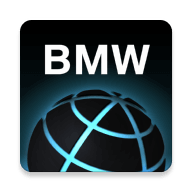
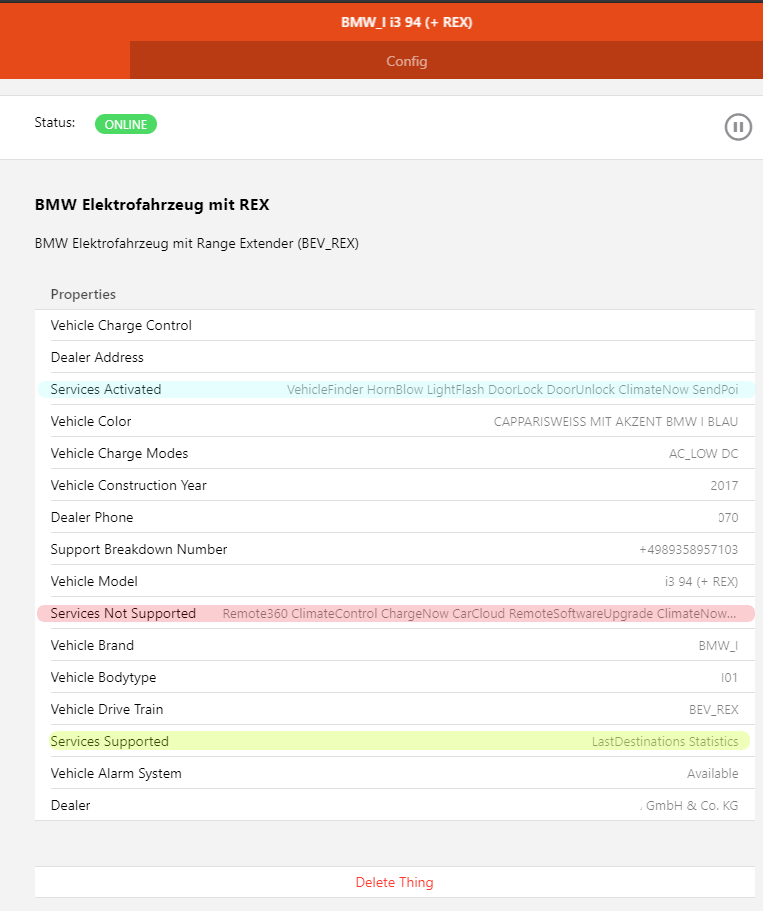
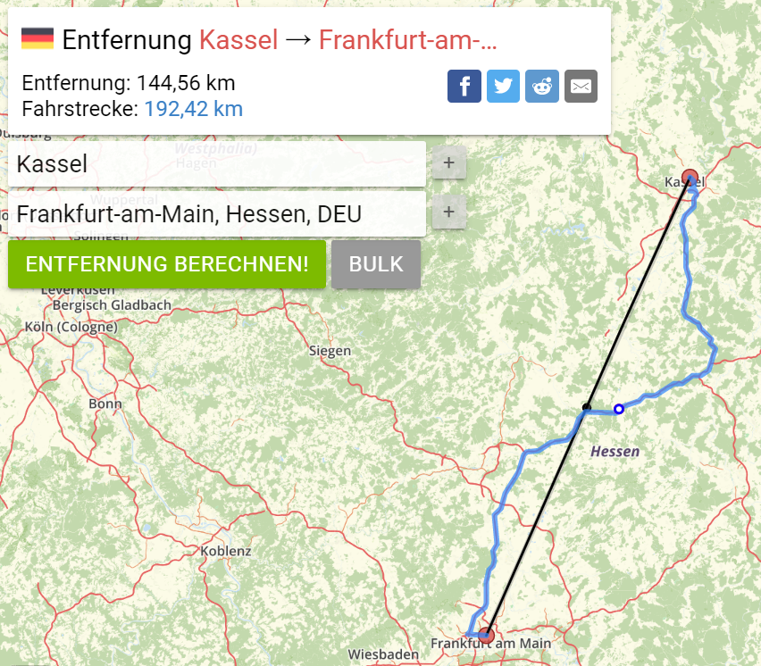
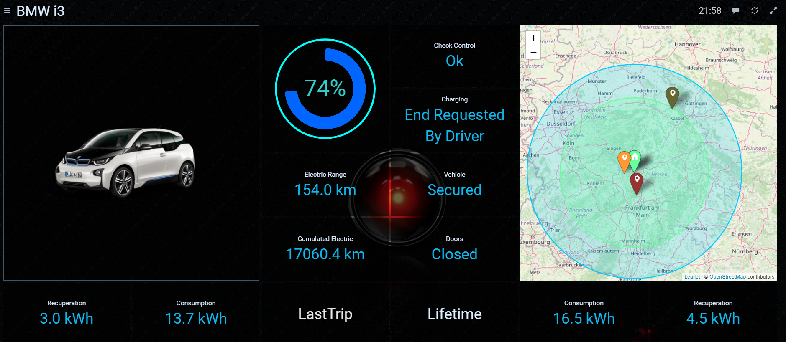

# BMW ConnectedDrive Binding



The Binding connects your Vehicles listed in BMWs ConnectedDrive Portal with openHAB.
Due to the high range of Vehicles BMW provides you need to check which Channels are applicable. 
The Discovery Service recognizes your Vehicle with the correct type 

* Conventional Fuel Vehicle
* Plugin-Hybrid Electrical Vehicle 
* Battery Electric Vehicle with Range Extender
* Battery Electric Vehicle 

In addition Properties are attached to the Vehicle Thing to observe the Supported & Activated Services.
Different Channel Groups are available so you are able to cross-check which group is supported by your Vehicle.  

Please note **this isn't a _real-time_ Binding**. 
If you open the Door the state isn't transmitted immediately and shown in your GUI. 
This isn't a flaw in the Binding itself because the state in BMWs own ConnectedDrive App is also updated with delay. 

## Supported Things

### Bridge

The Bridge establishes the Connection between BMW ConnectedDrive Portal and openHAB.

| Name                       | Bridge Type ID | Description                                                |
|----------------------------|----------------|------------------------------------------------------------|
| BMW ConnectedDrive Account | account        | Access to BMW ConnectedDrive Portal for a specific user    |


### Things

Four different Vehicle Types are provided. They differ in the supported Channel Groups & Channels. 
While Conventional Fuel Vehicles have no "Charging Profile" Electric Vehicles don't provide a _fuel range_. 
For Hybrid Vehicles _fuel range_ and _electric range_ is provided and in addition a _combined range_
 
| Name                                | Thing Type ID | Supported Channel Groups                                   |
|-------------------------------------|---------------|------------------------------------------------------------|
| BMW Electric Vehicle                | BEV           | status, range, remote, location, destination, image, troubleshoot, charge, last-trip, lifetime |
| BMW Electric Vehicle with REX       | BEV_REX       | status, range, remote, location, destination, image, troubleshoot, charge, last-trip, lifetime |
| BMW Plug-In-Hybrid Electric Vehicle | PHEV          | status, range, remote, location, destination, image, troubleshoot, charge |
| BMW Conventional Vehicle            | CONV          | status, range, remote, location, destination, image, troubleshoot |

 
#### Properties



For each Vehicle Properties are set with various informations. 
They are especially handy to figure out the provided Services of your Vehicle. 
In the right picture you can see in _Activated Services_ e.g. the _DoorLock_ and _DoorUnlock_ Services are mentioned. 
So you're sure that in Channel Group _Remote Services_ you are able to execute these commands.
Also _LastDestinations_ is mentioned in _Supported Services_ so it's valid to connect Channel Group _Last Destinations_ in order to display the last 3 Navigation Destinations.

Basically 3 Types of Information are registered as Properties

* Informations regarding your Dealer with Address and Phone Number
* Which services are available or not available
* Vehicle Properties like Color, Model Type, Drive Train and Construction Year

## Discovery

Auto Discovery is starting after you created the Bridge towards BMW ConnectedDrive. 
A list of your registered Vehicles is queried and all found Vehicles are added in Inbox.
As Unique Identifier the _Vehicle Identification Number_ (VIN) is used. 
If you already predefined a Thing in *.things configuration with the same VIN the Discovery won't discover it again. 
The Discovery still takes care updating the Properties of your Vehicle.

## Configuration

### Bridge

| Parameter       | Type    | Description                                                             |           
|-----------------|---------|-------------------------------------------------------------------------|
| userName        | text    | BMW Connected Drive Username                  |
| password        | text    | BMW Connected Drive Password                  |
| region          | text    | Select your Region in order to connect to the appropriate BMW Server.   |

The region Configuration has 3 different possibilities

* _NORTH_AMERICA_
* _CHINA_
* _ROW_ for Rest of World

### Things

All Things are needing the same Configuration Data

| Parameter       | Type    | Description                           |           
|-----------------|---------|---------------------------------------|
| vin             | text    | Vehicle Identification Number (VIN)   |
| refreshInterval | integer | Refresh Interval in Minutes           |
| units           | text    | Unit Selection                        |
| imageSize       | integer | Image Picture Size                    |
| imageViewport   | text    | Image Viewport                        |

The units can be configured in 3 ways

* _AUTODETECT_ selects Miles for US & UK, Kilometer otherwise
* _METRIC_ selects directly Kilometers
* _IMPERIAL_ selects directly Miles

The imageVieport allows you to show your Vehicle from different angels.
Possible values are 

* FRONT
* REAR
* SIDE
* DASHBOARD
* DRIVERDOOR

## Channels

There are many Channels available for each Vehicle. 
For better overview they are clustered in different Channel Groups.
The Channel Groups are different for the Vehicle Types but also depends on the build in Sensors of your Vehicle.
This means also the Construction Year is relevant if some Channels are supported or not.

### Bridge Channels

| Channel Label         | Channel ID            | Type   | Description                                       |
|-----------------------|-----------------------|--------|---------------------------------------------------|
| Door Status           | discovery-fingerprint | Switch | Forcing a log entry to analyze Discovery Problems |

### Thing Channel Groups 

#### Channel Group _Vehicle Status_

Available for all Vehicles.

| Channel Label             | Channel Group ID | Channel ID          | Type          | Description                                                          |
|---------------------------|------------------|---------------------|---------------|----------------------------------------------------------------------|
| Door Status               | status           | doors               | String        | Closed if all closed, else reports the Door which is still open      |
| Window Status             | status           | windows             | String        | Closed if all closed, else reports the Window which is still open    |
| Doors Locked              | status           | lock                | String        | Status if Doors are locked or unlocked                               |
| Next Service Date         | status           | service-date        | DateTime      | Date of Upcoming Service                                             |
| Mileage till Next Service | status           | service-mileage     | Number:Length | Mileage till Upcoming Service                                 |
| Next Service Description  | status           | service-name        | String        | Description of Upcoming Service                                      |
| Check Control             | status           | check-control       | String        | Description of actual Check Control message, Ok if none is activated |
| Last Status Update        | status           | last-update         | DateTime      | Date and Time of last status updateDescription of actual Check Control message, Ok if none is activated |

See [further details for DateTime](# Last Status Update Timestamp) in case of wrong timestamp values

#### Channel Group _Range Data_

Based on Vehicle Type (Thing Type ID) some Channels are presented or not. 
For Conventional Fuel Vehicles the *Electric Range* isn't presented while for Battery Electric Vehicles *Range Fuel* isn't valid.
Hybrid Vehicles have both and in addition *Hybrid Range*

| Channel Label         | Channel Group ID | Channel ID            | Type                 | CONV | PHEV | BEV_REX | BEV |
|-----------------------|------------------|-----------------------|----------------------|------|------|---------|-----|
| Mileage               | range            | mileage               | Number:Length        |  X   |  X   |    X    |  X  |
| Fuel Range            | range            | range-fuel            | Number:Length        |  X   |  X   |    X    |     |
| Battery Range         | range            | range-electric        | Number:Length        |      |  X   |    X    |  X  | 
| Hybrid Range          | range            | range-hybrid          | Number:Length        |      |  X   |    X    |     | 
| Battery Charge Level  | range            | soc                   | Number:Dimensionless |      |  X   |    X    |  X  |
| Remaining Fuel        | range            | remaining-fuel        | Number:Volume        |  X   |  X   |    X    |     | 
| Fuel Range Radius     | range            | range-radius-fuel     | Number:Length        |  X   |  X   |    X    |     | 
| Electric Range Radius | range            | range-radius-electric | Number:Length        |      |  X   |    X    |  X  | 
| Hybrid Range Radius   | range            | range-radius-hybrid   | Number:Length        |      |  X   |    X    |     | 

See Description [Range vs. Range Radius](#Range vs. Range Radius) to get more information

#### Channel Group _Electric Charging_

Valid for Electric and Hybrid Vehicles

| Channel Label                      | Channel Group ID | Channel ID          | Type   | 
|------------------------------------|------------------|---------------------|--------|
| Charging Status                    | charge           | status              | String | 
| Air Conditioning at Departure Time | charge           | profile-climate     | Switch | 
| Charging Mode for Profile          | charge           | profile-mode        | String | 
| Charging Window Start Time         | charge           | window-start        | String | 
| Charging Window End Time           | charge           | window-end          | String | 
| Timer 1: Departure Time            | charge           | timer1-departure    | String | 
| Timer 1: Scheduled Days            | charge           | timer1-days         | String | 
| Timer 1: Enabled                   | charge           | timer1-enabled      | Switch | 
| Timer 2: Departure Time            | charge           | timer2-departure    | String | 
| Timer 2: Scheduled Days            | charge           | timer2-days         | String | 
| Timer 2: Enabled                   | charge           | timer2-enabled      | Switch | 
| Timer 3: Departure Time            | charge           | timer3-departure    | String | 
| Timer 3: Scheduled Days            | charge           | timer3-days         | String | 
| Timer 3: Enabled                   | charge           | timer3-enabled      | Switch | 


#### Channel Group _Location_

Available for all Vehicles.

| Channel Label  | Channel Group ID | Channel ID          | Type         | 
|----------------|------------------|---------------------|--------------|
| Latitude       | location         | latitude            | Number       | 
| Longitude      | location         | longitude           | Number       |
| Heading        | location         | heading             | Number:Angle | 

#### Channel Group _Cha_


#### Channel Group _Last Trip_

Check in your Vehicle Thing Properties if *Statistics* is present in *Services Supported*

| Channel Label               | Channel Group ID | Channel ID              | Type          | Description                                       |
|-----------------------------|------------------|-------------------------|---------------|---------------------------------------------------|
| Distance Driven             | last-trip        | distance                | Number:Length | Distance Driven on your Last Trip                 |
| Distance since Last Charge  | last-trip        | distance-since-charging | Number:Length | Distance Driven since Last Charge                 |
| Average Consumption         | last-trip        | average-consumption     | Number:Power  | Average Power Consumption on your Last Trip per 100 km |
| Average Recuperation        | last-trip        | average-recuperation    | Number:Power  | Average Power Recuperation on your Last Trip per 100 km |


#### Channel Group _Lifetime Statistics_

Check in your Vehicle Thing Properties if *Statistics* is present in *Services Supported*

| Channel Label                      | Channel Group ID | Channel ID               | Type          | Description                                       |
|------------------------------------|------------------|--------------------------|---------------|---------------------------------------------------|
| Average Consumption                | lifetime        | average-consumption       | Number:Power  | Average Power Consumption on your Last Trip per 100 km |
| Distance since Last Charge         | lifetime        | average-recuperation      | Number:Power  | Average Power Recuperation on your Last Trip per 100 km |
| Cumulated Electric Driven Distance | lifetime        | cumulated-driven-distance | Number:Length | Total Distance Driven with Electric Power       |
| Longest Distance with one Charge   | lifetime        | single-longest-distance   | Number:Length | Longest Distance Driven with one single Charge      |


#### Channel Group _Remote Services_

Check in your Vehicle Thing Properties *Services Activated* which Remote Services are available
Only one Remote Service can be executed each Time.
Parallel execution isn't supported.
The *Service Execution State* Channel is reporting the state.
State *Executed* is the final State when Execution is finished.

| Channel Label           | Channel Group ID | Channel ID          | Type    | 
|-------------------------|------------------|---------------------|---------|
| Activate Flash Lights   | remote           | light               | Switch  |
| Find Vehicle            | remote           | finder              | Switch  |
| Lock Doors              | remote           | lock                | Switch  |
| Unlock Doors            | remote           | unlock              | Switch  |
| Horn Blow               | remote           | horn                | Switch  |
| Active Air Conditioning | remote           | climate             | Switch  |
| Service Execution State | remote           | state               | STring  |

#### Channel Group _Destinations_

Check in your Vehicle Thing Properties if *LastDestinations* is present in *Services Supported*

| Channel Label                        | Channel Group ID | Channel ID          | Type    | 
|--------------------------------------|------------------|---------------------|---------|
| Last Destination Name                | destination      | name-1              | String  |
| Last Destination Latitude            | destination      | lat-1               | Number  |
| Last Destination Longitude           | destination      | lon-1               | Number  |
| Second Last Destination Name         | destination      | name-2              | String  |
| Second Last Destination Latitude     | destination      | lat-2               | Number  |
| Second Last Destination Longitude    | destination      | lon-2               | Number  |
| Third Last Destination Name          | destination      | name-3              | String  |
| Third Last Destination Latitude      | destination      | lat-3               | Number  |
| Third Last Destination Longitude     | destination      | lon-3               | Number  |


#### Channel Group _Image_

Available for all Vehicles.

| Channel Label                 | Channel Group ID | Channel ID          | Type   | 
|-------------------------------|------------------|---------------------|--------|
| Rendered Image of your Vehicle| image            | png                 | Image  |

#### Channel Group _Troubleshooting_

Available for all Vehicles - really!
Please check [TroubleShooting Section](#TroubleShooting) for further advice

| Channel Label                       | Channel Group ID | Channel ID          | Type   | Description                                       |
|-------------------------------------|------------------|---------------------|--------|---------------------------------------------------|
| Log Vehicle Fingerprint             | troubleshoot     | vehicle-fingerprint | Switch | Forces log entries in openHAB logger in order to raise issues |

## Further Descriptions

### Range vs. Range Radius



You will observe differences in the Vehicle Range and Range Radius values. 
While Range is indicating the possible distance to be driven on roads the range radius indicates the reachable range on the Map.

The right picture shows the distance between Kassel and Frankfurt in Germany. 
While the Air-line Distance is ~ 145 Kilometer the Route Distance is ~ 192 Kilometer.
So Range value is the normal remaining range.
See the Section [OpenStreetMap](#OpenstreetMap Widget) how the Range Radius is used to indicate the reachable Range on Map.
Please note this is just an indicator and the effective range, especially for Electric Vehicles, depends on many factors like driving style and electric consumers 
 
### Last Status Update Timestamp

There's a timestamp showing the last update of your Vehicle. If this isn't shown correctly please check the date settings.
In case of Raspberry Pi execute _raspi-cinfig_, select _Localization Options_, the _Change Time Zone_
Select your _Geaographical Area_ and afterwards the correct City.
One restart of openHAB service with _systemctl restart openhab2_ is necessary in order to see the corrected Time Settings.
 
Correct TimeZone is crucial for handling all Time information in openHAB and it's discussed many times in the Forum.
See [similar discussion in the openHAB Forum](https://community.openhab.org/t/solved-wrong-local-time-how-to-change/90938) which deals with the same problem.

### TroubleShooting

As stated at the beginning: BMW has a high range of Vehicles supported by BMWs ConnectedDrive.
In case of any issues you face with this Binding please help to resolve it! 
Please perform the following Steps:

* Can you login *[Here](https://www.bmw-connecteddrive.com/country-region-select/country-region-selection.html)* with your Credentials? _Please note this isn't the BMW Customer Portal - it's the ConnectedDrive Portal_
* Is your Vehicle listed in your Account? _There's a one-to-one dependency from User to Vehicle_

If the access to the Portal and listing of the Vehicle is checked some debug data is needed in order to identify the issue. 
The [Example Sitemap](#Sitemap) contains the necessary items to generate Debug Data.

#### My Vehicle isn't found automatically!

The Vehicle isn't recognized or a predefined Vehicle doesn't show the right properties?
For this the *Discovery Fingerprint* is needed.
Short press on the Switch will force some logging entries which can be [normally found in your logs here](http://openhab:9001/) 

#### My Vehicle shows wrong data or data is missing!

Now the *Vehicle Fingerprint* is needed.
Proceed like before, shortly press the Switch and the log contains the data.

Personal Data is eliminated from thes log entries so it should be possible to share them in public.
Data like

* Dealer Properties
* Vehicle Identification Number (VIN)
* Location Latitude / Longitude 

are anonymized.

After you've generated the corresponding Fingerprint please [follow the instructions to raise an Issue](https://community.openhab.org/t/how-to-file-an-issue/68464) and attach the Fingerprint data!
Your feedback is highly appreciated!

Here an example of Debug Fingerprint Data from a BEV_REX Vehicle

```
2020-09-07 17:27:21.101 [WARN ] [rive.internal.handler.VehicleHandler] - ###### BMW ConnectedDrive Binding - Vehicle Troubleshoot Fingerprint Data - BEGIN ######
2020-09-07 17:27:21.105 [WARN ] [rive.internal.handler.VehicleHandler] - ### Discovery Result ###
2020-09-07 17:27:21.116 [WARN ] [rive.internal.handler.VehicleHandler] - {"vehicles":[{"vin":"ANONYMOUS","model":"i3 94 (+ REX)","driveTrain":"BEV_REX","brand":"BMW_I","yearOfConstruction":2017,"bodytype":"I01","color":"CAPPARISWEISS MIT AKZENT BMW I BLAU","statisticsCommunityEnabled":false,"statisticsAvailable":true,"hasAlarmSystem":true,"dealer":{"name":"ANONYMOUS","street":"ANONYMOUS","postalCode":"ANONYMOUS","city":"ANONYMOUS","country":"ANONYMOUS","phone":"ANONYMOUS"},"breakdownNumber":"ANONYMOUS","supportedChargingModes":["AC_LOW","DC"],"chargingControl":"WEEKLY_PLANNER","vehicleFinder":"ACTIVATED","hornBlow":"ACTIVATED","lightFlash":"ACTIVATED","doorLock":"ACTIVATED","doorUnlock":"ACTIVATED","climateNow":"ACTIVATED","sendPoi":"ACTIVATED","remote360":"NOT_SUPPORTED","climateControl":"NOT_SUPPORTED","chargeNow":"NOT_SUPPORTED","lastDestinations":"SUPPORTED","carCloud":"NOT_SUPPORTED","remoteSoftwareUpgrade":"NOT_SUPPORTED","climateNowRES":"NOT_SUPPORTED","climateControlRES":"NOT_SUPPORTED","smartSolution":"NOT_SUPPORTED","ipa":"NOT_SUPPORTED"}]}
2020-09-07 17:27:21.121 [WARN ] [rive.internal.handler.VehicleHandler] - ### Vehicle Status ###
2020-09-07 17:27:21.125 [WARN ] [rive.internal.handler.VehicleHandler] - {"vehicleStatus":{"mileage":17708,"remainingFuel":4.0,"remainingRangeElectric":146.0,"remainingRangeElectricMls":90.0,"remainingRangeFuel":65.0,"remainingRangeFuelMls":40.0,"maxRangeElectric":203.0,"maxRangeElectricMls":126.0,"maxFuel":8.5,"chargingLevelHv":74.0,"vin":"ANONYMOUS","updateReason":"VEHICLE_SECURED","updateTime":"2020-09-07T12:47:08+0000","doorDriverFront":"CLOSED","doorDriverRear":"CLOSED","doorPassengerFront":"CLOSED","doorPassengerRear":"CLOSED","windowDriverFront":"CLOSED","windowDriverRear":"CLOSED","windowPassengerFront":"CLOSED","windowPassengerRear":"CLOSED","sunroof":"CLOSED","trunk":"CLOSED","rearWindow":"INVALID","hood":"OPEN","doorLockState":"SECURED","parkingLight":"OFF","positionLight":"ON","connectionStatus":"DISCONNECTED","chargingStatus":"INVALID","lastChargingEndReason":"END_REQUESTED_BY_DRIVER","lastChargingEndResult":"SUCCESS","position":{"lat":-1.0,"lon":-1.0,"heading":-1,"status":"OK"},"internalDataTimeUTC":"2020-09-07T12:47:08","singleImmediateCharging":false,"chargingConnectionType":"CONDUCTIVE","chargingInductivePositioning":"NOT_POSITIONED","vehicleCountry":"DE","DCS_CCH_Activation":"NA","DCS_CCH_Ongoing":false,"checkControlMessages":[],"cbsData":[{"cbsType":"BRAKE_FLUID","cbsState":"OK","cbsDueDate":"2021-11","cbsDescription":"Next change due at the latest by the stated date.","cbsRemainingMileage":0},{"cbsType":"VEHICLE_CHECK","cbsState":"OK","cbsDueDate":"2021-11","cbsDescription":"Next visual inspection due when the stated distance has been covered or by the stated date.","cbsRemainingMileage":0},{"cbsType":"OIL","cbsState":"OK","cbsDueDate":"2021-11","cbsDescription":"Next change due when the stated distance has been covered or by the specified date.","cbsRemainingMileage":0},{"cbsType":"VEHICLE_TUV","cbsState":"OK","cbsDueDate":"2021-11","cbsDescription":"Next statutory vehicle inspection due by the stated date.","cbsRemainingMileage":0}]}}
2020-09-07 17:27:21.130 [WARN ] [rive.internal.handler.VehicleHandler] - ### Last Trip ###
2020-09-07 17:27:21.133 [WARN ] [rive.internal.handler.VehicleHandler] - {"lastTrip":{"efficiencyValue":0.8,"totalDistance":14,"electricDistance":14,"avgElectricConsumption":13.7,"avgRecuperation":3,"drivingModeValue":1,"accelerationValue":0.27,"anticipationValue":0.87,"totalConsumptionValue":0.98,"auxiliaryConsumptionValue":0.89,"avgCombinedConsumption":0,"electricDistanceRatio":100,"savedFuel":0,"date":"2020-09-07T14:35:00+0000","duration":13}}
2020-09-07 17:27:21.135 [WARN ] [rive.internal.handler.VehicleHandler] - ### All Trips ###
2020-09-07 17:27:21.138 [WARN ] [rive.internal.handler.VehicleHandler] - {"allTrips":{"avgElectricConsumption":{"communityLow":11,"communityAverage":16.28,"communityHigh":22,"userAverage":16.46},"avgRecuperation":{"communityLow":0.47,"communityAverage":3.37,"communityHigh":11.51,"userAverage":4.53},"chargecycleRange":{"communityAverage":194.57,"communityHigh":270,"userAverage":57.28,"userHigh":185.48,"userCurrentChargeCycle":33},"totalElectricDistance":{"communityLow":58,"communityAverage":41269.29,"communityHigh":193882,"userTotal":17060.4},"avgCombinedConsumption":{"communityLow":0,"communityAverage":0.92,"communityHigh":4.44,"userAverage":0.64},"savedCO2":473.033,"savedCO2greenEnergy":2782.551,"totalSavedFuel":0,"resetDate":"2020-09-07T12:00:04+0000","batterySizeMax":33200}}
2020-09-07 17:27:21.140 [WARN ] [rive.internal.handler.VehicleHandler] - ### Charge Profile ###
2020-09-07 17:27:21.142 [WARN ] [rive.internal.handler.VehicleHandler] - {"weeklyPlanner":{"climatizationEnabled":false,"chargingMode":"DELAYED_CHARGING","chargingPreferences":"CHARGING_WINDOW","timer1":{"departureTime":"05:00","timerEnabled":true,"weekdays":["MONDAY","TUESDAY","WEDNESDAY","THURSDAY","FRIDAY"]},"timer2":{"departureTime":"12:00","timerEnabled":false,"weekdays":["SATURDAY"]},"timer3":{"departureTime":"00:00","timerEnabled":false,"weekdays":[]},"overrideTimer":{"departureTime":"05:00","timerEnabled":false,"weekdays":["TUESDAY"]},"preferredChargingWindow":{"startTime":"11:00","endTime":"17:00"}}}
2020-09-07 17:27:21.144 [WARN ] [rive.internal.handler.VehicleHandler] - ### Charge Profile ###
2020-09-07 17:27:21.151 [WARN ] [rive.internal.handler.VehicleHandler] - {"destinations":[{"lat":0.0,"lon":0.0,"country":"ANONYMOUS","city":"ANONYMOUS","street":"ANONYMOUS","streetNumber":"ANONYMOUS","type":"DESTINATION","createdAt":"2020-08-16T12:52:58+0000"},{"lat":0.0,"lon":0.0,"country":"ANONYMOUS","city":"ANONYMOUS","street":"ANONYMOUS","streetNumber":"ANONYMOUS","type":"DESTINATION","createdAt":"2020-08-12T17:03:35+0000"},{"lat":0.0,"lon":0.0,"country":"ANONYMOUS","city":"ANONYMOUS","street":"ANONYMOUS","streetNumber":"ANONYMOUS","type":"DESTINATION","createdAt":"2020-08-03T08:15:20+0000"},{"lat":0.0,"lon":0.0,"country":"ANONYMOUS","city":"ANONYMOUS","street":"ANONYMOUS","streetNumber":"ANONYMOUS","type":"DESTINATION","createdAt":"2020-07-31T13:09:15+0000"},{"lat":0.0,"lon":0.0,"country":"ANONYMOUS","city":"ANONYMOUS","street":"ANONYMOUS","streetNumber":"ANONYMOUS","type":"DESTINATION","createdAt":"2020-07-25T11:20:18+0000"},{"lat":0.0,"lon":0.0,"country":"ANONYMOUS","city":"ANONYMOUS","street":"ANONYMOUS","streetNumber":"ANONYMOUS","type":"DESTINATION","createdAt":"2020-07-18T11:22:37+0000"},{"lat":0.0,"lon":0.0,"country":"ANONYMOUS","city":"ANONYMOUS","street":"ANONYMOUS","streetNumber":"ANONYMOUS","type":"DESTINATION","createdAt":"2020-02-08T11:06:52+0000"},{"lat":0.0,"lon":0.0,"country":"ANONYMOUS","city":"ANONYMOUS","street":"ANONYMOUS","streetNumber":"ANONYMOUS","type":"DESTINATION","createdAt":"2020-02-02T14:07:54+0000"},{"lat":0.0,"lon":0.0,"country":"ANONYMOUS","city":"ANONYMOUS","street":"ANONYMOUS","streetNumber":"ANONYMOUS","type":"DESTINATION","createdAt":"2020-02-02T13:24:36+0000"}]}
2020-09-07 17:27:21.158 [WARN ] [rive.internal.handler.VehicleHandler] - ###### BMW ConnectedDrive Binding - Vehicle Troubleshoot Fingerprint Data - END ######
```

## Full Example

The example is based on a BMW i3 with Range Extender (REX). 
Exchange the 3 configuration parameters in the Things section

* YOUR_USERNAME - with your ConnectedDrive Login Username
* YOUR_PASSWORD - with your ConnectedDrive Password Credentials
* VEHICLE_VIN - the Vehicle Identification Number

and you're ready to go!

### Things

```
Bridge bmwconnecteddrive:account:user   "BMW ConnectedDrive Account" [userName="YOUR_USERNAME",password="YOUR_PASSWORD",region="ROW"] {
         Thing BEV_REX i3       "BMW i3 94h REX"                [ vin="VEHICLE_VIN",units="AUTODETECT",imageSize=600,imageViewport="FRONT",refreshInterval=5]
}
```

### Items

```
Number:Length           i3Mileage                 "Odometer [%d %unit%]"                        <line>     (i3)        {channel="bmwconnecteddrive:BEV_REX:user:i3:range#mileage" }                                                                           
Number:Length           i3Range                   "Range [%d %unit%]"                           <motion>   (i3)        {channel="bmwconnecteddrive:BEV_REX:user:i3:range#hybrid"}
Number:Length           i3RangeElectric           "Electric Range [%d %unit%]"                  <motion>   (i3,long)   {channel="bmwconnecteddrive:BEV_REX:user:i3:range#electric"}   
Number:Length           i3RangeFuel               "Fuel Range [%d %unit%]"                      <motion>   (i3)        {channel="bmwconnecteddrive:BEV_REX:user:i3:range#fuel"}
Number:Dimensionless    i3BatterySoc              "Battery Charge [%.1f %%]"                    <battery>  (i3,long)   {channel="bmwconnecteddrive:BEV_REX:user:i3:range#soc"}
Number:Volume           i3Fuel                    "Fuel [%.1f %unit%]"                          <oil>      (i3)        {channel="bmwconnecteddrive:BEV_REX:user:i3:range#remaining-fuel"}
Number:Length           i3RadiusElectric          "Electric Radius [%d %unit%]"                 <zoom>     (i3)        {channel="bmwconnecteddrive:BEV_REX:user:i3:range#radius-electric" }
Number:Length           i3RadiusHybrid            "Hybrid Radius [%d %unit%]"                   <zoom>     (i3)        {channel="bmwconnecteddrive:BEV_REX:user:i3:range#radius-hybrid" }

String                  i3DoorStatus              "Door Status [%s]"                            <lock>       (i3)   {channel="bmwconnecteddrive:BEV_REX:user:i3:status#doors" }
String                  i3WindowStatus            "Window Status [%s]"                          <lock>       (i3)   {channel="bmwconnecteddrive:BEV_REX:user:i3:status#windows" }
String                  i3LockStatus              "Lock Status [%s]"                            <lock>       (i3)   {channel="bmwconnecteddrive:BEV_REX:user:i3:status#lock" }
DateTime                i3ServiceDate             "Service Date [%1$tb %1$tY]"                  <calendar>   (i3)   {channel="bmwconnecteddrive:BEV_REX:user:i3:status#service-date" }
String                  i3ServiceMileage          "Service Mileage [%d %unit%]"                 <line>       (i3)   {channel="bmwconnecteddrive:BEV_REX:user:i3:status#service-mileage" }
String                  i3ServiceName             "Service Name [%s]"                           <text>       (i3)   {channel="bmwconnecteddrive:BEV_REX:user:i3:status#service-name" }
String                  i3CheckControl            "Check Control [%s]"                          <error>      (i3)   {channel="bmwconnecteddrive:BEV_REX:user:i3:status#check-control" }
DateTime                i3LastUpdate              "Update [%1$tA, %1$td.%1$tm. %1$tH:%1$tM]"    <calendar>   (i3)   {channel="bmwconnecteddrive:BEV_REX:user:i3:status#last-update"}

Number:Length           i3TripDistance            "Distance [%d %unit%]"                        <line>     (i3)         {channel="bmwconnecteddrive:BEV_REX:user:i3:last-trip#distance" }                                                                           
Number:Length           i3TripDistanceSinceCharge "Distance since last Charge [%d %unit%]"      <line>     (i3,long)    {channel="bmwconnecteddrive:BEV_REX:user:i3:last-trip#distance-since-charging" }                                                                           
Number:Energy           i3AvgTripConsumption      "Average Consumption [%.1f %unit%]"           <energy>   (i3)         {channel="bmwconnecteddrive:BEV_REX:user:i3:last-trip#average-consumption" }                                                                           
Number:Energy           i3AvgTripRecuperation     "Average Recuperation [%.1f %unit%]"          <energy>   (i3)         {channel="bmwconnecteddrive:BEV_REX:user:i3:last-trip#average-recuperation" }                                                                           

Number:Length           i3CumulatedElectric       "Electric Distance Driven [%d %unit%]"        <line>     (i3)   {channel="bmwconnecteddrive:BEV_REX:user:i3:lifetime#cumulated-driven-distance" }                                                                           
Number:Length           i3LongestEVTrip           "Longest Electric Trip [%d %unit%]"           <line>     (i3)   {channel="bmwconnecteddrive:BEV_REX:user:i3:lifetime#single-longest-distance" }                                                                           
Number:Energy           i3AvgConsumption          "Average Consumption [%.1f %unit%]"           <energy>   (i3)   {channel="bmwconnecteddrive:BEV_REX:user:i3:lifetime#average-consumption" }                                                                           
Number:Energy           i3AvgRecuperation         "Average Recuperation [%.1f %unit%]"          <energy>   (i3)   {channel="bmwconnecteddrive:BEV_REX:user:i3:lifetime#average-recuperation" }  

Number                  i3Latitude                "Latitude  [%.4f]"                            <zoom>     (i3)   {channel="bmwconnecteddrive:BEV_REX:user:i3:location#latitude" }                                                                           
Number                  i3Longitude               "Longitude  [%.4f]"                           <zoom>     (i3)   {channel="bmwconnecteddrive:BEV_REX:user:i3:location#longitude" }                                                                           
Number:Angle            i3Heading                 "Heading [%.1f %unit%]"                       <zoom>     (i3)   {channel="bmwconnecteddrive:BEV_REX:user:i3:location#heading" }  

Switch                  i3RemoteFlash             "Flash"                                       <switch>   (i3)   {channel="bmwconnecteddrive:BEV_REX:user:i3:remote#light" } 
Switch                  i3RemoteFinder            "Finder"                                      <switch>   (i3)   {channel="bmwconnecteddrive:BEV_REX:user:i3:remote#finder" } 
Switch                  i3RemoteLock              "Lock"                                        <switch>   (i3)   {channel="bmwconnecteddrive:BEV_REX:user:i3:remote#lock" } 
Switch                  i3RemoteUnlock            "Unlock"                                      <switch>   (i3)   {channel="bmwconnecteddrive:BEV_REX:user:i3:remote#unlock" } 
Switch                  i3RemoteHorn              "Horn Blow"                                   <switch>   (i3)   {channel="bmwconnecteddrive:BEV_REX:user:i3:remote#horn" } 
Switch                  i3RemoteClimate           "Climate"                                     <switch>   (i3)   {channel="bmwconnecteddrive:BEV_REX:user:i3:remote#climate" } 
String                  i3RemoteState             "Remote Execution State [%s]"                 <status>   (i3)   {channel="bmwconnecteddrive:BEV_REX:user:i3:remote#state" } 

String                  i3Dest1Name               "Destination 1 [%s]"                          <house>    (i3)   {channel="bmwconnecteddrive:BEV_REX:user:i3:destination#name-1" } 
Number                  i3Dest1Lat                "Longitude [%.4f]"                            <zoom>     (i3)   {channel="bmwconnecteddrive:BEV_REX:user:i3:destination#lat-1" }                                                                           
Number                  i3Dest1Lon                "Latitude [%.4f]"                             <zoom>     (i3)   {channel="bmwconnecteddrive:BEV_REX:user:i3:destination#lon-1" }                                                                           
String                  i3Dest2Name               "Destination 2 [%s]"                          <house>    (i3)   {channel="bmwconnecteddrive:BEV_REX:user:i3:destination#name-2" } 
Number                  i3Dest2Lat                "Longitude [%.4f]"                            <zoom>     (i3)   {channel="bmwconnecteddrive:BEV_REX:user:i3:destination#lat-2" }                                                                           
Number                  i3Dest2Lon                "Latitude [%.4f]"                             <zoom>     (i3)   {channel="bmwconnecteddrive:BEV_REX:user:i3:destination#lon-2" }                                                                           
String                  i3Dest3Name               "Destination 3 [%s]"                          <house>    (i3)   {channel="bmwconnecteddrive:BEV_REX:user:i3:destination#name-3" } 
Number                  i3Dest3Lat                "Longitude [%.4f]"                            <zoom>     (i3)   {channel="bmwconnecteddrive:BEV_REX:user:i3:destination#lat-3" }                                                                           
Number                  i3Dest3Lon                "Latitude [%.4f]"                             <zoom>     (i3)   {channel="bmwconnecteddrive:BEV_REX:user:i3:destination#lon-3" }                                                                           
 
String                  i3ChargingStatus          "Charging [%s]"                               <power>         (i3)   {channel="bmwconnecteddrive:BEV_REX:user:i3:charge#status" } 
Switch                  i3ChargeProfileClimate    "Charge Profile Climatization"                <temperature>   (i3)   {channel="bmwconnecteddrive:BEV_REX:user:i3:charge#profile-climate" }  
String                  i3ChargeProfileMode       "Charge Profile Mode [%s]"                    <power>         (i3)   {channel="bmwconnecteddrive:BEV_REX:user:i3:charge#profile-mode" } 
String                  i3ChargeWindowStart       "Charge Window Start [%s]"                    <time>          (i3)   {channel="bmwconnecteddrive:BEV_REX:user:i3:charge#window-start" } 
String                  i3ChargeWindowEnd         "Charge Window End [%s]"                      <time>          (i3)   {channel="bmwconnecteddrive:BEV_REX:user:i3:charge#window-end" } 
String                  i3Timer1Departure         "Timer 1 Departure [%s]"                      <time>          (i3)   {channel="bmwconnecteddrive:BEV_REX:user:i3:charge#timer1-departure" } 
String                  i3Timer1Days              "Timer 1 Days [%s]"                           <calendar>      (i3)   {channel="bmwconnecteddrive:BEV_REX:user:i3:charge#timer1-days" } 
Switch                  i3Timer1Enabled           "Timer 1 Enabled"                             <switch>        (i3)   {channel="bmwconnecteddrive:BEV_REX:user:i3:charge#timer1-enabled" }  
String                  i3Timer2Departure         "Timer 2 Departure [%s]"                      <time>          (i3)   {channel="bmwconnecteddrive:BEV_REX:user:i3:charge#timer2-departure" } 
String                  i3Timer2Days              "Timer 2 Days [%s]"                           <calendar>      (i3)   {channel="bmwconnecteddrive:BEV_REX:user:i3:charge#timer2-days" } 
Switch                  i3Timer2Enabled           "Timer 2 Enabled"                             <switch>        (i3)   {channel="bmwconnecteddrive:BEV_REX:user:i3:charge#timer2-enabled" }  
String                  i3Timer3Departure         "Timer 3 Departure [%s]"                      <time>          (i3)   {channel="bmwconnecteddrive:BEV_REX:user:i3:charge#timer3-departure" } 
String                  i3Timer3Days              "Timer 3 Days [%s]"                           <calendar>      (i3)   {channel="bmwconnecteddrive:BEV_REX:user:i3:charge#timer3-days" } 
Switch                  i3Timer3Enabled           "Timer 3 Enabled"                             <switch>        (i3)   {channel="bmwconnecteddrive:BEV_REX:user:i3:charge#timer3-enabled" }  

Image                   i3Image                   "Vehilce Image"                               <switch>        (i3)   {channel="bmwconnecteddrive:BEV_REX:user:i3:image#png" }  

Switch                  i3Troubleshoot            "Vehicle Fingerprint"                         <switch>        (i3)   {channel="bmwconnecteddrive:BEV_REX:user:i3:troubleshoot#vehicle-fingerprint" }  
Switch                  i3DiscoveryTroubleshoot   "Discovery Fingerprint"                       <switch>        (i3)   {channel="bmwconnecteddrive:account:user:discovery-fingerprint" }  
 ```

### Sitemap

```
sitemap BMW label="BMW" {
  Frame label="BMW i3" {
    Image  item=i3Image                     
  } 
  Frame label="Range" {
    Text    item=i3Mileage           
    Text    item=i3Range             
    Text    item=i3RangeElectric     
    Text    item=i3RangeFuel         
    Text    item=i3BatterySoc        
    Text    item=i3Fuel              
    Text    item=i3RadiusElectric       
    Text    item=i3RadiusHybrid         
  }
  Frame label="Status" {
    Text    item=i3DoorStatus           
    Text    item=i3WindowStatus         
    Text    item=i3LockStatus           
    Text    item=i3ServiceDate              
    Text    item=i3ServiceMileage       
    Text    item=i3ServiceName          
    Text    item=i3CheckControl         
    Text    item=i3LastUpdate               
  }
  Frame label="Remote Services" {
    Switch  item=i3RemoteFlash              
    Switch  item=i3RemoteFinder             
    Switch  item=i3RemoteLock               
    Switch  item=i3RemoteUnlock             
    Switch  item=i3RemoteHorn               
    Switch  item=i3RemoteClimate            
    Text    item=i3RemoteState              
}
  Frame label="Last Trip" {
    Text    item=i3TripDistance            
    Text    item=i3TripDistanceSinceCharge 
    Text    item=i3AvgTripConsumption      
    Text    item=i3AvgTripRecuperation     
  }
  Frame label="Lifetime" {
    Text    item=i3CumulatedElectric  
    Text    item=i3LongestEVTrip      
    Text    item=i3AvgConsumption     
    Text    item=i3AvgRecuperation          
  }
  Frame label="Location" {
    Text    item=i3Latitude           
    Text    item=i3Longitude          
    Text    item=i3Heading             
  }
  Frame label="Charge Profile" {    
    Text    item=i3ChargingStatus           
    Switch  item=i3ChargeProfileClimate     
    Text    item=i3ChargeProfileMode        
    Text    item=i3ChargeWindowStart        
    Text    item=i3ChargeWindowEnd          
    Text    item=i3Timer1Departure          
    Text    item=i3Timer1Days               
    Switch  item=i3Timer1Enabled            
    Text    item=i3Timer2Departure          
    Text    item=i3Timer2Days               
    Switch  item=i3Timer2Enabled            
    Text    item=i3Timer3Departure          
    Text    item=i3Timer3Days               
    Switch  item=i3Timer3Enabled            
  } 
  Frame label="Last Destinations" {    
    Text  item=i3Dest1Name                 
    Text  item=i3Dest1Lat                                                                                   
    Text  item=i3Dest1Lon                                                                                    
    Text  item=i3Dest2Name                 
    Text  item=i3Dest2Lat                                                                                        
    Text  item=i3Dest2Lon                                                                                        
    Text  item=i3Dest3Name                 
    Text  item=i3Dest3Lat                                                                                        
    Text  item=i3Dest3Lon                                                                                         
  } 
  Frame label="Troubleshooting" { 
    Switch  item=i3DiscoveryTroubleshoot    
    Switch  item=i3Troubleshoot             
  } 
}

```

## Going further

You're now able to receive your Vehicle Data in openHAB. Continue the work and combine this data with other Powerful openHAB Bindings and Widgets.

### Notification

Beginning with a small rule which is quite handy if you aren't the _permanent Driver_ of the Car but you're somehow responsible for the Vehicle of your Kids / Wife / Parents.
As soon as a check control message is raised you'll be notified e.g. via Android App and you can work on a solution.
Here the short rule, just insert your Mail Adress which you are using for openHAB Cloud Connector

```
// App Notification if Check Control Message is active
rule "CheckControl"
    when
        System started or
        Item i3CheckControl changed 
    then
        if(i3CheckControl.state.toString != "Ok") {
            sendNotification("YOUR_OPENHAB_CLOUD_EMAIL","BMW i3 Check Control: "+i3CheckControl.state)
        }                                                    
end
```

### OpenstreetMap Widget



The [OpenStreetMap Widget](https://community.openhab.org/t/custom-widget-map/39225) can be used to display a Map on your Panel.
It's configurable with *Markers* and *Accuracy Circles* which are quite handy to display several informations.
See the HABPanel example with the OpenStreetMap Widget on the right side with

* Marker of current Vehicle location as Center of the Map
* Green Circle showing Electric Range Radius
* Blue Circle showing Hybrid Range Radius
* 3 additional Markers for the last Destinations

Some small modifications are needed to get the Location values. 
The items file declares some String with Latitude, Longitude values as String used in the Markers of the Widget. 
The Range Radius is needed in Meters so a small conversion is needed.
The rules file is performing the calculations on startup and if the values are changing. 
If the location of the Vehicle changes it will be shown in the Map


```
// Range Radius Items
String          i3LatLongElectric      "Location String"
Number          i3RadiusElectricMeter  "Electric Range Radius"
String          i3LatLongHybrid        "Location String"
Number          i3RadiusHybridMeter    "Hybrid Range Radius"
//Destination Items
String          i3Dest1LatLon          "Last Destination"
String          i3Dest2LatLon          "Second Last Destination"
String          i3Dest3LatLon          "Third Last Destination"
```

```
// Hybrid and Electric Range Radius plus Vehicle Coordinates
rule "LocationRangeChange"
    when
        System started or
        Item i3Latitude changed or
        Item i3Longitude changed or
        Item i3RangeRadiusElectric changed or
        Item i3RangeRadiusHybrid changed
    then
        // Electric Range Radius & Vehicle Coordinates
        val latitudeNumber = i3Latitude.state as Number
        val longitudeNumber = i3Longitude.state as Number
        i3LatLongElectric.sendCommand(latitudeNumber.floatValue+","+longitudeNumber.floatValue)
        val radiusElectricNumber = i3RadiusElectric.state as Number
        i3RadiusElectricMeter.sendCommand(radiusElectricNumber.intValue * 1000)
        
        // Hybrid Range Radius & Vehicle Coordinates
        i3LatLongHybrid.sendCommand(latitudeNumber.floatValue +","+longitudeNumber.floatValue)
        val radiusHybridNumber = i3RadiusHybrid.state as Number
        logInfo("Rage Map","Radius Hybrid"+radiusHybridNumber.intValue)
        i3RadiusHybridMeter.sendCommand(radiusHybridNumber.intValue * 1000)    
end

// Coordinates of the last 3 Destinations
rule "Destinations"
    when
        System started or
        Item i3Dest1Lat changed or
        Item i3Dest1Lon changed or
        Item i3Dest2Lat changed or
        Item i3Dest2Lon changed or
        Item i3Dest3Lat changed or
        Item i3Dest3Lon changed        
    then                                                    
        val lat1N = i3Dest1Lat.state as Number
        val lon1N = i3Dest1Lon.state as Number
        i3Dest1LatLon.sendCommand(lat1N.floatValue +","+lon1N.floatValue)
 
        val lat2N = i3Dest2Lat.state as Number
        val lon2N = i3Dest2Lon.state as Number
        i3Dest2LatLon.sendCommand(lat2N.floatValue +","+lon2N.floatValue)

        val lat3N = i3Dest3Lat.state as Number
        val lon3N = i3Dest3Lon.state as Number
        i3Dest3LatLon.sendCommand(lat3N.floatValue +","+lon3N.floatValue)
end

```


## Credits

This work is based on the work of [Bimmer Connected](https://github.com/bimmerconnected/bimmer_connected). 
Also a [manual installation based on python](https://community.openhab.org/t/script-to-access-the-bmw-connecteddrive-portal-via-oh/37345) was already available for openHAB.
This Binding is basically a port to openHAB based on these concept works!  
