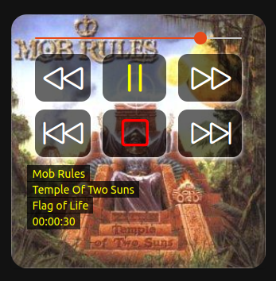

# Clementine Remote Binding


This binding shall bring the benefits of over-the-network control of the [Clementine-Player] to openHAB!

It allows control of playback, position and volume and allows display of various title information:

* Artist
* Album
* Title
* current position within track
* Album cover


[→ useful Links][links]

## Discovery

This thing does (currently) not provide auto-discovery.
You will have to manually configure clementine to allow remote connections.
And you will have to manually configure the Thing instances to talk to your player:

## Thing Configuration

Configuring the connection to Clementine is quite easy:

Normally you only need to set the hostname your Clementine player is running at.
If you set a password in the Clementine configuration, you will have to provide it to the configuration, too.

### Clementine Thing Configuration

| Name     | Type    | Description                                                       | Default | Required | Advanced |
|----------|---------|-------------------------------------------------------------------|---------|----------|----------|
| hostname | text    | Hostname or IP address of the device                              | N/A     | yes      | no       |
| password | text    | Password to access the device                                     | N/A     | no       | no       |
| port     | integer | Port at which Clementine is listening for remote control commands | 5500    | yes      | no       |

## Channels

The binding provides the following channels:

| Channel          | Type          | Read/Write  | Description                                  |
|------------------|---------------|-------------|----------------------------------------------|
| album            | String        | read-only   | Album the currently playing song belongs to  |
| artist           | String        | read-only   | Artist of the currently playing title        |
| cover            | Image         | read-only   | Cover of the current album                   |
| playback-control | String        | read/write  | Common control of playback and position      |
| position         | Number:Time   | read-only   | Current position within the playing track    |
| state            | String        | read-only   | Current state of Clementine player           |
| title            | String        | read-only   | Name of the currently playing track          |
| track            | String        | read-only   | Number of the title within the current album |
| volume-control   | system.volume | read/write  | Playback volume                              |


## Full Example

### Thing

```
UID: clementineremote:clementine:0590462b5b
label: Clementine
thingTypeUID: clementineremote:clementine
configuration:
  port: 5500
  hostname: 192.168.1.6
```

### Widget

based on https://community.openhab.org/t/universal-remote-widget/118423

```
uid: clementine_remote
tags: []
props:
  parameters:
    - context: item
      description: Select the clementine player item
      label: Select Clementine
      name: clementine
      required: true
      type: TEXT
    - context: item
      description: Select the artist channel
      label: Artist
      name: artist
      required: true
      type: TEXT
    - context: item
      description: Select the album channelpos
      label: Album
      name: album
      required: true
      type: TEXT
    - context: item
      description: Select the title channel
      label: Title
      name: title
      required: true
      type: TEXT
    - context: item
      description: Select the position channel
      label: Position
      name: pos
      required: true
      type: TEXT
    - context: item
      description: Select the volume channel
      label: Volume
      name: volume
      required: true
      type: TEXT
    - context: item
      description: Select the cover image channel
      label: Cover image
      name: cover
      required: true
      type: TEXT
  parameterGroups: []
component: f7-card
config:
  style:
    background: rgba(0,0,0,0)
    height: 20rem
    width: 20rem
slots:
  default:
    - component: oh-image
      config:
        item: =props.cover
        style:
          border-radius: 20px
          bottom: 0;
          height: auto
          position: absolute;
          width: 100%
    - component: oh-slider
      config:
        item: =props.volume
        label: true
        max: 100
        min: 0
        step: 10
        style:
          color: yellow
          left: 30px
          position: absolute
          top: 20px
          width: 260px
        unit: "%"
    - component: f7-badge
      config:
        style:
          background: rgba(0,0,0,0.6)
          border-radius: 12px
          box-shadow: 0px 2px 5px
          height: 60px
          left: 30px
          position: absolute
          top: 50px
          width: 70px
    - component: f7-badge
      config:
        style:
          background: rgba(0,0,0,0.6)
          border-radius: 12px
          box-shadow: 0px 2px 5px
          height: 60px
          left: 115px
          position: absolute
          top: 50px
          width: 80px
    - component: f7-badge
      config:
        style:
          background: rgba(0,0,0,0.6)
          border-radius: 12px
          box-shadow: 0px 2px 5px
          height: 60px
          position: absolute
          right: 30px
          top: 50px
          width: 80px
    - component: f7-badge
      config:
        style:
          background: rgba(0,0,0,0.6)
          border-radius: 12px
          box-shadow: 0px 2px 5px
          height: 60px
          left: 30px
          position: absolute
          top: 120px
          width: 70px
    - component: f7-badge
      config:
        style:
          background: rgba(0,0,0,0.6)
          border-radius: 12px
          box-shadow: 0px 2px 5px
          height: 60px
          left: 115px
          position: absolute
          top: 120px
          width: 80px
    - component: f7-badge
      config:
        style:
          background: rgba(0,0,0,0.6)
          border-radius: 12px
          box-shadow: 0px 2px 5px
          height: 60px
          position: absolute
          right: 30px
          top: 120px
          width: 80px
    - component: oh-link
      config:
        action: command
        actionCommand: REWIND
        actionItem: =props.clementine
        iconF7: backward
        iconSize: 50
        style:
          color: white
          left: 40px
          position: absolute
          top: 55px
    - component: oh-link
      config:
        action: command
        actionCommand: "=(items[props.clementine].state == 'PLAY') ? 'PAUSE' : 'PLAY'"
        actionItem: =props.clementine
        iconF7: "=(items[props.clementine].state == 'PLAY') ? 'pause' : 'play'"
        iconSize: 50
        style:
          color: "=(items[props.clementine].state == 'PLAY') ? 'yellow' : 'lime'"
          left: 130px
          position: absolute
          top: 55px
    - component: oh-link
      config:
        action: command
        actionCommand: FASTFORWARD
        actionItem: =props.clementine
        iconF7: forward
        iconSize: 50
        style:
          color: white
          position: absolute
          right: 44px
          top: 55px
    - component: oh-link
      config:
        action: command
        actionCommand: PREVIOUS
        actionItem: =props.clementine
        iconF7: backward_end_alt
        iconSize: 50
        style:
          color: white
          left: 40px
          position: absolute
          top: 124px
    - component: oh-link
      config:
        action: command
        actionCommand: STOP
        actionItem: =props.clementine
        iconF7: stop
        iconSize: 50
        style:
          color: red
          left: 130px
          position: absolute
          top: 124px
    - component: oh-link
      config:
        action: command
        actionCommand: NEXT
        actionItem: =props.clementine
        iconF7: forward_end_alt
        iconSize: 50
        style:
          color: white
          position: absolute
          right: 44px
          top: 124px
    - component: oh-link
      config:
        style:
          background: rgba(0,0,0,0.7)
          color: yellow
          left: 20px
          padding: 0 6px
          position: absolute
          top: 190px
        text: =items[props.artist].state
    - component: oh-link
      config:
        style:
          background: rgba(0,0,0,0.7)
          color: yellow
          left: 20px
          padding: 0 6px
          position: absolute
          top: 210px
        text: =items[props.album].state
    - component: oh-link
      config:
        style:
          background: rgba(0,0,0,0.7)
          color: yellow
          left: 20px
          padding: 0 6px
          position: absolute
          top: 230px
        text: =items[props.title].state
    - component: oh-link
      config:
        style:
          background: rgba(0,0,0,0.7)
          color: yellow
          left: 20px
          padding: 0 6px
          position: absolute
          top: 250px
        text: =items[props.pos].displayState || items[props.pos].state

```

[Clementine-Player]: https://www.clementine-player.org/
[Links]: doc/useful%20links.md
