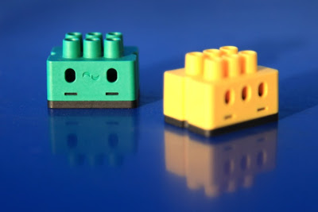

# digitalSTROM Binding

  This binding integrates the [digitalSTROM-System](https://www.digitalstrom.de/).
The integration happens through the digitalSTROM-Server, which acts as a gateway to connect the digitalSTROM-Devices.
The digitalSTROM-Server communicates through the digitalSTROM-Meters with the digitalSTROM-Devices, which are directly connected to the power-line.

**Note:** All was tested with digitalSTROM-Server firmware version 1.9.3 to 1.10.3.



## Supported Things

### digitalSTROM-Server

The `dssBridge` Bridge is required for accessing any other digitalSTROM-Devices.

### digitalSTROM-Devices

At this point almost all available **GE**, **SW**, **GR** and **BL** digitalSTROM-Devices with a set output-mode, unequal _disabled_, are supported by this binding.
Furthermore sensor devices like the **dS-iSens200** and **SW-devices** with binary-inputs are supported.
Last but not least the **circuit** (dS-Meter) is supported, too. They will provide the power consumption and electric meter as channels.

For that there are identically named thing types. Only the _GR_ type has a channel (shade), which cannot be changed.
The other types add their channels dynamically affected by the set color-group and output-mode.
They also automatically change or add the channels, if the color-group or output-mode has changed through the dSS-web-configuration or the configured sensor priorities of the thing has changed.

- The following table shows all tested digitalSTROM-Devices with their output-modes.

| HW-Type   | Output-Mode                                                                        | Tested color group |
|-----------|------------------------------------------------------------------------------------|--------------------|
| GE-KL200  | switched                                                                           | yellow             |
| GE-KM200  | switched, dimmed                                                                   | yellow             |
| GE-TKM210 | switched, dimmed                                                                   | yellow             |
| GE-SDM200 | switched, dimmed                                                                   | yellow             |
| GE-UMV200 | 1-10V dimmed                                                                       | yellow             |
| GR-KL200  | standard output-mode                                                               | grey               |
| GR-KL210  | standard output-mode                                                               | grey               |
| GR-KL220  | standard output-mode                                                               | grey               |
| SW-KL200  | switch, powersave, wipe                                                            | black, yellow      |
| SW-UMR200 | single switched, combined switch, combined 2 stage switch, combined 3 stage switch | yellow , black     |
| SW-ZWS200 | switch, powersave, wipe                                                            | black, yellow      |
| BL-KM200  | switch, pwm                                                                        | blue               |

- Binary-inputs were tested with SW-UMR200.
- Sensor channels were tested with dS-iSens200 and power sensor with all other supported devices, which are listed in the table above.

### digitalSTROM-Scenes

Furthermore the digitalSTROM-Scene concept is part of the digitalSTROM-Binding.
These scenes are implemented as virtual things.
The different scene thing types are listed in the following table.

| Thing-Type-ID | Label           | Description                                                     |
|---------------|-----------------|-----------------------------------------------------------------|
| appScene      | Apartment-Scene | Represents a digitalSTROM Apartment-Scene.                      |
| zoneScene     | Zone-Scene      | Represents a digitalSTROM Zone-Scene.                           |
| groupScene    | Group-Scene     | Represents a digitalSTROM Group-Scene.                          |
| namedScene    | Named-Scene     | Represents a digitalSTROM Scene, which has a user-defined name. |

### digitalSTROM-Zone-Temperature-Control

Last but not least, the digitalSTROM-Zone-Temperature-Control is also supported, if a zone-temerature-control is configured, as thing-type **zone_temperature_control**.
The difference between the digitalSTROM-heating-control-app is, that there are no operation-modes, like _comfort_ or _eco_.
You can directly set the target temperature, in case _pid-control_ is configured, otherwise you can set the value in percent of heating valves at the zone.
The needed channels will be added automatically, as it is also the case for the devices.

## Discovery

The digitalSTROM-Server is discovered by mDNS or _dss.local._ at the local network.
Once the server is added as a thing, you have to set a user name and password or insert a valid application-token to authenticate with the server.
If the binding is authorized, it automatically reads all supported devices, the dS-Meters and temperature controlled configured zones, that are set up on the digitalSTROM-System, and puts them into the _inbox_.

digitalSTROM-Scenes can be discovered, too.
The background scene-discovery is deactivated by default to not flood the inbox.
Otherwise it will discover so many scenes, that it can be difficult to find the searched devices.

Discoverable scenes are all user named scenes, group scenes that are reachable by local push-buttons, zone scenes and apartment scenes.
The discovery also will discover all called scenes, if they aren't automatically discovered yet.
Temperature control scenes, like _eco_ will be ignored, so they cannot be discovered.

If you only want to discover one of the thing types, you can start a discovery scan on the thing type you want to have discovered.
You can use the command line command, e.g.: ``openhab:discovery start digitalstrom:namedScene`` to start the scan.
Which thing types this binding supports, please have a look at **Supported Things**.

## Thing Configuration and Properties

### `digitalSTROM-Server` Configuration

The digitalSTROM-Server thing has the following configuration parameter groups: _Connection configuration_, _Server information_ and _General configurations_.

#### Connection configuration

If the digitalSTROM-Server isn’t found automatically, e.g. because the server isn’t placed at the local network or the mDNS-service is deactivated, you have to insert the network address or URL and the authentication data manually through the graphical user interface or type it into the \*.thing with textual configuration.
If you use your user name and password for authentication and there is already a token for this application, it will be automatically retrieved from the digitalSTROM-Server, otherwise a new application-token will be generated.

| Parameter Label   | Parameter ID     | Description                                                               | Required                                    | Advanced |
|-------------------|------------------|---------------------------------------------------------------------------|---------------------------------------------|----------|
| Network address   | dSSAddress       | Network address of the digitalSTROM-Server.                               | true                                        | false    |
| User name         | userName         | Name of a registered user to authenticate to the digitalSTROM-Server.     | user name and password or Application-Token | false    |
| Password          | password         | Password of a registered user to authenticate to the digitalSTROM-Server. | user name and password or Application-Token | false    |
| Application-Token | applicationToken | The Application-Token to authenticate to the digitalSTROM-Server.         | user name and password or Application-Token | false    |

#### Server information

The parameter group _Server information_ only includes informative parameters, which have no special functionality.

| Parameter Label | Parameter ID | Description                                     | Required | Advanced |
|-----------------|--------------|-------------------------------------------------|----------|----------|
| dSID            | dSID         | The unique identifier of a digitalSTROM-server. | false    | false    |

#### General Configuration

Here you can set general binding configuration parameters, which are shown in following table:

| Parameter Label                     | Parameter ID               | Description                                                                                                                                                                                                                                         | Required | Advanced | default |
|-------------------------------------|----------------------------|-----------------------------------------------------------------------------------------------------------------------------------------------------------------------------------------------------------------------------------------------------|----------|----------|---------|
| Sensor update interval              | sensorDataUpdateInterval   | Sets the seconds after the digitalSTROM-Device sensor data will be updated. If the priority is higher than 'never'.                                                                                                                                 | false    | false    | 60      |
| Total power update interval         | totalPowerUpdateInterval   | Sets the interval in seconds, after the digitalSTROM total power consumption and total electric meter sensor data will be updated.                                                                                                                  | false    | false    | 30      |
| Days to be slaked trash bin devices | defaultTrashBinDeleateTime | Sets the days after the temporary saved digitalSTROM-Device configuration from not reachable digitalSTROM-Devices get permanently deleted.                                                                                                          | false    | false    | 7       |
| Wait time sensor reading            | sensorWaitTime             | Waiting time between the evaluation of the sensor values and the reading of the scenes in seconds. **ATTENTION:** digitalSTROM rule 8 and 9 require a waiting period of 1 minute. Values less than 60 seconds could affect the digitalSTROM system. | false    | true     | 60      |

At the thing file, a manual configuration looks e.g. like

```java
Bridge digitalstrom:dssBridge:dssBridge1 [ dSSAddress="dss.local.",  userName="dssadmin", password="dssadmin", sensorDataUpdateInterval=180]
```

#### Properties

In addition to the configuration the digitalSTROM-Server has the following properties.

| Property-Name | Description |
| ------------- | ----------- |
| serverCert    | The SSL-Certificate of the digitalSTROM-Server. |
| dS-Installation-Name | The digitalSTROM-System installation name. |
| version | The digitalSTROM-Server-Application version. |
| distroVersion | The digitalSTROM-Server firmware version. |
| Hardware | The digitalSTROM-Server hardware identifier. |
| Revision | The digitalSTROM-Server hardware revision number. |
| Serial | The digitalSTROM-Server hardware serial number. |
| Ethernet | The digitalSTROM-Server IEEE mac address. |
| MachineID | The digitalSTROM-Server unique id. |
| Kernel | The digitalSTROM-Server Linux kernel release string. |

### digitalSTROM-Devices

The digitalSTROM-Device things have the following configuration parameter groups _Device information_ and _Sensor setup_.

#### Device information

Each digitalSTROM-Device needs the device ID named dSID as configuration parameter.
The device ID is printed as serial number at the digitalSTROM-Device and can also be found within the web-interface of the digitalSTROM-Server.
The following table shows the parameter:

| Parameter Label | Parameter ID | Description                                     | Required | Advanced |
|-----------------|--------------|-------------------------------------------------|----------|----------|
| ID              | dSID         | The unique identifier of a digitalSTORM-device. | true     | false    |

#### Sensor setup

The GE, BL and SW digitalSTROM-Devices usually have sensors to capture power consumption data.
So these devices have the following parameters to read them out.

| Parameter Label                 | Parameter ID                 | Description                                                                                                                  | Required | Advanced | Default |
|---------------------------------|------------------------------|------------------------------------------------------------------------------------------------------------------------------|----------|----------|---------|
| Active power refresh priority   | activePowerRefreshPriority   | Sets the refresh priority for the active power sensor value. Can be never, low priority, medium priority or high priority.   | false    | false    | never   |
| Electric meter refresh priority | electricMeterRefreshPriority | Sets the refresh priority for the electric meter sensor value. Can be never, low priority, medium priority or high priority. | false    | false    | never   |
| Output current refresh priority | outputCurrentRefreshPriority | Sets the refresh priority for the output current sensor value. Can be never, low priority, medium priority or high priority. | false    | false    | never   |

#### digitalSTROM-Device Properties

Furthermore a supported digitalSTROM-Device has some informative properties.
The following table shows all informative properties:

| Property-Name  | Description                                                                 |
|----------------|-----------------------------------------------------------------------------|
| dSUID          | The unique identifier of a digitalSTORM-device with virtual devices.        |
| deviceName     | he name of a digitalSTROM-Device.                                           |
| meterDSID      | Identifier of the meter to which the device is connected.                   |
| hwInfo         | The hardware type from this digitalSTROM-Device.                            |
| zoneID         | The digitalSTROM-Device is part of this zone.                               |
| groups         | The digitalSTROM-Device is part of this user-defined or functional groups.  |
| output mode    | The current digitalSTROM-Device output mode e.g. 22 = dimmable.             |
| funcColorGroup | The current digitalSTROM-Device functional color group e.g. yellow = light. |

The device scene configurations will also be persisted in the properties. There are in the format:

| Property-Name | Description |
| ------------- | ------------------------------------- |
| scene[sceneID] | {Scene: [sceneID], dontcare: [don't care flag], localPrio: [local prio flag], specialMode: [special mode flag]}(0..1), {sceneValue: [scene value], sceneAngle: [scene angle]}(0..1) |

### digitalSTROM-Meter

A digitalSTROM-Meter needs, like the digitalSTROM-Devices, only the unique digitalSTROM device ID named dSID as configuration parameter, which has the same parameters, so please have a look at the point _Device information_.

#### digitalSTROM-Meter Properties

In contrast to the digitalSTROM-Device there are other informal properties. The following table shows the available properties:

| Property-Name | Description                                        |
|---------------|----------------------------------------------------|
| hwName        | The hardware name of the digitalSTROM-Meter        |
| swVersion     | The software version of the digitalSTROM-Meter     |
| apiVersion    | The api version of the digitalSTROM-Meter          |
| dspSwVersion  | The dsp software version of the digitalSTROM-Meter |
| dSUID         | The dSUID of the digitalSTROM-Meter                |
| deviceName    | The user defined name of the digitalSTROM-Meter    |
| armSwVersion  | The arm software version of the digitalSTROM-Meter |
| hwVersion     | The hardware version of the digitalSTROM-Meter     |

### digitalSTROM-Zone-Temperature-Control

The thing type of a digitalSTROM-Zone-Temperature-Control is **zone_temperature_control**.
As configuration only the zone ID or the zone name, to identify the controlled zone, is needed.

| Parameter Label | Parameter ID| Description  | Required | Advanced |
|-----------------|------------------------|----------------------------------|----------------- |------------- |
| Zone ID or name | zoneID | The zone id or zone name of the temperature controlled zone.  | true | false |

#### Properties

| Property-Name | Description |
| ------------- | ------------------------------------- |
| controlMode | The currently configured control mode. |
| controlDSUID | The dSID of the meter or service that runs the control algorithm. |
| controlState | The currently configured control state. |

### digitalSTROM-Scenes

The digitalSTROM-Scenes can be defined with following parameters.

| Parameter Label | Parameter ID| Description  | Required | Advanced |
|-----------------|------------------------|----------------------------------|----------------- |------------- |
| Zone ID or name | zoneID | The zone ID or zone name of the called scene. 0 or empty is broadcast to all. | false | false |
| Group ID or name | groupID | The group ID or group name of the called scene. 0 or empty is broadcast to all. | false | false |
| Scene ID or name | sceneID |The call scene ID or scene name, e.g. preset 1 for scene ID 5. Callable scenes are from 0 to 126. | false | false |

The Scene-Thing-Type _Named-Scene_ and _Group-Scene_ have all parameters.
The _Apartment-Scene_ only has the parameters _Scene name_ and _Scene ID_ and the _Zone-Scene_ has all parameters without _Group ID or name_.

### Textual configuration examples

Usually the discovery works reliable, so that a manual configuration is not needed.

However, at the thing file, a manual configuration looks e.g. like

#### digitalSTROM-Devices

```java
Thing digitalstrom:GE:GE-KM200 (digitalstrom:dssBridge:myDssBridge) [ dSID="3504175fe0000000000043d4",  activePowerRefreshPriority="low", electricMeterRefreshPriority=“medium", outputCurrentRefreshPriority="high"]
Thing digitalstrom:GR:GR-KL200 (digitalstrom:dssBridge:myDssBridge) [ dSID="3504175fe0000000000043d5"]
```

#### digitalSTROM-Meters

```java
Thing digitalstrom:circuit:circuit (digitalstrom:dssBridge:myDssBridge) [ dSID="3504175fe0000000000043d5"]
```

#### digitalSTROM-Zone-Temperature-Control

```java
Thing digitalstrom:zone_temperature_control:zone_temperature_control3 (digitalstrom:dssBridge:myDssBridge)  [ zoneID="3"]
```

#### digitalSTROM-Group-Scene

```java
Thing digitalstrom:groupScene:preset1 (digitalstrom:dssBridge:myDssBridge) [ zoneID="3", groupID="1", sceneID="5"]
```

## Channels

All devices support some of the following channels:

### Output-Channels

digitalSTROM-Devices with an activated output mode.

| Channel Type ID | Item Type     | Description                                                                                                                                               | supported device type |
|-----------------|---------------|-----------------------------------------------------------------------------------------------------------------------------------------------------------|-----------------------|
| light_dimmer    | Dimmer        | The _light_dimm_ channel allows to dimm a light device.                                                                                                   | GE, SW                |
| light_switch    | Switch        | The _light_switch_ channel allows to turn a light device on or off.                                                                                       | GE, SW                |
| light_2_stage   | String        | The _light_2_stage_ channel allows to turn both light devices on or off or switch only 1 of the both light device on or off.                              | SW-UMR200             |
| light_3_stage   | String        | The _light_3_stage_ channel allows to turn both light devices on or off or switch both light devices separated from each other on or off.                 | SW-UMR200             |
| shade           | Rollershutter | The _shade_ channel allows to control shade device e.g. a roller shutter or awnings.                                                                      | GR                    |
| shade_angle     | Dimmer        | The _shade_angle_ channel allows to control the relative slat position in percent of blinds.                                                              | GR                    |
| general_dimmer  | Dimmer        | The _general_dimmer_ channel allows to control the power of a device e.g. a ceiling fan.                                                                  | SW                    |
| general_switch  | Switch        | The _general_switch_ channel allows to turn a device on or off e.g. a HIFI-System.                                                                        | SW                    |
| general_2_stage | String        | The _general_2_stage_ channel allows to turn both relais of the device on or off or switch only 1 of the both relais on or off.                           | SW-UMR200             |
| general_3_stage | String        | The _general_3_stage_ channel allows to turn both relais of the device on or off or switch both relais of the device separated from each other on or off. | SW-UMR200             |
| heating_switch  | Switch        | The _heating_switch_ channel allows to turn a heating device on or off.                                                                                   | BL                    |
| heating_dimmer  | Dimmer        | The _heating_switch_ channel allows to control the value in percent of heating valve.                                                                     | BL                    |

digitalSTROM-Zone-Temperature-Controlled

| Channel Type ID               | Item Type | Description                                                                               |
|-------------------------------|-----------|-------------------------------------------------------------------------------------------|
| heating_temperature_controled | Number    | The _heating_temperature_controled_ channel allows to set a target temperature of a zone. |
| heating_dimmer                | Dimmer    | The _heating_switch_ channel allows to control the value in percent of heating valve.     |

### Sensor-Channels

digitalSTROM-Devices which have sensors data.

| Channel Type ID                   | Item Type | Description                                                                                                | supported device type |
|-----------------------------------|-----------|------------------------------------------------------------------------------------------------------------|-----------------------|
| active_power                      | Number    | This channel indicates the current active power in watt (W) of the device."                                | GE, SW, BL            |
| output_current                    | Number    | This channel indicates the current output current in milliamper (mA) of the device."                       | GE, SW, BL            |
| electric_meter                    | Number    | This channel indicates the current electric meter value in killowatts hours (kWh) of the device.           | GE, SW, BL            |
| temperature_indoors               | Number    | This channel indicates the current temperature indoors in Celsius (°C) of the device.                      | dS-iSens200           |
| temperature_outdoors              | Number    | This channel indicates the current temperature outdoors in Celsius (°C) of the device.                     | ---                   |
| brightness_indoors                | Number    | This channel indicates the current brightness indoors in Lux (Lx) of the device.                           | ---                   |
| brightness_outdoors               | Number    | This channel indicates the current brightness outdoors in Lux (Lx) of the device.                          | ---                   |
| relative_humidity_indoors         | Number    | This channel indicates the current relative humidity indoors in percent of the device.                     | dS-iSens200           |
| relative_humidity_outdoors        | Number    | This channel indicates the current relative humidity outdoors in percent of the device.                    | ---                   |
| air_pressure                      | Number    | This channel indicates the current relative humidity outdoors in hectopscal (hPa bzw. mbar) of the device. | ---                   |
| wind_speed                        | Number    | This channel indicates the current wind speed in m/s of the device.                                        | ---                   |
| wind_direction                    | Number    | This channel indicates the current wind direction in degree of the device.                                 | ---                   |
| precipitation                     | Number    | This channel indicates the current precipitation in milliliter per square meter of the device.             | ---                   |
| carbon_dioxide                    | Number    | This channel indicates the current carbon dioxide in parts per million of the device.                      | ---                   |
| sound_pressure_level              | Number    | This channel indicates the current carbon dioxide in Dezibel (dB) of the device.                           | ---                   |
| room_temperation_set_point        | Number    | This channel indicates the current room temperation set point in Celsius (°C) of the device.               | ---                   |
| room_temperation_control_variable | Number    | This channel indicates the current room temperation control variable in Celsius (°C) of the device.        | ---                   |

*If no supported device type is at the table, digitalSTROM currently does not offer a device, which support this type of sensor.

### Binary-Input-Channels

digitalSTROM-Devices which are able to set a binary-input sensor like SW-UMR200 or SW-AKM200.

| Channel Type ID                          | Item Type | Description                                                                             | supported device type |
|------------------------------------------|-----------|-----------------------------------------------------------------------------------------|-----------------------|
| binary_input_presence                    | Switch    | Will be activated, if a presence is detected.                                           | SW                    |
| binary_input_brightness                  | Switch    | Will be activated, if the brightness is higher than a setted value.                     | SW                    |
| binary_input_presence_in_darkness        | Switch    | Will be activated, if a presence is detected. Sensor has an integrated twilight sensor. | SW                    |
| binary_input_twilight                    | Switch    | Will be activated by twilight.                                                          | SW                    |
| binary_input_motion                      | Switch    | Will be activated, if a motion is detected.                                             | SW                    |
| binary_input_motion_in_darkness          | Switch    | Will be activated, if a motion is detected. Sensor has an integrated twilight sensor.   | SW                    |
| binary_input_smoke                       | Switch    | Will be activated, if smoke is detected.                                                | SW                    |
| binary_input_wind_strenght_above_limit   | Switch    | Will be activated, if wind strength is above a user adjusted limit.                     | SW                    |
| binary_input_rain                        | Switch    | Will be activated, if rain is detected.                                                 | SW                    |
| binary_input_sun_radiation               | Switch    | Will be activated, if the sun light is above threshold.                                 | SW                    |
| binary_input_temperation_below_limit     | Switch    | Will be activated, if the temperature is below a limit.                                 | SW                    |
| binary_input_battery_status_is_low       | Switch    | Will be activated, if the battery status is low.                                        | SW                    |
| binary_input_window_is_open              | Switch    | Will be activated, if a window is open.                                                 | SW                    |
| binary_input_door_is_open                | Switch    | Will be activated, if a door is open.                                                   | SW                    |
| binary_input_window_is_tilted            | Switch    | Will be activated, if a window is tilted.                                               | SW                    |
| binary_input_garage_door_is_open         | Switch    | Will be activated, if a garage door is open.                                            | SW                    |
| binary_input_sun_protection              | Switch    | Will be activated, if the sun light is too heavy.                                       | SW                    |
| binary_input_frost                       | Switch    | Will be activated by frost.                                                             | SW                    |
| binary_input_heating_operation_on_off    | Switch    | Will be activated, if heating operation is on, otherwise it will be deactivated.        | SW                    |
| binary_input_change_over_heating_cooling | Switch    | Will be activated, if heating is activated, otherwise cooling is activated.             | SW                    |

### Metering-Channels

The digitalSTROM-Meters

| Channel Type ID | Item Type | Description                                                                                           | supported device type |
|-----------------|-----------|-------------------------------------------------------------------------------------------------------|-----------------------|
| consumption_Wh  | Number    | The _consumption_Wh_ channel indicates the current power consumption in watt (W)  of the  circuit.    | circuit               |
| energy_Wh       | Number    | The _energy_Wh_ channel indicates the current electric meter value in killowatt hours of the circuit. | circuit               |

The digitalSTROM-Server

| Channel Type ID      | Item Type | Description                                                                                                                                       | supported device type |
|----------------------|-----------|---------------------------------------------------------------------------------------------------------------------------------------------------|-----------------------|
| total_consumption_Wh | Number    | The _total_consumption_Wh_ channel indicates the current consumption power in watt (W)  of all connected circuits to the digitalSTROM-System.     | dssBridge             |
| total_energy_Wh      | Number    | The _total_energy_Wh_ channel indicates the current electric meter value in killowatt hours of all connected circuits to the digitalSTROM-System. | dssBridge             |

### Scenes

| Channel Type ID | Item Type | Description                                                         | supported device type |
|-----------------|-----------|---------------------------------------------------------------------|-----------------------|
| scene           | Switch    | The scene channel allows to call or undo a scene from digitalSTROM. | all scene-types       |

**Notes:**

_Generally:_

- The digitalSTROM-Server only informs the binding about scene-commands. So if you set the output value of devices e.g. through  the dSS-App, the binding will not be informed about the changes and you have to send a "refresh-command" to update the channel.
- If you press a physical switch at your digitalSTROM-installation and the called scene-value is not red out yet, it can take a bit time to read it out and change the state of the channel.
  It the scene-value is red out, the state will change immediately.
  See also _General-Informations/digitalSTROM-Scenes_.

_Channels with accepted command type increase and decrease:_

- digitalSTROM will only evaluate increase and decrease commands, if a scene was called before which turn the device on.

_Blinds:_

- Increase, decrease and up, down commands of the shade channel changes the angle in digitalSTROM, too. If you want to set only the position, you have to set the value directly.
- To protect the slats digitalSTROM changes the position by setting the angle, too, if the position is very high or low. So if you want to see the correct position, you have to send a refresh or stop command, if the blind is ready.

## Full Example

### `demo.things` Example

```java
Bridge digitalstrom:dssBridge:dSS [ dSSAddress="urlOfMyDss",  userName="dssadmin", password="mySecretPassword", sensorDataUpdateInterval=180] {
  GE GE-KM-200 [ dSID="3504175fe000000000010db9",  activePowerRefreshPriority="low", electricMeterRefreshPriority="medium", outputCurrentRefreshPriority="high"]
  SW SW-ZWS-200 [ dSID="3504175fe0000000000651c0"]
  SW SW-UMR-200 [ dSID="302ed89f43f00ec0000a1034"]
  dSiSens200 dS-iSens200 [ dSID="302ed89f43f026800003543d"]
  zoneTemperatureControl zoneTemperatureControl [ zoneID="livingroom"]
  GR GR-KL220 [ dSID="3504175fe0000000000651c1" ]
  namedScene Scene1 [ zoneID="5", groupID="1", sceneID="5"]
  circuit circuit1 [ dSID="3504175fe0000010000004e4" ]
  GR GR-KL200 [ dSID="3504175fe0000000000651c1" ]
}
```

### `demo.items` Example

```java
//dSS
Number TotalActivePower { channel="digitalstrom:dssBridge:dSS:total_consumption_wh" }
Number TotalElectricMeter { channel="digitalstrom:dssBridge:dSS:total_energy_wh" }

//circuit (circuit1)
Number TotalActivePowerDsm { channel="digitalstrom:circuit:dSS:circuit1:energy_wh" }
Number TotalElectricMeterDsm { channel="digitalstrom:circuit:dSS:circuit1:consumption_wh" }

//Light (KM-200)
Dimmer Brightness { channel="digitalstrom:GE:dSS:GE-KM-200:light_dimmer" }
Number ActivePower { channel="digitalstrom:GE:dSS:GE-KM-200:active_power" }
Number OutputCurrent { channel="digitalstrom:GE:dSS:GE-KM-200:output_current" }
Number ElectricMeter { channel="digitalstrom:GE:dSS:GE-KM-200:electric_meter" }

//Device
Switch DeviceSwitch { channel="digitalstrom:SW:dSS:SW-ZWS-200:general_switch" }

//Rollershutter (GR-KL200)
Rollershutter Shutter { channel="digitalstrom:GR:GR-KL200:shade" }

//Blind (GR-KL220)
Rollershutter BlindPosition { channel="digitalstrom:GR:GR-KL210:shade" }
Dimmer BlindAngle { channel="digitalstrom:GR:GR-KL210:shade_angle" }

//Scene (Scene1)
Switch Scene { channel="digitalstrom:namedScene:dSS:Scene1:scene" }

//binary input device (SW-UMR-200)
Switch SensorSwitch { channel="digitalstrom:SW:dSS:SW-UMR-200:binary_input_change_over_heating_cooling" }

//indoor climate (dSiSens200)
Number TempIndoor { channel="digitalstrom:dSiSens200:dSS:dS-iSens200:temperature_indoors" }
Number HumidityIndoor { channel="digitalstrom:dSiSens200:dSS:dS-iSens200:relative_humidity_indoors" }

//target temperature (zoneTemperatureControl)
Number Temperature { channel="digitalstrom:zoneTemperatureControl:dSS:zoneTemperatureControl:heating_temperature_controlled" }
```

### `demo.sitemap` Example

```perl
sitemap demo label="Main Menu"
{
  Frame label="System" {
   Frame label="digitalSTROM-Server"{
      Text item=TotalActivePower
      Text item=TotalElectricMeter
    }

   Frame label="digitalSTROM-Meter"{
      Text item=TotalActivePowerDsm
      Text item=TotalElectricMeterDsm
    }
  }

  Frame label="Climate" {
   Frame label="heating/cooling"{
      Switch item=SensorSwitch
    }

   Frame label="iSens200"{
      Text item=TempIndoor
      Text item=HumidityIndoor
    }

   Frame label="Target temperature"{
      Slider item=Temperature
      Text item=Temperature
    }
  }

  Frame label="Shade"{
   Frame label="Rollerschutter"{
      Slider item=Shade
      Text item=Shade
    }

   Frame label="Blind"{
      Slider item=BlindPosition
      Slider item=BlindAngle
    }
  }

  Frame label="Scenes"{
    Frame label="TV scene"{
      Switch item=Scene
    }
  }

  Frame label="HiFi" {
    Frame label="TV light"{
      Slider item=Brightness
      Switch item=Brightness
      Text item=ActivePower
      Text item=OutputCurrent
      Text item=ElectricMeter
    }

   Frame label="TV"{
      Switch item=DeviceSwitch
    }
  }
}
```

## General-Informations

### digitalSTROM-Scenes

The device scene configuration will be saved persistently to the thing properties, if the thing is not textual configured (because textual configured things will not be persisted), to update the device state faster.
For that each scene configuration of each device has to be read out first, because of the digitalSTROM-rule 9 that requires a waiting period of one minute, that take some time so that at the first start a scene call can be take some time to read it out and update the device state.
To read it out faster only the discovered or called scenes will be read out.

**Note:**
Because the digitalSTROM-Server can't inform the binding about save scene events at this time, the persistently saved scene configurations can't be updated.
The current troubleshooting to read out the new scene configuration after a save scene action at the digitalSTROM-Server is the following:

1. delete the thing to delete the persistently saved scene configuration
1. restart the server to delete the temporary saved scene configuration
1. add the thing again to read out the scene configuration again.

### Initial state of digitalSTROM-Scenes and devices

To get the device and scene state after a server start or restart, the binding uses the last called group scenes of digitalSTROM.
Because of that there are two things to be observed:

1. If a device status has changed through a device scene or a directly set output value, the status is maybe not correct.
1. If the last called group scene was not read out yet, it can takes some time until the status will be updated.

### Textual configuration notice

If you configure your system with textual configuration files, like _\*.thing_, there is one things you have to  consider.

- The feature of the persisting of scene-configurations, to get the scene-configurations after a restart faster (see _digitalSTROM-Scenes_ above), will not support  textural configured things, because the properties cannot be persist in this case.

### Rule specific notice

If you want to create a rule, which uses things of the digitalSTROM-Binding, there are also two things you have to consider.

1. If the rule contains several digitalSTROM-Devices, which can be summarized in a digitalSTROM-Scene, e.g. some lights in a zone, please use an equivalent supported scene. That will significantly reduce the communication to the digitalSTROM-Server, increases performance and does not bypass the digitalSTROM state-machine.
1. If you implement your own temperature control algorithm for a zone/room, e.g. because you want to use other temperature sensors, and call more than one digitalSTROM-BL-KM200, please use the _zone_temperature_control_ for valve value control. The _zone_temperature_control_ for valve value control will call all digitalSTROM-BL-KM200 with one command and increases the performance. To get the needed channel at the _zone_temperature_control_ you have to choose a control mode unequal to _pid-controlled_ for the affected zone at the digitalSTROM-heating-control-app.
