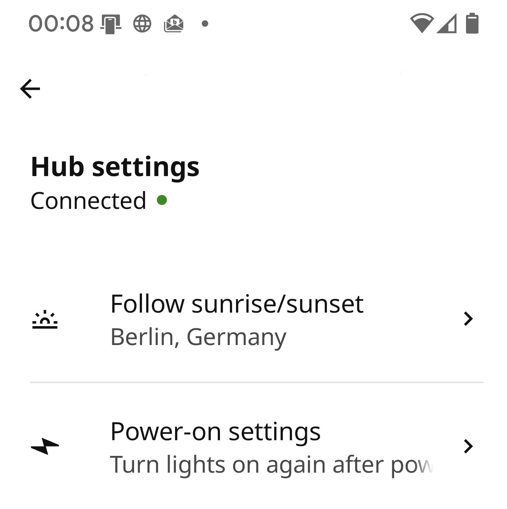
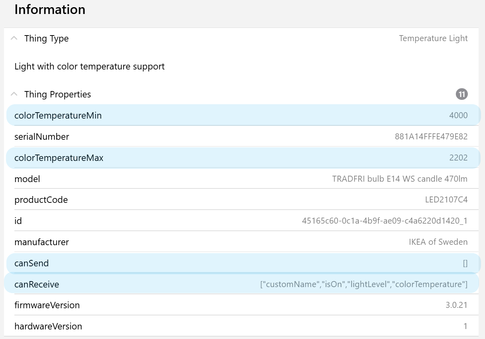

# DIRIGERA Binding

Binding supporting the DIRIGERA Gateway from IKEA.

## Supported Things

The DIRIGERA `bridge` is providing the connection to all devices and scenes.  

Refer to below sections which devices are supported and are covered by `things` connected to the DIRIGERA bridge.

| ThingTypeUID          | Description                                                | Section                                   | Products                                  |
|-----------------------|------------------------------------------------------------|-------------------------------------------|-------------------------------------------|
| `gateway`             | IKEA Gateway for smart products                            | [Gateway](#gateway-channels)              | DIRIGERA                                  |
| `air-purifier`        | Air cleaning device with particle filter                   | [Air Purifier](#air-purifier)             | STARKVIND                                 |
| `air-quality`         | Air measure for temperature, humidity and particles        | [Sensors](#air-quality-sensor)            | VINDSTYRKA                                |
| `blind`               | Window or door blind                                       | [Blinds](#blinds)                         | PRAKTLYSING ,KADRILJ ,FRYKTUR, TREDANSEN  |
| `blind-controller`    | Controller to open and close blinds                        | [Controller](#blind-controller)           | TRÅDFRI                                   |
| `switch-light`        | Light with switch ON, OFF capability                       | [Lights](#switch-lights)                  | TRÅDFRI                                   |
| `dimmable-light`      | Light with brightness support                              | [Lights](#dimmable-lights)                | TRÅDFRI                                   |
| `temperature-light`   | Light with color temperature support                       | [Lights](#temperature-lights)             | TRÅDFRI, FLOALT                           |
| `color-light`         | Light with color support                                   | [Lights](#color-lights)                   | TRÅDFRI, ORMANÅS                          |
| `light-controller`    | Controller to handle light attributes                      | [Controller](#light-controller)           | TRÅDFRI, RODRET,STYRBAAR                  |
| `motion-sensor`       | Sensor detecting motion events                             | [Sensors](#motion-sensor)                 | TRÅDFRI                                   |
| `motion-light-sensor` | Sensor detecting motion events and measures light level    | [Sensors](#motion-light-sensor)           | VALLHORN                                  |
| `single-shortcut`     | Shortcut controller with one button                        | [Controller](#single-shortcut-controller) | TRÅDFRI                                   |
| `double-shortcut`     | Shortcut controller with two buttons                       | [Controller](#double-shortcut-controller) | SOMRIG                                    |
| `simple-plug`         | Power plug                                                 | [Plugs](#simple-plug)                     | TRÅDFRI, ÅSKVÄDER                         |
| `power-plug`          | Power plug with status light and child lock                | [Plugs](#power-plug)                      | TRETAKT                                   |
| `smart-plug`          | Power plug with electricity measurements                   | [Plugs](#smart-power-plug)                | INSPELNING                                |
| `speaker`             | Speaker with player activities                             | [Speaker](#speaker)                       | SYMFONISK                                 |
| `sound-controller`    | Controller for speakers                                    | [Controller](#sound-controller)           | SYMFONISK, TRÅDFRI                        |
| `contact-sensor`      | Sensor tracking if windows or doors are open               | [Sensors](#contact-sensor)                | PARASOLL                                  |
| `water-sensor`        | Sensor to detect water leaks                               | [Sensors](#water-sensor)                  | BADRING                                   |
| `repeater`            | Repeater to strengthen signal                              | [Repeater](#repeater)                     | TRÅDFRI                                   |
| `scene`               | Scene from IKEA Home smart app which can be triggered      | [Scenes](#scenes)                         | -                                         |

## Discovery

The discovery will automatically detect your DIRIGERA Gateway via mDNS.
If it cannot be found check your router for IP address.
Manual scan isn't supported.

After successful creation of DIRIGERA Gateway and pairing process connected devices are automatically added to your INBOX.
You can switch off the automatic detection in [Bridge configuration](#bridge-configuration).

**Before adding the bridge** read [Pairing section](#gateway-pairing).

Devices connected to this bridge will be detected automatically unless you don't switch it off in [Bridge Configuration](#bridge-configuration)

## Gateway Bridge

### Bridge Configuration

| Name            | Type    | Description                                                | Explanation                                                                          | Default | Required |
|-----------------|---------|------------------------------------------------------------|--------------------------------------------------------------------------------------|---------|----------|
| `ipAddress`     | text    | DIRIGERA IP Address                                        | Use discovery to obtain this value automatically or enter it manually if known       | N/A     | yes      |
| `id`            | text    | Unique id of this gateway                                  | Detected automatically after successful pairing                                      | N/A     | no       |
| `discovery`     | boolean | Configure if paired devices shall be detected by discovery | Run continuously in the background and detect new, deleted or changed devices        | true    | no       |

### Gateway Pairing

First setup requires pairing the DIRIGERA gateway with openHAB.
You need physical access to the gateway to finish pairing so ensure you can reach it quickly.

Let's start pairing

1. Add the bridge found in discovery
1. Pairing started automatically after creation!
1. Press the button on the DIRIGERA rear side
1. Your bridge shall switch to ONLINE

### Gateway Channels

| Channel         | Type      | Read/Write | Description                                  |
|-----------------|-----------|------------|----------------------------------------------|
| `pairing`       | Switch    | RW         | Sets DIRIGERA hub into pairing mode          |
| `location`      | Location  | R(W)       | Location in lat.,lon. coordinates            |
| `sunrise`       | DateTime  | R          | Date and time of next sunrise                |
| `sunset`        | DateTime  | R          | Date and time of next sunset                 |
| `statistics`    | String    | R          | Several statistics about gateway activities  |

Channel `location` can overwrite GPS position with openHAB location, but it's not possible to delete GPS data.
See [Gateway Limitations](#gateway-limitations) for further information.

### Follow Sun



[Motion Sensors](#motion-sensor) can be active all the time or follow a schedule.
One schedule is follow the sun which needs to be activated in the IKEA Home smart app in _Hub Settings_.

## Things

With [DIRIGERA Gateway Bridge](#gateway-bridge) in place things can be connected as mentioned in the [supported things section](#supported-things).
Things contain generic configuration, properties and channels according to their capabilities.

### Generic Thing Configuration

Each thing is identified by a unique id which is mandatory to configure.
Discovery will automatically identify the id.

| Name              | Type    | Description                         | Default | Required |
|-------------------|---------|-------------------------------------|---------|----------|
| `id`              | text    | Unique id of this device / scene    | N/A     | yes      |

### Generic Thing Properties

Each thing has properties attached for product information.
It contains information of hardware and firmware version, device model and manufacturer.
Device capabilities are listed in `canReceive` and `canSend`.



### Generic Thing Channels

#### OTA Channels

Over-the-Air (OTA) updates are common for many devices.
If device is providing these channels is detected during runtime.

| Channel         | Type      | Read/Write | Description                                  | Advanced |
|-----------------|-----------|------------|----------------------------------------------|----------|
| `ota-status`    | Number    | R          | Over-the-air overall status                  |          |
| `ota-state`     | Number    | R          | Over-the-air current state                   |    X     |
| `ota-progress`  | Number    | R          | Over-the-air current progress                |    X     |

`ota-status` shows the _overall status_ if your device is _up to date_ or an _update is available_.
`ota-state` and `ota-progress` shows more detailed information which you may want to follow, that's why they are declared as advanced channels.

#### OTA Mappings

Mappings for `ota-status`

- 0 : Up to date
- 1 : Update available

Mappings for `ota-state`

- 0 : Ready to check
- 1 : Check in progress
- 2 : Ready to download
- 3 : Download in progress
- 4 : Update in progress
- 5 : Update failed
- 6 : Ready to update
- 7 : Check failed
- 8 : Download failed
- 9 : Update complete
- 10 : Battery check failed

#### Links and Candidates

Devices can be connected directly e.g. sensors or controllers with lights, plugs, blinds or speakers.
It's detected during runtime if a device is capable to support links _and_ if devices are available in your system to support this connection.
The channels are declared advanced and can be used for setup procedure.

| Channel               | Type                  | Read/Write | Description                                      | Advanced |
|-----------------------|-----------------------|------------|--------------------------------------------------|----------|
| `links`               | String                | RW         | Linked controllers and sensors                   |    X     |
| `link-candidates`     | String                | RW         | Candidates which can be linked                   |    X     |


Several devices can be linked together like

- [Light Controller](#light-controller) and [Motion Sensors](#motion-sensor) to [Plugs](#power-plugs) and [Lights](#lights)
- [Blind Controller](#blind-controller) to [Blinds](#blinds)
- [Sound Controller](#sound-controller) to [Speakers](#speaker)

Established links are shown in channel `links`.
The linked devices can be clicked in the UI and the link will be removed.

Possible candidates to be linked are shown in channel `link-candidates`.
If a candidate is clicked in the UI the link will be established.

Candidates and links marked with `(!)` are not present in openHAB environment so no handler is created yet.
In this case it's possible not all links are shown in the UI, but the present ones shall work.

#### Other Channels

| Channel               | Type              | Read/Write | Description                                  |
|-----------------------|-------------------|------------|----------------------------------------------|
| `startup`             | Number            | RW         | Startup behavior after power cutoff          |
| `custom-name`         | String            | RW         | Name given from IKEA home smart app          |

`startup` defines how the device shall behave after a power cutoff.
If there's a dedicated hardwired light switch which cuts power towards the bulb it makes sense to switch them on every time the switch is pressed.
But it's also possible to recover the last state.

Mappings for `startup`

- 0 : Previous
- 1 : On
- 2 : Off
- 3 : Switch

Option 3 is offered in IKEA Home smart app to control lights with using your normal light switch _slowly and smooth_.
With this the light shall stay online.
I wasn't able to reproduce this behavior.
Maybe somebody has more success.

`custom-name` is declared e.g. in your IKEA Home smart app.
This name is reflected in the discovery and if thing is created this name will be the thing label.
If `custom-name` is changed via openHAB API or a rule the label will not change.

### Unknown Devices

Filter your traces regarding 'DIRIGERA MODEL Unsupported Device'.
The trace contains a JSON object at the end which is needed to implement a corresponding handler.

## Air Purifier

Air cleaning device with particle filter.

| Channel               | Type              | Read/Write | Description                                  |
|-----------------------|-------------------|------------|----------------------------------------------|
| `fan-mode`            | Number            | RW         | Fan on, off, speed or automatic behavior     |
| `fan-speed`           | Dimmer            | RW         | Manual regulation of fan speed               |
| `fan-runtime`         | Number:Time       | R          | Fan runtime in minutes                       |
| `filter-elapsed`      | Number:Time       | R          | Filter elapsed time in minutes               |
| `filter-remain`       | Number:Time       | R          | Time to filter replacement in minutes        |
| `filter-lifetime`     | Number:Time       | R          | Filter lifetime in minutes                   |
| `filter-alarm`        | Switch            | R          | Filter alarm signal                          |
| `particulate-matter`  | Number:Density    | R          | Category 2.5 particulate matter              |
| `disable-status-light`| Switch            | RW         | Disable status light on plug                 |
| `child-lock`          | Switch            | RW         | Child lock for button on plug                |

There are several `Number:Time` which are delivered in minutes as default.
Note you can change the unit when connecting an item e.g. to `d` (days) for readability.
So you can check in a rule if your remaining filter time is going below 7 days instead of calculating minutes.

### Air Purifier Channel Mappings

Mappings for `fan-mode`

- 0 : Auto
- 1 : Low
- 2 : Medium
- 3 : High
- 4 : On
- 5 : Off

## Blinds

Window or door blind.

| Channel               | Type                  | Read/Write | Description                                      |
|-----------------------|-----------------------|------------|--------------------------------------------------|
| `blind-state`         | Number                | RW         | State if blind is moving up, down or stopped     |
| `blind-level`         | Dimmer                | RW         | Current blind level                              |
| `battery-level`       | Number:Dimensionless  | R          | Battery charge level in percent                  |

### Blind Channel Mappings

Mappings for `blind-state`

- 0 : Stopped
- 1 : Up
- 2 : Down

## Lights

Light devices in several variants.
Can be light bulbs, LED stripes, remote driver and more.
Configuration contains

| Name              | Type    | Description                                                         | Default | Required |
|-------------------|---------|---------------------------------------------------------------------|---------|----------|
| `id`              | text    | Unique id of this device / scene                                    | N/A     | yes      |
| `fadeTime`        | integer | Required time for fade sequnce to color or brightness               | 750     | yes      |
| `fadeSequence`    | integer | Define sequence if several light parameters are changed at once     | 0       | yes      |

`fadeTime` adjust fading time according to your device.
Current behavior shows commands are acknowledged while device is fading  but not executed correctly.
So they need to be executed one after another.
Maybe an update of the DIRIGERA gateway will change the current behavior and you can reduce them afterwards.

`fadeSequence` is only for [Color Lights](#color-lights).
Through `hsb` channel it's possible to adapt color brightness at once.
Again due to fading times they need to be executed in a sequence.
You can choose between options

- 0: First brightness, then color
- 1: First color, then brightness

### Lights ON OFF Behavior

When light is ON each command will change the settings accordingly immediately.
During power OFF the lights will preserve some values until next power ON.

| Channel               | Type          | Behavior                                                                  |
|-----------------------|---------------|---------------------------------------------------------------------------|
| `power`               | ON            | Switch ON, apply last / stored values                                     |
| `brightness`          | ON            | Switch ON, apply last / stored values                                     |
| `brightness`          | value > 0     | Switch ON, apply this brightness, apply last / stored values              |
| `color-temperature`   | ON            | Switch ON, apply last / stored values                                     |
| `color-temperature`   | any           | Store value, brightness stays at previous level                           |
| `color`               | ON            | Switch ON, apply last / stored values                                     |
| `color`               | value > 0     | Switch ON, apply this brightness, apply last / stored values              |
| `color`               | h,s,b         | Store color and brightness for next ON                                    |
| outside               |               | Switch ON, apply last / stored values                                     |

## Switch Lights

Light with switch ON, OFF capability

| Channel               | Type                  | Read/Write | Description                                      |
|-----------------------|-----------------------|------------|--------------------------------------------------|
| `power`               | Switch                | RW         | Power state of light                             |

## Dimmable Lights

Light with brightness support.

| Channel               | Type                  | Read/Write | Description                                      |
|-----------------------|-----------------------|------------|--------------------------------------------------|
| `power`               | Switch                | RW         | Power state of light                             |
| `brightness`          | Dimmer                | RW         | Control brightness of light                      |

Channel `brightness` can receive

- ON / OFF
- numbers from 0 to 100 as percent where 0 will switch the light OFF, any other > 0 switches light ON

## Temperature Lights

Light with color temperature support.

| Channel                   | Type                  | Read/Write | Description                                          | Advanced |
|---------------------------|-----------------------|------------|------------------------------------------------------|----------|
| `power`                   | Switch                | RW         | Power state of light                                 |          |
| `brightness`              | Dimmer                | RW         | Control brightness of light                          |          |
| `color-temperature`       | Dimmer                | RW         | Color temperature from cold (0 %) to warm (100 %)    |          |
| `color-temperature-abs`   | Number:Temperature    | RW         | Color temperature of a bulb in Kelvin                |    X     |

## Color Lights

Light with color support.

| Channel                   | Type                  | Read/Write | Description                                          | Advanced |
|---------------------------|-----------------------|------------|------------------------------------------------------|----------|
| `power`                   | Switch                | RW         | Power state of light                                 |          |
| `brightness`              | Dimmer                | RW         | Brightness of light in percent                       |          |
| `color-temperature`       | Dimmer                | RW         | Color temperature from cold (0 %) to warm (100 %)    |          |
| `color-temperature-abs`   | Number:Temperature    | RW         | Color temperature of a bulb in Kelvin                |          |
| `color`                   | Color                 | RW         | Color of light with hue, saturation and brightness   |    X     |

Channel `color` can receive

- ON / OFF
- numbers from 0 to 100 as brightness in percent where 0 will switch the light OFF, any other > 0 switches light ON
- triple values for hue, saturation, brightness

## Power Plugs

Power plugs in different variants.

## Simple Plug

Simple plug with control of power state and startup behavior.

| Channel               | Type                  | Read/Write | Description                                  |
|-----------------------|-----------------------|------------|----------------------------------------------|
| `power`               | Switch                | RW         | Power state of plug                          |

## Power Plug

Power plug with control of power state, startup behavior, hardware on/off button and status light.
Same channels as [Simple Plug](#simple-plug) plus following channels.

| Channel               | Type                  | Read/Write | Description                                  |
|-----------------------|-----------------------|------------|----------------------------------------------|
| `child-lock`          | Switch                | RW         | Child lock for button on plug                |
| `disable-status-light`| Switch                | RW         | Disable status light on plug                 |

## Smart Power Plug

Smart plug like [Power Plug](#power-plug) plus measuring capability.

| Channel               | Type                      | Read/Write | Description                                  |
|-----------------------|---------------------------|------------|----------------------------------------------|
| `electric-power`      | Number:Power              | R          | Electric power delivered by plug             |
| `energy-total`        | Number:Energy             | R          | Total energy consumption                     |
| `energy-reset`        | Number:Energy             | R          | Energy consumption since last reset          |
| `reset-date`          | DateTime                  | RW         | Date and time of last reset                  |
| `electric-current`    | Number:ElectricCurrent    | R          | Electric current measured by plug            |
| `electric-voltage`    | Number:ElectricPotential  | R          | Electric potential of plug                   |

Smart plug provides `energy-total` measuring energy consumption over lifetime and `energy-reset` measuring energy consumption from `reset-date` till now.
Channel `reset-date` is writable and will set the date time to the timestamp of command execution.
Past and future timestamps are not possible and will be ignored.

## Sensors

Various sensors for detecting events and measuring.

## Motion Sensor

Sensor detecting motion events.

| Channel               | Type                  | Read/Write | Description                                      |
|-----------------------|-----------------------|------------|--------------------------------------------------|
| `motion`              | Switch                | R          | Motion detected by the device                    |
| `active-duration`     | Number:Time           | RW         | Keep connected devices active for this duration  |
| `battery-level`       | Number:Dimensionless  | R          | Battery charge level in percent                  |
| `schedule`            | Number                | RW         | Schedule when the sensor shall be active         |
| `schedule-start`      | DateTime              | RW         | Start time of sensor activity                    |
| `schedule-end`        | DateTime              | RW         | End time of sensor activity                      |
| `light-preset`        | String                | RW         | Light presets for different times of the day     |

When motion is detected via `motion` channel all connected devices from `links` channel will be active for the time configured in `active-duration`.
Standard duration is seconds if raw number is sent as command.
See [Motion Sensor Rules](#motion-sensor-rules) for further examples.
  
Mappings for `schedule`

- 0 : Always, sensor is always active
- 1 : Follow sun, sensor gets active at sunset and deactivates at sunrise
- 2 : Schedule, custom schedule with manual start and end time

If option 1, follow sun is selected ensure you gave the permission in the IKEA Home smart app to use your GPS position to calculate times for sunrise and sunset.

See [Light Controller](#light-controller) for light-preset`.

## Motion Light Sensor

Sensor detecting motion events and measures light level.
Same channels as [Motion Sensor](#motion-sensor) with an additional `illuminance` channel.

| Channel               | Type                  | Read/Write | Description                                  |
|-----------------------|-----------------------|------------|----------------------------------------------|
| `illuminance`         | Number:Illuminance    | R          | Illuminance in Lux                           |

## Water Sensor

Sensor to detect water leaks.

| Channel               | Type                  | Read/Write | Description                                  |
|-----------------------|-----------------------|------------|----------------------------------------------|
| `leak`                | Switch                | R          | Water leak detected                          |
| `battery-level`       | Number:Dimensionless  | R          | Battery charge level in percent              |

## Contact Sensor

Sensor tracking if windows or doors are open

| Channel               | Type                  | Read/Write | Description                                  |
|-----------------------|-----------------------|------------|----------------------------------------------|
| `contact`             | Contact               | R          | State if door or window is open or closed    |
| `battery-level`       | Number:Dimensionless  | R          | Battery charge level in percent              |

## Air Quality Sensor

Air measure for temperature, humidity and particles.

| Channel               | Type                  | Read/Write | Description                                          |
|-----------------------|-----------------------|------------|------------------------------------------------------|
| `temperature`         | Number:Temperature    | R          | Air Temperature                                      |
| `humidity`            | Number:Dimensionless  | R          | Air Humidity                                         |
| `particulate-matter`  | Number:Density        | R          | Category 2.5 particulate matter                      |
| `voc-index`           | Number                | R          | Relative VOC intensity compared to recent history    |

The VOC Index mimics the human nose’s perception of odors with a relative intensity compared to recent history.
The VOC Index is also sensitive to odorless VOCs, but it cannot discriminate between them.
See more information in the [sensor description](https://sensirion.com/media/documents/02232963/6294E043/Info_Note_VOC_Index.pdf).

## Controller

Controller for lights, plugs, blinds, shortcuts and speakers.

## Single Shortcut Controller

Shortcut controller with one button.

| Channel               | Type                  | Read/Write | Description                                  |
|-----------------------|-----------------------|------------|----------------------------------------------|
| `button1`             | trigger               |            | Trigger of first button                      |
| `battery-level`       | Number:Dimensionless  | R          | Battery charge level in percent              |

### Button Triggers

Triggers for `button1`

- SHORT_PRESSED
- DOUBLE_PRESSED
- LONG_PRESSED

## Double Shortcut Controller

Shortcut controller with two buttons.

| Channel               | Type                  | Read/Write | Description                                  |
|-----------------------|-----------------------|------------|----------------------------------------------|
| `button2`             | trigger               |            | Trigger of second button                     |

Same as [Single Shortcut Controller](#single-shortcut-controller) with additional `button2` trigger channel.

## Light Controller

Controller to handle light attributes.

| Channel               | Type                  | Read/Write | Description                                  |
|-----------------------|-----------------------|------------|----------------------------------------------|
| `battery-level`       | Number:Dimensionless  | R          | Battery charge level in percent              |
| `light-preset`        | String                | RW         | Light presets for different times of the day |


Channel `light-preset` provides a JSON array with time an light settings for different times.
If light is switched on by the controller the light attributes for the configured time section is used.
This only works for connected devices shown in channel `links`.

IKEA provided some presets which can be selected but it's also possible to generate a custom schedule.
They are provided as options as strings

- Warm
- Slowdown
- Smooth
- Bright

This feature is from IKEA test center and not officially present in the IKEA Home smart app now.

## Blind Controller

Controller to open and close blinds.

| Channel               | Type                  | Read/Write | Description                                  |
|-----------------------|-----------------------|------------|----------------------------------------------|
| `battery-level`       | Number:Dimensionless  | R          | Battery charge level in percent              |

## Sound Controller

Controller for speakers.

| Channel               | Type                  | Read/Write | Description                                  |
|-----------------------|-----------------------|------------|----------------------------------------------|
| `battery-level`       | Number:Dimensionless  | R          | Battery charge level in percent              |

## Speaker

Speaker with player activities.

| Channel               | Type                  | Read/Write | Description                                  |
|-----------------------|-----------------------|------------|----------------------------------------------|
| `media-control`       | Player                | RW         | Media control  play, pause, next, previous   |
| `volume`              | Dimmer                | RW         | Handle volume in percent                     |
| `mute`                | Switch                | R(W)       | Mute current audio without stop playing      |
| `shuffle`             | Switch                | RW         | Control shuffle mode                         |
| `crossfade`           | Switch                | RW         | Cross fading between tracks                  |
| `repeat`              | Number                | RW         | Over-the-air overall status                  |
| `media-title`         | String                | R          | Title of a played media file                 |
| `image`               | RawType               | R          | Current playing track image                  |

Channel `mute` should be writable but this isnn't the case now.
See [Known Limitations](#speaker-limitations).

## Repeater

Repeater to strengthen signal.
Sadly there's no further information like _signal strength_ available so only [OTA channels](#ota-channels) and [custom name](#other-channels) is available.

## Scenes

Scene from IKEA home smart app which can be triggered.

| Channel               | Type                  | Read/Write | Description                                  |
|-----------------------|-----------------------|------------|----------------------------------------------|
| `trigger`             | Number                | RW         | Trigger / undo scene execution               |
| `last-trigger`        | DateTime              | R          | Date and time when last trigger occurred     |

Scenes are defined in IKEA Home smart app and can be performed via `trigger` channel.
Two commands are defined:

- 0 : Trigger
- 1 : Undo

If command 0 (Trigger) is sent scene will be executed.
There's a 30 seconds time slot to send command 1 (Undo).
The countdown is updating `trigger` channel state which can be evaluated if an undo operation is still possible.
State will switch to `Undef` after countdown.

## Known Limitations

### Gateway Limitations

Gateway channel `location` is reflecting the state correctly but isn't writable.
The Model says it `canReceive` command `coordinates` but in fact sending responds `http status 400`.
Channel will stay in this binding hoping a DIRIGERA software update will resolve this issue.

### Speaker Limitations

Speaker channel `mute` is reflecting the state correctly but isn't writable.
The Model says it `canReceive` command `isMuted` but in fact sending responds `http status 400`.
If mute is performed on Sonos App the channel is updating correctly, but sending the command fails!
Channel will stay in this binding hoping a DIRIGERA software update will resolve this issue.

## Development and Testing

Debugging is essential for such a binding which supports many available products and needs to support future products.
General debug messages will overflow traces and it's hard to find relevant information.
To deal with these challenges commands for [openHAB console](https://www.openhab.org/docs/administration/console.html) are provided.

```shell
Usage: openhab:dirigera token - Get token from DIRIGERA hub
Usage: openhab:dirigera json [<deviceId> | all] - Print JSON data
Usage: openhab:dirigera debug [<deviceId> | all] [true | false]  - Enable / disable detailed debugging for specific / all devices
```

### `token`

Prints the access token to communicate with DIRIGERA gateway as console output.

```shell
console> openhab:dirigera token
DIRIGERA Hub token: abcdef12345.......
```

With token available you can test your devices e.g. via curl commands.

```shell
curl -X PATCH https://$YOUR_IP:8443/v1/devices/$DEVICE -H 'Authorization: Bearer $TOKEN' -H 'Content-Type: application/json' -d '[{"attributes":{"colorHue":280,"colorSaturation":1}}]' --insecure
```

Replace content in curl command with following variables:

- $YOUR_IP - IP address of DIRIGERA gateway
- $DEVICE - bulb id you want to control, take it from configuration
- $TOKEN - shortly stop / start DIRIGERA bridge and search for obtained token

### `json`

Get capabilities and current status for one `deviceId` or all devices.
Output is shown on console as JSON String.

```shell
console> openhab:dirigera json 3c8b0049-eb5c-4ea1-9da3-cdedc50366ef_1
{"deviceType":"light","isReachable":true,"capabilities":{"canReceive":["customName","isOn","lightLevel","colorTemperature", ...}
```

### `debug`

Enables or disables detailed logging for one `deviceId` or all devices.
Answer is `Done` if command is successfully executed.
If you operate with the device you can see requests and responses in openHAB Log Viewer.
If device cannot be found answer is `Device Id xyz not found`.

```shell
console> openhab:dirigera debug all true
Done
```

## Full Example

### Thing Configuration

```java
Bridge dirigera:gateway:myhome                      "My wonderful Home"         [ ipAddress="1.2.3.4", discovery=true ] {
    Thing temperature-light     living-room-bulb    "Living Room Table Lamp"    [ id="aaaaaaaa-bbbb-xxxx-yyyy-zzzzzzzzzzzz"]
    Thing smart-plug            dishwasher          "Dishwasher"                [ id="zzzzzzzz-yyyy-xxxx-aaaa-bbbbbbbbbbbb"]
    Thing motion-sensor         bedroom-motion      "Bedroom Motion"            [ id="zzzzzzzz-yyyy-xxxx-aaaa-ffffffffffff"]
}
```

### Item Configuration

```java
Switch                      Bedroom_Motion_Detection        { channel="dirigera:motion-sensor:myhome:bedroom-motion:motion" }
Number:Time                 Bedroom_Motion_Active_Duration  { channel="dirigera:motion-sensor:myhome:bedroom-motion:active-duration" }
Number                      Bedroom_Motion_Schedule         { channel="dirigera:motion-sensor:myhome:bedroom-motion:schedule" }
DateTime                    Bedroom_Motion_Schedule_Start   { channel="dirigera:motion-sensor:myhome:bedroom-motion:schedule-start" }
DateTime                    Bedroom_Motion_Schedule_End     { channel="dirigera:motion-sensor:myhome:bedroom-motion:schedule-end" }
Number:Dimensionless        Bedroom_Motion_Battery_Level    { channel="dirigera:motion-sensor:myhome:bedroom-motion:battery-level" }

Switch                      Table_Lamp_Power_State      { channel="dirigera:temperature-light:myhome:living-room-bulb:power" }
Dimmer                      Table_Lamp_Brightness       { channel="dirigera:temperature-light:myhome:living-room-bulb:brightness" }
Dimmer                      Table_Lamp_Temperature      { channel="dirigera:temperature-light:myhome:living-room-bulb:color-temperature" }
Number                      Table_Lamp_Startup          { channel="dirigera:temperature-light:myhome:living-room-bulb:startup" }
Number                      Table_Lamp_OTA_Status       { channel="dirigera:temperature-light:myhome:living-room-bulb:ota-status" }
Number                      Table_Lamp_OTA_State        { channel="dirigera:temperature-light:myhome:living-room-bulb:ota-state" }
Number                      Table_Lamp_OTA_Progress     { channel="dirigera:temperature-light:myhome:living-room-bulb:ota-progress" }

Switch                      Dishwasher_Power_State      { channel="dirigera:smart-plug:myhome:dishwasher:power" }
Switch                      Dishwasher_Child_lock       { channel="dirigera:smart-plug:myhome:dishwasher:child-lock" }
Switch                      Dishwasher_Disable_Light    { channel="dirigera:smart-plug:myhome:dishwasher:disable-light" }
Number:Power                Dishwasher_Power            { channel="dirigera:smart-plug:myhome:dishwasher:electric-power" }
Number:Energy               Dishwasher_Energy_Total     { channel="dirigera:smart-plug:myhome:dishwasher:energy-total" }
Number:Energy               Dishwasher_Energy_Reset     { channel="dirigera:smart-plug:myhome:dishwasher:energy-reset" }
Number:ElectricCurrent      Dishwasher_Ampere           { channel="dirigera:smart-plug:myhome:dishwasher:electric-current" }
Number:ElectricPotential    Dishwasher_Voltage          { channel="dirigera:smart-plug:myhome:dishwasher:electric-potential" }
Number                      Dishwasher_Startup          { channel="dirigera:smart-plug:myhome:dishwasher:startup" }
Number                      Dishwasher_OTA_Status       { channel="dirigera:smart-plug:myhome:dishwasher:ota-status" }
Number                      Dishwasher_OTA_State        { channel="dirigera:smart-plug:myhome:dishwasher:ota-state" }
Number                      Dishwasher_OTA_Progress     { channel="dirigera:smart-plug:myhome:dishwasher:ota-progress" }
```

### Rule Examples

#### Shortcut Controller Rules

Catch triggers from shortcut controller and trigger a scene.

```java
rule "Shortcut Button 1 Triggers"
when
    Channel 'dirigera:double-shortcut:myhome:my-shortcut-controller:button1' triggered
then
    logInfo("DIRIGERA","Button 1 {}",receivedEvent)
    myhome-light-scene.sendCommand(0)
end
```

#### Motion Sensor Rules

Change the active duration time

```java
rule "Sensor configuration"
when
    System started
then
    logInfo("DIRIGERA","Configuring IKEA sensors")
    // active duration = 180 seconds
    Bedroom_Motion_Active_Duration.sendCommand(180)
    // active duration = 3 minutes aka 180 seconds
    Bedroom_Motion_Active_Duration.sendCommand("3 min")
end
```

## Credits

This work is based on [Leggin](https://github.com/Leggin/dirigera) and [dvdgeisler](https://github.com/dvdgeisler/DirigeraClient).
Without these contributions this binding wouldn't be possible!
