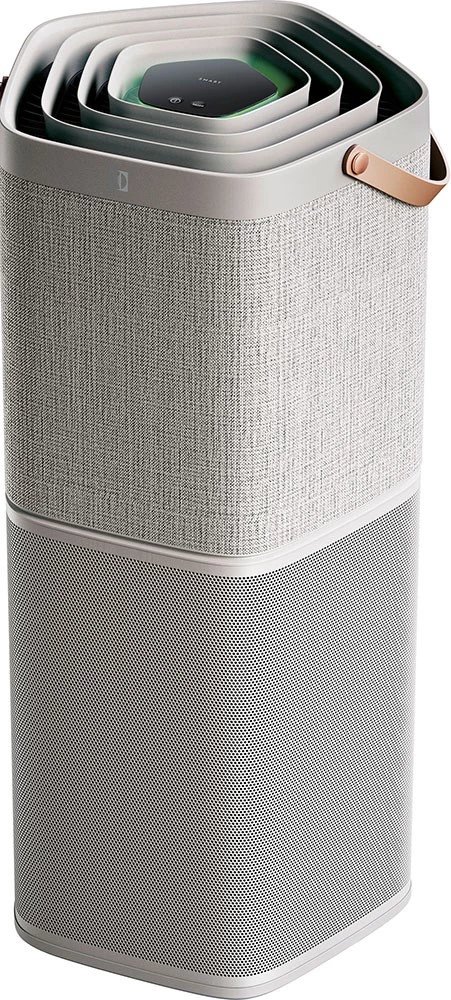

# ElectroluxAir Binding

This is an openHAB binding for the Pure A9 Air Purifier, by Electrolux.

This binding uses the Electrolux Delta REST API.

<p align="center">

</p>

## Supported Things

This binding supports the following thing types:

- Bridge
- Electrolux Pure A9

## Discovery

After the configuration of the Bridge, your Electrolux Pure A9 device will be automatically discovered and placed as a thing in the inbox.


## Binding Configuration

You will have to configure the bridge with username and password, these must be the same credentials as used when logging into your Electrolux Wellbeing app. 


### Configuration Options

#### Bridge

*   `username` - The username used to connect to the Electrolux Wellbeing app

*   `password` - The password used to connect to the Electrolux Wellbeing app

*   `refresh` - Specifies the refresh interval in second

If you define the bridge in a things-file the bridge type id is defined as `bridge`, e.g.:

`Bridge electroluxair:bridge:myElectroluxAirBridge`


## Thing Configuration

Only the bridge require manual configuration. The thing can be added by hand, or you can let the discovery mechanism automatically find your Electrolux Pure A9 thing.

### Configuration Options

#### Electrolux Pure A9

*   `deviceId` - Product ID of your Electrolux Pure A9 found in Electrolux Wellbeing app


## Enable Debugging

To enable DEBUG or TRACE logging for the binding, login to Karaf console and for DEBUG level enter:

`openhab> log:set DEBUG org.openhab.binding.electroluxair`

## Channels

### Bridge

The following channels are supported:

| Channel Type ID | Item Type | Description                                                                                     |
|-----------------|-----------|-------------------------------------------------------------------------------------------------|
| status          | String    | This channel can be used to trigger an instant refresh by sending a RefreshType.REFRESH command.|

### Electrolux Pure A9

The following channels are supported:

| Channel Type ID             | Item Type             | Description                                                                 | 
|-----------------------------|-----------------------|-----------------------------------------------------------------------------|
| temperature                 | Number:Temperature    | This channel reports the current temperature.                               |
| humidity                    | Number:Dimensionless  | This channel reports the current humidity in percentage.                    |
| tvoc                        | Number:Dimensionless  | This channel reports the total Volatile Organic Compounds in microgram/m3.  |
| pm1                         | Number:Density        | This channel reports the Particulate Matter 1 in ppb.                       |
| pm2_5                       | Number:Density        | This channel reports the Particulate Matter 2.5 in ppb.                     |
| pm10                        | Number:Density        | This channel reports the Particulate Matter 10 in ppb.                      |
| co2                         | Number:Dimensionless  | This channel reports the CO2 level in ppm.                                  |
| fanSpeed                    | String                | This channel sets and reports the current fan speed (1-9).                  |
| filterLife                  | Number:Dimensionless  | This channel reports the remaining filter life in %.                        |
| ionizer                     | Switch                | This channel sets and reports the status of the ionizer function (On/Off).  |
| doorOpen                    | Contact               | This channel reports the status of door (Opened/Closed).                    |
| workMode                    | Contact               | This channel sets and reports the current work mode (Auto, Manual, PowerOff.|


## Full Example

### Things-file

````
// Bridge configuration
Bridge electroluxair:api:myAPI "Electrolux Delta API" [username="user@password.com", password="12345", refresh="300"] {

     Thing electroluxpurea9 MyElectroluxPureA9  "Electrolux Pure A9"    [ deviceId="123456789" ]
     
}
````


