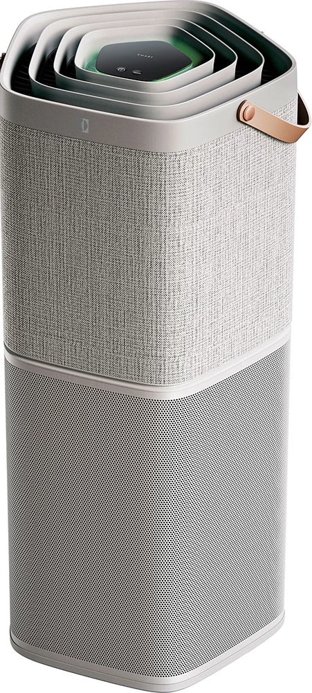

# Electrolux Appliances Binding

This is an openHAB binding for Electrolux Appliances.



## Supported Things

This binding supports the following thing types:

- api: Bridge - Implements the Electrolux Group API that is used to communicate with the different appliances

- electroluxairpurifier: The Electrolux Air Purifier

- electroluxwashingmachine: The Electrolux Washing Machine

## Discovery

After the configuration of the Bridge, your Electrolux appliances will be automatically discovered and placed as a thing in the inbox.

### Configuration Options

Only the bridge require manual configuration. The Electrolux appliances things can be added by hand, or you can let the discovery mechanism automatically find them.

#### Bridge

| Parameter    | Description                                           | Type   | Default  | Required |
|--------------|-------------------------------------------------------|--------|----------|----------|
| apiKey       | Your created API key on developer.electrolux.one      | String | NA       | yes      |        
| accessToken  | Your created access token on developer.electrolux.one | String | NA       | yes      |
| refreshToken | Your created access token on developer.electrolux.one | String | NA       | yes      |
| refresh      | Specifies the refresh interval in second              | Number | 600      | yes      |

#### Electrolux Air Purifier

| Parameter    | Description                                                              | Type   | Default  | Required |
|--------------|--------------------------------------------------------------------------|--------|----------|----------|
| serialNumber | Serial Number of your Electrolux appliance found in the Electrolux app   | Number | NA       | yes      |


#### Electrolux Washing Machine

| Parameter    | Description                                                              | Type   | Default  | Required |
|--------------|--------------------------------------------------------------------------|--------|----------|----------|
| serialNumber | Serial Number of your Electrolux appliance found in the Electrolux app   | Number | NA       | yes      |


## Channels

### Electrolux Air Purifier

The following channels are supported:

| Channel Type ID             | Item Type             | Description                                                                    |
|-----------------------------|-----------------------|--------------------------------------------------------------------------------|
| temperature                 | Number:Temperature    | This channel reports the current temperature.                                  |
| humidity                    | Number:Dimensionless  | This channel reports the current humidity in percentage.                       |
| tvoc                        | Number:Dimensionless  | This channel reports the total Volatile Organic Compounds in ppb.              |
| pm1                         | Number:Density        | This channel reports the Particulate Matter 1 in microgram/m3.                 |
| pm2_5                       | Number:Density        | This channel reports the Particulate Matter 2.5 in microgram/m3.               |
| pm10                        | Number:Density        | This channel reports the Particulate Matter 10 in microgram/m3.                |
| co2                         | Number:Dimensionless  | This channel reports the CO2 level in ppm.                                     |
| fanSpeed                    | Number                | This channel sets and reports the current fan speed (1-9).                     |
| filterLife                  | Number:Dimensionless  | This channel reports the remaining filter life in %.                           |
| ionizer                     | Switch                | This channel sets and reports the status of the Ionizer function (On/Off).     |
| doorOpen                    | Contact               | This channel reports the status of door (Opened/Closed).                       |
| workMode                    | String                | This channel sets and reports the current work mode (Auto, Manual, PowerOff.)  |
| uiLIght                     | Switch                | This channel sets and reports the status of the UI Light function (On/Off).    |
| safetyLock                  | Switch                | This channel sets and reports the status of the Safety Lock function (On/Off). |
| connectionState             | Switch                | This channel reports the connection status.                                    |


### Electrolux Washing Machine

The following channels are supported:

| Channel Type ID             | Item Type             | Description                                                                    |
|-----------------------------|-----------------------|--------------------------------------------------------------------------------|
| doorState                   | Contact               | This channel reports the status of door (Opened/Closed).                       |
| doorLock                    | Switch                | This channel reports the status of the door lock (On/Off).                     |
| startTime                   | Number:Time           | This channel reports the start time for a washing program.                     |
| timeToEnd                   | Number:Time           | This channel reports the time to end for a washing program.                    |
| cyclePhase                  | String                | This channel reports the washing cycle phase.                                  |
| analogTemperature           | String                | This channel reports the washing temperature.                                  |
| steamValue                  | String                | This channel reports the washing steam value.                                  |
| programsOrder               | String                | This channel reports the washing program.                                      |
| analogSpinSpeed             | String                | This channel reports the washing spin speed.                                   |
| applianceState              | String                | This channel reports the appliance state.                                      |
| applianceMode               | String                | This channel reports the appliance mode.                                       |
| applianceTotalWorkingTime   | Number:Time           | This channel reports the total working time for the washing machine.           |
| applianceUiSwVersion        | String                | This channel reports the appliance UI SW version.                              |
| optisenseResult             | String                | This channel reports the optisense result.                                     |
| detergentExtradosage        | String                | This channel reports the detergent extra dosage.                               |
| softenerExtradosage         | String                | This channel reports the softener extra dosage.                                |
| waterUsage                  | Number                | This channel reports the water usage.                                          |
| totalWashCyclesCount        | Number                | This channel reports the total number of washing cycles.                       |
| connectionState             | Switch                | This channel reports the connection status.                                    |


## Full Example

### Things-file

```java
// Bridge configuration
Bridge electroluxappliances:api:myAPI "Electrolux Group API" [apiKey="12345678", accessToken="12345678", refreshToken="12345678", refresh="300"] {

     Thing electroluxpurea9 myElectroluxPureA9  "Electrolux Pure A9"    [ serialNummber="123456789" ]
     
}
```

## Items-file

```java
// CO2
Number:Dimensionless electroluxappliancesCO2 "Electrolux Air CO2 [%d ppm]" {channel="electroluxappliances:electroluxpurea9:myAPI:MyElectroluxPureA9:co2"}
// Temperature
Number:Temperature electroluxappliancesTemperature "Electrolux Air Temperature" {channel="electroluxappliances:electroluxpurea9:myAPI:myElectroluxPureA9:temperature"}
// Door status
Contact electroluxappliancesDoor "Electrolux Air Door Status" {channel="electroluxappliances:electroluxpurea9:myAPI:myElectroluxPureA9:doorOpen"}
// Work mode
String electroluxappliancesWorkModeSetting "electroluxappliances Work Mode Setting" {channel="electroluxappliances:electroluxpurea9:myAPI:myElectroluxPureA9:workMode"}
// Fan speed
Number electroluxappliancesFanSpeed "Electrolux Air Fan Speed Setting" {channel="electroluxappliances:electroluxpurea9:myAPI:myElectroluxPureA9:fanSpeed"}
// UI Light
Switch electroluxappliancesUILight "Electrolux Air UI Light Setting" {channel="electroluxappliances:electroluxpurea9:myAPI:myElectroluxPureA9:uiLight"}
// Ionizer
Switch electroluxappliancesIonizer "Electrolux Air Ionizer Setting" {channel="electroluxappliances:electroluxpurea9:myAPI:myElectroluxPureA9:ionizer"}
// Safety Lock
Switch electroluxappliancesSafetyLock "Electrolux Air Safety Lock Setting" {channel="electroluxappliances:electroluxpurea9:myAPI:myElectroluxPureA9:safetyLock"}
```
