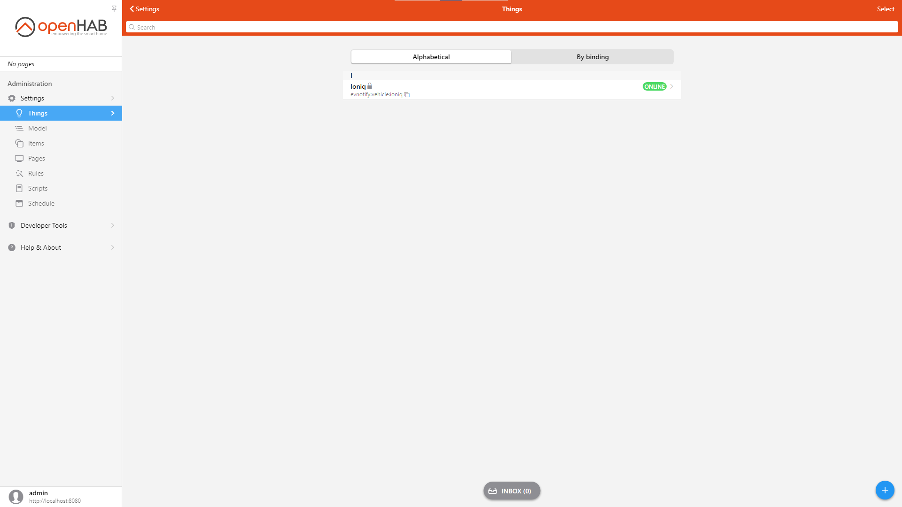
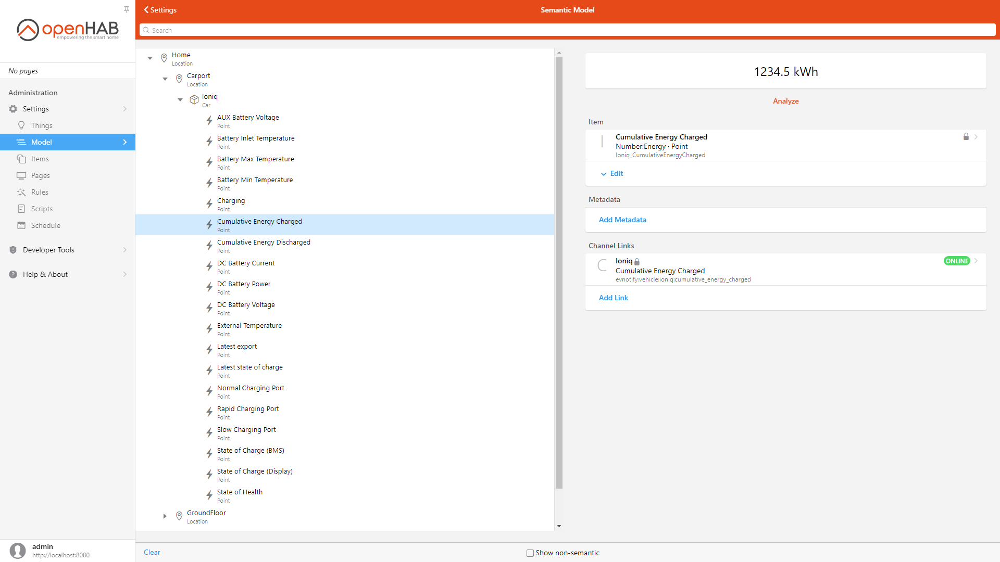

# EVNotify Binding

This binding can be used to read data for a given electric vehicle from the EVNotify online service (account). Please see [EVNotify](https://evnotify.de/).

It allows you to monitor different data from your electric vehicle (e.g. state of charge, state of health, etc.).

The binding was tested with a Hyundai Ioniq electric.

## Supported Things

| Thing Type | Description |
| ---------- | ----------- |
| `vehicle`  | The vehicle represents a connection to the [EVNotify](https://evnotify.de/) online service (account) |

## Discovery

There is no discovery implemented. You have to create your things manually and specify the `AKey` and the `Token` of your [EVNotify](https://evnotify.de/) online service (account).

## Binding Configuration

The binding has no configuration options, all configuration is done at `vehicle` level.

## Thing Configuration

### Vehicle Thing Configuration

| Parameter         | Description | Required | Default |
| ----------------- | ----------- | :------: | :-----: |
| `AKey`            | AKey used for EVNotify API access | yes | - |
| `Token`           | Token used for EVNotify API access. It is like a password. Do not share this with people you do not trust! | yes | - |
| `refreshInterval` | Refresh interval for reading data from EVNotify online service (in seconds) | no | 120 |

## Channels

### Channels for Vehicle Thing

| Channel ID                     | Item Type | Description                                    |
| ------------------------------ | --------- | ---------------------------------------------- |
| `soc_display`                  | Number    | State of Charge (Display)                      |
| `soc_bms`                      | Number    | State of Charge (BMS)                          |
| `last_soc`                     | String    | Timestamp of the latest state of charge export |
| `soh`                          | Number    | State of Health                                |
| `charging`                     | Switch    | ON if charging                                 |
| `rapid_charge_port`            | Switch    | ON if connected to a rapid charging port       |
| `normal_charge_port`           | Switch    | ON if connected to a normal charging port      |
| `slow_charge_port`             | Switch    | ON if connected to a slow charging port        |
| `aux_battery_voltage`          | Number    | Voltage of the aux battery                     |
| `dc_battery_voltage`           | Number    | Voltage of the DC battery                      |
| `dc_battery_current`           | Number    | Current of the DC battery                      |
| `dc_battery_power`             | Number    | Power of the DC battery                        |
| `cumulative_energy_charged`    | Number    | Amount of energy that has been charged         |
| `cumulative_energy_discharged` | Number    | Amount of energy that has been discharged      |
| `battery_min_temperature`      | Number    | The minimum temperature of the battery         |
| `battery_max_temperature`      | Number    | The maximum temperature of the battery         |
| `battery_inlet_temperature`    | Number    | The inlet temperature of the battery           |
| `external_temperature`         | Number    | External temperature                           |
| `last_extended`                | String    | Timestamp of the latest export                 |                                                                                 |

## Full Example

### evnotify.things

```properties
# Thing evnotify:vehicle:YOUR_VEHICLE_ID "YOUR_VEHICLE_LABEL" @ "YOUR_VEHICLE_LOCATION" [akey="YOUR_AKEY",token="YOUR_TOKEN",refreshInterval=120]
Thing evnotify:vehicle:ioniq "Ioniq" @ "Carport" [akey="YOUR_AKEY",token="YOUR_TOKEN",refreshInterval=120]
```



### evnotify.items

```properties
// Equipment representing thing:
// evnotify:vehicle:ioniq
// (Ioniq)

Group Ioniq "Ioniq" ["Car"]

// Points:

Number                   Ioniq_StateofChargeDisplay       "State of Charge (Display)"     (Ioniq) ["Point"]  { channel="evnotify:vehicle:ioniq:soc_display" }                  
Number                   Ioniq_StateofChargeBMS           "State of Charge (BMS)"         (Ioniq) ["Point"]  { channel="evnotify:vehicle:ioniq:soc_bms" }                      
String                   Ioniq_Lateststateofcharge        "Latest state of charge"        (Ioniq) ["Point"]  { channel="evnotify:vehicle:ioniq:last_soc" }                     
Number                   Ioniq_StateofHealth              "State of Health"               (Ioniq) ["Point"]  { channel="evnotify:vehicle:ioniq:soh" }                          
Switch                   Ioniq_Charging                   "Charging"                      (Ioniq) ["Point"]  { channel="evnotify:vehicle:ioniq:charging" }                     
Switch                   Ioniq_RapidChargingPort          "Rapid Charging Port"           (Ioniq) ["Point"]  { channel="evnotify:vehicle:ioniq:rapid_charge_port" }            
Switch                   Ioniq_NormalChargingPort         "Normal Charging Port"          (Ioniq) ["Point"]  { channel="evnotify:vehicle:ioniq:normal_charge_port" }           
Switch                   Ioniq_SlowChargingPort           "Slow Charging Port"            (Ioniq) ["Point"]  { channel="evnotify:vehicle:ioniq:slow_charge_port" }             
Number:ElectricPotential Ioniq_AUXBatteryVoltage          "AUX Battery Voltage"           (Ioniq) ["Point"]  { channel="evnotify:vehicle:ioniq:aux_battery_voltage" }          
Number:ElectricPotential Ioniq_DCBatteryVoltage           "DC Battery Voltage"            (Ioniq) ["Point"]  { channel="evnotify:vehicle:ioniq:dc_battery_voltage" } 
Number:ElectricCurrent   Ioniq_DCBatteryCurrent           "DC Battery Current"            (Ioniq) ["Point"]  { channel="evnotify:vehicle:ioniq:dc_battery_current" }                       
Number:Power             Ioniq_DCBatteryPower             "DC Battery Power"              (Ioniq) ["Point"]  { channel="evnotify:vehicle:ioniq:dc_battery_power" }             
Number:Energy            Ioniq_CumulativeEnergyCharged    "Cumulative Energy Charged"     (Ioniq) ["Point"]  { channel="evnotify:vehicle:ioniq:cumulative_energy_charged" }    
Number:Energy            Ioniq_CumulativeEnergyDischarged "Cumulative Energy Discharged"  (Ioniq) ["Point"]  { channel="evnotify:vehicle:ioniq:cumulative_energy_discharged" } 
Number:Temperature       Ioniq_BatteryMinTemperature      "Battery Min Temperature"       (Ioniq) ["Point"]  { channel="evnotify:vehicle:ioniq:battery_min_temperature" }      
Number:Temperature       Ioniq_BatteryMaxTemperature      "Battery Max Temperature"       (Ioniq) ["Point"]  { channel="evnotify:vehicle:ioniq:battery_max_temperature" }      
Number:Temperature       Ioniq_BatteryInletTemperature    "Battery Inlet Temperature"     (Ioniq) ["Point"]  { channel="evnotify:vehicle:ioniq:battery_inlet_temperature" }    
Number:Temperature       Ioniq_ExternalTemperature        "External Temperature"          (Ioniq) ["Point"]  { channel="evnotify:vehicle:ioniq:external_temperature" }         
String                   Ioniq_Latestexport               "Latest export"                 (Ioniq) ["Point"]  { channel="evnotify:vehicle:ioniq:last_extended" }       
```

