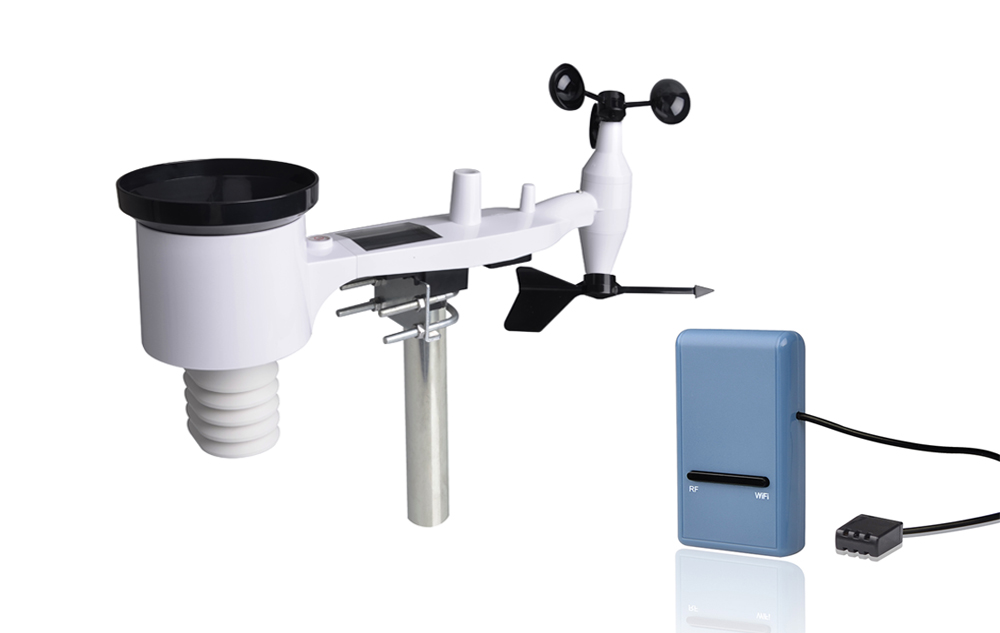
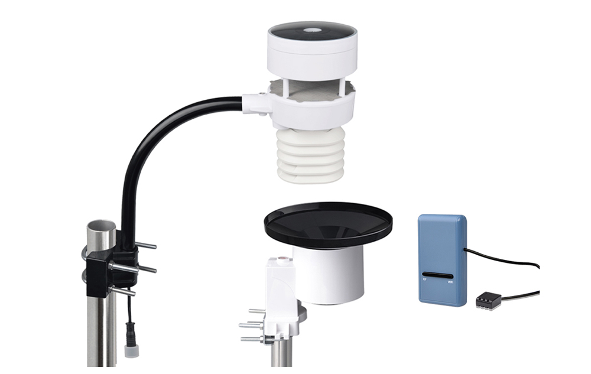

# Fine Offset weather station Binding

This binding is for weather stations that are manufactured by [Fine Offset](http://www.foshk.com/).
These weather stations are white labeled products which are re-branded by many distribution companies around the world.
Some of these brands are e.g.:

* Aercus
* Ambient Weather
* Ecowitt
* Frogitt
* Misol
* Pantech
* Sainlogic
* Steinberg Systems
* Waldbeck Halley

Here are some product pictures of how this Weather stations look like:





This binding works offline by [implementing the wire protocol](doc/protocol-v1.6.3.pdf) of the WiFi gateway device.

## Supported Things

- `weatherstation`: A Fine Offset gateway device with the ThingTypeUID `fineoffsetweatherstation:weatherstation` wich supports the [wire protocol](doc/protocol-v1.6.3.pdf) e.g.:
    - HP2550
    - HP3500
    - GW1000
    - GW1001
    - GW1002
    - GW1003
    - GW1100
    - WN1900
    - WN1910
    - WH2350
    - WH2600
    - WH2610
    - WH2620
    - WH2650 (tested)
    - WH2680
    - WH2900
    - WH2950
- `sensor`: A Fine Offset sensor which is connected to the bridge with the ThingTypeUID `fineoffsetweatherstation:sensor`. Since the gateway collects all the sensor data and harmonizes them, the sensor thing itself will only hold information about the signal and battery status. This is a list of sensors supported by the protocol:
  - WH24 - 7-in-1 weather station, Sensor for wind speed & direction, solar radiation & light, temperature, humidity, rainfall
  - WH25 - 3-in-1 sensor temperature, humidity, pressure
  - WH26 - 2-in-1 sensor temperature, humidity
  - WH31 - 2-in-1 sensor temperature, humidity
  - WH34 - External temperature sensor
  - WH35 - Leaf wetness sensor
  - WH40 - Rainfall sensor
  - WH41 - Outdoor air quality sensor
  - WH45 - Air quality sensor
  - WH51 - Soil moisture sensor
  - WH55 - Water leak detection sensor
  - WH57 - Lightning detection sensor
  - WH65 - 7-in-1 weather station for wind speed & direction, solar radiation & light, temperature, humidity and rainfall
  - WH68 - 4-in-1 weather station - Solar-powered sensor for wind speed & direction, solar radiation & light
  - WH80 - 6-in-1 weather station - Ultrasonic sensor for wind speed & direction, solar radiation & light, temperature & humidity
  - WH90 - A new weather station

## Discovery

This binding support discovery of Fine Offset gateway devices by sending a broadcast message.

## Thing Configuration

### `gateway` Thing Configuration

| Name              | Type    | Description                                                                     | Default | Required | Advanced |
|-------------------|---------|---------------------------------------------------------------------------------|---------|----------|----------|
| ip                | text    | Hostname or IP address of the device                                            | N/A     | yes      | no       |
| port              | text    | Port                                                                            | 45000   | yes      | no       |
| pollingInterval   | integer | Polling period for refreshing the data in sec                                   | 16     | yes       | yes      |
| discoverInterval  | integer | Interval in sec to fetch registered sensors, battery status and signal strength | 900     | yes       | yes      |

### `sensor` Thing Configuration

| Name             | Type    | Description                                                                                                                            | Default | Required | Advanced |
|------------------|---------|----------------------------------------------------------------------------------------------------------------------------------------|---------|----------|----------|
| sensor           | text    | The Name of sensor attached to the  gateway (multiple sensors of the same type my have different names according to the bound channel) | N/A     | yes      | no       |

Valid sensors:

- WH24
- WH65
- WH68
- WH80
- WH40
- WH25
- WH26
- WH31_CH1
- WH31_CH2
- WH31_CH3
- WH31_CH4
- WH31_CH5
- WH31_CH6
- WH31_CH7
- WH31_CH8
- WH51_CH1
- WH51_CH2
- WH51_CH3
- WH51_CH4
- WH51_CH5
- WH51_CH6
- WH51_CH7
- WH51_CH8
- WH41_CH1
- WH41_CH2
- WH41_CH3
- WH41_CH4
- WH57
- WH55_CH1
- WH55_CH2
- WH55_CH3
- WH55_CH4
- WH34_CH1
- WH34_CH2
- WH34_CH3
- WH34_CH4
- WH34_CH5
- WH34_CH6
- WH34_CH7
- WH34_CH8
- WH45
- WH35_CH1
- WH35_CH2
- WH35_CH3
- WH35_CH4
- WH35_CH5
- WH35_CH6
- WH35_CH7
- WH35_CH8
- WH90

## Channels

### `gateway` Channels

| Channel                               | Type                      | Read/Write | Description                                 |
|---------------------------------------|---------------------------|------------|---------------------------------------------|
| temperature-indoor                    | Number:Temperature        | R          | Indoor temperature                          |
| temperature-outdoor                   | Number:Temperature        | R          | Outdoor temperature                         |
| temperature-dew-point                 | Number:Temperature        | R          | Dew point                                   |
| temperature-wind-chill                | Number:Temperature        | R          | Perceived temperature                       |
| temperature-heat-index                | Number:Temperature        | R          | Heat index                                  |
| humidity-indoor                       | Number:Dimensionless      | R          | Humidity inside                             |
| humidity-outdoor                      | Number:Dimensionless      | R          | Humidity outside                            |
| pressure-absolute                     | Number:Pressure           | R          | Absolute pressure                           |
| pressure-relative                     | Number:Pressure           | R          | Relative pressure                           |
| direction-wind                        | Number:Angle              | R          | Wind direction                              |
| speed-wind                            | Number:Speed              | R          | Wind speed                                  |
| speed-gust                            | Number:Speed              | R          | Gust speed                                  |
| rain-event                            | Number:Length             | R          | Amount of rainfall at the last rain         |
| rain-rate                             | Number:VolumetricFlowRate | R          | Rainfall rate                               |
| rain-hour                             | Number:Length             | R          | Rainfall current hour                       |
| rain-day                              | Number:Length             | R          | Rainfall today                              |
| rain-week                             | Number:Length             | R          | Rainfall this week                          |
| rain-month                            | Number:Length             | R          | Rainfall this month                         |
| rain-year                             | Number:Length             | R          | Rainfall this year                          |
| rain-total                            | Number:Length             | R          | Rainfall total                              |
| illumination                          | Number:Illuminance        | R          | Light intensity                             |
| irradiation-uv                        | Number:Intensity          | R          | UV irradiation                              |
| uv-index                              | Number:Dimensionless      | R          | UV index                                    |
| wind-max-day                          | Number:Speed              | R          | Maximum wind speed today                    |
| temperature-channel-1                 | Number:Temperature        | R          | Temperature channel 1                       |
| temperature-channel-2                 | Number:Temperature        | R          | Temperature channel 2                       |
| temperature-channel-3                 | Number:Temperature        | R          | Temperature channel 3                       |
| temperature-channel-4                 | Number:Temperature        | R          | Temperature channel 4                       |
| temperature-channel-5                 | Number:Temperature        | R          | Temperature channel 5                       |
| temperature-channel-6                 | Number:Temperature        | R          | Temperature channel 6                       |
| temperature-channel-7                 | Number:Temperature        | R          | Temperature channel 7                       |
| temperature-channel-8                 | Number:Temperature        | R          | Temperature channel 8                       |
| humidity-channel-1                    | Number:Dimensionless      | R          | Humidity channel 1                          |
| humidity-channel-2                    | Number:Dimensionless      | R          | Humidity channel 2                          |
| humidity-channel-3                    | Number:Dimensionless      | R          | Humidity channel 3                          |
| humidity-channel-4                    | Number:Dimensionless      | R          | Humidity channel 4                          |
| humidity-channel-5                    | Number:Dimensionless      | R          | Humidity channel 5                          |
| humidity-channel-6                    | Number:Dimensionless      | R          | Humidity channel 6                          |
| humidity-channel-7                    | Number:Dimensionless      | R          | Humidity channel 7                          |
| humidity-channel-8                    | Number:Dimensionless      | R          | Humidity channel 8                          |
| temperature-soil-channel-1            | Number:Temperature        | R          | Soil temperature channel 1                  |
| temperature-soil-channel-2            | Number:Temperature        | R          | Soil temperature channel 2                  |
| temperature-soil-channel-3            | Number:Temperature        | R          | Soil temperature channel 3                  |
| temperature-soil-channel-4            | Number:Temperature        | R          | Soil temperature channel 4                  |
| temperature-soil-channel-5            | Number:Temperature        | R          | Soil temperature channel 5                  |
| temperature-soil-channel-6            | Number:Temperature        | R          | Soil temperature channel 6                  |
| temperature-soil-channel-7            | Number:Temperature        | R          | Soil temperature channel 7                  |
| temperature-soil-channel-8            | Number:Temperature        | R          | Soil temperature channel 8                  |
| temperature-soil-channel-9            | Number:Temperature        | R          | Soil temperature channel 9                  |
| temperature-soil-channel-10           | Number:Temperature        | R          | Soil temperature channel 10                 |
| temperature-soil-channel-11           | Number:Temperature        | R          | Soil temperature channel 11                 |
| temperature-soil-channel-12           | Number:Temperature        | R          | Soil temperature channel 12                 |
| temperature-soil-channel-13           | Number:Temperature        | R          | Soil temperature channel 13                 |
| temperature-soil-channel-14           | Number:Temperature        | R          | Soil temperature channel 14                 |
| temperature-soil-channel-15           | Number:Temperature        | R          | Soil temperature channel 15                 |
| temperature-soil-channel-16           | Number:Temperature        | R          | Soil temperature channel 16                 |
| moisture-soil-channel-1               | Number:Dimensionless      | R          | Soil moisture channel 1                     |
| moisture-soil-channel-2               | Number:Dimensionless      | R          | Soil moisture channel 2                     |
| moisture-soil-channel-3               | Number:Dimensionless      | R          | Soil moisture channel 3                     |
| moisture-soil-channel-4               | Number:Dimensionless      | R          | soil moisture channel 4                     |
| moisture-soil-channel-5               | Number:Dimensionless      | R          | Soil moisture channel 5                     |
| moisture-soil-channel-6               | Number:Dimensionless      | R          | Soil moisture channel 6                     |
| moisture-soil-channel-7               | Number:Dimensionless      | R          | Soil moisture channel 7                     |
| moisture-soil-channel-8               | Number:Dimensionless      | R          | Soil moisture channel 8                     |
| moisture-soil-channel-9               | Number:Dimensionless      | R          | Soil moisture channel 9                     |
| moisture-soil-channel-10              | Number:Dimensionless      | R          | Soil moisture channel 10                    |
| moisture-soil-channel-11              | Number:Dimensionless      | R          | Soil moisture channel 11                    |
| moisture-soil-channel-12              | Number:Dimensionless      | R          | Soil moisture channel 12                    |
| moisture-soil-channel-13              | Number:Dimensionless      | R          | soil moisture channel 13                    |
| moisture-soil-channel-14              | Number:Dimensionless      | R          | Soil moisture channel 14                    |
| moisture-soil-channel-15              | Number:Dimensionless      | R          | Soil moisture channel 15                    |
| moisture-soil-channel-16              | Number:Dimensionless      | R          | Soil moisture channel 16                    |
| air-quality-24-hour-average-channel-1 | Number:Density            | R          | PM2.5 Air Quality 24 hour average channel 1 |
| air-quality-24-hour-average-channel-2 | Number:Density            | R          | PM2.5 Air Quality 24 hour average channel 2 |
| air-quality-24-hour-average-channel-3 | Number:Density            | R          | PM2.5 Air Quality 24 hour average channel 3 |
| air-quality-24-hour-average-channel-4 | Number:Density            | R          | PM2.5 Air Quality 24 hour average channel 4 |
| air-quality-channel-1                 | Number:Density            | R          | PM2.5 Air Quality channel 1                 |
| air-quality-channel-2                 | Number:Density            | R          | PM2.5 Air Quality channel 2                 |
| air-quality-channel-3                 | Number:Density            | R          | PM2.5 Air Quality channel 3                 |
| air-quality-channel-4                 | Number:Density            | R          | PM2.5 Air Quality channel 4                 |
| water-leak-channel-1                  | Switch                    | R          | Water leak detection channel 1              |
| water-leak-channel-2                  | Switch                    | R          | Water leak detection channel 2              |
| water-leak-channel-3                  | Switch                    | R          | Water leak detection channel 3              |
| water-leak-channel-4                  | Switch                    | R          | Water leak detection channel 4              |
| lightning-distance                    | Number:Length             | R          | lightning distance                          |
| lightning-time                        | DateTime                  | R          | time of last lightning strike               |
| lightning-counter                     | Number                    | R          | lightning strikes today                     |
| temperature-external-channel-1        | Number:Temperature        | R          | external temperature sensor channel 1       |
| temperature-external-channel-2        | Number:Temperature        | R          | External temperature sensor channel 2       |
| temperature-external-channel-3        | Number:Temperature        | R          | External temperature sensor channel 3       |
| temperature-external-channel-4        | Number:Temperature        | R          | External temperature sensor channel 4       |
| temperature-external-channel-5        | Number:Temperature        | R          | External temperature sensor channel 5       |
| temperature-external-channel-6        | Number:Temperature        | R          | External temperature sensor channel 6       |
| temperature-external-channel-7        | Number:Temperature        | R          | External temperature sensor channel 7       |
| temperature-external-channel-8        | Number:Temperature        | R          | External temperature sensor channel 8       |

### `sensor` Channels

| Channel      | Type   | Read/Write | Description                 |
|--------------|--------|------------|-----------------------------|
| signal       | Number | R          | The sensors signal stranght |
| batteryLevel | Number | R          | The sensors batery level    |
| lowBattery   | Switch | R          | The sensors batery status   |

## Full Example

This is an example configuration for the WH2650 gateway

_weatherstation.things_:

```xtend
Bridge fineoffsetweatherstation:gateway:3906700515 "Weather station" [ip="192.168.1.42", port="45000", discoverInterval="900", pollingInterval="16"] {
	Thing sensor WH25 "WH25" [sensor="WH25"]
	Thing sensor WH65 "WH65" [sensor="WH65"]
}
```

_weatherstation.items_:

```xtend
Group WH25 "WH25"  <Sensor> ["Sensor"]
Number SignalWH25        "Signal WH25"      <QualityOfService> (WH25) ["Measurement", "Level"] { channel="fineoffsetweatherstation:sensor:3906700515:WH25:signal" }
Switch BatteryStatusWH25 "Low Battery WH25" <LowBattery>       (WH25) ["Energy", "LowBattery"] { channel="fineoffsetweatherstation:sensor:3906700515:WH25:lowBattery" }

Group WH65 "WH65"  <Sensor> ["Sensor"]
Number SignalWH65 "Signal WH65" <QualityOfService> (WH65) ["Measurement", "Level"] { channel="fineoffsetweatherstation:sensor:3906700515:WH65:signal" }
Switch BatteryStatusWH65 "Low Battery WH65" <LowBattery> (WH65) ["Energy", "LowBattery"] { channel="fineoffsetweatherstation:sensor:3906700515:WH65:lowBattery" }

Group gOutdoor "Outdoor" ["Location"]
Number:Temperature        weather_temperature_outdoor  "Outdoor Temperature"                 <Temperature> (gOutdoor) ["Measurement", "Temperature"] { channel="fineoffsetweatherstation:gateway:3906700515:temperature-outdoor" }
Number:Temperature        weather_temperature_indoor   "Inside temperature"                  <Temperature>            ["Measurement", "Temperature"]  { channel="fineoffsetweatherstation:gateway:3906700515:temperature-indoor" }
Number:Dimensionless      weather_humidity_indoor      "Humidity inside"                     <Humidity>               ["Measurement", "Humidity"]     { channel="fineoffsetweatherstation:gateway:3906700515:humidity-indoor" }
Number:Pressure           weather_pressure_absolute    "Absolute pressure"                   <Pressure>    (gOutdoor) ["Measurement", "Pressure"]     { channel="fineoffsetweatherstation:gateway:3906700515:pressure-absolute" }
Number:Pressure           weather_pressure_relative    "Relative pressure"                   <Pressure>    (gOutdoor) ["Measurement", "Pressure"]     { channel="fineoffsetweatherstation:gateway:3906700515:pressure-relative" }
Number:Temperature        weather_temperature_outdoor  "Outdoor temperature"                 <Temperature> (gOutdoor) ["Measurement", "Temperature"]  { channel="fineoffsetweatherstation:gateway:3906700515:temperature-outdoor" }
Number:Dimensionless      weather_humidity_outdoor     "Humidity outside"                    <Humidity>    (gOutdoor) ["Measurement", "Humidity"]     { channel="fineoffsetweatherstation:gateway:3906700515:humidity-outdoor" }
Number:Angle              weather_direction_wind       "Wind direction"                      <Wind>        (gOutdoor) ["Measurement", "Wind"]         { channel="fineoffsetweatherstation:gateway:3906700515:direction-wind" }
Number:Speed              weather_speed_wind           "Wind speed"                          <Wind>        (gOutdoor) ["Measurement", "Wind"]         { channel="fineoffsetweatherstation:gateway:3906700515:speed-wind" }
Number:Speed              weather_speed_gust           "Gust speed"                          <Wind>        (gOutdoor) ["Measurement", "Wind"]         { channel="fineoffsetweatherstation:gateway:3906700515:speed-gust" }
Number:Illuminance        weather_illumination         "Light intensity"                     <Sun>         (gOutdoor) ["Measurement", "Light"]        { channel="fineoffsetweatherstation:gateway:3906700515:illumination" }
Number:Intensity          weather_irradiation_uv       "UV radiation"                        <Sun>         (gOutdoor) ["Measurement", "Light"]        { channel="fineoffsetweatherstation:gateway:3906700515:irradiation-uv" }
Number:Dimensionless      weather_uv_index             "UV Index"                            <Sun>         (gOutdoor) ["Measurement", "Light"]        { channel="fineoffsetweatherstation:gateway:3906700515:uv-index" }
Number:Speed              weather_max_day              "Maximum wind speed today"            <Wind>        (gOutdoor) ["Measurement", "Wind"]         { channel="fineoffsetweatherstation:gateway:3906700515:wind-max-day" }
Number:VolumetricFlowRate weather_rain_rate            "Rainfall rate"                       <Rain>        (gOutdoor) ["Measurement", "Rain"]         { channel="fineoffsetweatherstation:gateway:3906700515:rain-rate" }
Number:Length             weather_rain_day             "Rainfall today"                      <Rain>        (gOutdoor) ["Measurement", "Rain"]         { channel="fineoffsetweatherstation:gateway:3906700515:rain-day" }
Number:Length             weather_rain_week            "Rainfall this week"                  <Rain>        (gOutdoor) ["Measurement", "Rain"]         { channel="fineoffsetweatherstation:gateway:3906700515:rain-week" }
Number:Length             weather_rain_month           "Rainfall this month"                 <Rain>        (gOutdoor) ["Measurement", "Rain"]         { channel="fineoffsetweatherstation:gateway:3906700515:rain-month" }
Number:Length             weather_rain_year            "Rainfall this year "                 <Rain>        (gOutdoor) ["Measurement", "Rain"]         { channel="fineoffsetweatherstation:gateway:3906700515:rain-year" }
Number:Length             weather_rain_event           "Amount of rainfall at the last rain" <Rain>        (gOutdoor) ["Measurement", "Rain"]         { channel="fineoffsetweatherstation:gateway:3906700515:rain-event" }
```
