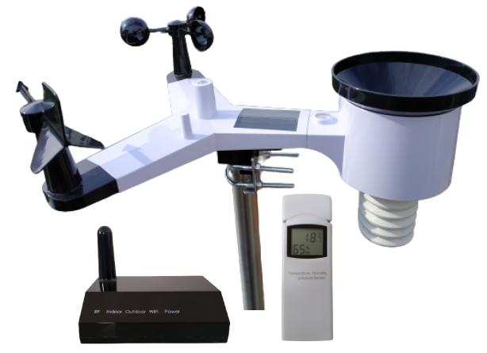

# Fine Offset Weather Station Binding

This binding is for weather stations manufactured by [Fine Offset](http://www.foshk.com/).
These weather stations are white labeled products which are re-branded by many distribution companies around the world.
Some of these brands are e.g.:

- Aercus
- Ambient Weather
- Ecowitt
- ELV
- Froggit
- Misol
- Pantech
- Sainlogic
- Steinberg Systems
- Waldbeck Halley

Here is a product picture of how this Weather Station looks like:



This binding works offline by [implementing the wire protocol](https://osswww.ecowitt.net/uploads/20220407/WN1900%20GW1000,1100%20WH2680,2650%20telenet%20v1.6.4.pdf) of the WiFi gateway device.

## Discussion

If you have any issues or feedback, please feel free to [get in touch via the community forum](https://community.openhab.org/t/fine-offset-weather-station-binding-discussion/134167)

## Supported Things

- `weatherstation`: A Fine Offset gateway device with the ThingTypeUID `fineoffsetweatherstation:weatherstation` which supports the [wire protocol](https://osswww.ecowitt.net/uploads/20220407/WN1900%20GW1000,1100%20WH2680,2650%20telenet%20v1.6.4.pdf) e.g.:
  - HP2550
  - HP3500
  - GW1000
  - GW1001
  - GW1002
  - GW1003
  - GW1100
  - GW2001
  - WN1900
  - WN1910
  - WH2350
  - WH2600
  - WH2610
  - WH2620
  - WH2650 (tested)
  - WH2680
  - WH2900
  - WH2950
  - WS980 ELV (tested)
  - WittBoy (tested)
- `sensor`: A Fine Offset sensor which is connected to the bridge with the ThingTypeUID `fineoffsetweatherstation:sensor`.
  Since the gateway collects all the sensor data and harmonizes them, the sensor thing itself will only hold information about the signal and battery status.
  This is a list of sensors supported by the protocol:
  - WH24 - 7-in-1 weather station, Sensor for wind speed & direction, solar radiation & light, temperature, humidity, rainfall
  - WH25 - 3-in-1 sensor temperature, humidity, pressure
  - WH26 - 2-in-1 sensor temperature, humidity
  - WH31 - 2-in-1 sensor temperature, humidity
  - WH34 - External temperature sensor
  - WH35 - Leaf wetness sensor
  - WH40 - Rainfall sensor
  - WH41 - Outdoor air quality sensor
  - WH45 - Air quality sensor
  - WH51 - Soil moisture sensor
  - WH55 - Water leak detection sensor
  - WH57 - Lightning detection sensor
  - WH65 - 7-in-1 weather station for wind speed & direction, solar radiation & light, temperature, humidity and rainfall
  - WH68 - 4-in-1 weather station - Solar-powered sensor for wind speed & direction, solar radiation & light
  - WH80 - 6-in-1 weather station - Ultrasonic sensor for wind speed & direction, solar radiation & light, temperature & humidity
  - WH90 - 7-in-1 weather station - Ultrasonic sensor for wind speed & direction, solar radiation & light, temperature, humidity and haptic rainfall Sensor

### Unsupported Devices

Some weather stations have firmware that does not allow you to query live-data directly.
In this case you have to configure a service to which the data is sent.
Please try if here the [IPObserver binding](https://www.openhab.org/addons/bindings/ipobserver/) offers an alternative.
Known weather stations not compatible with this binding:

- [WH3000](https://community.openhab.org/t/fine-offset-weather-station-binding-beta-and-discussion/134167/52)
- [Ecowitt HP2564C](https://community.openhab.org/t/fine-offset-weather-station-binding-discussion/134167/134)

If your gateway does not support reading out live-data, a second gateway can be used to read out the sensors for openHAB.
[This approach has been tested by a community member](https://community.openhab.org/t/fine-offset-weather-station-binding-discussion/134167/151).

## Discovery

This binding support discovery of Fine Offset gateway devices by sending a broadcast message.

## Thing Configuration

### `gateway` Thing Configuration

| Name             | Type    | Description                                                                                  | Default | Required | Advanced |
|------------------|---------|----------------------------------------------------------------------------------------------|---------|----------|----------|
| ip               | text    | The Hostname or IP address of the device                                                     | N/A     | yes      | no       |
| port             | integer | The network port of the gateway                                                              | 45000   | yes      | no       |
| protocol         | text    | The protocol to use for communicating with the gateway, valid values are: `DEFAULT` or `ELV` | DEFAULT | no       | no       |
| pollingInterval  | integer | Polling period for refreshing the data in seconds                                            | 16      | yes      | yes      |
| discoverInterval | integer | Interval in seconds to fetch registered sensors, battery status and signal strength          | 900     | yes      | yes      |

### `sensor` Thing Configuration

| Name             | Type    | Description                                                                                                                            | Default | Required | Advanced |
|------------------|---------|----------------------------------------------------------------------------------------------------------------------------------------|---------|----------|----------|
| sensor           | text    | The name of sensor attached to the gateway (multiple sensors of the same type may have different names according to the bound channel) | N/A     | yes      | no       |

Valid sensors:

- WH24
- WH65
- WH68
- WH80
- WH40
- WH25
- WH26
- WH31_CH1
- WH31_CH2
- WH31_CH3
- WH31_CH4
- WH31_CH5
- WH31_CH6
- WH31_CH7
- WH31_CH8
- WH51_CH1
- WH51_CH2
- WH51_CH3
- WH51_CH4
- WH51_CH5
- WH51_CH6
- WH51_CH7
- WH51_CH8
- WH41_CH1
- WH41_CH2
- WH41_CH3
- WH41_CH4
- WH57
- WH55_CH1
- WH55_CH2
- WH55_CH3
- WH55_CH4
- WH34_CH1
- WH34_CH2
- WH34_CH3
- WH34_CH4
- WH34_CH5
- WH34_CH6
- WH34_CH7
- WH34_CH8
- WH45
- WH35_CH1
- WH35_CH2
- WH35_CH3
- WH35_CH4
- WH35_CH5
- WH35_CH6
- WH35_CH7
- WH35_CH8
- WH90

## Channels

### `gateway` Channels

| Channel                               | Type                 | Read/Write | Description                                    |
|---------------------------------------|----------------------|------------|------------------------------------------------|
| temperature-indoor                    | Number:Temperature   | R          | Indoor Temperature                             |
| temperature-outdoor                   | Number:Temperature   | R          | Outdoor Temperature                            |
| temperature-dew-point                 | Number:Temperature   | R          | Dew Point                                      |
| temperature-wind-chill                | Number:Temperature   | R          | Perceived Temperature                          |
| temperature-heat-index                | Number:Temperature   | R          | Heat Index                                     |
| humidity-indoor                       | Number:Dimensionless | R          | Humidity Inside                                |
| humidity-outdoor                      | Number:Dimensionless | R          | Humidity Outside                               |
| pressure-absolute                     | Number:Pressure      | R          | Absolute Pressure                              |
| pressure-relative                     | Number:Pressure      | R          | Relative Pressure                              |
| direction-wind                        | Number:Angle         | R          | Wind Direction                                 |
| speed-wind                            | Number:Speed         | R          | Wind Speed                                     |
| speed-gust                            | Number:Speed         | R          | Gust Speed                                     |
| rain-event                            | Number:Length        | R          | Amount of Rainfall At the last Rain            |
| rain-rate                             | Number:Speed         | R          | Rainfall Rate                                  |
| rain-hour                             | Number:Length        | R          | Rainfall Current Hour                          |
| rain-day                              | Number:Length        | R          | Rainfall Today                                 |
| rain-week                             | Number:Length        | R          | Rainfall this Week                             |
| rain-month                            | Number:Length        | R          | Rainfall this Month                            |
| rain-year                             | Number:Length        | R          | Rainfall this Year                             |
| rain-total                            | Number:Length        | R          | Rainfall Total                                 |
| illumination                          | Number:Illuminance   | R          | Light Intensity                                |
| irradiation-uv                        | Number:Intensity     | R          | UV Irradiation                                 |
| uv-index                              | Number:Dimensionless | R          | UV Index                                       |
| wind-max-day                          | Number:Speed         | R          | Maximum Wind Speed Today                       |
| temperature-channel-1                 | Number:Temperature   | R          | Temperature Channel 1                          |
| temperature-channel-2                 | Number:Temperature   | R          | Temperature Channel 2                          |
| temperature-channel-3                 | Number:Temperature   | R          | Temperature Channel 3                          |
| temperature-channel-4                 | Number:Temperature   | R          | Temperature Channel 4                          |
| temperature-channel-5                 | Number:Temperature   | R          | Temperature Channel 5                          |
| temperature-channel-6                 | Number:Temperature   | R          | Temperature Channel 6                          |
| temperature-channel-7                 | Number:Temperature   | R          | Temperature Channel 7                          |
| temperature-channel-8                 | Number:Temperature   | R          | Temperature Channel 8                          |
| humidity-channel-1                    | Number:Dimensionless | R          | Humidity Channel 1                             |
| humidity-channel-2                    | Number:Dimensionless | R          | Humidity Channel 2                             |
| humidity-channel-3                    | Number:Dimensionless | R          | Humidity Channel 3                             |
| humidity-channel-4                    | Number:Dimensionless | R          | Humidity Channel 4                             |
| humidity-channel-5                    | Number:Dimensionless | R          | Humidity Channel 5                             |
| humidity-channel-6                    | Number:Dimensionless | R          | Humidity Channel 6                             |
| humidity-channel-7                    | Number:Dimensionless | R          | Humidity Channel 7                             |
| humidity-channel-8                    | Number:Dimensionless | R          | Humidity Channel 8                             |
| temperature-soil-channel-1            | Number:Temperature   | R          | Soil Temperature Channel 1                     |
| temperature-soil-channel-2            | Number:Temperature   | R          | Soil Temperature Channel 2                     |
| temperature-soil-channel-3            | Number:Temperature   | R          | Soil Temperature Channel 3                     |
| temperature-soil-channel-4            | Number:Temperature   | R          | Soil Temperature Channel 4                     |
| temperature-soil-channel-5            | Number:Temperature   | R          | Soil Temperature Channel 5                     |
| temperature-soil-channel-6            | Number:Temperature   | R          | Soil Temperature Channel 6                     |
| temperature-soil-channel-7            | Number:Temperature   | R          | Soil Temperature Channel 7                     |
| temperature-soil-channel-8            | Number:Temperature   | R          | Soil Temperature Channel 8                     |
| temperature-soil-channel-9            | Number:Temperature   | R          | Soil Temperature Channel 9                     |
| temperature-soil-channel-10           | Number:Temperature   | R          | Soil Temperature Channel 10                    |
| temperature-soil-channel-11           | Number:Temperature   | R          | Soil Temperature Channel 11                    |
| temperature-soil-channel-12           | Number:Temperature   | R          | Soil Temperature Channel 12                    |
| temperature-soil-channel-13           | Number:Temperature   | R          | Soil Temperature Channel 13                    |
| temperature-soil-channel-14           | Number:Temperature   | R          | Soil Temperature Channel 14                    |
| temperature-soil-channel-15           | Number:Temperature   | R          | Soil Temperature Channel 15                    |
| temperature-soil-channel-16           | Number:Temperature   | R          | Soil Temperature Channel 16                    |
| moisture-soil-channel-1               | Number:Dimensionless | R          | Soil Moisture Channel 1                        |
| moisture-soil-channel-2               | Number:Dimensionless | R          | Soil Moisture Channel 2                        |
| moisture-soil-channel-3               | Number:Dimensionless | R          | Soil Moisture Channel 3                        |
| moisture-soil-channel-4               | Number:Dimensionless | R          | soil Moisture Channel 4                        |
| moisture-soil-channel-5               | Number:Dimensionless | R          | Soil Moisture Channel 5                        |
| moisture-soil-channel-6               | Number:Dimensionless | R          | Soil Moisture Channel 6                        |
| moisture-soil-channel-7               | Number:Dimensionless | R          | Soil Moisture Channel 7                        |
| moisture-soil-channel-8               | Number:Dimensionless | R          | Soil Moisture Channel 8                        |
| moisture-soil-channel-9               | Number:Dimensionless | R          | Soil Moisture Channel 9                        |
| moisture-soil-channel-10              | Number:Dimensionless | R          | Soil Moisture Channel 10                       |
| moisture-soil-channel-11              | Number:Dimensionless | R          | Soil Moisture Channel 11                       |
| moisture-soil-channel-12              | Number:Dimensionless | R          | Soil Moisture Channel 12                       |
| moisture-soil-channel-13              | Number:Dimensionless | R          | soil Moisture Channel 13                       |
| moisture-soil-channel-14              | Number:Dimensionless | R          | Soil Moisture Channel 14                       |
| moisture-soil-channel-15              | Number:Dimensionless | R          | Soil Moisture Channel 15                       |
| moisture-soil-channel-16              | Number:Dimensionless | R          | Soil Moisture Channel 16                       |
| air-quality-24-hour-average-channel-1 | Number:Density       | R          | PM2.5 Air Quality 24 Hour Average Channel 1    |
| air-quality-24-hour-average-channel-2 | Number:Density       | R          | PM2.5 Air Quality 24 Hour Average Channel 2    |
| air-quality-24-hour-average-channel-3 | Number:Density       | R          | PM2.5 Air Quality 24 Hour Average Channel 3    |
| air-quality-24-hour-average-channel-4 | Number:Density       | R          | PM2.5 Air Quality 24 Hour Average Channel 4    |
| air-quality-channel-1                 | Number:Density       | R          | PM2.5 Air Quality Channel 1                    |
| air-quality-channel-2                 | Number:Density       | R          | PM2.5 Air Quality Channel 2                    |
| air-quality-channel-3                 | Number:Density       | R          | PM2.5 Air Quality Channel 3                    |
| air-quality-channel-4                 | Number:Density       | R          | PM2.5 Air Quality Channel 4                    |
| water-leak-channel-1                  | Switch               | R          | Water Leak Detection Channel 1                 |
| water-leak-channel-2                  | Switch               | R          | Water Leak Detection Channel 2                 |
| water-leak-channel-3                  | Switch               | R          | Water Leak Detection Channel 3                 |
| water-leak-channel-4                  | Switch               | R          | Water Leak Detection Channel 4                 |
| lightning-distance                    | Number:Length        | R          | Lightning Distance                             |
| lightning-time                        | DateTime             | R          | Time of last Lightning Strike                  |
| lightning-counter                     | Number               | R          | Lightning Strikes Today                        |
| temperature-external-channel-1        | Number:Temperature   | R          | External Temperature Sensor Channel 1          |
| temperature-external-channel-2        | Number:Temperature   | R          | External Temperature Sensor Channel 2          |
| temperature-external-channel-3        | Number:Temperature   | R          | External Temperature Sensor Channel 3          |
| temperature-external-channel-4        | Number:Temperature   | R          | External Temperature Sensor Channel 4          |
| temperature-external-channel-5        | Number:Temperature   | R          | External Temperature Sensor Channel 5          |
| temperature-external-channel-6        | Number:Temperature   | R          | External Temperature Sensor Channel 6          |
| temperature-external-channel-7        | Number:Temperature   | R          | External Temperature Sensor Channel 7          |
| temperature-external-channel-8        | Number:Temperature   | R          | External Temperature Sensor Channel 8          |
| sensor-co2-temperature                | Number:Temperature   | R          | Temperature (CO2-Sensor)                       |
| sensor-co2-humidity                   | Number:Dimensionless | R          | Humidity (CO2-Sensor)                          |
| sensor-co2-pm10                       | Number:Density       | R          | PM10 Air Quality (CO2-Sensor)                  |
| sensor-co2-pm10-24-hour-average       | Number:Density       | R          | PM10 Air Quality 24 Hour Average (CO2-Sensor)  |
| sensor-co2-pm25                       | Number:Density       | R          | PM2.5 Air Quality (CO2-Sensor)                 |
| sensor-co2-pm25-24-hour-average       | Number:Density       | R          | PM2.5 Air Quality 24 Hour Average (CO2-Sensor) |
| sensor-co2-co2                        | Number:Dimensionless | R          | CO2                                            |
| sensor-co2-co2-24-hour-average        | Number:Dimensionless | R          | CO2 24 Hour Average                            |
| leaf-wetness-channel-1                | Number:Dimensionless | R          | Leaf Moisture Channel 1                        |  
| leaf-wetness-channel-2                | Number:Dimensionless | R          | Leaf Moisture Channel 2                        |
| leaf-wetness-channel-3                | Number:Dimensionless | R          | Leaf Moisture Channel 3                        |
| leaf-wetness-channel-4                | Number:Dimensionless | R          | Leaf Moisture Channel 4                        |
| leaf-wetness-channel-5                | Number:Dimensionless | R          | Leaf Moisture Channel 5                        |
| leaf-wetness-channel-6                | Number:Dimensionless | R          | Leaf Moisture Channel 6                        |
| leaf-wetness-channel-7                | Number:Dimensionless | R          | Leaf Moisture Channel 7                        |
| leaf-wetness-channel-8                | Number:Dimensionless | R          | Leaf Moisture Channel 8                        |
| piezo-rain-rate                       | Number:Speed         | R          | Piezo - Rainfall Rate                          |
| piezo-rain-event                      | Number:Length        | R          | Piezo - Amount of Rainfall At the last Rain    |
| piezo-rain-hour                       | Number:Length        | R          | Piezo - Rainfall Current Hour                  |
| piezo-rain-day                        | Number:Length        | R          | Piezo - Rainfall Today                         |
| piezo-rain-week                       | Number:Length        | R          | Piezo - Rainfall this Week                     |
| piezo-rain-month                      | Number:Length        | R          | Piezo - Rainfall this Month                    |
| piezo-rain-year                       | Number:Length        | R          | Piezo - Rainfall this Year                     |

NOTE: Not every gateway provides all available data, even if they are displayed in the WS-View app.
Especially the channels `temperature-dew-point` or `temperature-wind-chill` are derived from other measured values.

### `sensor` Channels

| Channel        | Type                     | Read/Write | Description                 |
|----------------|--------------------------|------------|-----------------------------|
| signal         | Number                   | R          | The sensors signal strength |
| batteryLevel   | Number                   | R          | The sensors battery level   |
| batteryVoltage | Number:ElectricPotential | R          | The sensors battery voltage |
| lowBattery     | Switch                   | R          | The sensors battery status  |

## Full Example

This is an example configuration for the WH2650 gateway

_weatherstation.things_:

```java
Bridge fineoffsetweatherstation:gateway:3906700515 "Weather station" [
     ip="192.168.1.42",
     port="45000", 
     discoverInterval="900",
     pollingInterval="16",
     protocol="DEFAULT"
] {
 Thing sensor WH25 "WH25" [sensor="WH25"]
 Thing sensor WH65 "WH65" [sensor="WH65"]
}
```

_weatherstation.items_:

```java
Group WH25 "WH25"  <Sensor> ["Sensor"]
Number SignalWH25        "Signal WH25"      <QualityOfService> (WH25) ["Measurement", "Level"] { channel="fineoffsetweatherstation:sensor:3906700515:WH25:signal" }
Switch BatteryStatusWH25 "Low Battery WH25" <LowBattery>       (WH25) ["Energy", "LowBattery"] { channel="fineoffsetweatherstation:sensor:3906700515:WH25:lowBattery" }

Group WH65 "WH65"  <Sensor> ["Sensor"]
Number SignalWH65 "Signal WH65" <QualityOfService> (WH65) ["Measurement", "Level"] { channel="fineoffsetweatherstation:sensor:3906700515:WH65:signal" }
Switch BatteryStatusWH65 "Low Battery WH65" <LowBattery> (WH65) ["Energy", "LowBattery"] { channel="fineoffsetweatherstation:sensor:3906700515:WH65:lowBattery" }

Group gOutdoor "Outdoor" ["Location"]
Number:Temperature        weather_temperature_outdoor  "Outdoor Temperature"                 <Temperature> (gOutdoor) ["Measurement", "Temperature"] { channel="fineoffsetweatherstation:gateway:3906700515:temperature-outdoor" }
Number:Temperature        weather_temperature_indoor   "Inside temperature"                  <Temperature>            ["Measurement", "Temperature"]  { channel="fineoffsetweatherstation:gateway:3906700515:temperature-indoor" }
Number:Dimensionless      weather_humidity_indoor      "Humidity inside"                     <Humidity>               ["Measurement", "Humidity"]     { channel="fineoffsetweatherstation:gateway:3906700515:humidity-indoor" }
Number:Pressure           weather_pressure_absolute    "Absolute pressure"                   <Pressure>    (gOutdoor) ["Measurement", "Pressure"]     { channel="fineoffsetweatherstation:gateway:3906700515:pressure-absolute" }
Number:Pressure           weather_pressure_relative    "Relative pressure"                   <Pressure>    (gOutdoor) ["Measurement", "Pressure"]     { channel="fineoffsetweatherstation:gateway:3906700515:pressure-relative" }
Number:Dimensionless      weather_humidity_outdoor     "Humidity outside"                    <Humidity>    (gOutdoor) ["Measurement", "Humidity"]     { channel="fineoffsetweatherstation:gateway:3906700515:humidity-outdoor" }
Number:Angle              weather_direction_wind       "Wind direction"                      <Wind>        (gOutdoor) ["Measurement", "Wind"]         { channel="fineoffsetweatherstation:gateway:3906700515:direction-wind" }
Number:Speed              weather_speed_wind           "Wind speed"                          <Wind>        (gOutdoor) ["Measurement", "Wind"]         { channel="fineoffsetweatherstation:gateway:3906700515:speed-wind" }
Number:Speed              weather_speed_gust           "Gust speed"                          <Wind>        (gOutdoor) ["Measurement", "Wind"]         { channel="fineoffsetweatherstation:gateway:3906700515:speed-gust" }
Number:Illuminance        weather_illumination         "Light intensity"                     <Sun>         (gOutdoor) ["Measurement", "Light"]        { channel="fineoffsetweatherstation:gateway:3906700515:illumination" }
Number:Intensity          weather_irradiation_uv       "UV radiation"                        <Sun>         (gOutdoor) ["Measurement", "Light"]        { channel="fineoffsetweatherstation:gateway:3906700515:irradiation-uv" }
Number:Dimensionless      weather_uv_index             "UV Index"                            <Sun>         (gOutdoor) ["Measurement", "Light"]        { channel="fineoffsetweatherstation:gateway:3906700515:uv-index" }
Number:Speed              weather_max_day              "Maximum wind speed today"            <Wind>        (gOutdoor) ["Measurement", "Wind"]         { channel="fineoffsetweatherstation:gateway:3906700515:wind-max-day" }
Number:Speed              weather_rain_rate            "Rainfall rate"                       <Rain>        (gOutdoor) ["Measurement", "Rain"]         { channel="fineoffsetweatherstation:gateway:3906700515:rain-rate" }
Number:Length             weather_rain_day             "Rainfall today"                      <Rain>        (gOutdoor) ["Measurement", "Rain"]         { channel="fineoffsetweatherstation:gateway:3906700515:rain-day" }
Number:Length             weather_rain_week            "Rainfall this week"                  <Rain>        (gOutdoor) ["Measurement", "Rain"]         { channel="fineoffsetweatherstation:gateway:3906700515:rain-week" }
Number:Length             weather_rain_month           "Rainfall this month"                 <Rain>        (gOutdoor) ["Measurement", "Rain"]         { channel="fineoffsetweatherstation:gateway:3906700515:rain-month" }
Number:Length             weather_rain_year            "Rainfall this year "                 <Rain>        (gOutdoor) ["Measurement", "Rain"]         { channel="fineoffsetweatherstation:gateway:3906700515:rain-year" }
Number:Length             weather_rain_event           "Amount of rainfall at the last rain" <Rain>        (gOutdoor) ["Measurement", "Rain"]         { channel="fineoffsetweatherstation:gateway:3906700515:rain-event" }
```
