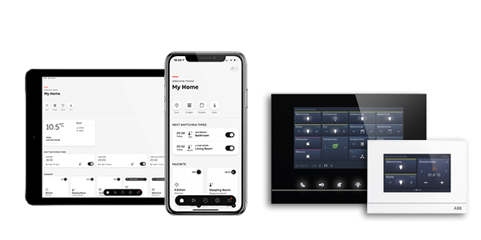

# ABB/Busch-free@home Smart Home binding

openHAB ABB/Busch-free@home binding based on the offical free@home local api


# Description

This openHAB binding allows you to connect your free@home Smart Home system from ABB / Busch-Jaeger to openHAB and to control and observe most of the components.
It requires a System Access Point with version 2.6.1 or higher.

# Supported Devices

**Network Gateway / System Access Point**
 - ABB / Busch-Jaeger System Access Point 2.0

**Sensors and Actuators**
 - Switch Actuator Sensor with single and multiple channels (wired and wireless)
 - Dimming Actuator Sensor with single and multiple channels (wired and wireless)
 - Switch Actuator 4-channel
 - Dimming Actuator 4- and 6-channel
 - Hue devices (untested)

**Blinds and Windows**
 - Shutter Actuator with single and multiple channels (wired and wireless)
 - Blind Actuator  with single and multiple channels (wired and wireless)
 - Attic window actuator
 - Awning actuator

**Room Temperature Control**
 - Room temperature controller master without fan
 - Room temperature controller master with fan
 - Room temperature controller slave

**Other devices** (e.g. movement detector, ring sensor and door opener)
 - IP-touch panel (function: door opener, door ring sensor)
 - Movement Detector Actuator

# Tested SysAP Versions

|Version|Supported|
|---|---|
|2.6.1+|yes|

# Setup / Installation

## Prerequisites

To make use of this Binding first the local free@home API has to be activated. The API is disabled by default!

1. Open the free@home next app
2. Browse to "Settings ⇨ free@home settings ⇨ local API and activate the checkbox

## Setup and Discovery

The free@home bridge shall be added manually. Once it is added as a Thing with correct credentials, the scan of free@home devices will be possible.

## free@home components as openHAB Things

The ABB/Busch free@home system is calling its smart home components as free@home devices.
The free@home system devices can have one or multiple channels depending the device's features.
During the scanning process the openHAB binding will detect only the devices IDs, the device features will be detected at the point in time, when a openHAB Thing is created.
At the of the creation the free@home binding will generate automatically the relevant channels.
If a free@home system device has multiple smart-home  channels (e.g. 4x DIN/rail Actuator), the newly created Thing will get all relevant channels to operate all actuators existing inside the free@home device.

`Actuator_Livingroom`

## Sensors and Actuators of free@home Devices as Things in openHAB

The free@home system is supporting sensors and actuators.
The connenction of sensors and actuatators are done on the free@home system dashboard.
If a Thing channel is a free@home device sensor channel, this channel is only read only

## Bridge Configuration

There are several settings for a bridge:

|Parameter|Description|
|---|---|
| **ipaddress** (required) | Network address of the free@home SysAP |
| **username** (required) | Valid user name for the free@home SysAP |
| **password** (required) | Password of the user |

The syntax for a bridge is:
```java
freeathomesystem:bridge:NAME
```

### Example

Bridge configuration

```java
Bridge freeathomesystem:bridge:mysysap [ ipaddress="...", username="...", password="..." ]
```

## Examples for .things

Things are all discovered automatically and visible on the openHAB dashboard after pushing the scan button

If you really like to manually configure a thing:

```java
Bridge freeathomesystem:bridge:mysysap [ ipaddress="...", username="...", password="..." ]
{
  Thing free-at-home-device    ABB700997F0A
}
```

The only parameter needed to creta a Thing is the free@home device ID, which you can find as sticker on the device.
The creation of the openHAB channels to operate the free@home device is happening automaticlly based on the device features detected on-line.

## Examples for .items

Sample for the free@home thermostat device

```java
Number Livingroom_MeasuredTemperature                     "Measured Temperature"            <temperature>  (Livingroom)  ["Measurement"]  { channel="freeathomesystem:thermostat:0836e63805:ABB700CF0FB0_0:thermostatMeasuredTemperature" }
Number LivingRoom_Thermostat_SetpointTemperature          "Setpoint Temperature"            <temperature>  (Livingroom)  ["Setpoint"]     { channel="freeathomesystem:thermostat:0836e63805:ABB700CF0FB0_0:thermostatSetpointTemperature" }
Switch LivingRoom_Thermostat_ThermostatActivationOnOff    "Thermostat Activation"           <switch>       (Livingroom)  ["Setpoint"]     { channel="freeathomesystem:thermostat:0836e63805:ABB700CF0FB0_0:thermostatOnoffSwitch" }
Switch LivingRoom_Thermostat_MainEcoOnOff                 "Thermostat Eco Activation"       <switch>       (Livingroom)  ["Setpoint"]     { channel="freeathomesystem:thermostat:0836e63805:ABB700CF0FB0_0:thermostatEcoSwitch" }
Number LivingRoom_ThermostatHeatingActive                 "Thermostat Heating Active"       <temperature>  (Livingroom)  ["Status"]       { channel="freeathomesystem:thermostat:0836e63805:ABB700CF0FB0_0:thermostatHeatingActive" }
Number LivingRoom_ThermostatHeatingDemand                 "Thermostat Heating Demand"       <temperature>  (Livingroom)  ["Status"]       { channel="freeathomesystem:thermostat:0836e63805:ABB700CF0FB0_0:thermostatHeatingDemand" }
```

Sample for the free@home sensor/actuator 1/1
```
Switch SwitchMoodlight_Livingroom                         "Moodlight Livingroom"     <switch>  (Livingroom)  ["Light"]   { channel="freeathomesystem:actuator:0836e63805:ABB700D85E0A_0:switchChannel }
```

Sample for the free@home sensor/actuator 2/2
```
Switch Switch_Livingroom_Double_1                         "Moodlight Livingroom"     <switch>  (Livingroom)  ["Light"]   { channel="freeathomesystem:actuator:0836e63805:ABB700887F0A_0:switchChannel }
Switch Switch_Livingroom_Double_2                         "Moodlight Livingroom"     <switch>  (Livingroom)  ["Light"]   { channel="freeathomesystem:actuator:0836e63805:ABB700887F0A_1:switchChannel }
```

## Debugging and Tracing
If you want to see what's going on in the binding, switch the log level to DEBUG in the Karaf console

```shell
log:set DEBUG org.openhab.binding.freeathomesystem
```

If you want to see even more, switch to TRACE to also see the SysAP request/response data

```shell
log:set TRACE org.openhab.binding.freeathomesystem
```

Set the logging back to normal

```shell
log:set INFO org.openhab.binding.freeathomesystem
```

To identify problems, a full startup TRACE log will be needed:

```shell
stop org.openhab.binding.freeathomesystem
log:set TRACE org.openhab.binding.freeathomesystem
start org.openhab.binding.freeathomesystem
```

# Communities

[Busch-Jaeger Community](https://community.busch-jaeger.de/)

[free@home user group Facebook DE](https://www.facebook.com/groups/738242583015188)

[free@home user group Facebook EN](https://www.facebook.com/groups/452502972031360)
