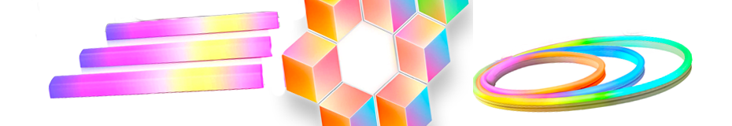
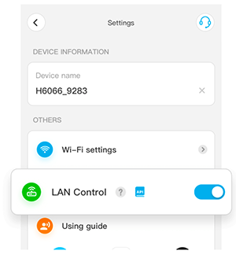
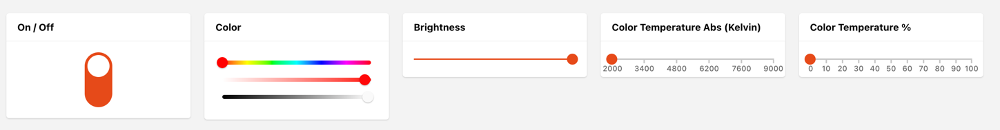
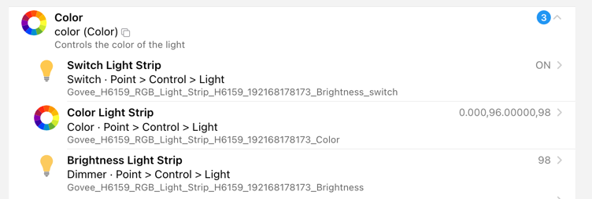
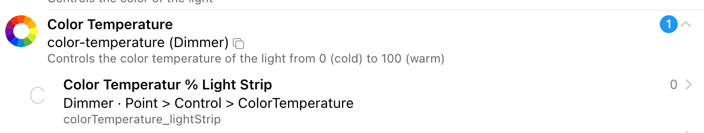
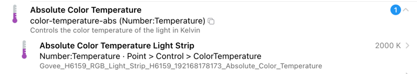

# Govee Lan-API Binding



This binding integrates Light devices from [Govee](https://www.govee.com/).
Even though these devices are widely used, they are usually only accessable via the Cloud.
Another option is using Bluetooth which, due to its limitation only allows to control devices within a small range.
The Bluetooth approach is supported by the openHAB Govee Binding while this binding covers the LAN interface.

Fortunately, there is a [LAN API](https://app-h5.govee.com/user-manual/wlan-guide) that allows to control the devices within your own network without accessing the Cloud.
Note, though, that is somehow limited to a number of devices listed in the aforementioned manual.
The binding is aware of all the devices that are listed in that document and even provides a product description during discovery.

Note: By intent the Cloud API has not been implemented (so far) as it makes controlling Govee devices dependent by Govee service itself.

## Supported Things

The things that are supported are all lights.
While Govee provides probably more than a hundred different lights, only the following are supported officially by the LAN API, even though others might works as well.

Here is a list of the supported devices (the ones marked with * have been tested by the author)

- H6042 Govee TV Light Bar #2
- H6043 Govee TV Light Bars #2
- H6046 RGBIC TV Light Bars
- H6047 RGBIC Gaming Light Bars with Smart Controller
- H6051 Aura - Smart Table Lamp
- H6052 Govee Table Lamp
- H6056 H6056 Flow Plus
- H6059 RGBWW Night Light for Kids
- H6061 Glide Hexa LED Panels (*)
- H6062 Glide Wall Light
- H6063 Gaming Wall Light
- H6065 Glide RGBIC Y Lights
- H6066 Glide Hexa Pro LED Panel
- H6067 Glide Triangle Light Panels (*)
- H606A Glide Hexa Light Panel Ultra
- H6072 RGBICWW Corner Floor Lamp (*)
- H6073 LED Floor Lamp
- H6076 RGBICW Smart Corner Floor Lamp (*)
- H6078 Cylinder Floor Lamp
- H607C Floor Lamp #2
- H6087 RGBIC Smart Wall Sconces
- H6088 RGBIC Cube Wall Sconces
- H608A String Downlights 5M
- H608B String Downlights 3M
- H608C String Downlights 2M
- H608D String Downlights 10M
- H60A0 Ceiling Light
- H60A1 Smart Ceiling Light (*)
- H610A Glide Lively Wall Lights
- H610B Music Wall Lights
- H6110 2x5M Multicolor with Alexa
- H6117 Dream Color LED Strip Light 10M
- H6141 5M Smart Multicolor Strip Light
- H6143 5M Strip Light
- H6144 2x5M Strip Light
- H6159 RGB Light Strip (*)
- H615A 5M Light Strip with Alexa (*)
- H615B 10M Light Strip with Alexa
- H615C 15M Light Strip with Alexa
- H615D 20M Light Strip with Alexa
- H615E 30M Light Strip with Alexa
- H6163 Dreamcolor LED Strip Light 5M
- H6167 TV Backlight 2.4M
- H6168 TV Backlight 2x0.7M+2x1.2M
- H616C Outdoor Strip 10M
- H616D Outdoor Strip 2x7.5M
- H616E Outdoor Strip 2x10M
- H6172 Outdoor LED Strip 10m
- H6173 RGBIC Outdoor Strip Lights
- H6175 RGBIC Outdoor Strip Lights 10M
- H6176 RGBIC Outdoor Strip Lights 30M
- H6182 WiFi Multicolor TV Strip Light
- H618A RGBIC Basic LED Strip Lights 5M
- H618C RGBIC Basic LED Strip Lights 5M
- H618E LED Strip Lights 22m
- H618F RGBIC LED Strip Lights
- H619A Strip Lights With Protective Coating 5M
- H619B Strip Lights With Protective Coating 7.5M
- H619C Strip Lights With Protective Coating with Alexa 10M
- H619D PRO LED Strip Lights with Alexa 2x7.5M
- H619E Strip Lights With Protective Coating with Alexa 2x10M
- H619Z Pro LED Strip Lights 3M
- H61A0 RGBIC Neon Rope Light 3M
- H61A1 RGBIC Neon Rope Light 2M
- H61A2 RGBIC Neon Rope Light 5M
- H61A3 RGBIC Neon Rope Light 4M
- H61A5 Neon LED Strip Light 10M
- H61A8 Neon Rope Light 10M
- H61A8 Neon Rope Light 20M
- H61B1 Strip Light with Cover 5M
- H61B2 RGBIC Neon TV Backlight 3M
- H61BA LED Strip Light 5M
- H61BC LED Strip Light 10M
- H61BE LED Strip Light 2x10M
- H61C2 Neon LED Strip Light 2M
- H61C2 Neon LED Strip Light 3M
- H61C2 Neon LED Strip Light 5M
- H61D3 Neon Rope Light 2 3m (*)
- H61D5 Neon Rope Light 2 5m (*)
- H61E0 LED Strip Light M1
- H61E1 LED Strip Light M1
- H7012 Warm White Outdoor String Lights
- H7013 Warm White Outdoor String Lights
- H7021 RGBIC Warm White Smart Outdoor String
- H7028 Lynx Dream LED-Bulb String
- H7033 LED-Bulb String Lights
- H7041 LED Outdoor Bulb String Lights
- H7042 LED Outdoor Bulb String Lights
- H7050 Outdoor Ground Lights 11M
- H7051 Outdoor Ground Lights 15M
- H7052 Outdoor Ground Lights 15M
- H7052 Outdoor Ground Lights 30M
- H7055 Pathway Light
- H705A Permanent Outdoor Lights 30M
- H705B Permanent Outdoor Lights 15M
- H705C Permanent Outdoor Lights 45M
- H705D Permanent Outdoor Lights #2 15M
- H705E Permanent Outdoor Lights #2 30M
- H705F Permanent Outdoor Lights #2 45M
- H7060 LED Flood Lights (2-Pack)
- H7061 LED Flood Lights (4-Pack)
- H7062 LED Flood Lights (6-Pack)
- H7063 Outdoor Flood Lights
- H7065 Outdoor Spot Lights
- H7066 Outdoor Spot Lights
- H706A Permanent Outdoor Lights Pro 30M
- H706B Permanent Outdoor Lights Pro 45M
- H706C Permanent Outdoor Lights Pro 60M
- H7070 Outdoor Projector Light (*)
- H7075 Outdoor Wall Light
- H70B1 520 LED Curtain Lights
- H70BC 400 LED Curtain Lights
- H70C1 RGBIC String Light 10M (*)
- H70C2 RGBIC String Light 20M (*)
- H805A Permanent Outdoor Lights Elite 30M
- H805B Permanent Outdoor Lights Elite 15M
- H805C Permanent Outdoor Lights Elite 45M

## Firewall

Govee devices communicate via multicast and unicast messages over the LAN.
So you must ensure that any firewall on your openHAB server is configured to pass the following traffic:

- Multicast UDP on 239.255.255.250 port 4001
- Incoming unicast UDP on port 4002
- Outgoing unicast UDP on port 4003

## Discovery

Discovery is done by scanning the devices in the Thing section.

The devices _do not_ support the LAN API support out-of-the-box.
To be able to use the device with the LAN API, the following needs to be done (also see the "Preparations for LAN API Control" section in the [Goveee LAN API Manual](https://app-h5.govee.com/user-manual/wlan-guide)):

- Start the Govee APP and add / discover the device (via Bluetooth) as described by the vendor manual
  Go to the settings page of the device
  
- Note that it may take several(!) minutes until this setting comes up.
- Switch on the LAN Control setting.
- Now the device can be used with openHAB.
- The easiest way is then to scan the devices via the SCAN button in the thing section of that binding

## Thing Configuration

Even though binding configuration is supported via a thing file it should be noted that the IP address is required and there is no easy way to find out the IP address of the device.
One possibility is to look for the MAC address in the Govee app and then looking the IP address up via:

```shell
arp -a | grep "MAC_ADDRESS"
```

### `govee-light` Thing Configuration

| Name            | Type    | Description                                                      | Default | Required | Advanced |
|-----------------|---------|------------------------------------------------------------------|---------|----------|----------|
| hostname        | text    | Hostname or IP address of the device                             | N/A     | yes      | no       |
| macAddress      | text    | MAC address of the device                                        | N/A     | yes      | no       |
| refreshInterval | integer | Interval the device is polled in sec.                            | 5       | no       | yes      |
| minKelvin       | integer | The minimum color temperature that the light supports in Kelvin. | N/A     | no       | yes      |
| maxKelvin       | integer | The maximum color temperature that the light supports in Kelvin. | N/A     | no       | yes      |

## Channels

| Channel               | Type   | Description                     | Read/Write | Description          |
|-----------------------|--------|---------------------------------|------------|----------------------|
| color                 | Switch | On / Off                        | RW         | Power On / OFF       |
|                       | Color  | HSB (Hue Saturation Brightness) | RW         |                      |
|                       | Dimmer | Brightness Percentage           | RW         |                      |
| color-temperature     | Dimmer | Color Temperature Percentage    | RW         |                      |
| color-temperature-abs | Dimmer | Color Temperature Absolute      | RW         | in 2000-9000 Kelvin  |

Note: you may want to set Unit metadata to "K" when creating a color-temperature-abs item.

## UI Example for one device



Thing channel setup:





```java
UID: govee:govee-light:33_5F_60_74_F4_08_77_21
label: Govee H6159 RGB Light Strip H6159 (192.168.178.173)
thingTypeUID: govee:govee-light
configuration:
  deviceType: H6159
  wifiSoftwareVersion: 1.02.11
  hostname: 192.168.162.233
  macAddress: 33:5F:60:74:F4:08:66:21
  wifiHardwareVersion: 1.00.10
  refreshInterval: 5
  productName: H6159 RGB Light Strip
channels:
  - id: color
    channelTypeUID: system:color
    label: Color
    description: Controls the color of the light
    configuration: {}
  - id: color-temperature
    channelTypeUID: system:color-temperature
    label: Color Temperature
    description: Controls the color temperature of the light from 0 (cold) to 100 (warm)
    configuration: {}
  - id: color-temperature-abs
    channelTypeUID: govee:color-temperature-abs
    label: Absolute Color Temperature
    description: Controls the color temperature of the light in Kelvin
    configuration: {}
```

# Troubleshooting

In case nothing is discovered

- please check if all devices are set to LAN-Mode
- ping the following address `ping 239.255.255.250`.
  You should get a response for every Govee Device on your LAN
- In case you get a result, add the device via the manual option

## Additional Information

Please provide any feedback regarding unlisted devices that even though not mentioned herein do work.
