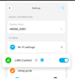

# Govee Lan-API Binding


This binding integrates Light devices from [Govee](https://www.govee.com/).
Even though these devices are widely used, they are usually only accessable via the Cloud.
Another option is using Bluetooth which, due to its limitation only allows to control devices within a small range.
The Bluetooth approach is supported by the openHAB Govee Binding while this binding covers the LAN interface.

Fortunately, there is a [LAN API](https://app-h5.govee.com/user-manual/wlan-guide) that allows to control the devices within your own network without accessing the Cloud.
Note, though, that is somehow limited to a number of devices listed in the aforementioned manual.
The binding is aware of all the devices that are listed in that document and even provides a product description during discovery.

Note: By intent the Cloud API has not been implemented (so far) as it makes controlling Govee devices dependent by Govee service itself.

## Supported Things

The things that are supported are all lights.
While Govee provides probably more than a hundred different lights, only the following are supported officially by the LAN API, even though others might works as well.

Here is a list of the supported devices (the ones marked with * have been tested by the author)

- H619Z RGBIC Pro LED Strip Lights
- H6046 RGBIC TV Light Bars
- H6047 RGBIC Gaming Light Bars with Smart Controller
- H6061 Glide Hexa LED Panels
- H6062 Glide Wall Light
- H6065 Glide RGBIC Y Lights
- H6066 Glide Hexa Pro LED Panel
- H6067 Glide Triangle Light Panels
- H6072 RGBICWW Corner Floor Lamp
- H6076 RGBICW Smart Corner Floor Lamp (*)
- H6073 LED Floor Lamp
- H6078 Cylinder Floor Lamp
- H6087 RGBIC Smart Wall Sconces
- H6173 RGBIC Outdoor Strip Lights
- H619A RGBIC Strip Lights With Protective Coating 5M
- H619B RGBIC LED Strip Lights With Protective Coating
- H619C LED Strip Lights With Protective Coating
- H619D RGBIC PRO LED Strip Lights
- H619E RGBIC LED Strip Lights With Protective Coating
- H61A0 RGBIC Neon Rope Light 1M
- H61A1 RGBIC Neon Rope Light 2M
- H61A2 RGBIC Neon Rope Light 5M
- H61A3 RGBIC Neon Rope Light
- H61A5 Neon LED Strip Light 10
- H61A8Neon Neon Rope Light 10
- H618A RGBIC Basic LED Strip Lights 5M
- H618C RGBIC Basic LED Strip Lights 5M
- H6117 Dream Color LED Strip Light 10M
- H6159 RGB Light Strip (*)
- H615E LED Strip Lights 30M
- H6163 Dreamcolor LED Strip Light 5M
- H610A Glide Lively Wall Lights
- H610B Music Wall Lights
- H6172 Outdoor LED Strip 10m
- H61B2 RGBIC Neon TV Backlight
- H61E1 LED Strip Light M1
- H7012 Warm White Outdoor String Lights
- H7013 Warm White Outdoor String Lights
- H7021 RGBIC Warm White Smart Outdoor String
- H7028 Lynx Dream LED-Bulb String
- H7041 LED Outdoor Bulb String Lights
- H7042 LED Outdoor Bulb String Lights
- H705A Permanent Outdoor Lights 30M
- H705B Permanent Outdoor Lights 15M
- H7050 Outdoor Ground Lights 11M
- H7051 Outdoor Ground Lights 15M
- H7055 Pathway Light
- H7060 LED Flood Lights (2-Pack)
- H7061 LED Flood Lights (4-Pack)
- H7062 LED Flood Lights (6-Pack)
- H7065 Outdoor Spot Lights
- H6051 Aura - Smart Table Lamp
- H6056 H6056 Flow Plus
- H6059 RGBWW Night Light for Kids
- H618F RGBIC LED Strip Lights
- H618E LED Strip Lights 22m
- H6168 TV LED Backlight

## Discovery

Discovery is done by scanning the devices in the Thing section. 

The devices _do not_ support the LAN API support out-of-the-box.
To be able to use the device with the LAN API, the following needs to be done (also see the "Preparations for LAN API Control" section in the [Goveee LAN API Manual](https://app-h5.govee.com/user-manual/wlan-guide)):

+ Start the Govee APP and add / discover the device (via Bluetooth) as described by the vendor manual
Go to the settings page of the device 

+ Note that it may take several(!) minutes until this setting comes up
+ Switch on the LAN-Control setting
+ Now the device can be used with openHAB
+ The easiest way is then to scan the devices via the SCAN button in the thing section of that binding

## Thing Configuration

Even though binding configuration is supported via a thing file it should be noted that the IP address is required and there is no easy way to find out the IP address of the device.
One possibility is to look for the MAC address in the Govee app and then looking the IP address up via 

```
arp -a | grep "MAC_ADDRESS"
```

### Thing Configuration

| Name            | Type    | Description                           | Default | Required | Advanced |
|-----------------|---------|---------------------------------------|---------|----------|----------|
| hostname        | text    | Hostname or IP address of the device  | N/A     | yes      | no       |
| macAddress      | text    | MAC address of the device             | N/A     | yes      | no       |
| deviceType      | text    | The product number of the device      | N/A     | yes      | no       |
| refreshInterval | integer | Interval the device is polled in sec. | 3       | no       | yes      |


## Channels

| Channel             | Type              | Read/Write | Description         |
|---------------------|-------------------|------------|---------------------|
| switch              | Switch            | RW         | Power On / OFF      |
| color               | Color HSB Type    | RW         |                     |
| colorTemperatureAbs | Color Temperature | RW         | in 2000-9000 Kelvin |
| brightness          | Percentage        | RW         |                     |

Note: you may have to add "%.0f K" as the state description when creating a colorTemperatureAbs item.

## Additional Information

Please provide any feedback regarding unlisted devices that even though not mentioned herein do work.
