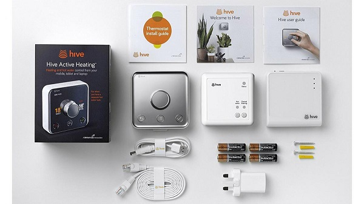

# Hive Binding

This binding allows Openhab to talk to British Gas's Hive Active Heating System through their API allowing you to view the temperature at the thermostat, change the current target temperature and even set a timed boost on your heating.

## Supported Things

Currently the Thermostat is the only thing supported but soon the individual radiator controls will be supported too

## Discovery

Will auto discover thermostats once the bridge is added

## Thing Configuration

Add a hive account through the plus button on the inbox, pop in your hive account details so that the binding can authenticate with the Hive API and it'll start discovering your devices right away

## Channels

Currently available channels are Current Temperature, Target Temperature, Boost, Remaining Boost Duration, Heating on, Hot water on, Heating Mode and Battery level.
