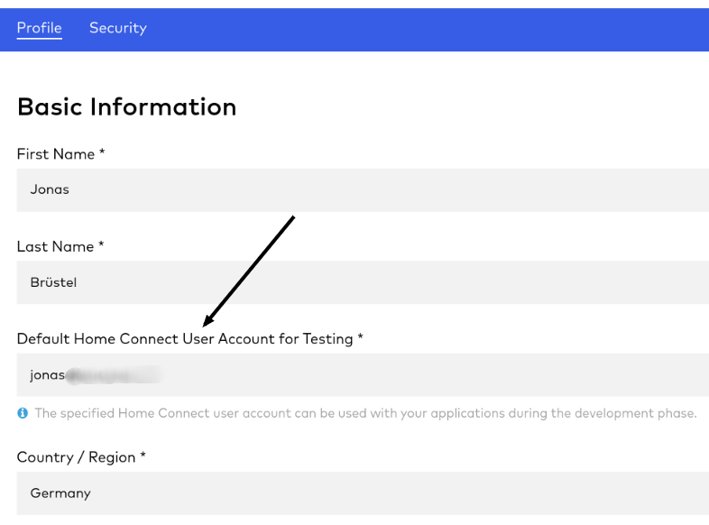
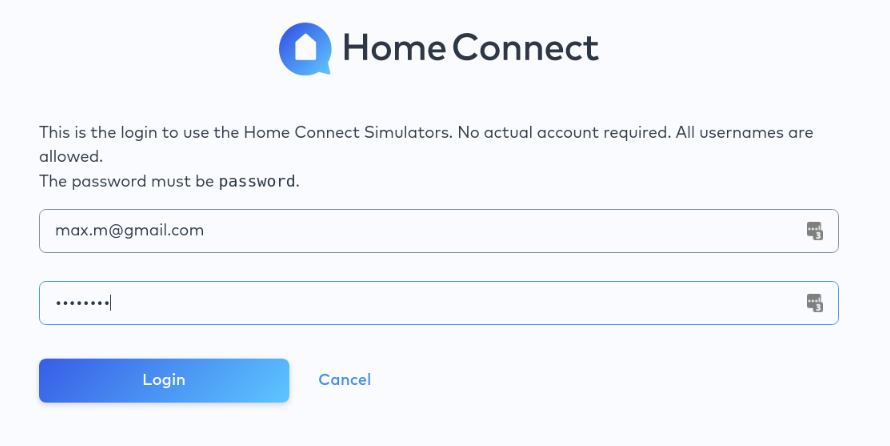
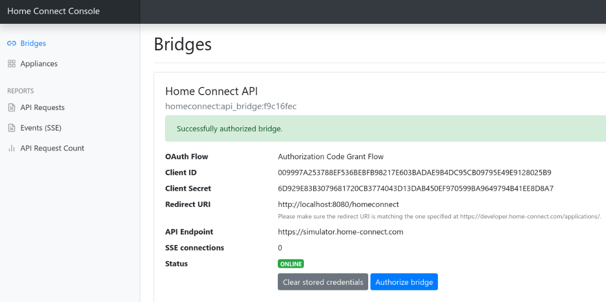
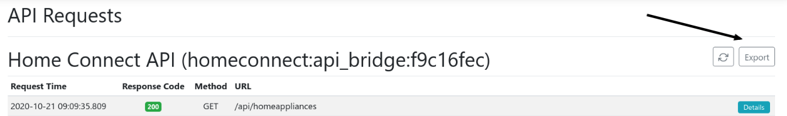
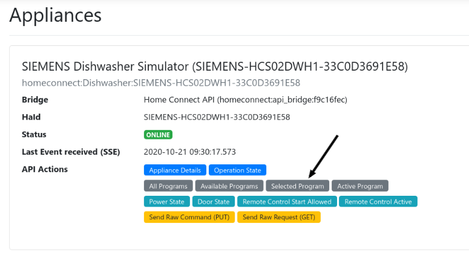
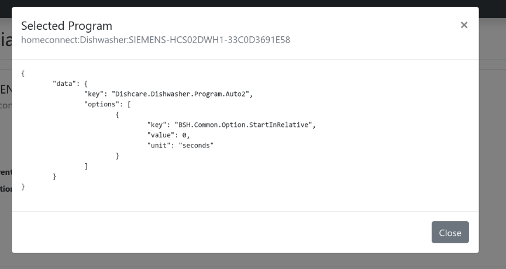
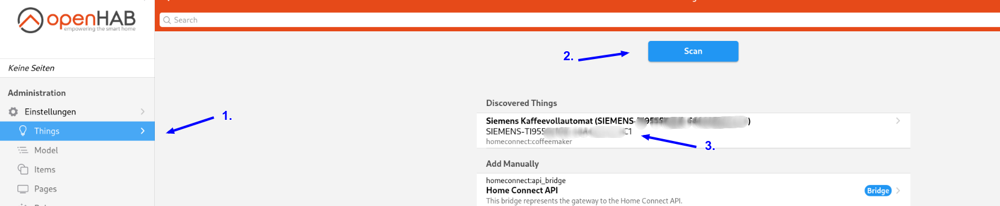
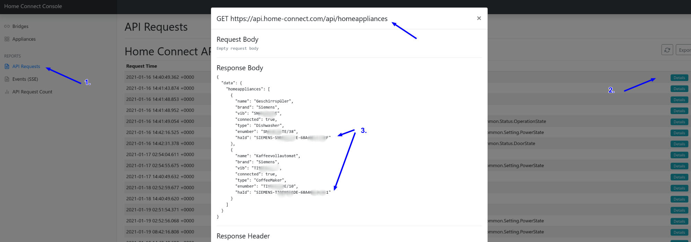

# Home Connect Binding

The binding integrates the [Home Connect](https://www.home-connect.com/) system into openHAB.
By using the Home Connect API it connects to household devices from brands like Bosch and Siemens.

Because all status updates and commands have to go through the API, a permanent internet connection is required.

## Supported Things

### Bridge

The **Home Connect API** (Bridge Type ID: api_bridge) is responsible for the communication with the Home Connect API. All devices use a bridge to execute commands and listen for updates. Without a working bridge the devices cannot communicate.

### Devices

Supported devices: dishwasher, washer, washer / dryer combination, dryer, oven, refrigerator freezer, coffee machine, hood, cooktop*

#### experimental support

| Home appliance | Thing Type ID |
| --------------- | ------------ |
| Dishwasher | dishwasher |
| Washer | washer |
| Washer / Dryer combination | washerdryer |
| Dryer | dryer |
| Oven | oven |
| Hood | hood |
| Cooktop | hob |
| Refrigerator Freezer | fridgefreezer |
| Coffee Machine | coffeemaker |

> **INFO:** Currently the Home Connect API does not support all appliance programs. Please check if your desired program is available (e.g. <https://developer.home-connect.com/docs/washing-machine/supported_programs_and_options>).

## Discovery

After the bridge has been added and authorized, devices are discovered automatically.

## Channels

| Channel Type ID | Item Type | Read only | Description | Available on thing |
| --------------- | --------- | --------- | ----------- | ------------------ |
| power_state | Switch | false | This setting describes the current power state of the home appliance. | dishwasher, oven, coffeemaker, hood, hob  |
| door_state | Contact | true | This status describes the door state of a home appliance. A status change is either triggered by the user operating the home appliance locally (i.e. opening/closing door) or automatically by the home appliance (i.e. locking the door). | dishwasher, washer, washerdryer, dryer, oven, fridgefreezer |
| operation_state | String | true | This status describes the operation state of the home appliance. | dishwasher, washer, washerdryer, dryer, oven, hood, hob, coffeemaker |
| remote_start_allowance_state | Switch | true  | This status indicates whether the remote program start is enabled. This can happen due to a programmatic change (only disabling), or manually by the user changing the flag locally on the home appliance, or automatically after a certain duration - usually in 24 hours. | dishwasher, washer, washerdryer, dryer, oven, hood, coffeemaker |
| remote_control_active_state | Switch | true  | This status indicates whether the allowance for remote controlling is enabled. | dishwasher, washer, washerdryer, dryer, oven, hood, hob |
| active_program_state | String | true  | This status describes the active program of the home appliance. | dishwasher, washer, washerdryer, dryer, oven, hood, hob, coffeemaker  |
| selected_program_state | String | false | This state describes the selected program of the home appliance. | dishwasher, washer, washerdryer, dryer, oven, hob, coffeemaker |
| remaining_program_time_state | Number:Time | true | This status indicates the remaining program time of the home appliance. | dishwasher, washer, washerdryer, dryer, oven |
| elapsed_program_time | Number:Time | true | This status indicates the elapsed program time of the home appliance. | oven |
| program_progress_state | Number:Dimensionless | true | This status describes the program progress of the home appliance in percent. | dishwasher, washer, washerdryer, dryer, oven, coffeemaker |
| duration | Number:Time | true | This status describes the duration of the program of the home appliance. | oven |
| oven_current_cavity_temperature | Number:Temperature | true | This status describes the current cavity temperature of the home appliance. | oven |
| setpoint_temperature | Number:Temperature | false | This status describes the setpoint/target temperature of the home appliance. | oven |
| laundry_care_washer_temperature | String | false | This status describes the temperature of the washing program of the home appliance. | washer, washerdryer |
| laundry_care_washer_spin_speed | String | false | This status defines the spin speed of a washer program of the home appliance. | washer, washerdryer |
| laundry_care_washer_idos1_level | String | false | This status defines the i-Dos 1 dosing level of a washer program of the home appliance (if appliance supports i-Dos). | washer |
| laundry_care_washer_idos2_level | String | false | This status defines the i-Dos 2 dosing level of a washer program of the home appliance (if appliance supports i-Dos). | washer |
| laundry_care_washer_idos1 | Switch | true | This status indicates whether i-Dos 1 is activated for a washer program of the home appliance. (If appliance supports i-Dos) | washer |
| laundry_care_washer_idos2 | Switch | true | This status indicates whether i-Dos 2 is activated for a washer program of the home appliance. (If appliance supports i-Dos) | washer |
| laundry_care_washer_vario_perfect | String | true | This status defines the vario perfect mode of a washer program of the home appliance. | washer, washerdryer |
| laundry_care_washer_less_ironing | Switch | true | This status indicates whether less ironing is activated for a washer program of the home appliance. | washer, washerdryer |
| laundry_care_washer_pre_wash | Switch | true | This status indicates whether the pre-wash is activated for a washer program of the home appliance. | washer, washerdryer |
| laundry_care_washer_rinse_plus | String | true | This status defines the number of additional rinses of a washer program of the home appliance. | washer, washerdryer |
| laundry_care_washer_rinse_hold | Switch | true | This status indicates whether the spin function is deactivated for a washer program of the home appliance (washing will remain in the water after the last rinse cycle). | washer, washerdryer |
| laundry_care_washer_soak | Switch | true | This status indicates whether the soaking is activated for a washer program of the home appliance. | washer, washerdryer |
| laundry_care_washer_load_recommendation | Number:Mass | true | This channel indicates the maximum laundry load recommended for a program of the home appliance. | washer, washerdryer |
| program_energy | Number:Dimensionless | true | This channel provides the estimated energy required in percentage for a program of the home appliance. | washer, washerdryer |
| program_water | Number:Dimensionless | true | This channel provides the estimated water required in percentage for a program of the home appliance. | washer, washerdryer |
| dryer_drying_target | String | false | This status defines the desired dryness of a program of the home appliance. | dryer, washerdryer |
| setpoint_temperature_refrigerator | Number:Temperature | false | Target temperature of the refrigerator compartment (range depends on appliance - common range 2 to 8°C). | fridgefreezer |
| setpoint_temperature_freezer | Number:Temperature | false | Target temperature of the freezer compartment (range depends on appliance - common range -16 to -24°C). | fridgefreezer |
| super_mode_refrigerator | Switch | false | The setting has no impact on setpoint temperatures but will make the fridge compartment cool to the lowest possible temperature until it is disabled manually by the customer or by the HA because of a timeout. | fridgefreezer |
| super_mode_freezer | Switch | false | This setting has no impact on setpoint temperatures but will make the freezer compartment cool to the lowest possible temperature until it is disabled manually by the customer or by the home appliance because of a timeout. | fridgefreezer |
| coffeemaker_drip_tray_full_state | Switch | true | Is coffee maker drip tray full? | coffeemaker |
| coffeemaker_water_tank_empty_state | Switch | true | Is coffee maker water tank empty? | coffeemaker |
| coffeemaker_bean_container_empty_state | Switch | true | Is coffee maker bean container empty? | coffeemaker |
| hood_venting_level | String | true | This option defines the required fan setting of the hood. | hood |
| hood_intensive_level | String | true | This option defines the intensive setting of the hood. | hood |
| hood_program_state | String | false | Adds hood controller actions to the appliance. The following commands are supported: `stop`, `venting1`, `venting2`, `venting3`, `venting4`, `venting5`, `ventingIntensive1`, `ventingIntensive1`, `automatic` and `delayed`. Furthermore it is possible to send raw (Home Connect JSON payload) to the home appliance. | hood |
| basic_actions_state | String | false | Adds basic controller actions to the appliance. The following basic commands are supported: `start` (start current selected program), `stop` (stop current program) and `selected` (show current program information). Furthermore it is possible to send raw (Home Connect JSON payload) to the home appliance. | dishwasher, oven, washer, washerdryer, dryer, coffeemaker |
| functional_light_state | Switch | false | This setting describes the current functional light state of the home appliance. | hood |
| functional_light_brightness_state | Dimmer | false | This setting describes the brightness state of the functional light. | hood |
| ambient_light_state | Switch | false | This setting describes the current ambient light state of the home appliance. | dishwasher, hood |
| ambient_light_brightness_state | Dimmer | false | This setting describes the brightness state of the ambient light. _INFO: Please note that the brightness can't be set if the ambient light color is set to `CustomColor`._ | dishwasher, hood |
| ambient_light_color_state | String | false | This setting describes the current ambient light color state of the home appliance. | dishwasher, hood |
| ambient_light_custom_color_state | Color | false | This setting describes the custom color state of the ambient light. HSB color commands are supported as well as hex color string e.g. `#11ff00`. _INFO: Please note that the brightness can't be set._ | dishwasher, hood |

## Thing Configuration

### Configuring the **Home Connect API** Bridge

#### 1. Preconditions

1. Please create an account at [Home Connect](https://www.home-connect.com/) and add your physical appliance to your account.
1. Test the connection to your physical appliance via mobile app ([Apple App Store (iOS)](https://itunes.apple.com/de/app/home-connect-app/id901397789?mt=8) or [Google Play Store (Android)](https://play.google.com/store/apps/details?id=com.bshg.homeconnect.android.release)).

#### 2. Create Home Connect developer account

1. Create an account at [https://developer.home-connect.com](https://developer.home-connect.com) and login.
1. Please make sure you've added your associated Home Connect account email at <https://developer.home-connect.com/user/me/edit>. You should fill in your email address, which you use for the official Android or iOS app, at `Default Home Connect User Account for Testing`.  

1. Register / Create an application at [https://developer.home-connect.com/applications](https://developer.home-connect.com/applications)
    - _Application ID_: e.g. `openhab-binding`
    - _OAuth Flow_: Authorization Code Grant Flow
    - _Home Connect User Account for Testing_: the associated user account email from [Home Connect](https://www.home-connect.com/)  
       > **WARNING**: Please don't use your developer account username  

    - _Redirect URIs_: add your openHAB URL followed by `/homeconnect`  
    for example: `http://192.168.178.34:8080/homeconnect` or `https://myhome.domain.com/homeconnect`
    - _One Time Token Mode_: keep unchecked
    - _Proof Key for Code Exchange_: keep unchecked
      
       > **NOTE**: You might get an error (`403 - Forbidden`) in case you entered a bare IP of your local openHAB instance. In that case, use your instance's hostname instead (e.g. for openhabian `http://openhabian:8080/homeconnect`) and try again.
    
1. After your application has been created, you should see the _Client ID_ and _Client Secret_ of the application. Please save these for later.  


#### 3. Setup bridge (openHAB UI)

The Home Connect bridge can be configured in the openHAB UI as follows:

1. Go to the Inbox and press the add button
1. Choose `Home Connect Binding`
1. Select `Home Connect API`
1. Setup and save thing
    - **client id:** your application client id
    - **client secret:** your application client secret
    - **simulator:** false
1. Now navigate to the URL (`Redirct URI`) you've added to your Home Connect application in the previous step (2.3). For example `http://192.168.178.80:8080/homeconnect`.
1. Please follow the steps shown to authenticate your binding. You can redo this step every time. For example if you have authentication problems, just start wizard again.  
  
  
  
  
1. That's it! Now you can use autodiscovery to add devices. Your devices should show up if you start a device scan in the openHAB UI.

## Examples: File based configuration

If you prefer to configure everything via file instead of openHAB UI, here are some examples. In order to get your `haId` you might use the discover feature in UI, copy the appliance's ID and paste it into your `*.things`.

### things/homeconnect.things

```java
Bridge homeconnect:api_bridge:api_bridge_at_home "Home Connect API" [ clientId="1234", clientSecret="1234", simulator=false] {
    // Thing configurations
    Thing dishwasher dishwasher1 "Dishwasher"  [ haId="SIEMENS-HCS02DWH1-6F2FC400C1EA4A" ]
    Thing washer washer1 "Washer"  [ haId="SIEMENS-HCS03WCH1-1F35EC2BE34A0F" ]
    Thing fridgefreezer fridge1 "Fridge Freezer  [ haId="SIEMENS-HCS05FRF1-7B3FA5EB3D885B" ]
    Thing oven oven1 "Oven"  [ haId="BOSCH-HCS01OVN1-2132B6FA25BA21" ]
    Thing dryer dryer1 "Dryer"  [ haId="BOSCH-HCS04DYR1-3921C766AD5BAF" ]
    Thing coffeemaker coffee1 "Coffee machine"  [ haId="BOSCH-HCS06COM1-2140A8821AE7AB" ]
    Thing washerdryer washerdryer1 "Washerdryer"  [ haId="BOSCH-HCS06COM1-2140A8821AE7AB" ]
    Thing fridgefreezer fridgefreezer1 "Fridge/Freezer"  [ haId="BOSCH-HCS06COM1-2140A8821AE7AB" ]
    Thing hood hood1 "Hood"  [ haId="BOSCH-HCS06COM1-2140A8821AE7AB" ]
    Thing hob hob1 "Hob"  [ haId="BOSCH-HCS06COM1-2140A8821AE7AB" ]
}
```

### items/homeconnect.items

The channel parameter uses the following syntax: `homeconnect:<thing type id>:<bridge id>:<thing id>:<channel type id>`. For example: `homeconnect:dishwasher:api_bridge_at_home:dishwasher1:power_state`

```java
// dishwasher
Switch                 Dishwasher_PowerState                              "Power State"                        {channel="homeconnect:dishwasher:api_bridge_at_home:dishwasher1:power_state"}
Contact                Dishwasher_DoorState                               "Door State"                         {channel="homeconnect:dishwasher:api_bridge_at_home:dishwasher1:door_state"}
String                 Dishwasher_OperationState                          "Operation State"                    {channel="homeconnect:dishwasher:api_bridge_at_home:dishwasher1:operation_state"}
Switch                 Dishwasher_RemoteStartAllowanceState               "Remote Start Allowance State"       {channel="homeconnect:dishwasher:api_bridge_at_home:dishwasher1:remote_start_allowance_state"}
Switch                 Dishwasher_RemoteControlActiveState                "Remote Control Activation State"    {channel="homeconnect:dishwasher:api_bridge_at_home:dishwasher1:remote_control_active_state"}
String                 Dishwasher_SelectedProgramState                    "Selected Program"                   {channel="homeconnect:dishwasher:api_bridge_at_home:dishwasher1:selected_program_state"}
String                 Dishwasher_ActiveProgramState                      "Active Program"                     {channel="homeconnect:dishwasher:api_bridge_at_home:dishwasher1:active_program_state"}
Number:Time            Dishwasher_RemainingProgramTimeState               "Remaining Program Time"             {channel="homeconnect:dishwasher:api_bridge_at_home:dishwasher1:remaining_program_time_state"}
Number:Dimensionless   Dishwasher_ProgramProgressState                    "Progress State"                     {channel="homeconnect:dishwasher:api_bridge_at_home:dishwasher1:program_progress_state"}
String                 Dishwasher_BasicActionsState                       "Basic Control"                      {channel="homeconnect:dishwasher:api_bridge_at_home:dishwasher1:basic_actions_state"}

// oven
Switch                 Oven_PowerState                                    "Power State"                        {channel="homeconnect:oven:api_bridge_at_home:oven1:power_state"}
Contact                Oven_DoorState                                     "Door State"                         {channel="homeconnect:oven:api_bridge_at_home:oven1:door_state"}
String                 Oven_OperationState                                "Operation State"                    {channel="homeconnect:oven:api_bridge_at_home:oven1:operation_state"}
Switch                 Oven_RemoteStartAllowanceState                     "Remote Start Allowance State"       {channel="homeconnect:oven:api_bridge_at_home:oven1:remote_start_allowance_state"}
Switch                 Oven_RemoteControlActiveState                      "Remote Control Activation State"    {channel="homeconnect:oven:api_bridge_at_home:oven1:remote_control_active_state"}
String                 Oven_SelectedProgramState                          "Selected Program"                   {channel="homeconnect:oven:api_bridge_at_home:oven1:selected_program_state"}
String                 Oven_ActiveProgramState                            "Active Program"                     {channel="homeconnect:oven:api_bridge_at_home:oven1:active_program_state"}
Number:Time            Oven_RemainingProgramTimeState                     "Remaining Program Time"             {channel="homeconnect:oven:api_bridge_at_home:oven1:remaining_program_time_state"}
Number:Dimensionless   Oven_ProgramProgressState                          "Progress State"                     {channel="homeconnect:oven:api_bridge_at_home:oven1:program_progress_state"}
Number:Time            Oven_ElapsedProgramTime                            "Elapsed Program Time"               {channel="homeconnect:oven:api_bridge_at_home:oven1:elapsed_program_time"}
Number:Time            Oven_Duration                                      "Program Duration"                   {channel="homeconnect:oven:api_bridge_at_home:oven1:duration"}
Number:Temperature     Oven_CurrentCavityTemperature                     "Current Temperature"                {channel="homeconnect:oven:api_bridge_at_home:oven1:oven_current_cavity_temperature"}
Number:Temperature     Oven_SetpointTemperature                          "Set Temperature"                    {channel="homeconnect:oven:api_bridge_at_home:oven1:setpoint_temperature"}
String                 Oven_BasicActionsState                            "Basic Control"                      {channel="homeconnect:oven:api_bridge_at_home:oven1:basic_actions_state"}

// washer
Switch                 Washer_PowerState                                  "Power State"                        {channel="homeconnect:washer:api_bridge_at_home:washer1:power_state"}
Contact                Washer_DoorState                                   "Door State"                         {channel="homeconnect:washer:api_bridge_at_home:washer1:door_state"}
String                 Washer_OperationState                              "Operation State"                    {channel="homeconnect:washer:api_bridge_at_home:washer1:operation_state"}
Switch                 Washer_RemoteStartAllowanceState                   "Remote Start Allowance State"       {channel="homeconnect:washer:api_bridge_at_home:washer1:remote_start_allowance_state"}
Switch                 Washer_RemoteControlActiveState                    "Remote Control Activation State"    {channel="homeconnect:washer:api_bridge_at_home:washer1:remote_control_active_state"}
String                 Washer_SelectedProgramState                        "Selected Program"                   {channel="homeconnect:washer:api_bridge_at_home:washer1:selected_program_state"}
String                 Washer_ActiveProgramState                          "Active Program"                     {channel="homeconnect:washer:api_bridge_at_home:washer1:active_program_state"}
Number:Time            Washer_RemainingProgramTimeState                   "Remaining Program Time"             {channel="homeconnect:washer:api_bridge_at_home:washer1:remaining_program_time_state"}
Number:Dimensionless   Washer_ProgramProgressState                        "Progress State"                     {channel="homeconnect:washer:api_bridge_at_home:washer1:program_progress_state"}
String                 Washer_LaundryCareWasherTemperature             "Temperature"                        {channel="homeconnect:washer:api_bridge_at_home:washer1:laundry_care_washer_temperature"}
String                 Washer_LaundryCareWasherSpinSpeed              "Spin Speed"                         {channel="homeconnect:washer:api_bridge_at_home:washer1:laundry_care_washer_spin_speed"}
String                 Washer_LaundryCareWasherIdos1Level             "i-Dos 1 Level"                      {channel="homeconnect:washer:api_bridge_at_home:washer1:laundry_care_washer_idos1_level"}
String                 Washer_LaundryCareWasherIdos2Level             "i-Dos 2 Level"                      {channel="homeconnect:washer:api_bridge_at_home:washer1:laundry_care_washer_idos2_level"}
Switch                 Washer_LaundryCareWasherIdos1                   "i-Dos 1 State"                      {channel="homeconnect:washer:api_bridge_at_home:washer1:laundry_care_washer_idos1"}
Switch                 Washer_LaundryCareWasherIdos2                   "i-Dos 2 State"                      {channel="homeconnect:washer:api_bridge_at_home:washer1:laundry_care_washer_idos2"}
Switch                 Washer_LaundryCareWasherVarioPerfect           "Vario Perfect State"                {channel="homeconnect:washer:api_bridge_at_home:washer1:laundry_care_washer_vario_perfect"}
Switch                 Washer_LaundryCareWasherLessIroning            "Ironing State"                      {channel="homeconnect:washer:api_bridge_at_home:washer1:laundry_care_washer_less_ironing"}
Switch                 Washer_LaundryCareWasherPreWash                "Prewash State"                      {channel="homeconnect:washer:api_bridge_at_home:washer1:laundry_care_washer_pre_wash"}
Switch                 Washer_LaundryCareWasherRinsePlus              "Amount Aadditional Rinses"           {channel="homeconnect:washer:api_bridge_at_home:washer1:laundry_care_washer_rinse_plus"}
Switch                 Washer_LaundryCareWasherRinseHold              "Spin Hold"                          {channel="homeconnect:washer:api_bridge_at_home:washer1:laundry_care_washer_rinse_hold"}
Switch                 Washer_LaundryCareWasherSoak                    "Soaking State"                      {channel="homeconnect:washer:api_bridge_at_home:washer1:laundry_care_washer_soak"}
Number:Mass            Washer_LaundryCareWasherLoadRecommendation     "Load Recommendation"                {channel="homeconnect:washer:api_bridge_at_home:washer1:laundry_care_washer_load_recommendation"}
Number:Dimensionless   Washer_ProgramEnergy                              "Estimated Energy Consumption"       {channel="homeconnect:washer:api_bridge_at_home:washer1:program_energy"}
Number:Dimensionless   Washer_ProgramWater                               "Estimated Water Consumption"        {channel="homeconnect:washer:api_bridge_at_home:washer1:program_water"}
String                 Washer_BasicActionsState                         "Basic Control"                      {channel="homeconnect:washer:api_bridge_at_home:washer1:basic_actions_state"}

```

## Home Connect Console

The binding comes with a separate user interface, which is reachable through the web browser http(s)://[YOUROPENHAB]:[YOURPORT]/homeconnect (e.g. `http://192.168.178.100:8080/homeconnect`).

Features:

- overview of your bridges and appliances
- send commands to your appliances
- see latest API requests
- see received events from the Home Connect backend
- API request counts

> **INFO**: If you have a problems with your installation, please always provide request and event exports. 

## How To

### Notification on credential error

To get notified when your Home Connect credentials have been revoked or expired you can use the following rule to get notified.

This can happen if

- your openHAB instance was offline for a longer period or
- new terms weren't accepted or
- a technical problem occurred.

```java
rule "Offline check - Home Connect bridge"
when
    Thing "<thingUID>" changed
then
    val statusInfo = getThingStatusInfo("<thingUID>")
    val status = statusInfo.getStatus()
    val statusDetail = statusInfo.getStatusDetail()

    if ((status !== null) && (statusDetail !== null)) {
        logInfo("api_bridge", "Home Connect bridge status: " + status.toString() + " detail: " + statusDetail.toString())
        if (status.toString() == 'OFFLINE' && statusDetail.toString() == 'CONFIGURATION_PENDING') {
            logError("api_bridge", "Home Connect bridge offline.")
            // send push, email, ...
        }
    }
end
```

### Start program with custom settings

Currently, not all program options of a device are available as items in openHAB. For example, you cannot change the `Fill quantity` of a coffee maker program. If you wish to start a program with a custom setting, you can send a special command to the item of type `basic_actions_state`.

> **INFO**: Only for advanced users. You need to know how to use the `curl` command. Alternatively you you can use the binding UI to trigger the commands.

#### 1. Retrieve "special command" payload

You have a couple options to get the program settings payload.

a) You could have a look at the Home Connect developer documentation (<https://developer.home-connect.com/docs/>) and create the payload on your own.

b) You could have a look at the request logs and extract the payload from there.

1. On the physical device, select your desired program with the appropriate options.
1. Open the appliance section of the binding UI (http(s)://[YOUROPENHAB]:[YOURPORT]/appliances) and click the 'Selected Program' button.

1.  Copy the JSON payload. In a further step, this payload will be used to start the program.

#### 2. Start program

After you've extracted the desired program command, you can start your program via openHAB rule or through a `curl` command.

##### in rule

_Example rule:_

```java
rule "trigger program"
when
    Time cron "0 32 13 ? * * *"
then
    homeconnect_CoffeeMaker_BOSCH_HCS06COM1_B95E5103934D_basic_actions_state.sendCommand('{"data":{"key":"ConsumerProducts.CoffeeMaker.Program.Beverage.EspressoMacchiato","options":[{"key":"ConsumerProducts.CoffeeMaker.Option.CoffeeTemperature","value":"ConsumerProducts.CoffeeMaker.EnumType.CoffeeTemperature.94C","unit":"enum"},{"key":"ConsumerProducts.CoffeeMaker.Option.BeanAmount","value":"ConsumerProducts.CoffeeMaker.EnumType.BeanAmount.Mild","unit":"enum"},{"key":"ConsumerProducts.CoffeeMaker.Option.FillQuantity","value":60,"unit":"ml"}]}}')
end
```

Please replace `homeconnect_CoffeeMaker_BOSCH_HCS06COM1_B95E5103934D_basic_actions_state` with your item name (of channel type `basic_actions_state`).

##### via curl

_Example command:_

```shell
curl -X POST --header "Content-Type: text/plain" --header "Accept: application/json" -d '{"data":{"key":"ConsumerProducts.CoffeeMaker.Program.Beverage.EspressoMacchiato","options":[{"key":"ConsumerProducts.CoffeeMaker.Option.CoffeeTemperature","value":"ConsumerProducts.CoffeeMaker.EnumType.CoffeeTemperature.94C","unit":"enum"},{"key":"ConsumerProducts.CoffeeMaker.Option.BeanAmount","value":"ConsumerProducts.CoffeeMaker.EnumType.BeanAmount.Mild","unit":"enum"},{"key":"ConsumerProducts.CoffeeMaker.Option.FillQuantity","value":60,"unit":"ml"}]}}' "http://localhost:8080/rest/items/homeconnect_CoffeeMaker_BOSCH_HCS06COM1_B95E5103934D_basic_actions_state"
```

Please replace `homeconnect_CoffeeMaker_BOSCH_HCS06COM1_B95E5103934D_basic_actions_state` with your item name (of channel type `basic_actions_state`).

### How to avoid having to re-authorize the bridge after a new openHAB installation

OAuth is storing data in two files: your access tokens in the file `userdata/jsondb/StorageHandler.For.OAuthClientService.json` and the encryption/decryption key in the file `userdata/config/SymmetricKeyCipher.config`.
Consider backing up and restoring these two files when installing a new openHAB server from scratch.
Otherwise, all you need to do is re-authorize your bridge.

## FAQ

### I can't switch remote start to on.

The channel of type `remote_start_allowance_state` is read only. You can only enable it directly on the physical appliance.

### In case of error...

Please check log UI (http(s)://[YOUROPENHAB]:[YOURPORT]/homeconnect) and ask for help in the community forum or on github. Please provide request and event exports.  
 

### Rate limit reached

The Home Connect API enforces rate [limits](https://developer.home-connect.com/docs/general/ratelimiting). If you have a lot of `429` response codes in your request log section (http(s)://[YOUROPENHAB]:[YOURPORT]/homeconnect/log/requests), please check the error response.

### Error message 'Program not supported', 'Unsupported operation' or 'SDK.Error.UnsupportedOption'

Not all appliance programs and program options are supported by the Home Connect API. Unfortunately you can't use them. You will see error messages like the following in the binding UI (request log):

```json
{
  "error": {
    "key": "SDK.Error.UnsupportedProgram",
    "description": "Unsupported operation: LaundryCare.Washer.Program.Cotton.CottonEco"
  }
}
```

```json
{
  "error": {
    "key": "SDK.Error.UnsupportedProgram",
    "description": "Program not supported"
  }
}
```

### How to find the Home Appliance ID (HaID) of my device?

You have two options to find the right HaID of your device.

1. You can use the openHAB UI and start a scan. 
1. You can use Home Connect binding UI. Please have a look at the first API request. 
