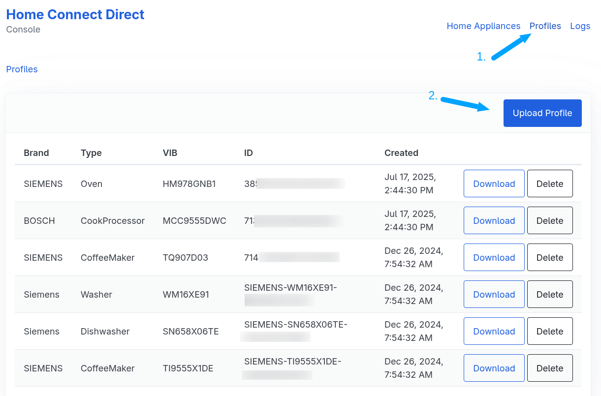
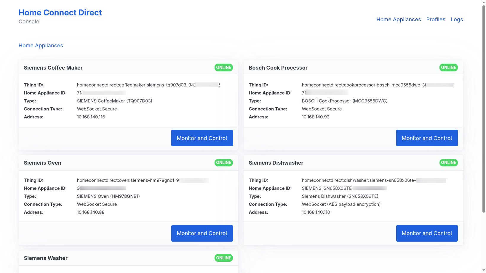
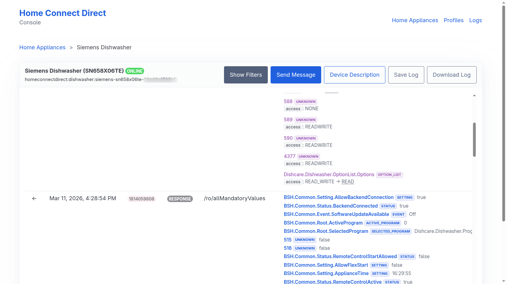
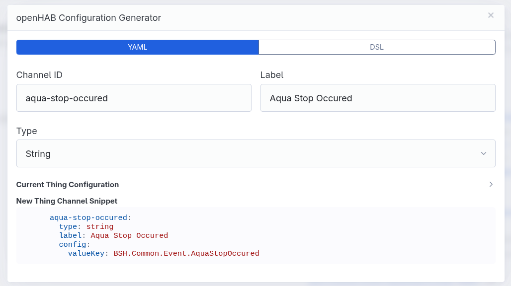

# Home Connect Direct Binding

The Home Connect Direct Binding integrates [Home Connect](https://www.home-connect.com/) enabled devices into openHAB via your local network.
Unlike the standard Home Connect binding, this implementation communicates directly with your appliances, ensuring reliable, low-latency operation without requiring cloud access.

## Supported Appliances

The following appliance types are supported. Appliance types marked with an asterisk (*) are currently in a **beta stage** and have not yet been extensively tested.

| Appliance Type                  | Thing Type ID   |
|---------------------------------|-----------------|
| Dishwasher                      | `dishwasher`    |
| Cook Processor (Cookit)         | `cookprocessor` |
| Washer                          | `washer`        |
| Washer / Dryer Combination      | `washerdryer`   |
| Dryer                           | `dryer`         |
| Oven                            | `oven`          |
| Warming Drawer*                 | `warmingdrawer` |
| Coffee Machine                  | `coffeemaker`   |
| Hood*                           | `hood`          |
| Cooktop (Hob)*                  | `cooktop`       |
| Fridge / Freezer*               | `fridgefreezer` |
| Generic (other types)           | `generic`       |

## Prerequisites & Initial Setup

Before adding things to openHAB, you must load the **Appliance Profiles**. These profiles contain the technical descriptions (keys, enumeration values, etc.) required for the binding to communicate with your specific hardware.

### Load Appliance Profiles

The binding includes a dedicated web console for profile management.

1. **Access the Console**: Open your browser and navigate to:  
   `http(s)://[YOUR_OPENHAB_IP]:[PORT]/homeconnectdirect`  
   _(e.g., `http://192.168.178.100:8080/homeconnectdirect`)_
1. **Go to Appliance Profiles**: Open the **"Profiles"** menu item.
1. **Upload Profiles**: Click the **`Upload Profile`** button in the top-right corner.

> **IMPORTANT:**
> The binding cannot fetch profiles automatically from the BSH cloud. You must use an external tool to download your profiles first.
>
> **Recommended Tool**: [HomeConnect Profile Downloader](https://github.com/bruestel/homeconnect-profile-downloader)  
> Download the latest version from the [Releases page](https://github.com/bruestel/homeconnect-profile-downloader/releases).



## Discovery & Configuration

### Creating Things

Once profiles are uploaded, you can add your appliances:

- **Automatic Discovery**: The binding uses **mDNS** to scan your local network. Discovered devices will appear in the openHAB Inbox automatically.
- **Manual Configuration**: You can manually create things via the UI or `.things` files using the parameters below.

#### Thing Configuration Parameters

| Parameter              | Type    | Description                                                              | Required |
|------------------------|---------|--------------------------------------------------------------------------|----------|
| `haId`                 | Text    | The unique Home Appliance ID (found in the Home Connect Direct console). | Yes      |
| `address`              | Text    | The local IP address or hostname of the appliance.                       | Yes      |
| `connectionRetryDelay` | Integer | Delay in minutes before attempting a reconnect (1-60, default: 1).       | No       |

## Channels

The binding offers two types of channels: **Preconfigured** (standard functions) and **Custom** (custom attributes).

### Preconfigured Channels

These channels provide immediate access to common functions. Available channels vary by appliance type. Some channels are added dynamically based on the features supported by your specific appliance model (e.g., different heating modes for an oven).

#### General Channels

| Channel ID                     | Item Type            | Access | Description                                                                                                                                             | Supported Appliance Types                                                                                  |
|--------------------------------|----------------------|--------|---------------------------------------------------------------------------------------------------------------------------------------------------------|------------------------------------------------------------------------------------------------------------|
| `power-state`                  | Switch               | R/W    | Controls and monitors the appliance power state.                                                                                                        | Dishwasher, Cook Processor, Coffee Maker, Oven, Warming Drawer, Hood, Cooktop                              |
| `door`                         | Contact              | R      | Indicates if the door is Open or Closed.                                                                                                                | Dishwasher, Washer, Washer/Dryer, Dryer                                                                    |
| `operation-state`              | String               | R      | Current state (e.g., Run, Ready, Finished).                                                                                                             | Dishwasher, Cook Processor, Washer, Washer/Dryer, Dryer, Coffee Maker, Oven, Warming Drawer, Hood, Cooktop |
| `remote-control-start-allowed` | Switch               | R      | Indicates if remote operation is enabled.                                                                                                               | Dishwasher, Washer, Washer/Dryer, Dryer, Coffee Maker, Oven, Warming Drawer, Hood                          |
| `child-lock`                   | Switch               | R/W    | The child lock state.                                                                                                                                   | Cook Processor, Washer, Washer/Dryer, Dryer, Oven, Cooktop                                                 |
| `active-program`               | String               | R      | The program currently running. Changes to UNDEF when no program is active (e.g., when paused or idle).                                                  | Dishwasher, Cook Processor, Washer, Washer/Dryer, Dryer, Coffee Maker, Oven, Warming Drawer, Hood, Cooktop |
| `selected-program`             | String               | R/W    | The program currently selected on the device.                                                                                                           | Dishwasher, Washer, Washer/Dryer, Dryer, Coffee Maker, Oven, Warming Drawer                                |
| `remaining-program-time`       | Number:Time          | R      | Estimated time remaining.                                                                                                                               | Dishwasher, Washer, Washer/Dryer, Dryer, Oven, Warming Drawer                                              |
| `program-progress`             | Number:Dimensionless | R      | Progress in percent (0-100%).                                                                                                                           | Dishwasher, Cook Processor, Washer, Washer/Dryer, Dryer, Coffee Maker, Oven, Warming Drawer                |
| `program-command`              | String               | W      | Send commands like `start`, `pause`, or `resume`.                                                                                                       | Dishwasher, Cook Processor, Washer, Washer/Dryer, Dryer                                                    |
| `command`                      | String               | W      | Send specific operation commands to the appliance.                                                                                                      | All                                                                                                        |
| `raw-message`                  | String               | W      | Advanced: Send raw JSON payloads.<br>Example (Start coffee program): `{"action": "POST", "resource": "/ro/activeProgram", "data": [{"program": 8217}]}` | All                                                                                                        |

#### Dishwasher Channels

| Channel ID                    | Item Type | Access | Description                                              |
|-------------------------------|-----------|--------|----------------------------------------------------------|
| `salt-lack`                   | Switch    | R      | Indicates if dishwasher salt is empty.                   |
| `rinse-aid-lack`              | Switch    | R      | Indicates if dishwasher rinse aid is empty.              |
| `salt-nearly-empty`           | Switch    | R      | Indicates when the dishwasher salt is almost empty.      |
| `rinse-aid-nearly-empty`      | Switch    | R      | Indicates when the dishwasher rinse aid is almost empty. |
| `machine-care-reminder`       | Switch    | R      | Indicates whether the dishwasher needs cleaning.         |
| `program-phase`               | String    | R      | The program or process phase of the dishwasher.          |
| `dishwasher-vario-speed-plus` | Switch    | R/W    | High-speed cleaning option.                              |
| `dishwasher-intensiv-zone`    | Switch    | R/W    | Increases spray pressure in the lower basket.            |
| `dishwasher-brilliance-dry`   | Switch    | R/W    | Enhances the drying process for glassware.               |

#### Washer, Dryer & Washer/Dryer Channels

| Channel ID                    | Item Type   | Access | Description                                                             |
|-------------------------------|-------------|--------|-------------------------------------------------------------------------|
| `drum-clean-reminder`         | Switch      | R      | Indicates whether the drum needs cleaning.                              |
| `laundry-load-information`    | Number:Mass | R      | The current laundry load information.                                   |
| `laundry-load-recommendation` | Number:Mass | R      | The recommended load for the current program.                           |
| `process-phase`               | String      | R      | The current process phase of the appliance.                             |
| `washer-temperature`          | String      | R/W    | The temperature of the washing program.                                 |
| `washer-spin-speed`           | String      | R/W    | The spin speed of the washing program.                                  |
| `washer-speed-perfect`        | Switch      | R/W    | Reduces the program duration.                                           |
| `washer-water-plus`           | Switch      | R/W    | Increases the water level.                                              |
| `washer-prewash`              | Switch      | R/W    | Adds a prewash cycle.                                                   |
| `washer-rinse-hold`           | Switch      | R/W    | Stops the cycle before the final spin.                                  |
| `washer-less-ironing`         | Switch      | R/W    | Reduces creasing.                                                       |
| `washer-silent-wash`          | Switch      | R/W    | Reduces noise during operation.                                         |
| `washer-soak`                 | Switch      | R/W    | Adds an immersion phase for stubborn dirt.                              |
| `washer-rinse-plus`           | String      | R/W    | Adds additional rinse cycles.                                           |
| `washer-stains`               | String      | R/W    | Optimizes the cycle for specific stain types.                           |
| `drying-target`               | String      | R/W    | Specifies the desired dryness setting (Dryer, Washer/Dryer).            |
| `wrinkle-guard`               | String      | R/W    | Prevents laundry from creasing after the cycle (Dryer, Washer/Dryer).   |
| `idos1-active`                | Switch      | R/W    | Whether i-Dos 1 is enabled for the washing program (dynamically added). |
| `idos2-active`                | Switch      | R/W    | Whether i-Dos 2 is enabled for the washing program (dynamically added). |
| `idos1-fill-level-poor`       | Switch      | R      | Indicates whether i-Dos 1 is almost empty (dynamically added).          |
| `idos2-fill-level-poor`       | Switch      | R      | Indicates whether i-Dos 2 is almost empty (dynamically added).          |

#### Oven & Warming Drawer Channels

| Channel ID                   | Item Type          | Access | Description                                                                                           |
|------------------------------|--------------------|--------|-------------------------------------------------------------------------------------------------------|
| `oven-program-command`       | String             | W      | Controls program execution (`start`, `pause`, `resume`, `stop`).                                      |
| `duration`                   | Number:Time        | R/W    | The duration of the program (Oven).                                                                   |
| `setpoint-temperature`       | Number:Temperature | R/W    | Target temperature.                                                                                   |
| `temperature-{n}`            | Number:Temperature | R      | The current cavity temperature (dynamically added, where {n} is the cavity number).                   |
| `cavity-light-{n}`           | Switch             | R/W    | The cavity light state (dynamically added, where {n} is the cavity number).                           |
| `door-{n}`                   | Contact            | R      | Indicates if the door is Open or Closed (dynamically added, where {n} is the cavity number).          |
| `meat-probe-temperature-{n}` | Number:Temperature | R      | The current meat probe temperature (dynamically added, where {n} is the cavity number).               |
| `meat-probe-plugged-{n}`     | Switch             | R      | Indicates if the meat probe sensor is plugged in (dynamically added, where {n} is the cavity number). |

#### Coffee Maker Channels

| Channel ID                    | Item Type | Access | Description                                    |
|-------------------------------|-----------|--------|------------------------------------------------|
| `cleaning`                    | Number    | R      | Countdown until cleaning is due.               |
| `calc-n-clean`                | Number    | R      | Countdown until calc 'n' clean is due.         |
| `descaling`                   | Number    | R      | Countdown until descaling is due.              |
| `water-filter`                | Number    | R      | Countdown for water filter replacement.        |
| `water-tank-empty`            | Switch    | R      | Indicates when the water tank is empty.        |
| `water-tank-nearly-empty`     | Switch    | R      | Indicates when the water tank is almost empty. |
| `drip-tray-full`              | Switch    | R      | Indicates when the drip tray is full.          |
| `empty-milk-tank`             | Switch    | R      | Indicates when the milk tank is empty.         |
| `bean-container-empty`        | Switch    | R      | Indicates when the bean container is empty.    |
| `process-phase`               | String    | R      | The current process phase of the coffee maker. |
| `coffeemaker-program-command` | String    | W      | Controls program execution (`start`, `stop`).  |

#### Hood Channels

| Channel ID                 | Item Type | Access | Description                             |
|----------------------------|-----------|--------|-----------------------------------------|
| `cooking-light`            | Switch    | R/W    | The functional light state.             |
| `cooking-light-brightness` | Number    | R/W    | The brightness of the functional light. |
| `button-tones`             | Switch    | R/W    | The button tones setting.               |
| `venting-level`            | String    | R/W    | Venting level of the hood.              |
| `intensive-level`          | String    | R/W    | Intensive venting level of the hood.    |

#### Cooktop Channels

| Channel ID     | Item Type | Access | Description               |
|----------------|-----------|--------|---------------------------|
| `button-tones` | Switch    | R/W    | The button tones setting. |

#### Fridge / Freezer Channels

| Channel ID                          | Item Type            | Access | Description                                                                                      |
|-------------------------------------|----------------------|--------|--------------------------------------------------------------------------------------------------|
| `refrigerator-door`                 | Contact              | R      | Indicates if the refrigerator door is Open or Closed (dynamically added).                        |
| `freezer-door`                      | Contact              | R      | Indicates if the freezer door is Open or Closed (dynamically added).                             |
| `door`                              | Contact              | R      | Indicates if the door is Open or Closed (dynamically added - fallback if specific doors absent). |
| `setpoint-temperature-refrigerator` | Number:Temperature   | R/W    | Target temperature of the refrigerator compartment (dynamically added).                          |
| `setpoint-temperature-freezer`      | Number:Temperature   | R/W    | Target temperature of the freezer compartment (dynamically added).                               |
| `setpoint-temperature-chiller`      | Number:Temperature   | R/W    | Target temperature of the chiller compartment (dynamically added).                               |
| `super-mode-refrigerator`           | Switch               | R/W    | Enables Super Cooling mode for the refrigerator (dynamically added).                             |
| `super-mode-freezer`                | Switch               | R/W    | Enables Super Freezing mode for the freezer (dynamically added).                                 |
| `dispenser-enabled`                 | Switch               | R/W    | Enables or disables the dispenser (dynamically added).                                           |
| `dispenser-party-mode`              | Switch               | R/W    | Enables or disables the dispenser party mode (dynamically added).                                |
| `dispenser-water-filter-saturation` | Number:Dimensionless | R      | Water filter saturation level of the dispenser in percent (dynamically added).                   |
| `chiller-preset`                    | String               | R/W    | Allows selecting a predefined cooling mode for the chiller compartment (dynamically added).      |

### Custom Channels

Custom channels allow you to monitor **any** internal value or device description attribute available in the appliance profile. This is useful for advanced scenarios or accessing functions not covered by standard channels.

The binding's web console includes an **openHAB Configuration Generator** to help create the necessary YAML or DSL for these channels. You can access it by monitoring an appliance and clicking the openHAB icon next to any value or description key.

#### 1. Value Channels

These channels reflect the **current actual values** of the home appliance. They answer the question: _"What is the current state?"_

Examples: "How hot is the oven?", "Is the door open?", "Which program is running?"

| Channel Type ID | Item Type | Config Parameters      | Description                                                                                                                                          |
|-----------------|-----------|------------------------|------------------------------------------------------------------------------------------------------------------------------------------------------|
| `switch`        | Switch    | `valueKey`             | For boolean values (true/false).                                                                                                                     |
| `string`        | String    | `valueKey`             | For text or enumeration values.                                                                                                                      |
| `number`        | Number    | `valueKey`, `unit`     | For numeric values. `unit` is optional (e.g., "°C", "%").                                                                                            |
| `trigger`       | —         | `valueKey`             | Trigger channel that fires events (e.g., for event keys).                                                                                            |
| `enum-switch`   | Switch    | `valueKey`, `onValue`  | Read-only switch that maps enumeration values to ON/OFF. `onValue` is a comma-separated list of enum value keys that map to ON (case-insensitive).   |

#### 2. Device Description Channels

These channels describe the **capabilities and constraints** of the appliance. They answer the question: _"What is currently possible?"_

Home Connect appliances are dynamic; allowed ranges or available options change based on the selected program or operation state.
Examples: "What is the maximum allowed temperature for the current program?", "Can I currently change the power state (Read/Write) or is it locked (Read-Only)?", "Is a specific option available right now?"

| Channel Type ID             | Item Type | Config Parameters             | Description                                             |
|-----------------------------|-----------|-------------------------------|---------------------------------------------------------|
| `device-description-switch` | Switch    | `descriptionKey`, `attribute` | For boolean attributes (e.g. `available`).              |
| `device-description-string` | String    | `descriptionKey`, `attribute` | For text attributes (e.g. `access`, `enumerationType`). |
| `device-description-number` | Number    | `descriptionKey`, `attribute` | For numeric attributes (e.g. `min`, `max`, `stepSize`). |

**Supported Attributes:**

- `access`: Current access rights (read/write).
- `available`: Whether the feature is currently available.
- `min`: Minimum allowed value.
- `max`: Maximum allowed value.
- `stepSize`: Step size for value adjustments.
- `enumerationType`: The UID of the enumeration type.
- `enumerationTypeKey`: The key of the enumeration type.

## Full Example

### `demo.things`

```java
Thing homeconnectdirect:dishwasher:myDishwasher "Dishwasher" [ haId="BSH-DISHWASHER-XXXX", address="192.168.1.50" ]
Thing homeconnectdirect:oven:myOven "Oven" [ haId="BSH-OVEN-XXXX", address="192.168.1.51" ] {
    Channels:
        Type number : currentTemp "Internal Temp" [ valueKey="Cooking.Oven.Status.CurrentCavityTemperature", unit="°C" ]
        Type trigger : programFinished "Program Finished" [ valueKey="BSH.Common.Event.ProgramFinished" ]
        Type enum-switch : doorOpen "Door Open" [ valueKey="BSH.Common.Status.DoorState", onValue="Open" ]
}
```

### `demo.items`

```java
// Dishwasher
Switch  Dishwasher_Power       "Power"              { channel="homeconnectdirect:dishwasher:myDishwasher:power-state" }
Contact Dishwasher_Door        "Door"               { channel="homeconnectdirect:dishwasher:myDishwasher:door" }
String  Dishwasher_Status      "Status [%s]"        { channel="homeconnectdirect:dishwasher:myDishwasher:operation-state" }
Number:Time Dishwasher_Time    "Remaining [%d s]"   { channel="homeconnectdirect:dishwasher:myDishwasher:remaining-program-time" }

// Oven
Number:Temperature Oven_Temp   "Temp [%.1f %unit%]" { channel="homeconnectdirect:oven:myOven:currentTemp" }
```

## Binding Console (Web UI)

The binding includes a built-in web console (accessible at `http://[YOUR_OPENHAB_IP]:[PORT]/homeconnectdirect`) that serves as a powerful tool for setup, monitoring and troubleshooting.

### Main Sections

- **Home Appliances**: Lists all discovered and configured appliances. It provides a quick overview of their connection status (ONLINE/OFFLINE), hardware details (Brand, Type, VIB), and local network addresses.
- **Profiles**: Central management for **Appliance Profiles**. Here you can upload new profiles (required for initial setup), download existing ones for backup, or delete outdated profiles.
- **Logs**: Allows management of message logs stored on the openHAB server. You can import external logs (e.g., from the [Home Connect Appliance Proxy](https://github.com/bruestel/homeconnect-appliance-proxy)), download logs for analysis or view them directly in the browser.



### Monitoring and Control

By clicking **"Monitor and Control"** on an appliance, you enter a real-time diagnostic view:

- **Live Message Stream**: View every message exchanged between openHAB and the appliance in real-time via WebSockets.
- **Advanced Filtering**: Narrow down the message stream by value keys, description keys, resource paths, actions (GET/POST/NOTIFY), or specific time ranges.
- **Deep Inspection**: Click on any message to view its raw JSON payload, formatted values, or device description changes. You can also browse the internal **Device Description** tree.
- **openHAB Configuration Generator**: Next to each value or description attribute, you'll find an openHAB icon. Clicking it opens a generator that provides ready-to-use **YAML** or **DSL** snippets for creating custom channels (see [Custom Channels](#custom-channels)).
- **Raw Messaging**: Send manual `GET`, `POST`, or `NOTIFY` commands directly to the appliance for testing and advanced control.




## Binding Configuration

The binding offers global settings to secure the web console and manage the internal message log.

- **Console Security**: You can enable a login for the Home Connect Direct web console (`loginEnabled`). When enabled, a password (`loginPassword`) must be provided.
- **Message Log Size**: The `messageQueueSize` determines how many messages are kept in the internal log displayed in the console (default: 300).

### Configuration Methods

- **openHAB UI**: Navigate to `Settings` -> `Add-on Settings` -> `Home Connect Direct`.
- **OSGi Console**:

  ```shell
  config:edit binding.homeconnectdirect
  config:property-set loginEnabled true
  config:property-set loginPassword your_secure_password
  config:property-set messageQueueSize 500
  config:update
  ```

## FAQ

**Q: Are robot vacuums supported?**  
**A:** No. Robot vacuums appear to communicate exclusively via the cloud. This binding is designed for direct local communication only.

**Q: How do I find the `haId` of my device?**  
**A:** You can find it via the openHAB Inbox scan (Discovery). Alternatively, open the binding's web console and navigate to the **Profiles** tab. After importing a profile, the specific Device ID is displayed there.

**Q: I have a problem or found a bug.**  
**A:** Please use the openHAB Community channels. It is helpful to create a log file using the **Logs** feature in the binding's web console, which you can provide for troubleshooting.

## Credits

This binding is built upon the outstanding research and work of the following projects:

- [osresearch/hcpy](https://github.com/osresearch/hcpy)
- [hcpy2-0/hcpy](https://github.com/hcpy2-0/hcpy)

A big thank you to the contributors of these projects for their excellent work!
