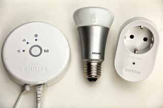
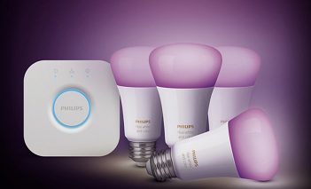

# Philips Hue Binding

This binding integrates the [Philips Hue Lighting system](https://www.meethue.com).
The integration happens through the Hue Bridge, which acts as an IP gateway to the Zigbee devices.

 

## Introduction

The Hue Bridge is required as a "bridge" for accessing any other Hue device.
It supports the Zigbee Light Link protocol as well as the upwards compatible Zigbee 3.0 protocol.
There are two types of Hue Bridges, generally referred to as v1 (the rounded version) and v2 (the squared version).
The difference between the two generations of bridges is that the v2 bridge added support for Apple HomeKit and the CLIP v2 API [see next paragraph](#api-versions).
Both bridges are fully supported by this binding.

Almost all available Hue devices are supported by this binding.
This includes not only the "Friends of Hue", but also products like the LivingWhites adapter.
Additionally, it is possible to use OSRAM Lightify devices as well as other Zigbee Light Link compatible products, including the IKEA TRÅDFRI lights (when updated). 
Beside bulbs and luminaires the Hue binding also supports some Zigbee sensors.
Currently only Hue specific sensors are tested successfully (Hue Motion Sensor and Hue Dimmer Switch).
Please note that the devices need to be registered with the Hue Bridge before it is possible for this binding to use them.

## API Versions

Bridges are accessed by means of the "CLIP" ('Connected Lighting Interface Protocol') Application Program Interface ('API').
There are two versions of CLIP - namely CLIP v1 and CLIP v2, which are referred to as API v1 and API v2 in the links below.
Signify has stated that any new features (such as dynamic scenes) will only be available on API v2, and in the long term API v1 will eventually be removed.
The API v2 has more features, e.g. it supports Server Sent Events 'SSE' which means that it is much faster to receive status updates in openHAB.
For this reason it is recommended to use API v2 for new openHAB installations.
But unfortunately the API v2 is not supported by older v1 (round) bridges, nor by newer v2 (square-ish) bridges if their firmware is under v1948086000.

## Discovery

The Hue Bridge is discovered through mDNS in the local network.
Potentially two types of Bridge will be discovered - namely an API v1 Bridge and/or an API v2 Bridge.

Auto-discovery is enabled by default.
To disable it, you can add the following line to `<openHAB-conf>/services/runtime.cfg`:

```text
discovery.hue:background=false
```

Once it is added as a Thing, its authentication button (in the middle) needs to be pressed in order to authorize the binding to access it.
Once the binding is authorized, it automatically reads all devices (and groups) that are set up on the Hue Bridge and puts them into the Inbox.

## Configuration for API v1 and API v2

- [Configuration for API v1](doc/readme_v1.md#philips-hue-binding-api-v1)
- [Configuration for API v2](doc/readme_v2.md#philips-hue-binding-api-v2)

## Migration from API v1 to API v2

You can create new API v2 things either via the automatic discovery services, via a `.things` file, or manually in the UI.
If things are created manually in the UI then you will have to enter all configuration parameters by hand.
You can use the [console command](doc/readme_v2.md#console-command-for-finding-resourceids) to discover the `resourceId` of all the things in the bridge.
You might also need to edit the names and types of your items, depending on the individual circumstances below.

### Migration via Automatic Discovery Services

When new API v2 things are created via the discovery services, then if a matching legacy API v1 thing exists, the new v2 thing will clone some of the the attributes of the existing API v1 thing.
And also, if a legacy API v1 thing exists and has items linked to its channels, then the new API v2 thing will replicate the links between those items and the respective new API v2 thing's channels.

### Migration via a `.things` File

You need to manually edit your bridge and thing definitions as shown below:

- Bridge definitions change from `hue:bridge:bridgename` to `hue:bridge-api2:bridgename`.
- Bridge configuration parameters change `userName` to `applicationKey`.
- Physical thing definitions change from `hue:0100:thingname` or `hue:0210:thingname` etc. to `hue:device:thingname`.
- Room or zone thing definitions change from `hue:group:thingname` to `hue:room:thingname` resp. `hue:zone:thingname`.
- Thing configuration parameters change from `lightId` or `sensorId` etc. to `resourceId`.

Notes:

1. In API v1 different things have different types (`0100`, `0220`, `0830`, etc.) but in API v2 all things have the same type `device`.
1. In API v1 different things are configured by different parameters (`sensorId`, `lightId`, etc.) but in API v2 all things are configured via the same `resourceId` parameter.
1. In API v1 some channel names contain underscore characters (`_`) but in API v2 they have changed to dashes (`-`) e.g `color_temperature` -> `color-temperature`.

Examples:

```java
// old (API v1) ..
Bridge hue:bridge:g24 "Philips Hue Hub" @ "Under Stairs" [ipAddress="192.168.1.234", userName="abcdefghijklmnopqrstuvwxyz0123456789ABCD"] {
   Thing 0210 b01 "Living Room Standard Lamp Left" @ "Living Room" [lightId="1"]
}

// new (API v2) ...
Bridge hue:bridge-api2:g24 "Philips Hue Hub (api2)" @ "Home" [ipAddress="192.168.1.234", applicationKey="abcdefghijklmnopqrstuvwxyz0123456789ABCD"] {
    // Device things
    Thing device 11111111-2222-3333-4444-555555555555 "Living Room Standard Lamp Left" @ "Living Room" [resourceId="11111111-2222-3333-4444-555555555555"] // Hue color lamp
    ..
    // Room things
    Thing room 99999999-8888-7777-6666-555555555555 "Back Bedroom (Room)" [resourceId="99999999-8888-7777-6666-555555555555"] // Room
    ..
    // Zone things
    Thing zone 99999999-8888-7777-6666-555555555555 "Standard Lamps" [resourceId="99999999-8888-7777-6666-555555555555"] // Zone
    ..
}
```
