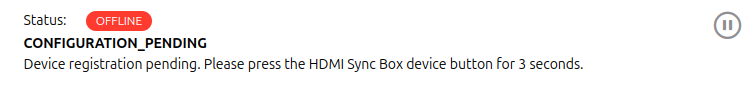

# hueSync Binding

<!-- markdownlint-disable MD033 -->
This binding integrates the [Play HDMI Sync Box](https://www.philips-hue.com/en-us/p/hue-philips-hue-play-hdmi-sync-box/046677579753) into openHAB.
The integration happens directly through the Hue [HDMI Sync Box API](https://developers.meethue.com/develop/hue-entertainment/hue-hdmi-sync-box-api/).

- [hueSync Binding](#huesync-binding)
  - [Supported Things](#supported-things)
  - [Discovery](#discovery)
  - [Configuration](#configuration)
    - [Thing(s)](#things)
  - [Channels](#channels)
    - [Firmware Information](#firmware-information)
    - [HDMI connections \[in|out\]](#hdmi-connections-inout)
    - [Commands](#commands)
  - [Example Configuration](#example-configuration)
    - [huesyncbox.things](#huesyncboxthings)
    - [huesyncbox.items](#huesyncboxitems)
    - [example.sitemap](#examplesitemap)

## Supported Things

This binding provides only one thing type: **`box`**.
Each thing will represent a Hue Play HDMI sync box.

## Discovery

The binding supports auto discovery using [mDNS](https://en.wikipedia.org/wiki/Multicast_DNS) to find devices in the local network.

Make sure the device is connected to the network (the LED on the Sync Box is white or red).
If the LED is blinking blue, you need to setup the device using the official [Hue Sync App](https://www.philips-hue.com/en-in/explore-hue/propositions/entertainment/hue-sync).

If the device is not discovered you can check if it is properly configured and discoverable:

<p>
  <details>
    <summary><b>Linux</b> (Ubuntu based distributions)</summary>

  ```bash
  $ avahi-browse --resolve _huesync._tcp 
  + wlp0s20f3 IPv4 HueSyncBox-XXXXXXXXXXX                       _huesync._tcp        local
  = wlp0s20f3 IPv4 HueSyncBox-XXXXXXXXXXX                       _huesync._tcp        local
    hostname = [XXXXXXXXXXX.local]
    address = [192.168.0.12]
    port = [443]
    txt = ["name=Sync Box" "devicetype=HSB1" "uniqueid=XXXXXXXXXXX" "path=/api"]
  ```

  </details>
</p>

mDNS uses link-local multicast addresses; its scope is limited to a single physical or logical LAN ([Layer 3](https://en.wikipedia.org/wiki/OSI_model#Layer_3:_Network_layer")).
If your device is not automatically discovered, create a thing and manually configure the "host" parameter.

To communicate with the sync box, you need to couple the thing with the hardware (registration).
The thing will start this process automatically.
To complete the registration you just press the "coupling" button on the sync box for 3 seconds.:



For special use cases it is possible to configure the id and token manually in the **advanced configuration** settings section.

## Configuration

### Thing(s)

| Name                 | Type    | Description                       | Default | Required | Advanced |
| -------------------- | ------- | --------------------------------- | ------- | -------- | -------- |
| host                 | text    | IP address of the device          | N/A     | yes      | no       |
| port                 | integer | Port of the HDMI Sync Box.        | 443     | yes      | yes      |
| registrationId       | text    | Application Registration Id       | N/A     | no       | yes      |
| apiAccessToken       | text    | API Access Token                  | N/A     | no       | yes      |
| statusUpdateInterval | integer | Status Update Interval in seconds | 10      | yes      | yes      |

## Channels

### Firmware Information

Information about the installed device firmware and available updates.

| Channel            | Type   | Read/Write | Description                       |
| ------------------ | ------ | ---------- | --------------------------------- |
| firmware           | String | R          | Installed firmware version        |
| available-firmware | String | R          | Latest available firmware version |

### HDMI connections [in\|out]

Information about a HDMI input  connection.

| Channel | Type   | Read/Write | Description                                                                                                                                                                                                                                                                                                                                                                                                            |
| ------- | ------ | ---------- | ---------------------------------------------------------------------------------------------------------------------------------------------------------------------------------------------------------------------------------------------------------------------------------------------------------------------------------------------------------------------------------------------------------------------- |
| type    | String | R          | <details><summary>Friendly Type</summary><ul><li>generic</li><li>video</li><li>game</li><li>music</li><li>xbox</li><li>playstation</li><li>nintendoswitch</li><li>phone</li><li>desktop</li><li>laptop</li><li>appletv</li><li>roku</li><li>shield</li><li>chromecast</li><li>firetv</li><li>diskplayer</li><li>settopbox</li><li>satellite</li><li>avreceiver</li><li>soundbar</li><li>hdmiswitch</li></ul></details> |
| status  | String | R          | <details><summary>Device connection status</summary><ul><li>unplugged</li><li>plugged</li><li>linked</li><li>unknown</li></ul></details>                                                                                                                                                                                                                                                                               |
| name    | String | R          | Friendly Name                                                                                                                                                                                                                                                                                                                                                                                                          |
| mode    | String | R          | <details><summary>Mode</summary><ul><li>video</li><li>game</li><li>music</li><li>powersave</li><li>passthrough</li></ul></details>                                                                                                                                                                                                                                                                                     |

### Commands

| Channel     | Type                 | Read/Write | Description                                                                                                                                                                                                                                                                                                           |
| ----------- | -------------------- | ---------- | --------------------------------------------------------------------------------------------------------------------------------------------------------------------------------------------------------------------------------------------------------------------------------------------------------------------- |
| mode        | String               | R/W        | <details><summary>Hue Sync operation mode</summary><ul><li>video</li><li>game</li><li>music</li><li>powersave</li><li>passthrough</li></ul></details>                                                                                                                                                                 |
| hdmi-source | Switch               | R/W        | <details><summary>Source</summary><ul><li>input1</li><li>input2</li><li>input3</li><li>input4</li></ul></details>                                                                                                                                                                                                     |
| sync-active | Switch               | R/W        | <details><summary>Synchronization</summary><p><b>OFF</b> in case of powersave or passthrough mode, and <b>ON</b> in case of video, game or music mode. When changed from OFF to ON, it will start syncing in last used mode for current source. When changed from ON to OFF, will set passthrough mode.</p></details> |
| brightness  | Number:Dimensionless | R/W        | <details><summary>Brightness</summary><p><ul><li>0 = max reduction</li><li>100 = no brightness reduction/boost compared to input</li><li>200 = max boost</li></ul></p></details>                                                                                                                                      |

## Example Configuration

### huesyncbox.things

```java
Thing huesync:box:LivingRoom "Philips Hue HDMI Sync Box, LivingRoom" [
     host="192.168.2.115",
     httpPollingInterval=60,
     apiAccessToken="yourTokenGoesHere=",
     registrationId="8",
     port=443,
     statusUpdateInterval=10
]
```

### huesyncbox.items

Both item and sitemap configuration example use the `iconify` support for the `firmware` as well as `input1` and `input2`.
Those icons loaded if needed from the internet and not suited for a pure offline setup.
The other items use the `classic` icons.
Read the documentation about the offline provider for `iconify` icons, or use the `classic` icons bundled with openHAB.

```java
// Firmware
Group     firmware                         "Firmware Information"    <iconify:mdi:info>
String    firmware_version                 "Current Firmware"        <iconify:mdi:text>          (firmware)    {channel="huesync:box:LivingRoom:device-firmware#firmware"}
String    latest_firmware_version          "Latest Firmware"         <iconify:mdi:text>          (firmware)    {channel="huesync:box:LivingRoom:device-firmware#available-firmware"}

//HDMI Input 1
Group     hdmi_in1                         "HDMI 1"                  <iconify:mdi:hdmi-port>
String    friendly_name_input1             "Friendly Name"           <iconify:mdi:text>          (hdmi_in1)    {channel="huesync:box:LivingRoom:device-hdmi-in-1#name"}
String    friendly_type_input1             "Friendly Type"           <iconify:mdi:devices>       (hdmi_in1)    {channel="huesync:box:LivingRoom:device-hdmi-in-1#type"}
String    hdmi_connection_status_input1    "Connection Status"       <iconify:mdi:connection>    (hdmi_in1)    {channel="huesync:box:LivingRoom:device-hdmi-in-1#status"}
String    last_sync_mode_input1            "Last Sync Mode "         <iconify:mdi:multimedia>    (hdmi_in1)    {channel="huesync:box:LivingRoom:device-hdmi-in-1#mode"}

//HDMI Input 2
Group     hdmi_in2
String    friendly_name_input2             "Friendly Name"                                                     {channel="huesync:box:LivingRoom:device-hdmi-in-2#name"}
String    friendly_type_input2             "Friendly Type"                                                     {channel="huesync:box:LivingRoom:device-hdmi-in-2#type"}
String    hdmi_connection_status_input2    "Connection Status"                                                 {channel="huesync:box:LivingRoom:device-hdmi-in-2#status"}
String    last_sync_mode_input2            "Last Sync Mode"                                                    {channel="huesync:box:LivingRoom:device-hdmi-in-2#mode"}

//HDMI Input 3
String    friendly_name_input3             "Friendly Name"           <text>                                    {channel="huesync:box:LivingRoom:device-hdmi-in-3#name"}
String    friendly_type_input3             "Friendly Type"           <text>                                    {channel="huesync:box:LivingRoom:device-hdmi-in-3#type"}
String    hdmi_connection_status_input3    "Connection Status"       <text>                                    {channel="huesync:box:LivingRoom:device-hdmi-in-3#status"}
String    last_sync_mode_input3            "Last Sync Mode"          <text>                                    {channel="huesync:box:LivingRoom:device-hdmi-in-3#mode"}

//HDMI Input 4
String    friendly_name_input4             "Friendly Name"           <text>                                    {channel="huesync:box:LivingRoom:device-hdmi-in-4#name"}
String    friendly_type_input4             "Friendly Type"           <text>                                    {channel="huesync:box:LivingRoom:device-hdmi-in-4#type"}
String    hdmi_connection_status_input4    "Connection Status"       <text>                                    {channel="huesync:box:LivingRoom:device-hdmi-in-4#status"}
String    last_sync_mode_input4            "Last Sync Mode"          <text>                                    {channel="huesync:box:LivingRoom:device-hdmi-in-4#mode"}


//HDMI output
String    friendly_name_output             "Friendly Name"           <text>                                    {channel="huesync:box:LivingRoom:device-hdmi-out#name"}
String    friendly_type_output             "Friendly Type"           <text>                                    {channel="huesync:box:LivingRoom:device-hdmi-out#type"}
String    hdmi_connection_status_output    "Connection Status"       <text>                                    {channel="huesync:box:LivingRoom:device-hdmi-out#status"}
String    last_sync_mode_output            "Last Sync Mode"          <text>                                    {channel="huesync:box:LivingRoom:device-hdmi-out#mode"}

//Commands
String    huesync_mode                     "Mode"                    <switch>                                  {channel="huesync:box:LivingRoom:device-commands#mode"}
Switch    sync_active                      "Sync active"             <switch>                                  {channel="huesync:box:LivingRoom:device-commands#sync-active"}
Switch    hdmi_active                      "HDMI active"             <switch>                                  {channel="huesync:box:LivingRoom:device-commands#hdmi-active"}
String    hdmi_source                      "HDMI Source"             <player>                                  {channel="huesync:box:LivingRoom:device-commands#hdmi-source"}
Dimmer    huesync_brightness               "Brightness"              <slider>                                  {channel="huesync:box:LivingRoom:device-commands#brightness"}

```

### example.sitemap

```java
sitemap demo label="Hue Sync Box" {
 Frame {
  Group item=firmware
 }
 Frame label="Commands" icon=settings {
  Text item=huesync_mode                     
  Text item=hdmi_active                    
  Switch item=sync_active  
  Text item=hdmi_source  
  Buttongrid label="HDMI Source" staticIcon=player {
   Button row=1 column=1 item=hdmi_source label="Source 1" stateless click=input1
   Button row=2 column=1 item=hdmi_source label="Source 2" stateless click=input2
   Button row=3 column=1 item=hdmi_source label="Source 3" stateless click=input3
   Button row=4 column=1 item=hdmi_source label="Source 4" stateless click=input4
  }
  Selection item=hdmi_source mappings=[input1="Source 1", input2="Source 2", input3="Source 3", input3="Source 4"]                   
  
  Slider item=huesync_brightness minValue=0 maxValue=200 step=10
 }
 Frame label="HDMI Inputs 1 & 2" icon="iconify:mdi:hdmi-port" {
  Default item=hdmi_in1

  Group item=hdmi_in2 label="HDMI 2" icon="iconify:mdi:hdmi-port" {
   Default item=friendly_name_input2 icon="iconify:mdi:text"
   Default item=friendly_type_input2 icon="iconify:mdi:devices"
   Default item=hdmi_connection_status_input2 icon="iconify:mdi:connection"
   Default item=last_sync_mode_input2 icon="iconify:mdi:multimedia"
  }
 }        
 Frame label="HDMI 3" icon=player {
  Default item=friendly_name_input3            
  Default item=friendly_type_input3            
  Default item=hdmi_connection_status_input3   
  Default item=last_sync_mode_input3 
 } 
 Frame label="HDMI 4" icon=player {
  Text item=friendly_name_input4            
  Text item=friendly_type_input4            
  Text item=hdmi_connection_status_input4   
  Text item=last_sync_mode_input4
 }
```
