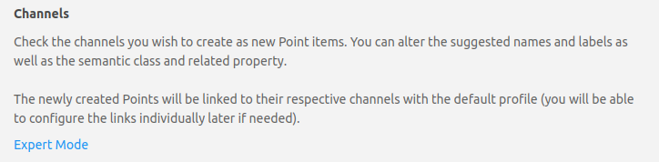
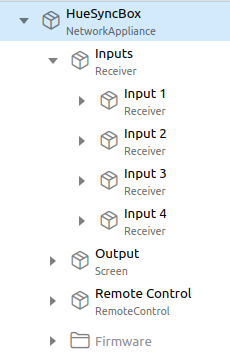

# HueSync Binding

<!-- markdownlint-disable MD033 -->
This binding integrates the [Play HDMI Sync Box](https://www.philips-hue.com/en-us/p/hue-play-hdmi-sync-box-/046677555221) into openHAB.
The integration happens directly through the Hue [HDMI Sync Box API](https://developers.meethue.com/develop/hue-entertainment/hue-hdmi-sync-box-api/).

- [HueSync Binding](#huesync-binding)
  - [Discovery](#discovery)
  - [Thing Configuration](#thing-configuration)
    - [Registration](#registration)
    - [Parameters](#parameters)
  - [Channels](#channels)
    - [Channels - Groups](#channels---groups)
    - [Channels - device-firmware](#channels---device-firmware)
    - [Channels - device-hdmi-connection-\[in|out\]](#channels---device-hdmi-connection-inout)
      - [device-commands](#device-commands)
  - [Item Configuration](#item-configuration)
    - [Items - Groups](#items---groups)
    - [Items - Remote Control](#items---remote-control)
    - [Items - Firmware](#items---firmware)

## Discovery

The binding is using [mDNS](https://en.wikipedia.org/wiki/Multicast_DNS) to discover HDMI Sync devices in the local network.
The LED on the Sync Box must be white or red.
This indicates that the device is connected to the Network.
If the LED is blinking blue, you need to setup the device using the official [Hue Sync App](https://www.philips-hue.com/en-in/explore-hue/propositions/entertainment/hue-sync).

If the device is not discovered you can check if it is properly configured and discoverable in the network:

<details>
  <summary>Linux (Ubuntu based distributions)</summary>

```bash
$ avahi-browse --resolve _huesync._tcp 
+ wlp0s20f3 IPv4 HueSyncBox-XXXXXXXXXXX                       _huesync._tcp        local
= wlp0s20f3 IPv4 HueSyncBox-XXXXXXXXXXX                       _huesync._tcp        local
   hostname = [XXXXXXXXXXX.local]
   address = [192.168.0.12]
   port = [443]
   txt = ["name=Sync Box" "devicetype=HSB1" "uniqueid=XXXXXXXXXXX" "path=/api"]
```

</details>

## Thing Configuration

### Registration

To communicate with the sync box, you need to couple the thing with the hardware (registration).
The thing will start this process automatically.
To complete the registration you just press the "coupling" button on the sync box for 3 seconds.:


For special use cases it is possible to configure the id and token manually in the **advanced configuration** settings section.

### Parameters

| Name                 | Type    | Description                       | Default | Required | Advanced |
| -------------------- | ------- | --------------------------------- | ------- | -------- | -------- |
| host                 | text    | IP address of the device          | N/A     | yes      | no       |
| port                 | integer | Port of the HDMI Sync Box.        | 443     | yes      | yes      |
| registrationId       | text    | Application Registration Id       | N/A     | no       | yes      |
| apiAccessToken       | text    | API Access Token                  | N/A     | no       | yes      |
| statusUpdateInterval | integer | Status Update Interval in seconds | 10      | yes      | yes      |

Once the thing is connection, you can add the equipment to the model using the advanced configuration option of the UI.
Select the "**Channels**"-Tab of the thing and click "**Add Equipment to Model**":


You may use **Expert Mode** for configuration, or use the UI wizard.



<details>
  <summary>Expert Mode - Configuration Example to create a model and item setup:</summary>
  <p>You need to update the device in the example with the UID of your device (<code>huesync:box:<u><b>HueSyncBox</b></u></code>).</p>
  <pre>
Group HueSyncBox "HueSyncBox" &lt;iconify:mdi:television-ambient-light&gt; ["NetworkAppliance"]

Group HueSyncBox_Inputs "Inputs" &lt;receiver&gt; (HueSyncBox) ["Receiver"]

Group HueSyncBox_Input_1 "Input 1" &lt;iconify:mdi:hdmi-port&gt; (HueSyncBox_Inputs) ["Receiver"]
Group HueSyncBox_Input_2 "Input 2" &lt;iconify:mdi:hdmi-port&gt; (HueSyncBox_Inputs) ["Receiver"]
Group HueSyncBox_Input_3 "Input 3" &lt;iconify:mdi:hdmi-port&gt; (HueSyncBox_Inputs) ["Receiver"]
Group HueSyncBox_Input_4 "Input 4" &lt;iconify:mdi:hdmi-port&gt; (HueSyncBox_Inputs) ["Receiver"]

Group HueSyncBox_Output    "Output"         &lt;iconify:mdi:tv&gt;          (HueSyncBox) ["Screen"]
Group HueSyncBox_Firmware  "Firmware"       &lt;iconify:mdi:information&gt; (HueSyncBox)
Group HueSyncBox_Execution "Remote Control" &lt;iconify:mdi:remote&gt;      (HueSyncBox) ["RemoteControl"]

String HueSyncBox_Device_Mode       "Mode"       &lt;iconify:mdi:multimedia&gt;         (HueSyncBox_Execution) { channel="huesync:box:HueSyncBox:device-commands#mode" }
String HueSyncBox_Device_Input      "Input"      &lt;iconify:mdi:input&gt;              (HueSyncBox_Execution) { channel="huesync:box:HueSyncBox:device-commands#hdmi-source" }
Switch HueSyncBox_Device_Hdmi       "HDMI"       &lt;iconify:mdi:hdmi-port&gt;          (HueSyncBox_Execution) { channel="huesync:box:HueSyncBox:device-commands#hdmi-active" }
Switch HueSyncBox_Device_Sync       "Sync"       &lt;iconify:mdi:sync&gt;               (HueSyncBox_Execution) { channel="huesync:box:HueSyncBox:device-commands#sync-active" }
Number HueSyncBox_Device_Brightness "Brightness" &lt;iconify:mdi:brightness-percent&gt; (HueSyncBox_Execution) { channel="huesync:box:HueSyncBox:device-commands#brightness" }

String HueSyncBox_Firmware_Version        "Firmware Version"        &lt;iconify:mdi:text&gt; (HueSyncBox_Firmware) { channel="huesync:box:HueSyncBox:device-firmware#firmware" }
String HueSyncBox_Latest_Firmware_Version "Latest Firmware Version" &lt;iconify:mdi:text&gt; (HueSyncBox_Firmware) { channel="huesync:box:HueSyncBox:device-firmware#available-firmware" }

String HueSyncBox_Device_hdmi_in1_Name      "Name - Input 1"    &lt;iconify:mdi:text&gt;       (HueSyncBox_Input_1)   { channel="huesync:box:HueSyncBox:device-hdmi-in-1#name" }
String HueSyncBox_Device_hdmi_in1_Type      "Type - Input 1"    &lt;iconify:mdi:devices&gt;    (HueSyncBox_Input_1)   { channel="huesync:box:HueSyncBox:device-hdmi-in-1#type" }
String HueSyncBox_Device_hdmi_in1_Status    "Status - Input 1"  &lt;iconify:mdi:connection&gt; (HueSyncBox_Input_1)   { channel="huesync:box:HueSyncBox:device-hdmi-in-1#status" }
String HueSyncBox_Device_hdmi_in1_Mode      "Mode - Input 1"    &lt;iconify:mdi:multimedia&gt; (HueSyncBox_Input_1)   { channel="huesync:box:HueSyncBox:device-hdmi-in-1#mode" }

String HueSyncBox_Device_hdmi_in2_Name      "Name - Input 2"    &lt;iconify:mdi:text&gt;       (HueSyncBox_Input_2)   { channel="huesync:box:HueSyncBox:device-hdmi-in-2#name" }
String HueSyncBox_Device_hdmi_in2_Type      "Type - Input 2"    &lt;iconify:mdi:devices&gt;    (HueSyncBox_Input_2)   { channel="huesync:box:HueSyncBox:device-hdmi-in-2#type" }
String HueSyncBox_Device_hdmi_in2_Status    "Status - Input 2"  &lt;iconify:mdi:connection&gt; (HueSyncBox_Input_2)   { channel="huesync:box:HueSyncBox:device-hdmi-in-2#status" }
String HueSyncBox_Device_hdmi_in2_Mode      "Mode - Input 2"    &lt;iconify:mdi:multimedia&gt; (HueSyncBox_Input_2)   { channel="huesync:box:HueSyncBox:device-hdmi-in-2#mode" }

String HueSyncBox_Device_hdmi_in3_Name      "Name - Input 3"    &lt;iconify:mdi:text&gt;       (HueSyncBox_Input_3)   { channel="huesync:box:HueSyncBox:device-hdmi-in-3#name" }
String HueSyncBox_Device_hdmi_in3_Type      "Type - Input 3"    &lt;iconify:mdi:devices&gt;    (HueSyncBox_Input_3)   { channel="huesync:box:HueSyncBox:device-hdmi-in-3#type" }
String HueSyncBox_Device_hdmi_in3_Status    "Status - Input 3"  &lt;iconify:mdi:connection&gt; (HueSyncBox_Input_3)   { channel="huesync:box:HueSyncBox:device-hdmi-in-3#status" }
String HueSyncBox_Device_hdmi_in3_Mode      "Mode - Input 3"    &lt;iconify:mdi:multimedia&gt; (HueSyncBox_Input_3)   { channel="huesync:box:HueSyncBox:device-hdmi-in-3#mode" }

String HueSyncBox_Device_hdmi_in4_Name      "Name - Input 4"    &lt;iconify:mdi:text&gt;       (HueSyncBox_Input_4)   { channel="huesync:box:HueSyncBox:device-hdmi-in-4#name" }
String HueSyncBox_Device_hdmi_in4_Type      "Type - Input 4"    &lt;iconify:mdi:devices&gt;    (HueSyncBox_Input_4)   { channel="huesync:box:HueSyncBox:device-hdmi-in-4#type" }
String HueSyncBox_Device_hdmi_in4_Status    "Status - Input 4"  &lt;iconify:mdi:connection&gt; (HueSyncBox_Input_4)   { channel="huesync:box:HueSyncBox:device-hdmi-in-4#status" }
String HueSyncBox_Device_hdmi_in4_Mode      "Mode - Input 4"    &lt;iconify:mdi:multimedia&gt; (HueSyncBox_Input_4)   { channel="huesync:box:HueSyncBox:device-hdmi-in-4#mode" }

String HueSyncBox_Device_hdmi_out_Name      "Name - Output"     &lt;iconify:mdi:text&gt;       (HueSyncBox_Output)   { channel="huesync:box:HueSyncBox:device-hdmi-out#name" }
String HueSyncBox_Device_hdmi_out_Type      "Type - Output"     &lt;iconify:mdi:tv&gt;         (HueSyncBox_Output)   { channel="huesync:box:HueSyncBox:device-hdmi-out#type" }
String HueSyncBox_Device_hdmi_out_Status    "Status - Output"   &lt;iconify:mdi:connection&gt; (HueSyncBox_Output)   { channel="huesync:box:HueSyncBox:device-hdmi-out#status" }
String HueSyncBox_Device_hdmi_out_Mode      "Mode - Output"     &lt;iconify:mdi:multimedia&gt; (HueSyncBox_Output)   { channel="huesync:box:HueSyncBox:device-hdmi-out#mode" }
  </pre>
</details>
<br />



## Channels

The following chapters provide more details for a tailored setup.

### Channels - Groups

### Channels - device-firmware

Information about the installed device firmware and available updates.

| Channel            | Type   | Read/Write | Description                       |
| ------------------ | ------ | ---------- | --------------------------------- |
| firmware           | String | R          | Installed firmware version        |
| available-firmware | String | R          | Latest available firmware version |

### Channels - device-hdmi-connection-[in\|out]

Information about a HDMI input  connection.

| Channel | Type   | Read/Write | Description                                                                                                                                                                                                                                                                                                                                                                                                            |
| ------- | ------ | ---------- | ---------------------------------------------------------------------------------------------------------------------------------------------------------------------------------------------------------------------------------------------------------------------------------------------------------------------------------------------------------------------------------------------------------------------- |
| type    | String | R          | <details><summary>Friendly Type</summary><ul><li>generic</li><li>video</li><li>game</li><li>music</li><li>xbox</li><li>playstation</li><li>nintendoswitch</li><li>phone</li><li>desktop</li><li>laptop</li><li>appletv</li><li>roku</li><li>shield</li><li>chromecast</li><li>firetv</li><li>diskplayer</li><li>settopbox</li><li>satellite</li><li>avreceiver</li><li>soundbar</li><li>hdmiswitch</li></ul></details> |
| status  | String | R          | <details><summary>Device connection status</summary><ul><li>unplugged</li><li>plugged</li><li>linked</li><li>unknown</li></ul></details>                                                                                                                                                                                                                                                                               |
| name    | String | R          | Friendly Name                                                                                                                                                                                                                                                                                                                                                                                                          |
| mode    | String | R          | <details><summary>Mode</summary><ul><li>video</li><li>game</li><li>music</li><li>powersave</li><li>passthrough</li></ul></details>                                                                                                                                                                                                                                                                                     |

#### device-commands

| Channel     | Type                 | Read/Write | Description                                                                                                                                                                                                                                                                                                           |
| ----------- | -------------------- | ---------- | --------------------------------------------------------------------------------------------------------------------------------------------------------------------------------------------------------------------------------------------------------------------------------------------------------------------- |
| mode        | String               | R/W        | <details><summary>Hue Sync operation mode</summary><ul><li>video</li><li>game</li><li>music</li><li>powersave</li><li>passthrough</li></ul></details>                                                                                                                                                                 |
| hdmi-source | Switch               | R/W        | <details><summary>Source</summary><ul><li>input1</li><li>input2</li><li>input3</li><li>input4</li></ul></details>                                                                                                                                                                                                     |
| sync-active | Switch               | R/W        | <details><summary>Synchronization</summary><p><b>OFF</b> in case of powersave or passthrough mode, and <b>ON</b> in case of video, game or music mode. When changed from OFF to ON, it will start syncing in last used mode for current source. When changed from ON to OFF, will set passthrough mode.</p></details> |
| brightness  | Number:Dimensionless | R/W        | <details><summary>Brightness</summary><p><ul><li>0 = max reduction</li><li>100 = no brightness reduction/boost compared to input</li><li>200 = max boost</li></ul></p></details>                                                                                                                                      |

## Item Configuration

### Items - Groups

<details>
  <summary> Groups</summary>

|       |                      |                  |                             |                     |                      |     |
| ----- | -------------------- | ---------------- | --------------------------- | ------------------- | -------------------- | --- |
| Group | HueSyncBox           | "HueSyncBox"     | \<iconify:mdi:tv\>          |                     | ["NetworkAppliance"] |     |
| Group | HueSyncBox_Execution | "Remote Control" | \<iconify:mdi:remote\>      | (HueSyncBox)        | ["RemoteControl"]    |     |
| Group | HueSyncBox_Firmware  | "Firmware"       | \<iconify:mdi:information\> | (HueSyncBox)        | ["Point"]            |     |
| Group | HueSyncBox_Inputs    | "Inputs"         | \<receiver\>                | (HueSyncBox)        | ["Receiver"]         |     |
| Group | HueSyncBox_Input_1   | "Input 1"        | \<iconify:mdi:hdmi-port\>   | (HueSyncBox_Inputs) | ["Receiver"]         |     |
| Group | HueSyncBox_Input_2   | "Input 2"        | \<iconify:mdi:hdmi-port\>   | (HueSyncBox_Inputs) | ["Receiver"]         |     |
| Group | HueSyncBox_Input_3   | "Input 3"        | \<iconify:mdi:hdmi-port\>   | (HueSyncBox_Inputs) | ["Receiver"]         |     |
| Group | HueSyncBox_Input_4   | "Input 4"        | \<iconify:mdi:hdmi-port\>   | (HueSyncBox_Inputs) | ["Receiver"]         |     |
| Group | HueSyncBox_Output    | "Output"         | \<iconify:mdi:tv\>          | (HueSyncBox)        | ["Screen"]           |     |

</details>

### Items - Remote Control

<details>
  <summary> Remote Control </summary>

|                      |                              |              |                                    |                        |                                                                  |                                                                                                                                                                                                                                                                                                                                                                                             |
| -------------------- | ---------------------------- | ------------ | ---------------------------------- | ---------------------- | ---------------------------------------------------------------- | ------------------------------------------------------------------------------------------------------------------------------------------------------------------------------------------------------------------------------------------------------------------------------------------------------------------------------------------------------------------------------------------- |
| String               | HueSyncBox_Device_Mode       | "Mode"       | \<iconify:mdi:multimedia\>         | (HueSyncBox_Execution) | { channel="huesync:box:HueSyncBox:device-commands#mode" }        |                                                                                                                                                                                                                                                                                                                                                                                             |
| String               | HueSyncBox_Device_Input      | "Input"      | \<iconify:mdi:input\>              | (HueSyncBox_Execution) | { channel="huesync:box:HueSyncBox:device-commands#hdmi-source" } | <details><summary>HDMI Source</summary><ul><li>input1</li><li>input2</li><li>input3</li><li>input4</li></ul></details>                                                                                                                                                                                                                                                                      |
| Switch               | HueSyncBox_Device_Sync       | "Sync"       | \<iconify:mdi:sync\>               | (HueSyncBox_Execution) | { channel="huesync:box:HueSyncBox:device-commands#sync-active" } | <details><summary>HDMI Sync</summary><p><b>OFF</b> in case of <i>powersave</i> or <i>passthrough</i> mode, and <b>ON</b> in case of <i>video</i>, <i>game</i> or <i>music</i> mode.</p><p>When changed from <b>OFF</b> to <b>ON</b>, it will start syncing in last used mode for current source. When changed from <b>ON</b> to <b>OFF</b>, will set <i>passthrough</i> mode.</p></details> |
| Switch               | HueSyncBox_Device_Hdmi       | "HDMI"       | \<iconify:mdi:hdmi-port\>          | (HueSyncBox_Execution) | { channel="huesync:box:HueSyncBox:device-commands#hdmi-active" } | <details><summary>HDMI Active</summary><p><b>OFF</b> in case of <i>powersave</i> mode and <b>ON</b> in case of <i>passthrough</i>, <i>video</i>, <i>game</i> or <i>music</i> mode.</p><p>When changed from <b>OFF</b> to <b>ON</b>, it will set <i>passthrough</i> mode. When changed from <b>ON</b> to <b>OFF</b>, will set <i>powersave</i> mode.</p></details>                           |
| Number:Dimensionless | HueSyncBox_Device_Brightness | "Brightness" | \<iconify:mdi:brightness-percent\> | (HueSyncBox_Execution) | { channel="huesync:box:HueSyncBox:device-commands#brightness" }  | <details><summary>0 ... 200</summary><p><ul><li>0 = max reduction</li><li>100 = no brightness reduction/boost compared to input</li><li>200 = max boost</li></ul></p></details>                                                                                                                                                                                                             |

</details>

### Items - Firmware

<details>
  <summary> Firmware </summary>

|        |                                    |                           |                      |                       |              |                                                                           |
| ------ | ---------------------------------- | ------------------------- | -------------------- | --------------------- | ------------ | ------------------------------------------------------------------------- |
| String | HueSyncBox_Firmware_Version        | "Firmware Version"        | \<iconify:mdi:text\> | (HueSyncBox_Firmware) | ["Property"] | `{ channel="huesync:box:HueSyncBox:device-firmware#firmware" }`           |
| String | HueSyncBox_Latest_Firmware_Version | "Latest Firmware Version" | \<iconify:mdi:text\> | (HueSyncBox_Firmware) | ["Property"] | `{ channel="huesync:box:HueSyncBox:device-firmware#available-firmware" }` |

</details>

---

<details>
  <summary> Input 1 </summary>

|        |                                   |                    |                            |                      |              |                                                                |
| ------ | --------------------------------- | ------------------ | -------------------------- | -------------------- | ------------ | -------------------------------------------------------------- |
| String | HueSyncBox_Device_hdmi_in1_Name   | "Name - Input 1"   | \<iconify:mdi:text\>       | (HueSyncBox_Input_1) | ["Property"] | `{ channel="huesync:box:HueSyncBox:device-hdmi-in-1#name" }`   |
| String | HueSyncBox_Device_hdmi_in1_Type   | "Type - Input 1"   | \<iconify:mdi:devices\>    | (HueSyncBox_Input_1) | ["Property"] | `{ channel="huesync:box:HueSyncBox:device-hdmi-in-1#type" }`   |
| String | HueSyncBox_Device_hdmi_in1_Status | "Status - Input 1" | \<iconify:mdi:connection\> | (HueSyncBox_Input_1) | ["Property"] | `{ channel="huesync:box:HueSyncBox:device-hdmi-in-1#status" }` |
| String | HueSyncBox_Device_hdmi_in1_Mode   | "Mode - Input 1"   | \<iconify:mdi:multimedia\> | (HueSyncBox_Input_1) | ["Property"] | `{ channel="huesync:box:HueSyncBox:device-hdmi-in-1#mode" }`   |

</details>

<details>
  <summary> Input 2 </summary>

|        |                                   |                    |                            |                      |              |                                                                |
| ------ | --------------------------------- | ------------------ | -------------------------- | -------------------- | ------------ | -------------------------------------------------------------- |
| String | HueSyncBox_Device_hdmi_in2_Name   | "Name - Input 2"   | \<iconify:mdi:text\>       | (HueSyncBox_Input_2) | ["Property"] | `{ channel="huesync:box:HueSyncBox:device-hdmi-in-2#name" }`   |
| String | HueSyncBox_Device_hdmi_in2_Type   | "Type - Input 2"   | \<iconify:mdi:devices\>    | (HueSyncBox_Input_2) | ["Property"] | `{ channel="huesync:box:HueSyncBox:device-hdmi-in-2#type" }`   |
| String | HueSyncBox_Device_hdmi_in2_Status | "Status - Input 2" | \<iconify:mdi:connection\> | (HueSyncBox_Input_2) | ["Property"] | `{ channel="huesync:box:HueSyncBox:device-hdmi-in-2#status" }` |
| String | HueSyncBox_Device_hdmi_in2_Mode   | "Mode - Input 2"   | \<iconify:mdi:multimedia\> | (HueSyncBox_Input_2) | ["Property"] | `{ channel="huesync:box:HueSyncBox:device-hdmi-in-2#mode" }`   |

</details>

<details>
  <summary> Input 3 </summary>

|        |                                   |                    |                            |                      |              |                                                                |
| ------ | --------------------------------- | ------------------ | -------------------------- | -------------------- | ------------ | -------------------------------------------------------------- |
| String | HueSyncBox_Device_hdmi_in3_Name   | "Name - Input 3"   | \<iconify:mdi:text\>       | (HueSyncBox_Input_3) | ["Property"] | `{ channel="huesync:box:HueSyncBox:device-hdmi-in-3#name" }`   |
| String | HueSyncBox_Device_hdmi_in3_Type   | "Type - Input 3"   | \<iconify:mdi:devices\>    | (HueSyncBox_Input_3) | ["Property"] | `{ channel="huesync:box:HueSyncBox:device-hdmi-in-3#type" }`   |
| String | HueSyncBox_Device_hdmi_in3_Status | "Status - Input 3" | \<iconify:mdi:connection\> | (HueSyncBox_Input_3) | ["Property"] | `{ channel="huesync:box:HueSyncBox:device-hdmi-in-3#status" }` |
| String | HueSyncBox_Device_hdmi_in3_Mode   | "Mode - Input 3"   | \<iconify:mdi:multimedia\> | (HueSyncBox_Input_3) | ["Property"] | `{ channel="huesync:box:HueSyncBox:device-hdmi-in-3#mode" }`   |

</details>

<details>
  <summary> Input 4 </summary>

|        |                                   |                    |                            |                      |              |                                                                |
| ------ | --------------------------------- | ------------------ | -------------------------- | -------------------- | ------------ | -------------------------------------------------------------- |
| String | HueSyncBox_Device_hdmi_in4_Name   | "Name - Input 4"   | \<iconify:mdi:text\>       | (HueSyncBox_Input_4) | ["Property"] | `{ channel="huesync:box:HueSyncBox:device-hdmi-in-4#name" }`   |
| String | HueSyncBox_Device_hdmi_in4_Type   | "Type - Input 4"   | \<iconify:mdi:devices\>    | (HueSyncBox_Input_4) | ["Property"] | `{ channel="huesync:box:HueSyncBox:device-hdmi-in-4#type" }`   |
| String | HueSyncBox_Device_hdmi_in4_Status | "Status - Input 4" | \<iconify:mdi:connection\> | (HueSyncBox_Input_4) | ["Property"] | `{ channel="huesync:box:HueSyncBox:device-hdmi-in-4#status" }` |
| String | HueSyncBox_Device_hdmi_in4_Mode   | "Mode - Input 4"   | \<iconify:mdi:multimedia\> | (HueSyncBox_Input_4) | ["Property"] | `{ channel="huesync:box:HueSyncBox:device-hdmi-in-4#mode" }`   |

</details>

---

<details>
  <summary> Output </summary>

|        |                                   |                   |                            |                     |              |                                                               |
| ------ | --------------------------------- | ----------------- | -------------------------- | ------------------- | ------------ | ------------------------------------------------------------- |
| String | HueSyncBox_Device_hdmi_out_Name   | "Name - Output"   | \<iconify:mdi:text\>       | (HueSyncBox_Output) | ["Property"] | `{ channel="huesync:box:HueSyncBox:device-hdmi-out#name" }`   |
| String | HueSyncBox_Device_hdmi_out_Type   | "Type - Output"   | \<iconify:mdi:tv\>         | (HueSyncBox_Output) | ["Property"] | `{ channel="huesync:box:HueSyncBox:device-hdmi-out#type" }`   |
| String | HueSyncBox_Device_hdmi_out_Status | "Status - Output" | \<iconify:mdi:connection\> | (HueSyncBox_Output) | ["Property"] | `{ channel="huesync:box:HueSyncBox:device-hdmi-out#status" }` |
| String | HueSyncBox_Device_hdmi_out_Mode   | "Mode - Output"   | \<iconify:mdi:multimedia\> | (HueSyncBox_Output) | ["Property"] | `{ channel="huesync:box:HueSyncBox:device-hdmi-out#mode" }`   |

</details>

<!-- markdownlint-enable MD033 -->

<!-- 
### Sitemap Configuration

```perl
Optional Sitemap configuration goes here.
Remove this section, if not needed.
```

## Any custom content here

_Feel free to add additional sections for whatever you think should also be mentioned about your binding!_ 
-->
