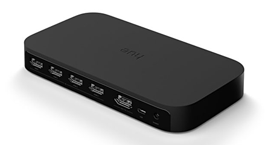
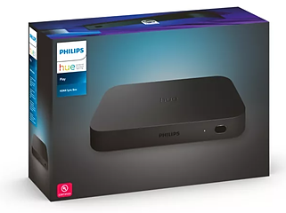

# HueSync Binding

This binding integrates the [Play HDMI Sync Box](https://www.philips-hue.com/en-us/p/hue-play-hdmi-sync-box-/046677555221) into openHAB.
The integration happens directly through the Hue [HDMI Sync Box API](https://developers.meethue.com/develop/hue-entertainment/hue-hdmi-sync-box-api/).

- [HueSync Binding](#huesync-binding)
  - [Discovery](#discovery)
  - [Thing Configuration](#thing-configuration)
    - [Thing Configuration "huesyncthing"](#thing-configuration-huesyncthing)
  - [Channels](#channels)
    - [Group - "device-firmware"](#group---device-firmware)
    - [Group - "device-hdmi-connection-\[in|out\]"](#group---device-hdmi-connection-inout)
    - [Group - "device-commands"](#group---device-commands)
      - [mode](#mode)
    - [Item Configuration](#item-configuration)

<br />




<!-- 
## Supported Things

_Please describe the different supported things / devices including their ThingTypeUID within this section._
_Which different types are supported, which models were tested etc.?_
_Note that it is planned to generate some part of this based on the XML files within ```src/main/resources/OH-INF/thing``` of your binding._

- `bridge`: Short description of the Bridge, if any
- `sample`: Short description of the Thing with the ThingTypeUID `sample` 
- -->

## Discovery

The binding is using [mDNS](https://en.wikipedia.org/wiki/Multicast_DNS) to discover HDMI Sync devices in the local network.
The LED on the Sync Box must be white or red.
This indicates that the device is connected to the Network.
If the LED is blinking blue, you need to setup the device using the official [Hue Sync App](https://www.philips-hue.com/en-in/explore-hue/propositions/entertainment/hue-sync).

If the device is not discovered you can check if it is properly configured and discoverable in the network:

<details>
  <summary>Linux (Ubuntu based distributions)</summary>

```bash
$ avahi-browse --resolve _huesync._tcp 
+ wlp0s20f3 IPv4 HueSyncBox-XXXXXXXXXXX                       _huesync._tcp        local
= wlp0s20f3 IPv4 HueSyncBox-XXXXXXXXXXX                       _huesync._tcp        local
   hostname = [XXXXXXXXXXX.local]
   address = [192.168.0.12]
   port = [443]
   txt = ["name=Sync Box" "devicetype=HSB1" "uniqueid=XXXXXXXXXXX" "path=/api"]
```

</details>

## Thing Configuration

To enable the binding to communicate with the device, a registration is required.
Once the registration process is completed, the acquired token will authorize the binding to communicate with the device.
After initial discovery and thing creation the device will stay offline.
To complete the authentication you need to pressed the registration button on the sync box for 3 seconds.

<!-- _
Describe what is needed to manually configure a thing, either through the UI or via a thing-file._
_This should be mainly about its mandatory and optional configuration parameters._

_Note that it is planned to generate some part of this based on the XML files within ```src/main/resources/OH-INF/thing``` of your binding._ 
-->

### Thing Configuration "huesyncthing"

| Name                 | Type    | Description                       | Default | Required | Advanced |
| -------------------- | ------- | --------------------------------- | ------- | -------- | -------- |
| host                 | text    | IP address of the device          | N/A     | yes      | no       |
| port                 | integer | Port of the HDMI Sync Box.        | 443     | yes      | yes      |
| registrationId       | text    | Application Registration Id       | N/A     | no       | yes      |
| apiAccessToken       | text    | API Access Token                  | N/A     | no       | yes      |
| statusUpdateInterval | integer | Status Update Interval in seconds | 10      | yes      | yes      |

## Channels

### Group - "device-firmware"

Information about the installed device firmware and available updates.

| Channel            | Type   | Read/Write | Description                       |
| ------------------ | ------ | ---------- | --------------------------------- |
| firmware           | String | R          | Installed firmware version        |
| available-firmware | String | R          | Latest available firmware version |

### Group - "device-hdmi-connection-[in\|out]"

Information about a HDMI input  connection.

| Channel | Type   | Read/Write | Description                                                                                                                                                                                                                                                                                                                                                                                                            |
| ------- | ------ | ---------- | ---------------------------------------------------------------------------------------------------------------------------------------------------------------------------------------------------------------------------------------------------------------------------------------------------------------------------------------------------------------------------------------------------------------------- |
| type    | String | R          | <details><summary>Friendly Type</summary><ul><li>generic</li><li>video</li><li>game</li><li>music</li><li>xbox</li><li>playstation</li><li>nintendoswitch</li><li>phone</li><li>desktop</li><li>laptop</li><li>appletv</li><li>roku</li><li>shield</li><li>chromecast</li><li>firetv</li><li>diskplayer</li><li>settopbox</li><li>satellite</li><li>avreceiver</li><li>soundbar</li><li>hdmiswitch</li></ul></details> |
| status  | String | R          | <details><summary>Device connection status></summary><ul><li>unplugged</li><li>plugged</li><li>linked</li><li>unknown</li></ul></details>                                                                                                                                                                                                                                                                              |
| mode    | String | R          | <details><summary>Last sync mode used for this channel.</summary><ul><li>video</li><li>game</li><li>music</li></ul></details>                                                                                                                                                                                                                                                                                          |

### Group - "device-commands"

| Channel | Type   | Read/Write | Description                                                                                                                                                                                                                                                                                                                                                                                                            |
| ------- | ------ | ---------- | ---------------------------------------------------------------------------------------------------------------------------------------------------------------------------------------------------------------------------------------------------------------------------------------------------------------------------------------------------------------------------------------------------------------------- |
| name    | String | R/W        | <details><summary>Hue Sync operation mode</summary><ul><li>powersave</li><li>passthrough</li><li>video</li><li>game</li><li>music</li><li>ambient</li><li>unknown (read only)</li></ul></details>                                                                                                                                                                                                                                                                                                                                                                                            |

#### mode

- **video** <br /> Analyzes the on-screen visuals, translating colors and brightness into corresponding light effects for an immersive movie-watching experience.
- **music** <br /> Analyzes the rhythm and beat of your music, creating dynamic light along to your tunes.
- **game**  <br /> Reacts to the action on your screen, intensifying the in-game atmosphere with bursts of light that correspond to explosions, gunfire, and other gameplay events.\n
- **ambient**
- **passthrough**
- **powersave**
- **unknown** <br /> The device reports a mode not known to the binding (e.g. intorduced by a new firmware). *NOTE: It is not possible to send this command to the device.*

<!-- 
## Full Example

_Provide a full usage example based on textual configuration files._
_*.things, *.items examples are mandatory as textual configuration is well used by many users._
_*.sitemap examples are optional._  

### Thing Configuration

```java
Example thing configuration goes here.
``` 
-->

### Item Configuration

<details>
  <summary> Groups</summary>

|       |                      |                  |                           |                     |                      |     |
| ----- | -------------------- | ---------------- | ------------------------- | ------------------- | -------------------- | --- |
| Group | HueSyncBox           | "HueSyncBox"     | <iconify:mdi:tv>          |                     | ["NetworkAppliance"] |     |
| Group | HueSyncBox_Execution | "Remote Control" | <iconify:mdi:remote>      | (HueSyncBox)        | ["RemoteControl"]    |     |
| Group | HueSyncBox_Firmware  | "Firmware"       | <iconify:mdi:information> | (HueSyncBox)        | ["Point"]            |     |
| Group | HueSyncBox_Inputs    | "Inputs"         | <receiver>                | (HueSyncBox)        | ["Receiver"]         |     |
| Group | HueSyncBox_Input_1   | "Input 1"        | <iconify:mdi:hdmi-port>   | (HueSyncBox_Inputs) | ["Equipment"]        |     |
| Group | HueSyncBox_Input_2   | "Input 2"        | <iconify:mdi:hdmi-port>   | (HueSyncBox_Inputs) | ["Equipment"]        |     |
| Group | HueSyncBox_Input_3   | "Input 3"        | <iconify:mdi:hdmi-port>   | (HueSyncBox_Inputs) | ["Equipment"]        |     |
| Group | HueSyncBox_Input_4   | "Input 4"        | <iconify:mdi:hdmi-port>   | (HueSyncBox_Inputs) | ["Equipment"]        |     |
| Group | HueSyncBox_Output    | "Output"         | <iconify:mdi:tv>          | (HueSyncBox)        | ["Screen"]           |     |
</details>

---

<details>
  <summary> Remote Control - Channels</summary>

|        |                        |        |                          |                        |                                                                    |     |
| ------ | ---------------------- | ------ | ------------------------ | ---------------------- | ------------------------------------------------------------------ | --- |
| String | HueSyncBox_Device_Mode | "Mode" | <iconify:mdi:multimedia> | (HueSyncBox_Execution) | { channel="huesync:huesyncthing:HueSyncBox:device-commands#mode" } |     |
</details>

---

<details>
  <summary> Firmware - Channels</summary>

|        |                                    |                           |                    |                       |              |                                                                                    |
| ------ | ---------------------------------- | ------------------------- | ------------------ | --------------------- | ------------ | ---------------------------------------------------------------------------------- |
| String | HueSyncBox_Firmware_Version        | "Firmware Version"        | <iconify:mdi:text> | (HueSyncBox_Firmware) | ["Property"] | `{ channel="huesync:huesyncthing:HueSyncBox:device-firmware#firmware" }`           |
| String | HueSyncBox_Latest_Firmware_Version | "Latest Firmware Version" | <iconify:mdi:text> | (HueSyncBox_Firmware) | ["Property"] | `{ channel="huesync:huesyncthing:HueSyncBox:device-firmware#available-firmware" }` |

</details>

---

<details>
  <summary> Input 1 - Channels</summary>

|        |                                   |                    |                          |                      |              |                                                                         |
| ------ | --------------------------------- | ------------------ | ------------------------ | -------------------- | ------------ | ----------------------------------------------------------------------- |
| String | HueSyncBox_Device_hdmi_in1_Name   | "Name - Input 1"   | <iconify:mdi:text>       | (HueSyncBox_Input_1) | ["Property"] | `{ channel="huesync:huesyncthing:HueSyncBox:device-hdmi-in-1#name" }`   |
| String | HueSyncBox_Device_hdmi_in1_Type   | "Type - Input 1"   | <iconify:mdi:devices>    | (HueSyncBox_Input_1) | ["Property"] | `{ channel="huesync:huesyncthing:HueSyncBox:device-hdmi-in-1#type" }`   |
| String | HueSyncBox_Device_hdmi_in1_Status | "Status - Input 1" | <iconify:mdi:connection> | (HueSyncBox_Input_1) | ["Property"] | `{ channel="huesync:huesyncthing:HueSyncBox:device-hdmi-in-1#status" }` |
| String | HueSyncBox_Device_hdmi_in1_Mode   | "Mode - Input 1"   | <iconify:mdi:multimedia> | (HueSyncBox_Input_1) | ["Property"] | `{ channel="huesync:huesyncthing:HueSyncBox:device-hdmi-in-1#mode" }`   |

</details>

<details>
  <summary> Input 2 - Channels</summary>

|        |                                   |                    |                          |                      |              |                                                                         |
| ------ | --------------------------------- | ------------------ | ------------------------ | -------------------- | ------------ | ----------------------------------------------------------------------- |
| String | HueSyncBox_Device_hdmi_in2_Name   | "Name - Input 2"   | <iconify:mdi:text>       | (HueSyncBox_Input_2) | ["Property"] | `{ channel="huesync:huesyncthing:HueSyncBox:device-hdmi-in-2#name" }`   |
| String | HueSyncBox_Device_hdmi_in2_Type   | "Type - Input 2"   | <iconify:mdi:devices>    | (HueSyncBox_Input_2) | ["Property"] | `{ channel="huesync:huesyncthing:HueSyncBox:device-hdmi-in-2#type" }`   |
| String | HueSyncBox_Device_hdmi_in2_Status | "Status - Input 2" | <iconify:mdi:connection> | (HueSyncBox_Input_2) | ["Property"] | `{ channel="huesync:huesyncthing:HueSyncBox:device-hdmi-in-2#status" }` |
| String | HueSyncBox_Device_hdmi_in2_Mode   | "Mode - Input 2"   | <iconify:mdi:multimedia> | (HueSyncBox_Input_2) | ["Property"] | `{ channel="huesync:huesyncthing:HueSyncBox:device-hdmi-in-2#mode" }`   |
</details>

<details>
  <summary> Input 3 - Channels</summary>

|        |                                   |                    |                          |                      |              |                                                                          |
| ------ | --------------------------------- | ------------------ | ------------------------ | -------------------- | ------------ | ------------------------------------------------------------------------ |
| String | HueSyncBox_Device_hdmi_in3_Name   | "Name - Input 3"   | <iconify:mdi:text>       | (HueSyncBox_Input_3) | ["Property"] | `{ channel="huesync:huesyncthing:HueSyncBox:device-hdmi-in-3#name" } `   |
| String | HueSyncBox_Device_hdmi_in3_Type   | "Type - Input 3"   | <iconify:mdi:devices>    | (HueSyncBox_Input_3) | ["Property"] | `{ channel="huesync:huesyncthing:HueSyncBox:device-hdmi-in-3#type" } `   |
| String | HueSyncBox_Device_hdmi_in3_Status | "Status - Input 3" | <iconify:mdi:connection> | (HueSyncBox_Input_3) | ["Property"] | `{ channel="huesync:huesyncthing:HueSyncBox:device-hdmi-in-3#status" } ` |
| String | HueSyncBox_Device_hdmi_in3_Mode   | "Mode - Input 3"   | <iconify:mdi:multimedia> | (HueSyncBox_Input_3) | ["Property"] | `{ channel="huesync:huesyncthing:HueSyncBox:device-hdmi-in-3#mode" }`    |

</details>


<details>
  <summary> Input 4 - Channels</summary>

|        |                                   |                    |                          |                      |              |                                                                          |
| ------ | --------------------------------- | ------------------ | ------------------------ | -------------------- | ------------ | ------------------------------------------------------------------------ |
| String | HueSyncBox_Device_hdmi_in4_Name   | "Name - Input 4"   | <iconify:mdi:text>       | (HueSyncBox_Input_4) | ["Property"] | `{ channel="huesync:huesyncthing:HueSyncBox:device-hdmi-in-4#name" } `   |
| String | HueSyncBox_Device_hdmi_in4_Type   | "Type - Input 4"   | <iconify:mdi:devices>    | (HueSyncBox_Input_4) | ["Property"] | `{ channel="huesync:huesyncthing:HueSyncBox:device-hdmi-in-4#type" } `   |
| String | HueSyncBox_Device_hdmi_in4_Status | "Status - Input 4" | <iconify:mdi:connection> | (HueSyncBox_Input_4) | ["Property"] | `{ channel="huesync:huesyncthing:HueSyncBox:device-hdmi-in-4#status" } ` |
| String | HueSyncBox_Device_hdmi_in4_Mode   | "Mode - Input 4"   | <iconify:mdi:multimedia> | (HueSyncBox_Input_4) | ["Property"] | `{ channel="huesync:huesyncthing:HueSyncBox:device-hdmi-in-4#mode" }`    |

</details>

---

<details>
  <summary> Output - Channels</summary>

|        |                                   |                   |                          |                     |              |                                                                         |
| ------ | --------------------------------- | ----------------- | ------------------------ | ------------------- | ------------ | ----------------------------------------------------------------------- |
| String | HueSyncBox_Device_hdmi_out_Name   | "Name - Output"   | <iconify:mdi:text>       | (HueSyncBox_Output) | ["Property"] | `{ channel="huesync:huesyncthing:HueSyncBox:device-hdmi-out#name" } `   |
| String | HueSyncBox_Device_hdmi_out_Type   | "Type - Output"   | <iconify:mdi:tv>         | (HueSyncBox_Output) | ["Property"] | `{ channel="huesync:huesyncthing:HueSyncBox:device-hdmi-out#type" } `   |
| String | HueSyncBox_Device_hdmi_out_Status | "Status - Output" | <iconify:mdi:connection> | (HueSyncBox_Output) | ["Property"] | `{ channel="huesync:huesyncthing:HueSyncBox:device-hdmi-out#status" } ` |
| String | HueSyncBox_Device_hdmi_out_Mode   | "Mode - Output"   | <iconify:mdi:multimedia> | (HueSyncBox_Output) | ["Property"] | `{ channel="huesync:huesyncthing:HueSyncBox:device-hdmi-out#mode" }`    |

</details>

<!-- 
### Sitemap Configuration

```perl
Optional Sitemap configuration goes here.
Remove this section, if not needed.
```

## Any custom content here

_Feel free to add additional sections for whatever you think should also be mentioned about your binding!_ 
-->
