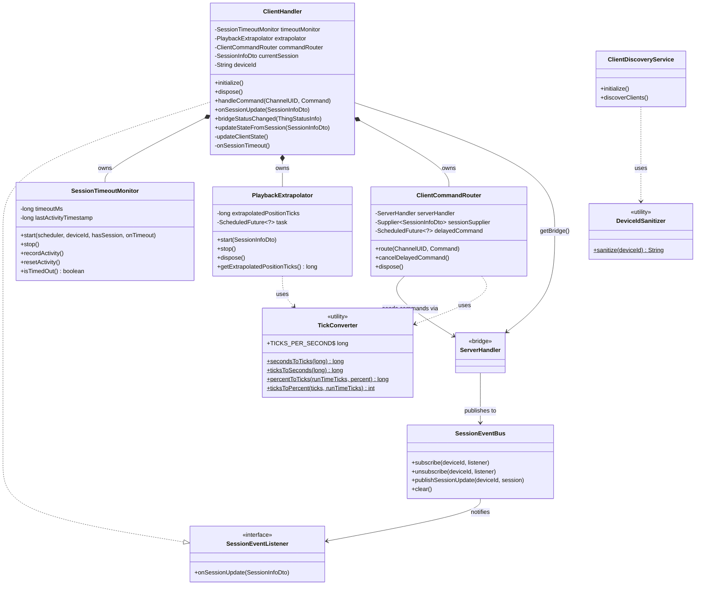

# ClientHandler Refactoring — Class Diagram

**Feature:** `refactor-clienthandler`
**Date:** 2026-03-02
**Status:** Archived

---

## Overview

`ClientHandler` was refactored from a 1023-line God Class into a lean 392-line coordinator
that delegates to four single-responsibility utility classes. `ClientDiscoveryService` gained
a dedicated `DeviceIdSanitizer` helper.

---

## Class Diagram



---

## Key Design Changes

| Before                                           | After                                                    |
| ------------------------------------------------ | -------------------------------------------------------- |
| `ClientHandler` — 1023 lines, all logic inline   | `ClientHandler` — 392 lines, coordination only           |
| Tick math (`10_000_000L`) scattered in handler   | `TickConverter` — static utility, single source of truth |
| Position extrapolation loop in handler           | `PlaybackExtrapolator` — self-contained, testable        |
| Session timeout logic in handler                 | `SessionTimeoutMonitor` — configurable, reusable         |
| 14-channel `if/else` dispatch in handler         | `ClientCommandRouter` — dedicated router                 |
| `sanitizeDeviceId()` in `ClientDiscoveryService` | `DeviceIdSanitizer` — static utility, directly tested    |

---

## Package Structure

```
internal/
├── handler/
│   └── ClientHandler.java            (coordinator, 392 lines)
├── discovery/
│   └── ClientDiscoveryService.java   (uses DeviceIdSanitizer)
└── util/
    ├── command/
    │   └── ClientCommandRouter.java  (14-channel dispatch)
    ├── discovery/
    │   └── DeviceIdSanitizer.java    (static sanitise)
    ├── extrapolation/
    │   └── PlaybackExtrapolator.java (per-second tick counter)
    ├── tick/
    │   └── TickConverter.java        (static tick math)
    └── timeout/
        └── SessionTimeoutMonitor.java (activity + timeout)
```
