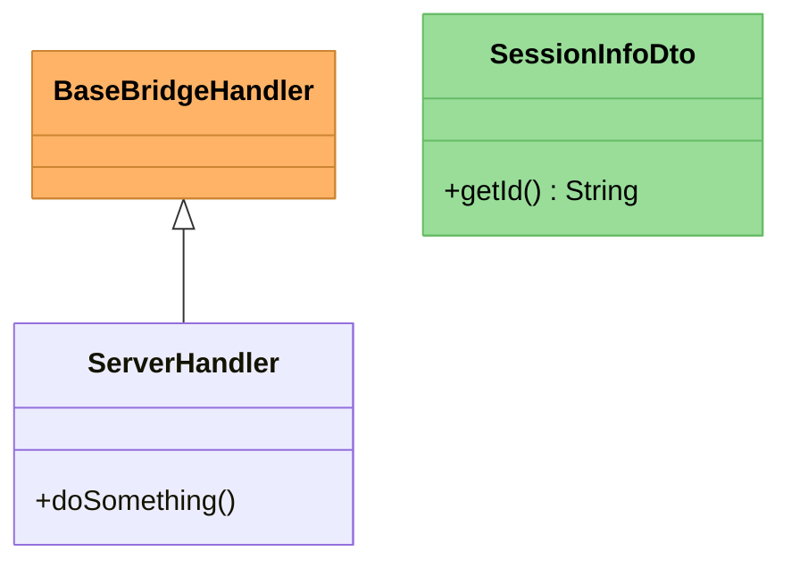
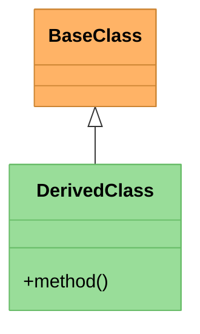

# Prompt: Update Copilot Instructions with Mermaid Diagram Styling Rules

## Context

During work on `/home/pgfeller/Documents/GitHub/openhab-addons.worktrees/pgfeller/jellyfin/issue/17674/bundles/org.openhab.binding.jellyfin/docs/architecture/*.md`, I discovered the correct syntax for applying colors to Mermaid class diagrams. This knowledge must be added to the copilot instructions for consistent, high-quality diagram generation.

## Problem Statement

Multiple Mermaid styling approaches exist, but only **`style` command** reliably works across:

- VS Code Mermaid preview
- GitHub Mermaid renderer
- Other Mermaid-compatible viewers

## Tested Approaches

### ❌ Failed Approaches

1. **`classStyle` statement** (deprecated/non-standard)

   ```mermaid
   classStyle ClassName1 fill:#ffb366
   ```

   Result: Parse errors on GitHub, inconsistent rendering

2. **`classDef` + `class` statement**

   ```mermaid
   classDef styleName fill:#ffb366,stroke:#cc8533
   class ClassName styleName
   ```

   Result: All classes get same color, syntax not recognized

3. **`classDef` + `cssClass` command**

   ```mermaid
   classDef styleName fill:#ffb366,stroke:#cc8533
   cssClass "ClassName" styleName
   ```

   Result: Works in VS Code but inconsistent on GitHub

4. **Inline `:::` syntax**

   ```mermaid
   class ClassName:::styleName
   classDef styleName fill:#ffb366,stroke:#cc8533
   ```

   Result: Mixed compatibility, requires class definition modification

### ✅ Correct Approach: `style` Command



**Key Points:**

- Use `style ClassName fill:#color,stroke:#color,color:#textcolor`
- Place style commands at end of diagram (after class definitions)
- No quotes around class names
- Works for classes defined explicitly OR implicitly (via relationships)
- Consistent across all platforms

## Instruction Requirements

Add to `.github/` copilot instructions (technology-agnostic section or Mermaid-specific):

### Required Content

#### Rule: Mermaid Class Diagram Styling

When generating Mermaid class diagrams requiring colored classes:

1. **MANDATORY**: Use `style` command for all color applications
2. **Syntax**: `style ClassName fill:#hexcolor,stroke:#hexcolor,color:#textcolor`
3. **Placement**: After all class definitions, before closing code fence
4. **Compatibility**: Verified across VS Code preview, GitHub renderer, mermaid.live
5. **Class existence**: Works for explicitly defined classes AND classes referenced only in relationships

**Example Pattern:**



**Anti-patterns (DO NOT USE):**

- `classStyle` statements
- `classDef` + `class ClassName styleName`
- `classDef` + `cssClass "ClassName" styleName`
- Inline `class ClassName:::styleName` (less portable)

**Benefits:**

- Universal compatibility
- No parsing ambiguity
- Simple, direct syntax
- Works with inheritance hierarchies

### Integration Instructions

1. **Location**: Add to technology-independent core instructions OR create `mermaid-diagrams.md` in `.github/technologies/`
2. **Precedence**: MANDATORY - overrides any conflicting diagram styling guidance
3. **Scope**: Applies to ALL class diagrams requiring color differentiation
4. **Enforcement**: AI agents MUST use `style` command; other syntaxes are prohibited

### Optimization Notes

**Token efficiency:**

- Rule statement: ~150 tokens (example + anti-patterns)
- Retrieval frequency: Low (only when generating/modifying class diagrams)
- Value: Prevents multi-iteration debugging cycles (saves 500-2000 tokens per diagram fix)

**Quality impact:**

- Eliminates platform-specific rendering failures
- Reduces GitHub PR diagram validation overhead
- Ensures consistent documentation appearance

## Validation

After updating instructions:

1. Generate sample diagram with 3+ colored classes
2. Preview in VS Code
3. Commit to GitHub and verify rendering
4. Confirm colors display correctly for all classes

## Success Criteria

- [ ] Instruction added to `.github/` with clear MANDATORY designation
- [ ] Example pattern included with anti-patterns marked
- [ ] Token-optimized (concise but complete)
- [ ] Tested by generating new diagram following updated instructions
- [ ] New diagram renders correctly in VS Code and GitHub

## Files Referenced

- Example diagrams: `/home/pgfeller/Documents/GitHub/openhab-addons.worktrees/pgfeller/jellyfin/issue/17674/bundles/org.openhab.binding.jellyfin/docs/architecture/core-handler.md`
- Session report: `/home/pgfeller/Documents/GitHub/openhab-addons.worktrees/pgfeller/jellyfin/issue/17674/bundles/org.openhab.binding.jellyfin/.copilot/session-reports/2026-01-01/mermaid-diagram-validation-fixes.md`

## Notes

This instruction addition prevents repeated trial-and-error with Mermaid styling syntax. The `style` command is the official Mermaid approach per their documentation but often overlooked in favor of more complex `classDef` patterns.
