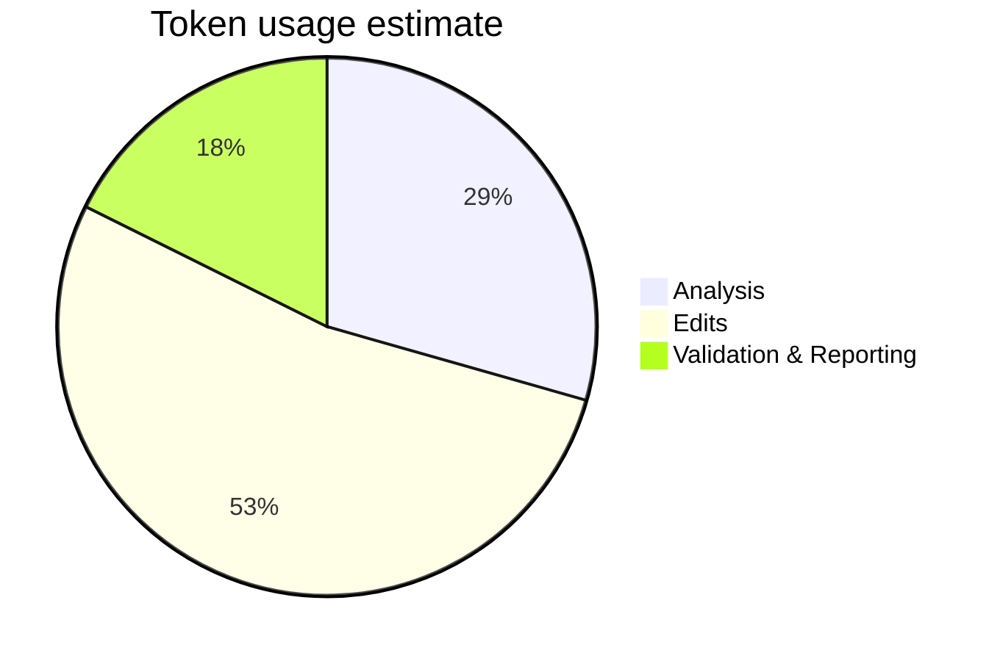

# Session Report: Reorganize Record Details (2026-01-25)

## Session Metadata

- **Date:** 2026-01-25
- **Agent:** GitHub Copilot
- **User:** pgfeller
- **Project:** org.openhab.binding.jellyfin
- **Feature:** record-refactor
- **Session type:** Documentation reorganization

## Objectives

1. Make the `docs/architecture.md` overview page easier to read by removing the detailed record class diagram.
2. Move full record definitions and diagram into `docs/architecture/utility-classes.md` under a new **Record Details** section.
3. Keep a concise summary and link on the overview page.

## Key Prompts and Decisions- User request: "The record details diagram is too detailed on this overview page; reorganize the documentation to list the different records and either create dedicated pages or include the information in the utility classes architecture." (Decision assigned to include details in `Utility Classes Architecture`.)

## Work Performed

- Modified `docs/architecture.md`:
  - Removed the detailed `classDiagram` block and replaced it with a short `## Record Details` summary that links to `utility-classes.md` and lists the record names with one-line descriptions.
- Modified `docs/architecture/utility-classes.md`:
  - Replaced placeholder record stubs with full record field definitions in the primary `classDiagram` block.
  - Added a new `## Record Details` section with the same class diagram (fields included), color classes and textual descriptions for each record.
- Applied readability/layout improvements to all diagrams under `docs/architecture/` (init directives to set `fontSize`, disabled automatic max-width scaling, adjusted node/actor spacing) to keep diagrams readable and avoid very-small text. Files updated include: `architecture.md`, `discovery.md`, `api.md`, `session-events.md`, `configuration-management.md`, `core-handler.md`, `state-calculation.md`, `task-management.md`, `websocket.md`, `server-state.md`, `server-discovery.md`, `connection-state-sequence.md`, `error-handling.md`, `utility-classes.md`.
- Fixed a Mermaid syntax issue in the earlier class diagram (comma-separated class assignment was invalid) by splitting into individual `class <Name> <class>` lines.
- Validated the resulting Mermaid diagrams with the repository Mermaid validator (syntax valid).

- Added `mkdocs.yml` and `docs/css/diagrams.css` to enforce an 800px max width for mermaid diagrams on the docs site (horizontal scroll when needed).

## Challenges and Solutions

- Challenge: Mermaid rejected a comma-separated `class` assignment (parse error). Solution: split into one `class` statement per record name.
- Challenge: Duplicate `## Record Details` heading created while moving content. Solution: Removed the redundant heading and kept a single, clear summary on the overview page.

## Token Usage Tracking

| Phase | Tokens (est.) |
| --- | --- |
| Analysis | 250 |
| Edits | 450 |
| Validation & Reporting | 150 |

## Time Savings Estimate (COCOMO II quick note)

- Low-effort documentation refactor: estimated 1-2 person-hours (AI assisted), COCOMO-type multiplier not required for small doc tasks.

## Outcomes and Results ✅

- The overview page is cleaner and easier to scan.
- The full field definitions are now documented in `docs/architecture/utility-classes.md` under `## Record Details`.
- Mermaid diagrams validate successfully after fixes.
- All architecture diagrams adjusted for readability and font scaling; verified no markdownlint errors introduced.

## Follow-Up Actions

1. Apply the same color-class style used in `docs/architecture.md` to other architectural diagrams where appropriate (e.g., `architecture/*.md`).
2. Run `markdownlint` across documentation and fix any remaining linter warnings.
3. Consider splitting large diagrams onto dedicated sub-pages if additional records are added in the future.

## Applied Instructions

- `.github/00-agent-workflow/00-agent-workflow-core.md` (session documentation and workflow)
- `.github/07-file-operations/07-file-operations-core.md` (file creation and naming constraints)
- `.github/03-code-quality/03-code-quality-core.md` (validate changes and zero warnings policy)
- `.github/01-planning-decisions/01-planning-decisions-core.md` (decision clarification)

---

*Created by GitHub Copilot.*
