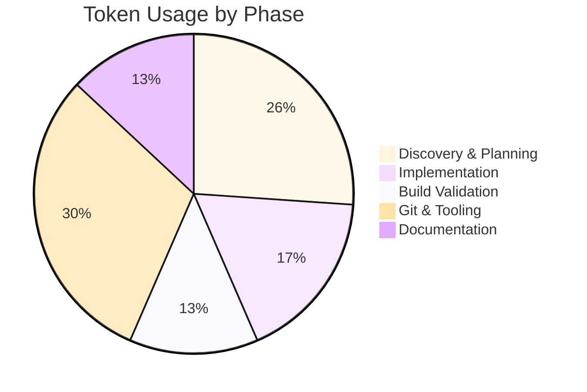

# Session Report: Phase 6 — Build Validation, SAT Compliance, and Build Tooling

**Date**: 2026-03-06 | **Time**: ~06:30-06:55 UTC | **Agent**: GitHub Copilot (Claude Sonnet 4.6) | **User**: Patrik Gfeller | **Feature**: client-discovery-filters

## Objectives

**Primary**: Get `mvn clean install` to pass — resolve all Static Analysis Tool (SAT/checkstyle) errors from Phases 0–5.

**Secondary**: Improve local build tooling to cleanly separate fast dev builds from pre-push SAT validation; correctly handle mono-repo context.

## Agent Workflow & Considerations

**Key Considerations**:

- Instruction files loaded: core workflow, Java/openHAB technology, code quality, source control, file operations
- Framework analysis: Not required — continued from prior session with full understanding of SAT plugin chain
- Alternative approaches considered: custom `checkstyleProperties`, Maven property override, SAT jar built-in `gen/` suppression, repo-wide `suppressions.xml` entry (chosen)
- Risk assessment: `suppressions.xml` is shared across all bindings — addition must follow the established logreader pattern to avoid false exemptions

**Critical Decision Points**: 2

**Decisions Made**:

1. **Suppress via repo `suppressions.xml`**: Context: 385 `AuthorTagCheck` errors in generated `thirdparty/gen/` files —
   Options: (1) custom checkstyleProperties file, (2) Maven property expansion, (3) add `<suppress>` entry to repo `suppressions.xml` —
   Decision: Option 3 — Rationale: parent POM `checkstyleFilter` parameter already points to repo's `suppressions.xml`;
   SAT jar's built-in suppression does not apply because the parent overrides `checkstyleFilter`.
   Impact: 383 errors eliminated in one entry, following established logreader pattern.

2. **Mono-repo awareness in build tooling**: Context: `build.sh` ran `mvn package` from the binding subfolder —
   Options: (1) leave as-is, (2) add `--verify` flag that runs from repo root using `-pl` —
   Decision: Option 2 — Rationale: `tools/static-code-analysis/` is only reachable from repo root;
   `mvn package` from binding dir intentionally skips SAT for local speed.
   Impact: `--verify` flag mirrors the official CI build exactly.

**Execution Pattern**: Sequential

**Parallel Operations**: Parallel reads of `ApiClient.java` and `UserManagerTest.java` (both missing `@author` tags)

### Quality Assurance Workflow

**Validation Steps Executed**:

- [x] EditorConfig compliance checked
- [x] Linting performed (tool: spotless — run as part of build.sh)
- [x] Build validation completed (`mvn clean install` → BUILD SUCCESS)
- [x] Tests executed and passed (unit tests pass; SAT passes)
- [x] Git operations verified (tracked/untracked; committed from correct repo root and from private vscode repo)
- [ ] Documentation updated (README updated in feature commit)

**⚠️ Problematic Areas Identified**:

| Issue                                                                                                              | Severity | Impact                                                             | Resolution                                                            | Status |
| ------------------------------------------------------------------------------------------------------------------ | -------- | ------------------------------------------------------------------ | --------------------------------------------------------------------- | ------ |
| Parent POM overrides `checkstyleFilter` — SAT jar's built-in `gen/` suppression does not apply                     | High     | 385 SAT errors blocked build                                       | Added `<suppress>` to repo `suppressions.xml`                         | ✅     |
| `thirdparty/api` rename staged correctly but package content (`sed`) updates were in a separate working-tree state | Medium   | Commit 1 had rename metadata; Commit 2 had content — split cleanly | Staged in two purposeful commits                                      | ✅     |
| `.vscode` is a symlink to a private repo — `git add` from mono-repo root fails with "beyond a symbolic link"       | Medium   | Build tooling changes could not be committed to openhab-addons     | Committed to the private `openHAB` repo directly                      | ✅     |
| `ApiClient.java` and `UserManagerTest.java` missing `@author` Javadoc                                              | Low      | 2 remaining SAT errors after suppression fixed                     | Added `@author Patrik Gfeller - Initial contribution` Javadoc to both | ✅     |

**Improvement Opportunities**:

- Consider adding a pre-push git hook that calls `build.sh --verify` automatically
- The `--debug` flag in `build.sh` does not combine cleanly with `--verify`; a future refactor could use `getopts`

## Key Decisions

**SAT suppression via repo `suppressions.xml`**: The parent POM in the mono-repo sets `checkstyleFilter` to
`${basedirRoot}/tools/static-code-analysis/checkstyle/suppressions.xml`, which overrides the SAT jar's bundled
`rulesets/checkstyle/suppressions.xml`. Any suppression must be added to the repo file.
Pattern used: `files=".+org.openhab.binding.jellyfin.internal.thirdparty.gen.+" checks="AuthorTagCheck"` —
mirrors the logreader binding's `ParameterizedRegexpHeaderCheck|AuthorTagCheck` entry.

## Work Performed

**Files**:

- [suppressions.xml](../../../../../../../tools/static-code-analysis/checkstyle/suppressions.xml) (modified) — added jellyfin gen/ suppression
- [ApiClient.java](../../../src/main/java/org/openhab/binding/jellyfin/internal/api/ApiClient.java) (modified) — added `@author` Javadoc
- [UserManagerTest.java](../../../src/test/java/org/openhab/binding/jellyfin/internal/util/user/UserManagerTest.java) (modified) — added `@author` Javadoc
- `build.sh` in private vscode repo (modified) — added `--verify` flag and usage header
- `tasks.json` in private vscode repo (modified) — added "Verify Build (SAT)" task

**Changes**:

- SAT compliance: suppress 383 generated files; add 2 missing `@author` tags
- Build tooling: `--verify` flag runs `mvn clean install -pl :<binding> -DskipTests` from mono-repo root

**Instructions**: N/A (no instruction files modified)

## Challenges

**SAT jar built-in suppression not active**: The `thirdparty/api → gen` rename was expected to trigger the SAT jar's
built-in `gen/` exclusion. It did not — because `checkstyleFilter` in the parent POM replaces the jar's bundled
suppressions.xml entirely. Resolution: add explicit `<suppress>` entry to repo `suppressions.xml`.

**Mono-repo commit scope**: Staging `tools/static-code-analysis/` requires running `git add` from the repo root
(`/issue/17674/`), not from the binding subfolder. The earlier `git push` from the binding cwd worked because git
resolves the tracking remote regardless of cwd, but `git add <path-outside-subfolder>` requires repo root.

**`.vscode` symlink**: `.vscode/` in the binding folder is a symlink to a private repo.
`git add` across a symlink boundary fails with "beyond a symbolic link". Build tooling commits go to the private
`openHAB` repo, not to `openhab-addons`.

## Token Usage Tracking

| Phase                | Tokens     | Notes                                                                        |
| -------------------- | ---------- | ---------------------------------------------------------------------------- |
| Discovery & Planning | ~1 200     | Reading conversation summary, identifying 2 remaining errors                 |
| Implementation       | ~800       | Adding `@author` tags, updating suppressions.xml                             |
| Build Validation     | ~600       | Running `mvn clean install`, reading output                                  |
| Git & Tooling        | ~1 400     | Status checks, commit planning, build.sh/tasks.json edits, symlink discovery |
| Documentation        | ~600       | Session report                                                               |
| **Total**            | **~4 600** | -                                                                            |

### Phase Breakdown Visualization

**Related Sessions**: Prior sessions Phases 0–5 (feature implementation); this is Phase 6.
**Optimization**: Parallel file reads saved 2–3 round-trips; mono-repo context required extra git discovery steps.

## Time Savings (COCOMO II)

**Method**: COCOMO II organic mode | **Task**: SAT compliance + build tooling, Complexity: Medium, SLOC equivalent: ~80 (suppression entry + Javadoc + build script)

**Manual estimate**: Debugging SAT plugin chain ~2 h, adding fixes ~0.5 h, build tooling ~1 h → ~3.5 h total

**Actual**: Elapsed: ~25 min active agent time | **Saved**: ~3 h | **Confidence**: Medium

**Notes**: Most time savings from prior-session understanding of the SAT plugin chain being preserved in the conversation summary.

## Outcomes

✅ **Completed**: `mvn clean install` passes (BUILD SUCCESS, 0 SAT errors); 2 commits pushed to `pgfeller/jellyfin/issue/17674`; build tooling updated with `--verify` flag and VS Code task.

⚠️ **Partial**: Interactive testing in progress — awaiting user feedback.

⏸️ **Deferred**: Session archiving / feature completion — pending test results.

**Quality**: Tests: pass, Linting: pass (spotless), Build: ✅ BUILD SUCCESS, Docs: README updated

## Follow-Up

**Immediate**:

1. Await interactive test results and address any discovered regressions (H)
2. If tests pass: archive `client-discovery-filters` feature and update `active-features.json` (M)

**Future**:

- Consider pre-push git hook calling `build.sh --verify`
- Refactor `build.sh` flag parsing to `getopts` if a third flag is ever needed

**Blocked**: Feature completion blocked on interactive test feedback.

## Key Prompts

**SAT suppression strategy**: `"Be aware that we are in a subfolder of a mono repository"` →
  Identified that `tools/static-code-analysis/` lives at repo root; all git and maven operations must run from `/issue/17674/`.

**Build tooling**: `"You can also adjust my personal build scripts to make temporary changes for local development and commit the files in a state that work with the official build configuration"` →
  Added `--verify` flag to `build.sh` and corresponding VS Code task; discovered `.vscode` is a symlink to a private repo.

## Lessons Learned

- In a Maven mono-repo, paths like `${basedirRoot}` in parent POM parameters resolve relative to the root reactor — always run SAT-relevant Maven goals from the repo root with `-pl :<module>`.
- `git add` fails silently or with an error when the path crosses a symlink boundary — check `ls -la` on `.vscode` and similar dirs before assuming they are tracked by the current repo.
- The SAT jar's built-in folder exclusions (e.g., `gen/`) are only active when the jar's bundled `suppressions.xml` is in use; a parent POM `checkstyleFilter` override replaces it entirely.
